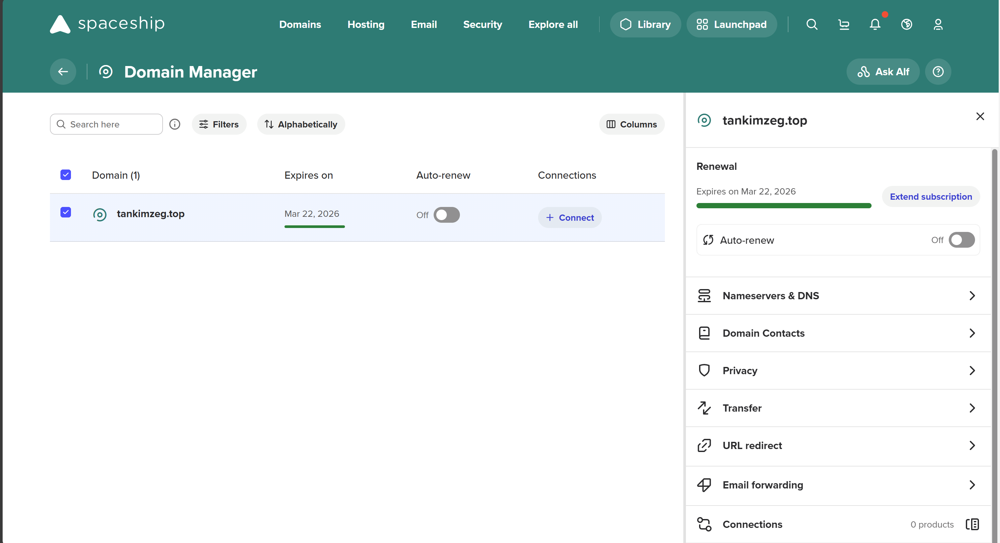
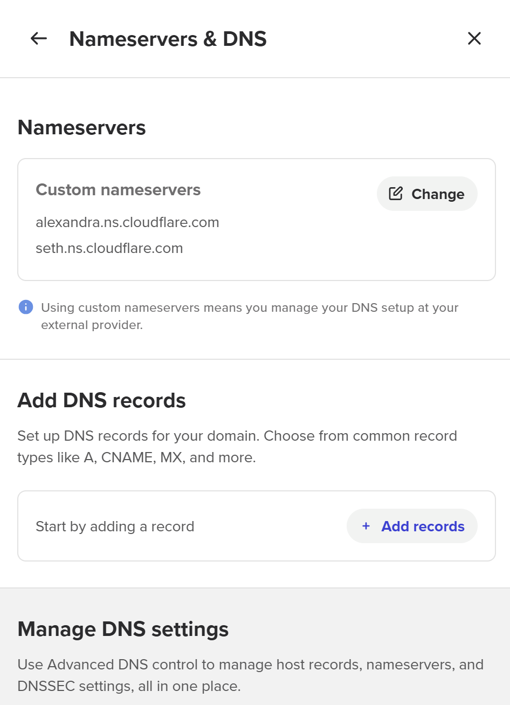
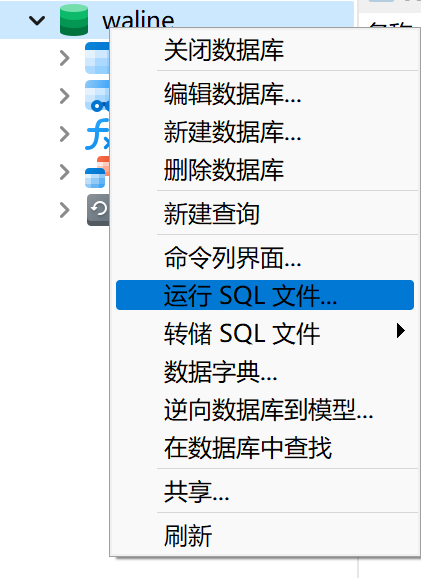

用了几天时间,我的网站终于建设好了!

我使用Astro的Frosti模板,Nginx反代实现docker独立部署Waline.为了实现反代购买了一个域名,将原来用IP地址访问绑定到域名,并使用HTTPS协议提升安全性.

数据库使用远程Azure flexible MySQL.

# 购买域名并托管到Cloudflare

在[Spaceship](https://www.spaceship.com)上购买一个域名,支持支付宝付款,具体bilibili上有视频展示过程.

将域名托管到[Cloudflare](https://dash.cloudflare.com)上:
(具体看别的教程吧,这里我凭印象说一下)
先登录自己的邮箱账号,然后点Overview,输入自己的域名(注意这时候是不含www这类二级域名的)然后(我记得有一步选择套餐,不记得先后顺序了,那里选择$0免费的.)Cloudflare会对域名进行DNS解析,这时候,由于域名之前由Spaceship持有,所以这里会出现几条记录,IPv4和IPv6可能都有,先删掉,之后要解析成自己的IP地址嘛.最后出现两个CF的DNS服务器,复制后,在Spaceship中找到自己的购买的域名[Domain Manager App - Spaceship](https://www.spaceship.com/application/domain-list-application/),

填写到Nameservers里面去,设置为Custom nameservers


回到Cloudflare,在左侧导航栏中点击DNS -> Records,当你的域名显示绿色的Activate之后,可以管理DNS Records.把无关的DNS记录删掉,然后添加A记录.

#### **A 记录（将域名指向服务器 IP）**

- **名称**：`@`（表示主域名，如 `example.com`）或 `www`（表示 `www.example.com`）。
    
- **IPv4 地址**：您的服务器 IP 地址（如 `123.45.67.89`）。
    
- **Proxy status**：选择 **Proxied**（橙色云图标），以通过 Cloudflare 的 CDN 和安全服务。

> 我注意到还有其他类型的记录,如AAAA对应的是IPv6地址,NS是自己服务器上的DNS服务,这些我暂时都用不上.其实子域名如blog.example.com应该是可以用CNAME的,不过我没用.

保存后,过几分钟,在以下网站搜索自己的域名就能看到A记录的变化.由于世界各地的DNS服务器都有各自的缓存,可能还留有旧纪录.由于我们选择了CF的Proxy服务,所以看不到自己服务器的真实IP,不用担心是自己设置错了.

[查看国内DNS解析情况](https://www.itdog.cn/dns/)

[查看全球DNS解析情况](https://dnschecker.org/)

可以在终端输入nslookup(for Windows)或nslookup/dig(for Linux)查看自己所在网络的域名解析结果:
```bash
nslookup example.com
```

```bash
dig example.com
```

# 在Frosti中启用Waline
原作者默认关闭了这个功能,我们可以手动启用.
浏览项目结构,打开src/pages/blog/[...slug].astro文件,找到如下代码:
```html
  <BaseCard
    title={post.data.title}
    image={post.data.image}
    pubDate={post.data.pubDate}
    badge={post.data.badge}
    categories={post.data.categories}
    tags={post.data.tags}
    word={remarkPluginFrontmatter.totalCharCount}
    time={remarkPluginFrontmatter.readingTime}
    isBlog="true"
  >
```
添加一行`comment="true"` :
```html
  <BaseCard
    title={post.data.title}
    image={post.data.image}
    pubDate={post.data.pubDate}
    badge={post.data.badge}
    categories={post.data.categories}
    tags={post.data.tags}
    word={remarkPluginFrontmatter.totalCharCount}
    time={remarkPluginFrontmatter.readingTime}
    isBlog="true"
    comment="true"
  >
```
然后在 src/consts.ts文件修改SERVER_URL,例如 http://waline.example.com
,我们暂时还没有这个网站,要往CF里添加这一条记录.

## 部署Waline
来到[waline](https://waline.js.org/guide/)文档,我们可以选择适合自己的方式部署.别的那些线上部署我不熟悉,看起来也挺麻烦的,我选择的是非常原始但我熟悉的Docker + MySQL

这里我参考了[使用docker独立部署MySQL](https://bg3lnt.xyz/posts/dc23e930.html)

不过我有远程的MySQL服务器(得感谢Github学生包啊,美美享用微软的Azure服务器)

我先连接我的数据库(这里用的是Navicat,没用的话也可以用命令行去连接),然后新建一个数据库`waline`,右键"运行SQL文件:


waline文档指引我们导入[waline.sql](https://github.com/walinejs/waline/blob/main/assets/waline.sql)文件,

> 一开始这个文件导入会出错,因为含有非法的SQL语句.我已向源项目提交PR.


导入后,确保你的服务器上已经下载好了waline的仓库:
```bash
git clone https://github.com/walinejs/waline.git
cd waline/packages/server
```
编辑docker-compose文件
```bash
sudo vim docker-compose.yml
```
如下
```
# docker-compose.yml
version: '3'

services:
  waline:
    container_name: waline
    image: lizheming/waline:latest
    restart: always
    ports:
      - 172.17.0.1:8360:8360
    volumes:
      - ${PWD}/data:/app/data
    environment:
      TZ: 'Asia/Shanghai'
      MYSQL_HOST: "REMOTE DATABASE HOST"
      MYSSQL_PORT: 3306
      MYSQL_DB: "waline"
      MYSQL_USER: "USERXXX"
      MYSQL_PASSWORD: "PSWXXX"
      MYSQL_SSL: "true"
      SITE_NAME: "可不填"
      SITE_URL: '可不填'
      AUTHOR_EMAIL: 'YOUR EMAIL'
      IPQPS: 30 # 参考服务端配置
```
 参考[服务端环境变量 | Waline](https://waline.js.org/reference/server/env.html)可以自己添加
编写好配置文件后
```bash
sudo docker-compose up -d
```
 > 最好按我的来,用docker-compose,不要用文档上的docker build,不得不说,docker部署这部分的文档写得混乱
 
 成功后,docker容器运行在8360端口上,且外部不可通过IP:8360访问到,比较安全.
 ```bash
 netstat -tln
```
172.17.0.1:8360处于LISTEN状态.

# 配置Nginx
我的网站一开始是直接IP访问80端口的,现在,我们可以改用域名访问,稍后,再升级为HTTPS.
首先,nginx的配置文件都在/etc/nginx里面

conf.d,site-avalible,site-enable都存放了server配置文件.网页展示的site-enable里.Nginx默认的页面放在site-enable,并且site-avalible里也有一份.我的实践方式是在site-avalible中编辑配置文件,然后在site-enable中创建软连接指着site-avalible的文件
```bash
cd ./site-enable
ln -s ../site-avalible/astro astro
ln -s ../site-avalible/waline waline
```
编写类似如下的内容:
```nginx
server {
	listen 80;
    server_name www.example.com example.com;  # 你的域名或者 IP 地址

    root /path/to/astroProject/dist;  # 指向 Astro 构建的 dist 目录
    index index.html;

    # 配置静态资源缓存（可选）
    location / {
        try_files $uri $uri/ =404;
    }

    # 配置 gzip 压缩（可选，提高性能）
    gzip on;
    gzip_types text/plain application/xml text/css application/javascript;
    gzip_min_length 1000;
}
```
保存退出后,测试并重启nginx
```bash
sudo nginx -t
sudo systemctl restart nginx
```

## Nginx反代Waline
还记得我们在Frosti里面把SERVER_URL设置为waline.example.com吗?访问这个URL,实际上是访问的80 或443端口,而不是docker运行的8360端口,而且docker容器只对内网开放.所以,像上面那样配置是不能直接提供服务的.

我们要做的是像一个路由器那样,把外来的请求转发到内网的另一个地方去,这就叫**反向代理**,是Nginx一个很强大的功能.

在上面的docker-compose.yml文件中,我们把172.17.0.1:8360映射到镜像的8360端口,netstat也显示容器监听172.17.0.1的8360端口,所以我们要做的就是把来自域名waline.example.com的请求发送到172.17.0.1:8360去.

```nginx
sever {
	listen 80;
	server_name waline.example.com;

	location / {
		proxy_pass http://172.17.0.1:8360;
		proxy_http_version 1.1;
		proxy_set_header Host $host;
		proxy_set_header X-Real-IP $remote_addr;
		proxy_set_header X-Forwarded-For $proxy_add_x_forwarded_for;
		proxy_set_header X-Forwarded-Proto $scheme;
		proxy_set_header REMOTE-HOST $remote_addr;
		add_header X-Cache $upstream_cache_status;
		add_header Cahce-Control no-cache;
	}
}
```
这样部署后,登录Waline管理页面就能创建管理账号(第一个登录的用户会被设置为管理员).

### 禁止用户访问Waline的demo页面
上述配置全部成功后,访问反向代理的自定义域名`waline.example.com`时,会显示 Waline 的 demo 页面,这个页面不应展示.

修改配置文件
```nginx
location ~* ^/.+ {
	#   原配置
	...
}
location = / {
	return 403;
}
```
通过正则表达式匹配,只有后面跟有request url的请求才被转发,否则返回403 Forbidden状态码.

> 配置完成后,记得重启nginx服务哦~


# 注册HTTPS证书
以下操作都是Deepseek告诉我的,基于我已经配置好HTTP服务,实测可用.如果你没有HTTP服务,不知道这只 `certbot` 会怎么处理.🤖


 ---

## *DeepSeek - 探索未至之境*
以下是详细的步骤，指导您如何为使用 **Nginx + Cloudflare** 的网站配置 HTTPS：

### **1. 在 Cloudflare 中启用 HTTPS**
Cloudflare 提供免费的 SSL/TLS 证书，并自动为您的域名启用 HTTPS。

#### **步骤 1：登录 Cloudflare 控制面板**
1. 访问 [Cloudflare](https://www.cloudflare.com/) 并登录您的账户。
2. 选择您的域名。

#### **步骤 2：配置 SSL/TLS 模式**
1. 点击 **SSL/TLS** → **Overview**。
2. 选择 SSL/TLS 模式：
   - **Flexible**：仅加密浏览器到 Cloudflare 的流量（不推荐）。
   - **Full**：加密浏览器到 Cloudflare 和 Cloudflare 到服务器的流量（服务器可使用自签名证书）。
   - **Full (Strict)**：加密全链路流量（服务器需安装有效证书，推荐选择此项）。

   **选择 `Full`[^1] 或 `Full (Strict)`**。

3. 启用 **Always Use HTTPS**（强制所有 HTTP 请求跳转到 HTTPS）[^5]


### **2. 为服务器获取 SSL 证书**
#### **使用 Let's Encrypt 免费证书（推荐）**
Let's Encrypt 提供免费的 SSL 证书，并通过 Certbot 工具自动化管理。

#### **步骤 1：安装 Certbot**
在服务器上执行以下命令（以 Ubuntu/Debian 为例）：
```bash
sudo apt update
sudo apt install certbot python3-certbot-nginx
```

#### **步骤 2：获取证书**
运行 Certbot 并自动配置 Nginx：
```bash
sudo certbot --nginx -d example.com -d www.example.com
```
（将 `example.com` 替换为您的域名）

Certbot 会：
1. 自动验证域名所有权。
2. 生成 SSL 证书（保存在 `/etc/letsencrypt/live/example.com/`）。
3. 自动修改 Nginx 配置文件以启用 HTTPS。

#### **步骤 3：验证证书自动续期**
Let's Encrypt 证书有效期为 90 天，Certbot 会自动续期。手动测试续期：[^2]
```bash
sudo certbot renew --dry-run
```


### **3. 配置 Nginx 支持 HTTPS**
#### **步骤 1：检查 Nginx 配置文件**
Certbot 已自动修改配置，但需手动检查。  
打开配置文件（通常位于 `/etc/nginx/sites-available/default`）：
```bash
sudo nano /etc/nginx/sites-available/default
```

#### **步骤 2：确保 HTTPS 配置正确**
配置文件应包含类似以下内容：
```nginx
server {
    listen 80;
    server_name example.com www.example.com;
    return 301 https://$host$request_uri;  # 强制跳转到 HTTPS
}

server {
    listen 443 ssl;
    server_name example.com www.example.com;

    ssl_certificate /etc/letsencrypt/live/example.com/fullchain.pem;
    ssl_certificate_key /etc/letsencrypt/live/example.com/privkey.pem;

    root /var/www/html;
    index index.html index.htm;

    location / {
        try_files $uri $uri/ =404;
    }
}
```

#### **步骤 3：测试并重启 Nginx**
```bash
sudo nginx -t          # 检查配置语法
sudo systemctl restart nginx  # 重启 Nginx
```

---

### **4. 配置 Cloudflare 的 SSL 证书源**
如果选择 **Full (Strict) 模式**，需确保 Cloudflare 信任服务器证书。

#### **步骤 1：在 Cloudflare 上传原始证书（可选）**[^3]
1. 进入 **SSL/TLS** → **Origin Server** → **Create Certificate**。
2. 生成并下载证书（包含 `.pem` 文件）。
3. 将证书上传到服务器，并更新 Nginx 配置：
   ```nginx
   ssl_certificate /path/to/cloudflare-origin.crt;
   ssl_certificate_key /path/to/cloudflare-origin.key;
   ```


### **5. 验证 HTTPS 是否生效**
1. 在浏览器中访问 `https://example.com`，检查是否显示 **安全锁标志**。
2. 使用 [SSL Labs 测试工具](https://www.ssllabs.com/ssltest/) 检查 SSL 配置评分（目标为 A 或 A+）。[^4]


### **6. 常见问题解决**
#### **问题 1：浏览器提示“不安全”**
- **原因**：网站中存在混合内容（HTTP 资源）。
- **解决**：
  1. 确保所有资源（图片、CSS、JS）使用 HTTPS 链接。
  2. 在 Cloudflare 启用 **Automatic HTTPS Rewrites**（SSL/TLS → Edge Certificates）。

#### **问题 2：Nginx 启动失败**[^6]
- **原因**：配置文件语法错误或端口冲突。
- **解决**：
  ```bash
  sudo nginx -t  # 检查错误日志
  sudo systemctl status nginx
  ```

#### **问题 3：证书续期失败**
- **原因**：Certbot 无法自动续期。
- **解决**：
  ```bash
  sudo certbot renew --force-renewal  # 手动强制续期
  ```


### **总结**
1. 在 Cloudflare 启用 **Full (Strict) SSL** 并强制 HTTPS。
2. 使用 Certbot 自动获取并安装 Let's Encrypt 证书。
3. 配置 Nginx 支持 HTTPS 并重启服务。
4. 验证 HTTPS 生效并解决常见问题。

完成以上步骤后，您的网站将通过 HTTPS 安全访问，数据全程加密，用户信任度和 SEO 排名也会提升。如果有具体问题，请随时告诉我！ 😊

---
> 注意此时waline.example.com采用HTTPS,但docker配置依然使用http://172.17.0.1:8360 ,TLS加密是存在于客户端(浏览器)和网站服务器之间的.

> 如果Nginx与Waline交互过程中出现莫名其妙的错误,可查看/var/log/nginx/error.log文件,说不定能快速定位原因.

# 总结
至此,我们的网站终于大功告成了!🤩

但是搜索引擎(Google和百度等)的爬虫目前还没有找到我们的网站.可以向搜索引擎反馈,加快这一过程.

> 自由,开放,是互联网的精神.希望每个人都能在互联网上展示自信多彩的自己!


[^1]: 我选的是Full

[^2]: 我手动测试续期失败了...但是最后有解决方法,手动强制续期

[^3]: 我没做这一步

[^4]: 结果为B😅

[^5]: Certbot🤖在Nginx中自动处理,所以我未设置

[^6]: 我的Shadowsocks🚀服务端一开始占用了443端口,产生了启动失败的现象
