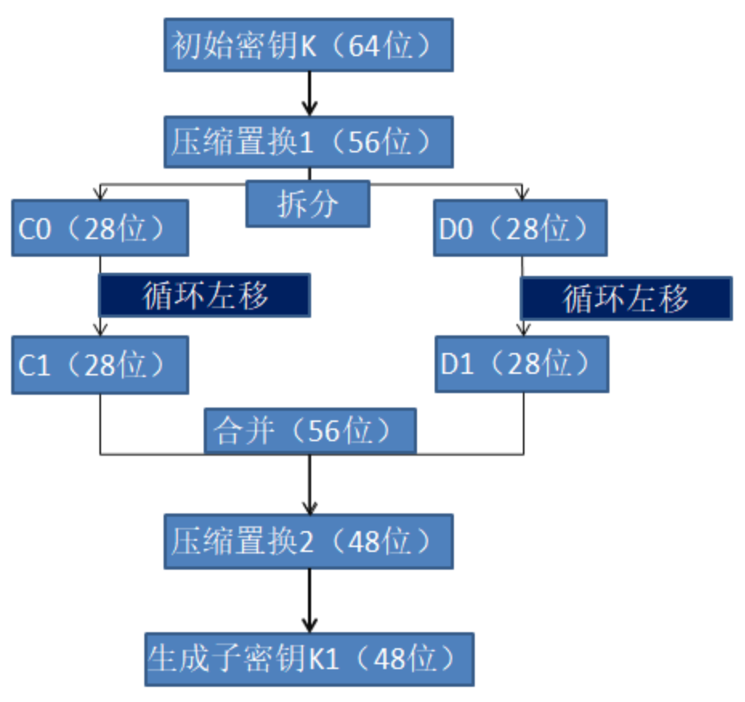
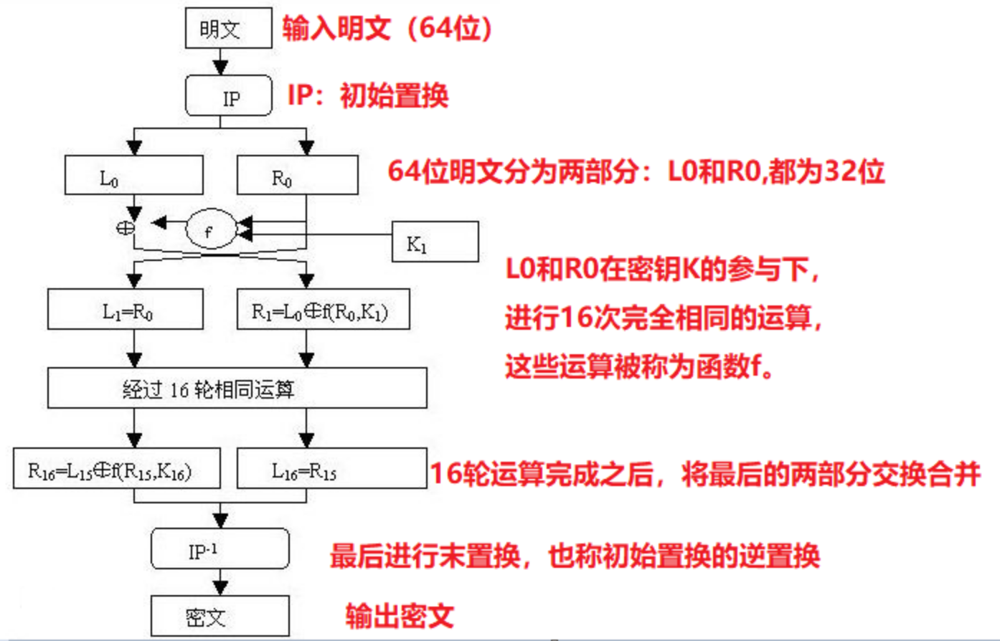
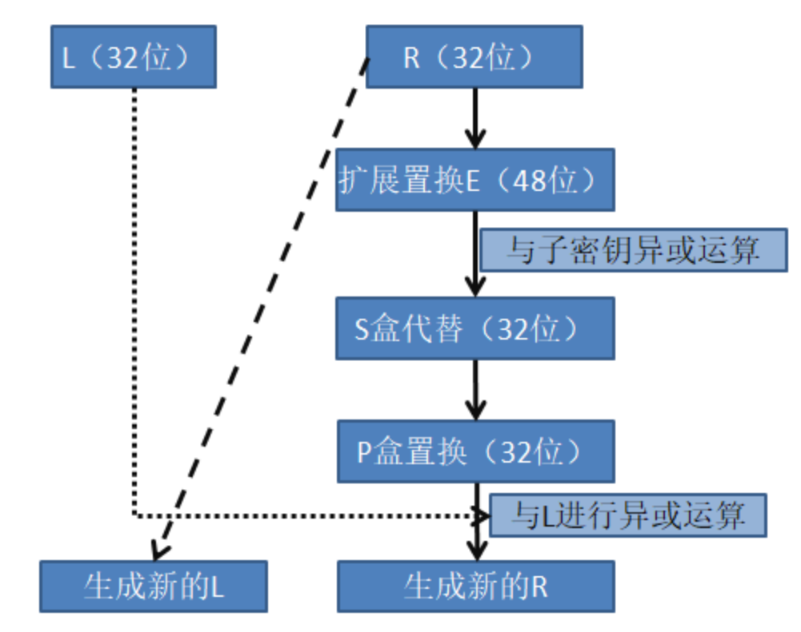

import RepositoryCard from "@/components/mdx/RepositoryCard.astro";

项目地址：
<RepositoryCard repo="TanKimzeg/uno" image="https://github.com/PrekrasnoyeDalekov/DES"/>

> 本项目约700行代码,以后将考虑增加多线程的功能.

## DES简介

DES全称为Data Encryption  Standard，即数据加密标准，是一种使用密钥加密的**对称密码算法**，1977年被美国联邦政府的国家标准局确定为联邦资料处理标准（FIPS），并授权在非密级政府通信中使用，随后该算法在国际上广泛流传开来。

有关DES算法本身的过程和原理,教科书和网上都有大量资料,这里不再赘述.本文主要讲我写代码的过程以及解决的问题.

## 密钥处理

DES的密钥是64位,其中8位不用,其实是56位的密钥空间.加密和解密,16轮变换,首先都需要先产生子密钥.我也是从这里入手的.



首先初始密钥64位经过压缩置换1变为56位,分割为左边28位C0和右边28位D0.之后的$C_{i}$和$D_{i}$都是由$C_{i-1}$和$D_{i-1}$循环左移得到的.

$C_{i}$和$D_{i}$拼在一起得到56位,再经过压缩变换2变成48位的$K_{i}(i=1,2,3,\dots,16)$是16轮feistel网络变换的子密钥.

在我的代码中,[cipher.c](https://github.com/PrekrasnoyeDalekov/DES/blob/main/cipherkey.c)的 `fill_CDK`函数实现了16轮子密钥的生成.

压缩置换1(PC_1)和压缩置换2(PC_2)的含义是,第i个位置为原数据的第PC_1[i]/PC_2[i]位(有点绕对吧)

## 64位数据的加密过程

在[encrypt.c](https://github.com/PrekrasnoyeDalekov/DES/blob/main/encrypt.c)中,我实现了对一个完整8字节数据的加密.


*加密过程*


*f函数*


## 64位数据的解密过程

解密过程实际上和加密过程的步骤**相同**,只是每一轮的密钥是加密的密钥的逆序.这正是这一对称密码算法的精妙之处.

## 消息加密解密,文件加密解密的实现

其实,完成以上8字节的加密解密,估计已经能交"实验报告"了.但是作为我这种水平的人,怎么可能止步于此?于是,我开启了文件IO的自我折磨.


> DES密码算法处理数据按字节流进行(类似于大端序),而在大多数智能设备上,存储整数的字节序是小端序.64位数据是DES加密解密的最小单元,我一开始把这64位数据真的当成了一个"数"而采用了小端序(为了加密后的结果是十六进制的***可视字符串数字***),项目几乎完成后才发觉不太好,因为`fscanf`函数读取十六进制的`unsinged long long`可能影响效率,不如`fread`函数一次性读取8字节快.由于我普遍采用了这一逻辑,其实也有利有弊,(看到加密后的HEX数字,能增强我调试的信心😆;但是作为完美主义者,又忍不住想优化).本项目仅作为演示DES算法,将就这样了.读者应想清楚这一点,选择合适自己的实践方式.

首先,DES算法是分块加密算法,每个数据块都是8字节,对于文本和文件来说,如果大小不是8字节的倍数,就需要补齐.

本项目采用的是**PKCS7**填充规则:
- 对于末尾不满8字节的数据块,缺i个字节,就填充i个字节,且填充字节的值为i.
- 对于末尾满8字节的数据块,填充8个`0x08`字节

如果只有第一条规则没有第二条规则,可能出现一种情况就是数据块是8字节但最后一个字节是0x01,这样会无法判断是否剥去这个字节.

> 我的小端序实现不影响PKCS7填充,读者可以想想为什么.

我的代码中提供了
`encryptMessage`, `encryptFile`, `decryptMessgae`和 `decryptFile`函数来分别实现加密和解密,他们读取逻辑都不太一样,十分烧脑!还好我有Github Copilot,帮了我一点忙.

说实话,这样混乱的读取逻辑让我十分不满意,但或许涉及文件IO都是如此吧,之前网络编程的时候`receive`和 `send`也是相似的感觉,那时只需考虑读净写净,这里还要考虑format,十分恶心.

## 文件重定向的处理

最后编写`main`函数,根据程序设计的功能和用户输入来确定程序的逻辑流,多一些判断增强程序的健壮性,最后搞得跟GNU命令行软件一样有模有样😎:

```shell
$ ./DES -h
Usage: ./DES [-e | -d] -k <key> [-x <hex> | -m <message> | -f <file>] [-o <output>] [-h] [-v]
Options:
  -e            Encrypt the input (message, file or 64-bit hex number).
  -d            Decrypt the input (message, file or 64-bit hex number).
  -k <key>      Specify the encryption/decryption key (required).      
  -x <hex>      Specify the hex number to encrypt or decrypt.
  -m <message>  Specify the message to encrypt or decrypt.
  -f <file>     Specify the file to encrypt or decrypt.
  -o <output>   Specify the output file for encrypted/decrypted data, default STDOUT.
  -h            Display this help message.
  -v            Enable verbose mode for detailed output.

Examples:
  ./DES -e -k 0x12345678 -x 0x789abc -v
  ./DES -e -k 0x12345678 -m "Hello, World!"
  ./DES -e -k 0x12345678 -f input.txt -o encrypted_file.txt
  ./DES -d -k 0x12345678 -f encrypted_file.txt -o decrypted_file.txt   
```

但还有一关:换行符格式

我们知道,Windows文本使用CRLF(即\r\n)来换行,而在C语言中`printf("\n")`即可换行,这是因为Windows下自动给C的标准输出流的`\n`替换为`\r\n`.

这会带来一个什么问题呢?当我把一个CRLF文件加密,密文里面隐藏了`\r\n`,而当我输出解密后的明文时,Windows下的C会将`\n`替换为`\r\n`,于是就变成了`\r\n\n`,换了两行.

我发现这个现象,不仅仅是文本文件会发生,所有fprintf(stdout)都会执行不分青红皂白的替换,只要它遇到`\n`(好像是0x0a)这个字节,自动替换为0x0d0a,这就导致了大多数时候经过加密解密后md5校验和不一致.

我问Github Copilot,它给我的解决方法是:

```c
#ifdef _WIN32
#include <windows.h>
#include <fcntl.h>
#include <io.h>
#endif
```

以及

```c
int main(int argc, char *argv[]) {
#ifdef _WIN32
	_setmode(_fileno(stdout), _O_BINARY);
#endif
	...
}
```

这样,就不会自动修改为CRLF.

目前为止,输出重定向用的是终端中的 `>`,比如:
```shell
./DES -d -k 0x999 -f "encrypted_file" > "decrypted_file"
```
在cmd中确实没问题了,但是一旦在Powshell中运行又不行了.

Github Copilot教我这样检查文件的内容:
```shell
Get-Content -Path "yourfile.txt" -Raw | Format-Hex
```
我发现相较于cmd的输出,Powershell的输出在文件末尾多了`0x0D0A`,正是`\r\n`.

诶,我不是明明已经针对这种行为加入了那个奇怪的`_setmode`函数吗?而且cmd中是正确的.

Copilot又告诉我,这已经不是Windows下C的行为了,而是Powershell自己的行为.它将`>`重定向默认当作是文本文件,并且在最后加上`\r\n`来转换为Windows的CRLF文本文件格式.

哎,真是拿你没办法呢.为了兼容性,我干脆增加了一个output选项,这就是最终版.

## 程序测试

文件经过加密和解密,MD5校验和与原文件一致,说明程序执行逻辑正确!

```shell
PS > .\DES.exe -e -k 0x999 -f DES.exe -o encrypted
PS > .\DES.exe -d -k 0x999 -f encrypted -o decrypted
PS > md5sum .\DES.exe
\0319c765a2e54d3dc02520e11b2f3145 *.\\DES.exe
PS > md5sum .\decrypted
\0319c765a2e54d3dc02520e11b2f3145 *.\\decrypted
```