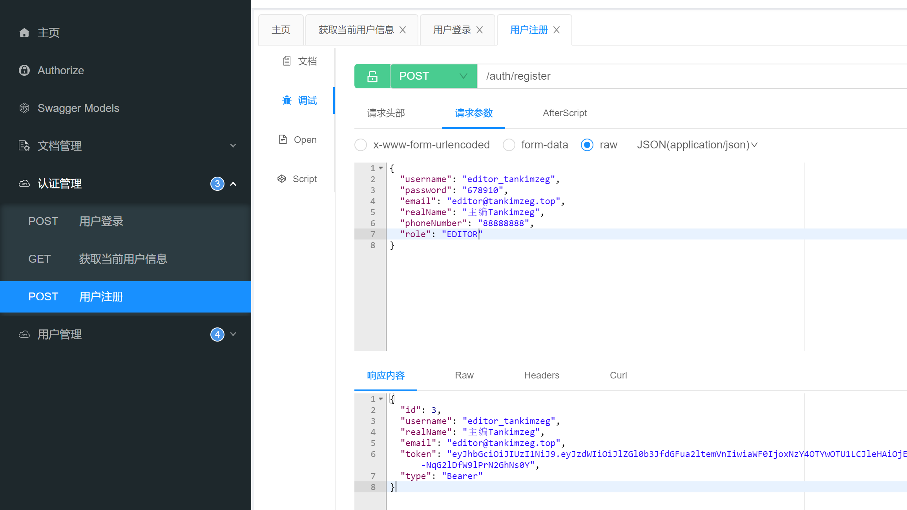
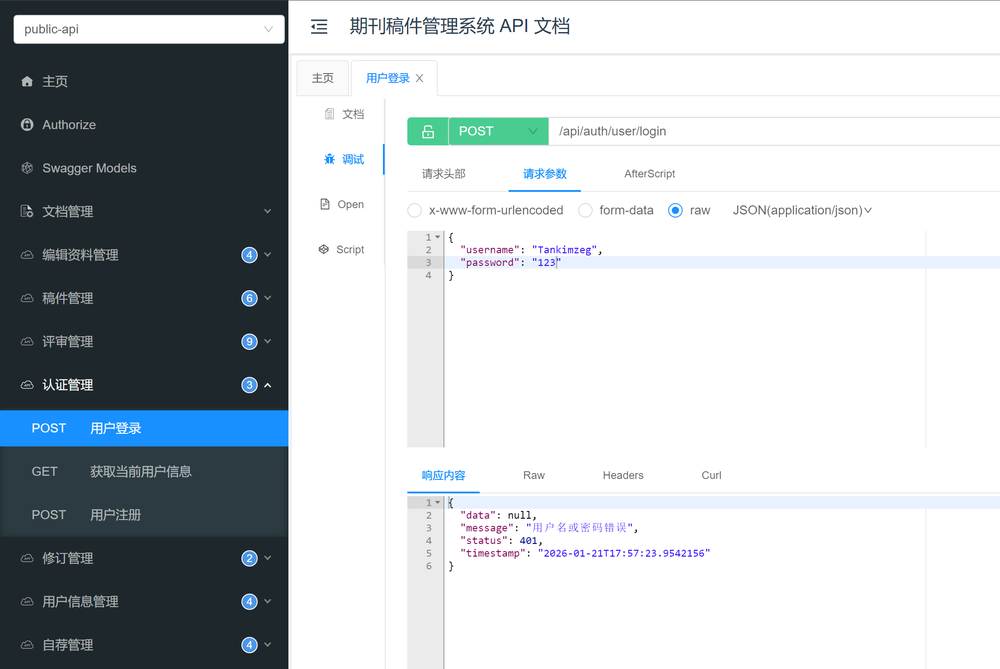

前段时间在投稿，整个系统看起来像是2000年代的网页风格，打开F12，接口返回的是HTML代码，果然是PHP的前后端不分离Web应用。这都什么年代了，网站还这么落后，真的不堪入目啊……

正好最近在学习设计模式和Java语言，于是我想以设计一个类似的投稿系统为例来学习Spring等技术栈。打开Github，搜索一些关键词，发现相关项目较少，而且以毕设为主，[例如这个](https://github.com/yafeng-Soong/paperbackend/)，有的时间久远，工具链落后，质量总体不高，所以我决定模仿稿件处理一系列流程，亲自开发一个Spring Web应用，同时体验软件的设计周期，掌握设计思想。

Java自从1995年诞生以来，凭借其“一次编写，到处运行”的特点，风靡世界。我记得我小时候，就是按键手机和后来三星的早期触屏手机那个年代，很多软件都是Java编写的。在手机的存储目录里面经常能看到.jar包，还有Oracel JDK那个咖啡图标，我都有印象，我连电脑都不会用呢，就知道Java了。上小学的时候开始玩Minecraft，我也知道“Java版”和后来才有的“基岩版”。这导致我一直对Java的印象是编写游戏和软件的。实际上也没错，但是在国内的氛围下，Web后端占据当前互联网企业的大部分业务，这口气现在就靠Spring撑着了，还是阿里系带起来的。我在中厂实习的时候，那边也用的是SpringBoot，所以我对常规的CRUD操作、My-batis编写SQL已经熟悉，但始终觉得没有学到东西，都是依照项目的样板代码来的。借助这个机会，我来重新学习Spring的一些技术栈，使用最新的开发环境，采用符合自己品味的技术实践。我通过与DeepSeek和Github Copilot对话，得以快速搭建项目。

## 搭建并运行项目

**阶段1：**创建Spring Boot项目并理解基础结构

首先到[Spring Initializr](https://start.spring.io/)选择依赖并下载
选择：

- Project: Maven

- Language: Java

- Spring Boot: 4.0.1

- Group: top.tankimzeg

- Artifact: journal-editorial-system

- 依赖：Spring Web, Spring Data JPA, MySQL Driver

用IDEA打开。我自己配置了Maven和镜像源，所以不需要Maven包装器。等着IDEA慢慢转，下载好依赖。

我的开发环境十分激进，JDK 25 + SpringBoot 4.0.1 都是目前最新稳定版。

点击运行模板的 `EditorialSystemApplication`，发现报错 "Data Source" 相关。原来，
`@SpringBootApplication` [注解](https://docs.springframework.org.cn/spring-boot/tutorial/first-application/index.html#getting-started.first-application.code.spring-boot-application)包含了自动配置，需要我去 `resource/application.yml` 配置数据库连接，即使现在还没有用到数据库持久化操作。就像这样：

```yaml
spring:
 datasource:  
   url: jdbc:mysql://localhost:3306/spring_application?useUnicode=true&characterEncoding=UTF-8&useSSL=false  
   driver-class-name: com.mysql.cj.jdbc.Driver  
   username: spring  
   password: spring  
   type: com.zaxxer.hikari.HikariDataSource  
   hikari:  
     maximum-pool-size: 8  
     auto-commit: true
```

数据访问层用的不是MyBatis，而是Spring Data Jpa。Spring Data JPA 是 Spring 框架中用于简化数据访问层开发的核心模块。它基于 JPA 规范，底层使用 Hibernate实现，通过接口继承和方法命名规则，自动实现增删改查等常见操作。

```yaml
spring:
 jpa:  
   hibernate:  
     ddl-auto: update  
   database-platform: org.hibernate.dialect.MySQLDialect  
   show-sql: true  
   # 如果要用 data.sql 初始化数据，需要加上这个配置  
   defer-datasource-initialization: true
```

现在成功启动了！内存升高，风扇也响了起来！

创建第一个Controller:

```java
package top.tankimzeg.manuscript_system.controller;  
  
import org.springframework.http.ResponseEntity;  
import org.springframework.web.bind.annotation.GetMapping;  
import org.springframework.web.bind.annotation.RestController;  
  
@RestController  
public class HelloController {  
  
    @GetMapping("/hello")  
    public ResponseEntity<String> hello(){  
        return ResponseEntity.ok("期刊在线稿件管理系统！");  
    }  
}
```

浏览器访问 <http://localhost:8080/hello> ，即可看到这行字。

**阶段2：**数据库设计与基础CRUD

我们来设计第一个实体类：User。
用户主要有三个角色：作者、审稿人、编辑。稿件会在这三个人之间流转，稿件处理流程也需要他们来处理。作者可以转化为审稿人，用的也是同一个登录接口，只是审稿人能看到编辑安排的审稿需求。

```java
package top.tankimzeg.editorial_system.entity;  
  
import jakarta.persistence.*;  
import lombok.Data;  
import org.hibernate.annotations.CreationTimestamp;  
import org.hibernate.annotations.UpdateTimestamp;  
  
import java.time.LocalDateTime;  
  
@Entity  
@Table(name = "users")  
@Data  
public class User {  
  
    @Id  
    @GeneratedValue(strategy = GenerationType.IDENTITY)  
    private Long id;  
  
    @Column(unique = true, nullable = false)  
    private String username;  
  
    @Column(nullable = false)  
    private String password;  
  
    @Column(unique = true, nullable = false)  
    private String email;  
  
    @Column(name = "real_name")  
    private String realName;  
  
    public enum Role {  
        AUTHOR,  
        REVIEWER,  
        EDITOR  
    }  
  
    @Enumerated(EnumType.STRING)  
    @Column(nullable = false)  
    private Role role = Role.AUTHOR;  
  
    @CreationTimestamp  
    @Column(name = "created_at", updatable = false)  
    private LocalDateTime createdAt;  
  
    @UpdateTimestamp  
    @Column(name = "updated_at")  
    private LocalDateTime updatedAt;  
  
}
```

在项目开发过程中，实体类经过了多次变更，反复推定，最后才达到功能和代码简洁性的统一。

总体上的需求就是我所经历的稿件生命周期。这里还有一篇卖毕设的，如果你没有体验过投稿过程，可以参考 <https://blog.csdn.net/sheji717/article/details/144497868>

接下来创建Repository接口，这是程序对数据库进行访问和操作的一层抽象。

```java
package top.tankimzeg.editorial_system.repository;  
  
import org.springframework.data.jpa.repository.JpaRepository;  
import org.springframework.stereotype.Repository;  
import top.tankimzeg.editorial_system.entity.User;  
  
import java.util.Optional;  
  
@Repository  
public interface UserRepo extends JpaRepository<User, Long> {  
  
    Optional<User> findUserByUsername(String username);  
  
    boolean existsUserByUsername(String username);  
  
    boolean existsUserByEmail(String email);  
}
```

跟My-Batis不同，我们不需要编写实现或者SQL~~（以前过的是什么日子）~~。Jpa很神奇，通过函数名就能生成查询。对于复杂的查询，可以通过注解手动编写（本项目用不上，我觉得如果需要那种查询，得想想是不是表没设计好）。对于联表查询，在实体类中就要先声明好，就像这样：

```java
package top.tankimzeg.editorial_system.entity;  
  
import jakarta.persistence.*;  
import lombok.Data;  
  
/**  
 * @author Kim  
 * @date 2026/1/18 23:21  
 * @description 作者、专家个人详细信息实体类  
 */
@Entity  
@Table(name = "author_profiles")  
@Data  
public class AuthorProfile {  
  
    @Id  
    @Column(name = "author_id")  
    private Long id; // 与 users.id 共享主键（同时作为外键）  
  
    @OneToOne(fetch = FetchType.LAZY, optional = false)  
    @MapsId  
    @JoinColumn(name = "author_id", referencedColumnName = "id")  
    private User author;          // 关联的作者用户  
  
    @Embedded  
    private Profile profile;      // 通用个人资料  
}
```

```java
package top.tankimzeg.editorial_system.entity;  
  
import jakarta.persistence.*;  
import lombok.Data;  
import org.hibernate.annotations.CreationTimestamp;  
import org.hibernate.annotations.UpdateTimestamp;  
  
import java.time.LocalDateTime;  
import java.util.HashSet;  
import java.util.Set;  
  
/**  
 * @author Kim  
 * @date 2026/1/19 10:32  
 * @description 稿件实体类  
 */@Entity  
@Table(name = "manuscripts")  
@Data  
public class Manuscript {  
    @Id  
    @GeneratedValue(strategy = GenerationType.IDENTITY)  
    private Long id;  
  
    private String title;  
  
    private String abstractText;  
  
    private String keywords;  
  
    private String fields;  // 研究领域  
  
    @ManyToOne(fetch = FetchType.LAZY)  
    @JoinColumn(name = "author_id", nullable = false)  
    private User author;  // 投稿作者  
  
    @Enumerated(EnumType.STRING)  
    private ManuscriptStatus status;  // 稿件状态  
  
    public enum ManuscriptStatus {  
        SUBMITTED,              // 已提交  
        UNDER_REVIEW,           // 审核中  
        REVIEW_COMPLETED,       // 审核完成  
        UNDER_REVISION,         // 修订中  
        REVISION_COMPLETED,     // 修订完成  
        ACCEPTED,               // 已接受  
        REJECTED,               // 已拒绝  
        PUBLISHED,              // 已发表  
        WITHDRAWN               // 已撤回  
    }  
  
    @CreationTimestamp  
    @Column(name = "submitted_at", updatable = false)  
    private LocalDateTime submittedAt;      // 提交时间  
  
    @UpdateTimestamp  
    @Column(name = "updated_at")  
    private LocalDateTime updatedAt;  
  
    @OneToMany(mappedBy = "manuscript", cascade = CascadeType.ALL, orphanRemoval = true)  
    private Set<ManuscriptProcess> manuscriptProcesses = new HashSet<>();  
  
    @OneToMany(mappedBy = "manuscript", cascade = CascadeType.ALL, orphanRemoval = true)  
    private Set<ManuscriptAttachment> attachments = new HashSet<>();  
}
```

代码不是一开始就能写成这样的，是随着业务拓展和debug试错而逐步完善的。我一开始`Profile`为了能继承用了[@Inheritance](https://www.cnblogs.com/caofanqi/p/12095841.html)注解，结果总是报错，后来才改为@Embedable。

### 参考资料

#### SpringBoot API

<https://docs.spring.io/spring-boot/api/java/index.html>

#### Jpa Respository

<https://zhuanlan.zhihu.com/p/31265092632>

<https://blog.csdn.net/yanfeng918/article/details/38358747>

<https://www.hxstrive.com/subject/open_jpa.htm?id=542>

## 代码逻辑编写

接下来，我创建了 Manuscript/Review/AuthorProfile/ManuscriptProcess等实体，编写他们的Repository，然后是Service。各种主要业务逻辑都在Service中。

## 接口测试

接口测试我目前用的是Knife4j，但是我的Knife4j无法支持 `List<MutipartFile>` 的上传。后续测试可以改用postman等更高级的工具。

### Knife4j

Knife4j，这是一个Swagger的增强工具，用于生成API文档并提供一个可交互的界面，方便开发测试。

1. 在pom.xml中添加依赖

```xml
<dependency>
    <groupId>com.github.xiaoymin</groupId>
    <artifactId>knife4j-openapi3-jakarta-spring-boot-starter</artifactId>
    <version>4.5.0</version>
</dependency>
```

1. 在`application.yml`中添加Knife4j的配置：

```yaml
# springdoc-openapi项目配置  
springdoc:  
  swagger-ui:  
    path: /swagger-ui.html  
    tags-sorter: alpha  
    operations-sorter: alpha  
  api-docs:  
    path: /v3/api-docs  
  packages-to-scan: top.tankimzeg.editorial_system.controller  
  default-flat-param-object: true  
# knife4j的增强配置  
knife4j:  
  enable: true  
  setting:  
    language: zh_cn  
    enable-footer-custom: true  
    enable-version: true  
    footer-custom-content: "Apache License 2.0  |  Copyright © 2026 期刊在线采编系统"
```

1. 创建OpenAPI配置类

创建一个配置类来定义OpenAPI的基本信息，例如标题、描述、版本等。

```java
package top.tankimzeg.editorial_system.config;  
  
import io.swagger.v3.oas.models.OpenAPI;  
import io.swagger.v3.oas.models.info.Contact;  
import io.swagger.v3.oas.models.info.Info;  
import io.swagger.v3.oas.models.info.License;  
import io.swagger.v3.oas.models.security.SecurityRequirement;  
import io.swagger.v3.oas.models.security.SecurityScheme;  
import org.springdoc.core.models.GroupedOpenApi;  
import org.springframework.context.annotation.Bean;  
import org.springframework.context.annotation.Configuration;  
import org.springframework.http.HttpHeaders;  
  
/**  
 * @author Kim  
 * @date 2026/1/19 10:07  
 * @description Knife4j配置类  
 */@Configuration  
public class Knife4jConfig {  
  
    @Bean  
    public OpenAPI customOpenAPI() {  
        return new OpenAPI()  
                .info(new Info()  
                        .title("期刊采编系统 API 文档")  
                        .description("期刊在线采编系统后端API接口文档")  
                        .version("1.0.0")  
                        .contact(new Contact()  
                                .name("Tan Kimzeg")  
                                .email("tankimzeg@qq.com")  
                                .url("https://github.com/TanKimzeg/JournalEditorialSystem"))  
                        .license(new License()  
                                .name("Apache-2.0")  
                                .url("https://www.apache.org/licenses/LICENSE-2.0.html")))  
                .addSecurityItem(new SecurityRequirement().addList(HttpHeaders.AUTHORIZATION))  
                .components(new io.swagger.v3.oas.models.Components()  
                        .addSecuritySchemes(HttpHeaders.AUTHORIZATION,  
                                new SecurityScheme()  
                                        .type(SecurityScheme.Type.HTTP)  
                                        .scheme("bearer")  
                                        .bearerFormat("JWT")  
                                        .in(SecurityScheme.In.HEADER)  
                                        .name(HttpHeaders.AUTHORIZATION)));  
    }  
  
  
    @Bean  
    public GroupedOpenApi api() {  
        return GroupedOpenApi.builder()  
                .group("public-api")  
                .pathsToMatch("/api/**")  
                .build();  
    }  
  
}
```

然后，就可以在Controller里面加上一些注解：`@Tag` / `@Operation` / `@Schema` 等。

## JWT 登录认证授权

做好了以上主要业务逻辑的编写之后，Controller层却无法继续。我们实现controller之前需要先实现用户登录认证授权，这样在controller里面才能知道访问接口的用户身份，从而填写一些Service的authorId参数。

DeepSeek告诉我采用JWT机制完成登录认证。什么是JWT？我先学习了一下JWT。关于登录认证的机制有很多种，JWT可以说是其中最简单的了。

**实现Spring Security用户认证授权**：

1. 添加Spring Security依赖

 ```xml
 <!-- Spring Security -->  
 <dependency>  
     <groupId>org.springframework.boot</groupId>  
     <artifactId>spring-boot-starter-security</artifactId>  
 </dependency>  
   
 <!-- JWT支持 -->  
 <dependency>  
     <groupId>io.jsonwebtoken</groupId>  
     <artifactId>jjwt-api</artifactId>  
     <version>0.11.5</version>  
 </dependency>  
 <dependency>  
     <groupId>io.jsonwebtoken</groupId>  
     <artifactId>jjwt-impl</artifactId>  
     <version>0.11.5</version>  
     <scope>runtime</scope>  
 </dependency>  
 <dependency>  
     <groupId>io.jsonwebtoken</groupId>  
     <artifactId>jjwt-jackson</artifactId>  
     <version>0.11.5</version>  
     <scope>runtime</scope>  
 </dependency>  
   
 <!-- 密码加密 -->  
 <dependency>  
     <groupId>org.springframework.security</groupId>  
     <artifactId>spring-security-crypto</artifactId>  
 </dependency>
 ```

2. 创建JWT工具类

 ```java
 package top.tankimzeg.editorial_system.utils;  
   
 import io.jsonwebtoken.Claims;  
 import io.jsonwebtoken.Jwts;  
 import io.jsonwebtoken.SignatureAlgorithm;  
 import io.jsonwebtoken.security.Keys;  
 import org.springframework.beans.factory.annotation.Value;  
 import org.springframework.security.core.userdetails.UserDetails;  
 import org.springframework.stereotype.Component;  
   
 import java.security.Key;  
 import java.util.Date;  
 import java.util.HashMap;  
 import java.util.Map;  
 import java.util.function.Function;  
   
 /**  
  * @author Kim  
  * @date 2026/1/20 17:52  
  * @description JWT 工具类  
  */@Component  
 public class JwtUtil {  
   
     @Value("${jwt.secret}")  
     private String secret;  
   
     @Value("${jwt.expiration}")  
     private Long expiration;  
   
     // 从token中提取用户名  
     public String extractUsername(String token) {  
         return extractClaim(token, Claims::getSubject);  
     }  
   
     // 从token中提取过期时间  
     public Date extractExpiration(String token) {  
         return extractClaim(token, Claims::getExpiration);  
     }  
   
     // 从token中提取指定信息  
     public <T> T extractClaim(String token, Function<Claims, T> claimsResolver) {  
         final Claims claims = extractAllClaims(token);  
         return claimsResolver.apply(claims);  
     }  
   
     // 从token中提取所有信息  
     private Claims extractAllClaims(String token) {  
         return Jwts.parserBuilder()  
                 .setSigningKey(getSigningKey())  
                 .build()  
                 .parseClaimsJws(token)  
                 .getBody();  
     }  
   
     // 检查token是否过期  
     public Boolean isTokenExpired(String token) {  
         return extractExpiration(token).before(new Date());  
     }  
   
     // 生成token  
     public String generateToken(UserDetails userDetails) {  
         Map<String, Object> claims = new HashMap<>();  
         return createToken(claims, userDetails.getUsername());  
     }  
   
     // 创建token  
     private String createToken(Map<String, Object> claims, String subject) {  
         return Jwts.builder()  
                 .setClaims(claims)  
                 .setSubject(subject)  
                 .setIssuedAt(new Date(System.currentTimeMillis()))  
                 .setExpiration(new Date(System.currentTimeMillis() + expiration))  
                 .signWith(getSigningKey(), SignatureAlgorithm.HS256)  
                 .compact();  
     }  
   
     // 验证token  
     public Boolean validateToken(String token, UserDetails userDetails) {  
         final String username = extractUsername(token);  
         return (username.equals(userDetails.getUsername()) && !isTokenExpired(token));  
     }  
   
     // 获取签名密钥  
     private Key getSigningKey() {  
         byte[] keyBytes = secret.getBytes();  
         return Keys.hmacShaKeyFor(keyBytes);  
     }  
 }
 ```

3. 创建UserDetails实现类

 ```java
 package top.tankimzeg.editorial_system.entity;  
   
 import com.fasterxml.jackson.annotation.JsonIgnore;  
 import lombok.Getter;  
 import org.springframework.security.core.GrantedAuthority;  
 import org.springframework.security.core.authority.SimpleGrantedAuthority;  
 import org.springframework.security.core.userdetails.UserDetails;  
   
 import java.util.ArrayList;  
 import java.util.Collection;  
 import java.util.List;  
   
 /**  
  * @author Kim  
  * @date 2026/1/20 17:55  
  * @description Journal User Details 实现 UserDetails 接口  
  */@Getter  
 public class JournalUserDetails implements UserDetails {  
   
     private Long id;  
   
     private String username;  
   
     @JsonIgnore  
     private String password;  
   
     private String email;  
   
     private String realName;  
   
     private User.Role role;  
   
     private Collection<? extends GrantedAuthority> authorities;  
   
     public JournalUserDetails(  
             Long id,  
             String username,  
             String password,  
             String email,  
             String realName,  
             User.Role role,  
             Collection<? extends GrantedAuthority> authorities  
     ) {  
         this.id = id;  
         this.username = username;  
         this.password = password;  
         this.email = email;  
         this.realName = realName;  
         this.role = role;  
         this.authorities = authorities;  
     }  
   
     public static JournalUserDetails build(User user) {  
         List<GrantedAuthority> authorities = new ArrayList<>();  
         authorities.add(new SimpleGrantedAuthority("ROLE_" + user.getRole().name()));  
         if (user.getRole().equals(User.Role.EDITOR))  
             authorities.add(new SimpleGrantedAuthority("ROLE_" + User.Role.AUTHOR));  
   
         return new JournalUserDetails(  
                 user.getId(),  
                 user.getUsername(),  
                 user.getPassword(),  
                 user.getEmail(),  
                 user.getRealName(),  
                 user.getRole(),  
                 authorities  
         );  
     }  
   
 }
 ```

4. 创建UserDetailsService实现

 ```java
 package top.tankimzeg.editorial_system.service;  
   
 import org.springframework.beans.factory.annotation.Autowired;  
 import org.springframework.security.core.userdetails.UserDetails;  
 import org.springframework.security.core.userdetails.UserDetailsService;  
 import org.springframework.security.core.userdetails.UsernameNotFoundException;  
 import org.springframework.stereotype.Service;  
 import top.tankimzeg.editorial_system.entity.JournalUserDetails;  
 import top.tankimzeg.editorial_system.entity.User;  
 import top.tankimzeg.editorial_system.repository.UserRepo;  
   
 /**  
  * @author Kim  
  * @date 2026/1/20 18:00  
  * @description 期刊用户详情服务  
  */@Service  
 public class JournalUserDetailsService implements UserDetailsService {  
   
     @Autowired  
     private UserRepo userRepo;  
   
     @Override  
     public UserDetails loadUserByUsername(String username) throws UsernameNotFoundException {  
         User user = userRepo.findUserByUsername(username)  
                 .orElseThrow(() -> new UsernameNotFoundException("用户未找到: " + username));  
   
         return JournalUserDetails.build(user);  
     }  
   
       
 }
 ```

5. 创建认证请求、响应DTO

 ```java
 package top.tankimzeg.editorial_system.dto.request;  
   
 import lombok.Data;  
   
 /**  
  * @author Kim  
  * @date 2026/1/20 21:03  
  * @description 登录请求 DTO  
  */@Data  
 public class LoginRequest {  
   
     private String username;  
   
     private String password;  
 }
 ```

 ```java
 package top.tankimzeg.editorial_system.dto.request;  
   
 import lombok.Data;  
   
 /**  
  * @author Kim  
  * @date 2026/1/20 21:04  
  * @description 注册请求 DTO  
  */@Data  
 public class RegisterRequest {  
   
     private String username;  
   
     private String password;  
   
     private String email;  
   
     private String realName;  
   
     private String phoneNumber;  
   
     private String role = "AUTHOR";  
 }
 ```

 ```java
 package top.tankimzeg.editorial_system.dto.response;  
   
 import lombok.Data;  
   
 /**  
  * @author Kim  
  * @date 2026/1/20 21:06  
  * @description JWT 响应 DTO  
  */@Data  
 public class JwtResponse {  
   
     private String token;  
   
     private String type = "Bearer";  
   
     private Long id;  
   
     private String username;  
   
     private String realName;  
   
     private String email;  
   
     public JwtResponse(  
             String accessToken,  
             Long id,  
             String username,  
             String realName,  
             String email  
     ) {  
         this.token = accessToken;  
         this.id = id;  
         this.username = username;  
         this.realName = realName;  
         this.email = email;  
     }  
   
 }
 ```

6. 创建JWT认证过滤器

 ```java
 package top.tankimzeg.editorial_system.config;  
   
 import jakarta.servlet.FilterChain;  
 import jakarta.servlet.ServletException;  
 import jakarta.servlet.http.HttpServletRequest;  
 import jakarta.servlet.http.HttpServletResponse;  
 import org.springframework.beans.factory.annotation.Autowired;  
 import org.springframework.http.HttpHeaders;  
 import org.springframework.security.authentication.UsernamePasswordAuthenticationToken;  
 import org.springframework.security.core.context.SecurityContextHolder;  
 import org.springframework.security.core.userdetails.UserDetails;  
 import org.springframework.stereotype.Component;  
 import org.springframework.util.StringUtils;  
 import org.springframework.web.filter.OncePerRequestFilter;  
 import top.tankimzeg.editorial_system.service.JournalUserDetailsService;  
 import top.tankimzeg.editorial_system.utils.JwtUtil;  
   
 import java.io.IOException;  
   
 /**  
  * @author Kim  
  * @date 2026/1/20 18:37  
  * @description 创建JWT认证过滤器  
  */@Component  
 public class JwtAuthenticationFilter extends OncePerRequestFilter {  
   
     @Autowired  
     private JwtUtil jwtUtil;  
   
     @Autowired  
     private JournalUserDetailsService userDetailsService;  
   
     @Override  
     protected void doFilterInternal(  
             HttpServletRequest request, HttpServletResponse response, FilterChain filterChain  
     ) throws ServletException, IOException {  
         String jwt = parseJwt(request);  
         if (jwt != null && jwtUtil.extractUsername(jwt) != null) {  
             String username = jwtUtil.extractUsername(jwt);  
             UserDetails userDetails = userDetailsService.loadUserByUsername(username);  
   
             if (jwtUtil.validateToken(jwt, userDetails)) {  
                 UsernamePasswordAuthenticationToken authenticationToken =  
                         new UsernamePasswordAuthenticationToken(  
                                 userDetails,  
                                 null,  
                                 userDetails.getAuthorities()  
                         );  
                 authenticationToken.setDetails(userDetails);  
                 // 将认证信息存入SecurityContext  
                 SecurityContextHolder.getContext().setAuthentication(authenticationToken);  
             }  
         }  
         filterChain.doFilter(request, response);  
     }  
   
     private String parseJwt(HttpServletRequest request) {  
         String headerAuth = request.getHeader(HttpHeaders.AUTHORIZATION);  
   
         if (StringUtils.hasText(headerAuth) && headerAuth.startsWith("Bearer ")) {  
             return headerAuth.substring(7);  
         }  
   
         return null;  
     }  
 }
 ```

7. 创建Spring Security配置

 ```java
 package top.tankimzeg.editorial_system.config;  
   
 import org.springframework.beans.factory.annotation.Autowired;  
 import org.springframework.context.annotation.Bean;  
 import org.springframework.context.annotation.Configuration;  
 import org.springframework.security.authentication.AuthenticationManager;  
 import org.springframework.security.config.Customizer;  
 import org.springframework.security.config.annotation.authentication.configuration.AuthenticationConfiguration;  
 import org.springframework.security.config.annotation.method.configuration.EnableMethodSecurity;  
 import org.springframework.security.config.annotation.web.builders.HttpSecurity;  
 import org.springframework.security.config.annotation.web.configuration.EnableWebSecurity;  
 import org.springframework.security.config.annotation.web.configurers.AbstractHttpConfigurer;  
 import org.springframework.security.config.http.SessionCreationPolicy;  
 import org.springframework.security.crypto.bcrypt.BCryptPasswordEncoder;  
 import org.springframework.security.crypto.password.PasswordEncoder;  
 import org.springframework.security.web.SecurityFilterChain;  
 import org.springframework.security.web.authentication.UsernamePasswordAuthenticationFilter;  
   
   
 /**  
  * @author Kim  
  * @date 2026/1/20 19:12  
  * @description Security configuration for stateless JWT authentication  
  */@Configuration  
 @EnableWebSecurity  
 @EnableMethodSecurity  
 public class SecurityConfig {  
   
     @Autowired  
     private JwtAuthenticationFilter jwtAuthenticationFilter;  
   
     @Bean  
     public SecurityFilterChain filterChain(HttpSecurity http) {  
         http  
                 .cors(Customizer.withDefaults())  
                 .csrf(AbstractHttpConfigurer::disable)  
                 .sessionManagement(session -> session.sessionCreationPolicy(SessionCreationPolicy.STATELESS))  
                 .authorizeHttpRequests(auth -> auth  
                         .requestMatchers(  
                                 "/api/auth/**",  
                                 "/swagger-ui/**",  
                                 "/v3/api-docs/**",  
                                 "/doc.html",  
                                 "/webjars/**",  
                                 "/favicon.ico"  
                         ).permitAll()  
                         .anyRequest().authenticated()  
                 );  
   
         // Ensure JWT filter runs before credential-based filter (even if not used)  
         http.addFilterBefore(jwtAuthenticationFilter, UsernamePasswordAuthenticationFilter.class);  
   
         return http.build();  
     }  
   
     @Bean  
     public AuthenticationManager authenticationManager(AuthenticationConfiguration authenticationConfiguration) {  
         return authenticationConfiguration.getAuthenticationManager();  
     }  
   
     @Bean  
     public PasswordEncoder passwordEncoder() {  
         return new BCryptPasswordEncoder();  
     }  
 }
 ```

8. 创建认证Controller

 ```java
 package top.tankimzeg.editorial_system.controller;  
   
 import io.swagger.v3.oas.annotations.Operation;  
 import io.swagger.v3.oas.annotations.tags.Tag;  
 import org.springframework.beans.factory.annotation.Autowired;  
 import org.springframework.http.HttpStatus;  
 import org.springframework.security.authentication.AuthenticationManager;  
 import org.springframework.security.authentication.UsernamePasswordAuthenticationToken;  
 import org.springframework.security.core.Authentication;  
 import org.springframework.security.core.context.SecurityContextHolder;  
 import org.springframework.security.crypto.password.PasswordEncoder;  
 import org.springframework.validation.annotation.Validated;  
 import org.springframework.web.bind.annotation.*;  
 import top.tankimzeg.editorial_system.dto.response.JwtResponse;  
 import top.tankimzeg.editorial_system.dto.request.LoginRequest;  
 import top.tankimzeg.editorial_system.dto.request.RegisterRequest;  
 import top.tankimzeg.editorial_system.entity.JournalUserDetails;  
 import top.tankimzeg.editorial_system.entity.User;  
 import top.tankimzeg.editorial_system.exception.BusinessException;  
 import top.tankimzeg.editorial_system.service.UserService;  
 import top.tankimzeg.editorial_system.utils.JwtUtil;  
   
 import org.springframework.security.core.AuthenticationException;  
 import top.tankimzeg.editorial_system.utils.SecurityUtil;  
 import top.tankimzeg.editorial_system.utils.ApiResponse;  
   
 /**  
  * @author Kim  
  * @date 2026/1/20 21:09  
  * @description 用户认证管理控制器  
  */@RestController  
 @RequestMapping("/api/auth/user")  
 @Tag(name = "认证管理", description = "用户登录、注册与认证相关接口")  
 public class AuthController {  
   
     @Autowired  
     private AuthenticationManager authenticationManager;  
   
     @Autowired  
     private JwtUtil jwtUtil;  
   
     @Autowired  
     private UserService userService;  
   
     @Autowired  
     private PasswordEncoder passwordEncoder;  
   
     @PostMapping("/login")  
     @Operation(summary = "用户登录", description = "用户通过用户名和密码进行登录，成功后返回JWT令牌")  
     public ApiResponse<JwtResponse> authenticateUser(  
             @Validated @RequestBody LoginRequest loginRequest  
     ) {  
         try {  
             Authentication authentication = authenticationManager.authenticate(  
                     new UsernamePasswordAuthenticationToken(  
                             loginRequest.getUsername(),  
                             loginRequest.getPassword()  
                     )  
             );  
   
             SecurityContextHolder.getContext().setAuthentication(authentication);  
             JournalUserDetails userDetails = (JournalUserDetails) authentication.getPrincipal();  
             String jwt = jwtUtil.generateToken(userDetails);  
             return ApiResponse.success(  
                     new JwtResponse(  
                             jwt,  
                             userDetails.getId(),  
                             userDetails.getUsername(),  
                             userDetails.getRealName(),  
                             userDetails.getEmail()  
                     ));  
         } catch (AuthenticationException ex) {  
             throw new BusinessException(HttpStatus.UNAUTHORIZED, "用户名或密码错误");  
         }  
     }  
   
     @PostMapping("/register")  
     @Operation(summary = "用户注册", description = "新用户注册接口")  
     public ApiResponse<JwtResponse> registerUser(  
             @RequestBody RegisterRequest registerRequest  
     ) {  
         if (userService.existsByUsername(registerRequest.getUsername())) {  
             throw new BusinessException("用户名已被注册");  
         }  
         if (userService.existsByEmail(registerRequest.getEmail())) {  
             throw new BusinessException("邮箱已被注册");  
         }  
   
         // 创建新用户  
         User newUser = new User();  
         newUser.setUsername(registerRequest.getUsername());  
         newUser.setEmail(registerRequest.getEmail());  
         newUser.setRealName(registerRequest.getRealName());  
         newUser.setRole(User.Role.valueOf(registerRequest.getRole().toUpperCase()));  
         newUser.setPassword(passwordEncoder.encode(registerRequest.getPassword()));  
         User createdUser = userService.createAuthor(newUser);  
   
         // 自动登录  
         Authentication authentication = authenticationManager.authenticate(  
                 new UsernamePasswordAuthenticationToken(  
                         registerRequest.getUsername(),  
                         registerRequest.getPassword()  
                 )  
         );  
         SecurityContextHolder.getContext().setAuthentication(authentication);  
         JournalUserDetails userDetails = (JournalUserDetails) authentication.getPrincipal();  
         String jwt = jwtUtil.generateToken(userDetails);  
         return ApiResponse.success(  
                 new JwtResponse(  
                         jwt,  
                         userDetails.getId(),  
                         userDetails.getUsername(),  
                         userDetails.getRealName(),  
                         userDetails.getEmail()  
                 )  
         );  
     }  
   
     @GetMapping("/me")  
     @Operation(summary = "获取当前用户信息", description = "获取已认证用户的详细信息")  
     public ApiResponse<JournalUserDetails> getCurrentUserInfo() {  
         return ApiResponse.success(SecurityUtil.getCurrentUserDetails()  
                 .orElseThrow(() -> new BusinessException(HttpStatus.UNAUTHORIZED, "未认证的用户")));  
     }  
   
 }
 ```

9. 创建工具类获取当前用户

 ```java
 package top.tankimzeg.editorial_system.utils;  
   
 import org.springframework.security.core.Authentication;  
 import org.springframework.security.core.context.SecurityContextHolder;  
 import org.springframework.stereotype.Component;  
 import top.tankimzeg.editorial_system.entity.JournalUserDetails;  
 import top.tankimzeg.editorial_system.entity.User;  
   
 import java.util.Optional;  
   
 /**  
  * @author Kim  
  * @date 2026/1/20 21:54  
  * @description 获取当前登录用户信息的工具类  
  */@Component  
 public class SecurityUtil {  
   
     public static Long getCurrentUserId() {  
         return getCurrentUserDetails()  
                 .orElseThrow()  
                 .getId();  
     }  
   
     public static User.Role getCurrentUserRole() {  
         return getCurrentUserDetails()  
                 .orElseThrow()  
                 .getRole();  
   
     }  
   
     public static String getCurrentUsername() {  
         return getCurrentUserDetails()  
                 .orElseThrow()  
                 .getUsername();  
     }  
   
     public static String getCurrentUserEmail() {  
         return getCurrentUserDetails()  
                 .orElseThrow()  
                 .getEmail();  
     }  
   
     public static String getCurrentUserRealName() {  
         return getCurrentUserDetails()  
                 .orElseThrow()  
                 .getRealName();  
     }  
   
     public static boolean isAuthor() {  
         return getCurrentUserRole().equals(  
                 User.Role.AUTHOR  
         ) || getCurrentUserRole().equals(  
                 User.Role.REVIEWER  
         );  
     }  
   
     public static boolean isEditor() {  
         return getCurrentUserRole().equals(  
                 User.Role.EDITOR  
         );  
     }  
   
     public static boolean isReviewer() {  
         return getCurrentUserRole().equals(  
                 User.Role.REVIEWER  
         );  
     }  
   
     public static Optional<JournalUserDetails> getCurrentUserDetails() {  
         Authentication authentication = SecurityContextHolder.getContext().getAuthentication();  
         if (authentication != null && authentication.isAuthenticated()) {  
             Object principal = authentication.getDetails();  
             if (principal instanceof JournalUserDetails)  
                 return Optional.ofNullable((JournalUserDetails) authentication.getPrincipal());  
         }  
         return Optional.empty();  
     }  
   
 }
 ```

10. 更新Knife4j配置支持JWT

 几乎所有请求接口都需要认证，有两种方法增加请求头部的设置，我用的方法是直接全局新增请求头部，不需要的再删掉。

 ```java
 package top.tankimzeg.editorial_system.config;  
   
 import io.swagger.v3.oas.models.Operation;  
 import io.swagger.v3.oas.models.security.SecurityRequirement;  
 import org.springdoc.core.customizers.GlobalOperationCustomizer;  
 import org.springframework.http.HttpHeaders;  
 import org.springframework.stereotype.Component;  
 import org.springframework.web.method.HandlerMethod;  
   
 import java.util.List;  
   
 /**  
  * @author Kim  
  * @date 2026/1/20 23:24  
  * @description 为所有Knife4j界面调试接口添加Authorization请求头部  
  * @see <a href="https://doc.xiaominfo.com/docs/blog/add-authorization-header">OpenAPI3规范中添加Authorization鉴权请求</a>  
  */  
 @Component  
 public class Knife4jOperationCustomizer implements GlobalOperationCustomizer {  
     @Override  
     public Operation customize(Operation operation, HandlerMethod handlerMethod) {  
         List<SecurityRequirement> securityRequirements = operation.getSecurity();  
         if (securityRequirements == null) {  
             securityRequirements = List.of(new SecurityRequirement()  
                     .addList(HttpHeaders.AUTHORIZATION));  
             operation.setSecurity(securityRequirements);  
         }  
         return operation;  
     }  
 }
 ```

现在可以在Controller中使用 `SecurityUtil.getCurrentUserId()` 来获取当前用户ID。这一整套操作下来，我还有点懵，但的确是管用的。

## 接口返回统一格式与全局异常处理

统一异常处理和响应封装是构建健壮REST API的关键。

封装API响应：

```java
package top.tankimzeg.editorial_system.utils;  
  
import lombok.Data;  
import org.springframework.http.HttpStatus;  
import top.tankimzeg.editorial_system.exception.BusinessException;  
  
import java.time.LocalDateTime;  
  
@Data  
public class ApiResponse<T> {  
    private int status;  
    private String message;  
    private T data;  
    private LocalDateTime timestamp;  
  
    public ApiResponse(HttpStatus status, String message, T data) {  
        this.status = status.value();  
        this.message = message;  
        this.data = data;  
        this.timestamp = LocalDateTime.now();  
    }  
  
    public ApiResponse(int code, String message, T data) {  
        this.status = code;  
        this.message = message;  
        this.data = data;  
        this.timestamp = LocalDateTime.now();  
    }  
  
    public static <T> ApiResponse<T> success(T data) {  
        return new ApiResponse<>(HttpStatus.OK, "success", data);  
    }  
  
    public static <T> ApiResponse<T> success(String message, T data) {  
        return new ApiResponse<>(HttpStatus.OK, message, data);  
    }  
  
    public static ApiResponse<?> failure(HttpStatus status, String message) {  
        return new ApiResponse<>(status, message, null);  
    }  
  
    public static <T> ApiResponse<T> failure(HttpStatus status, String message, T data) {  
        return new ApiResponse<>(status, message, data);  
    }  
  
    public static ApiResponse<?> failure(String message) {  
        return new ApiResponse<>(HttpStatus.BAD_REQUEST, message, null);  
    }  
  
    public static ApiResponse<?> fromException(BusinessException ex) {  
        return new ApiResponse<>(ex.getStatus(), ex.getMessage(), null);  
    }  
  
    public static ApiResponse<?> unauthorized(String message) {  
        return new ApiResponse<>(HttpStatus.UNAUTHORIZED, message, null);  
    }  
  
    public static ApiResponse<?> forbidden(String message) {  
        return new ApiResponse<>(HttpStatus.FORBIDDEN, message, null);  
    }  
  
    public static ApiResponse<?> badRequest(String message) {  
        return new ApiResponse<>(HttpStatus.BAD_REQUEST, message, null);  
    }  
  
    public static ApiResponse<?> internalServerError(String message) {  
        return new ApiResponse<>(HttpStatus.INTERNAL_SERVER_ERROR, message, null);  
    }  
}
```

封装一个自定义的异常：

```java
package top.tankimzeg.editorial_system.exception;  
  
import lombok.Getter;  
import org.springframework.http.HttpStatus;  
  
/**  
 * @author Kim  
 * @date 2026/1/21 16:11  
 * @description 自定义业务异常类  
 */@Getter  
public class BusinessException extends RuntimeException{  
  
    private final HttpStatus status;  
  
    private final int code;  
  
    public BusinessException(HttpStatus status, int code, String message){  
        super(message);  
        this.status = status;  
        this.code = code;  
    }  
  
    public BusinessException(String message) {  
        super(message);  
        this.status = HttpStatus.BAD_REQUEST;  
        this.code = HttpStatus.BAD_REQUEST.value();  
    }  
  
    public BusinessException(HttpStatus status, String message){  
        super(message);  
        this.status = status;  
        this.code = status.value();  
    }  
  
    public BusinessException(int code, String message){  
        super(message);  
        this.code = code;  
        this.status = HttpStatus.valueOf(code);  
    }  
  
}
```

全局异常处理类：

```java
package top.tankimzeg.editorial_system.exception;  
  
import io.swagger.v3.oas.annotations.Hidden;  
import jakarta.validation.ConstraintViolation;  
import jakarta.validation.ConstraintViolationException;  
import org.springframework.http.HttpStatus;  
import org.springframework.security.access.AccessDeniedException;  
import org.springframework.security.authentication.BadCredentialsException;  
import org.springframework.security.core.AuthenticationException;  
import org.springframework.validation.FieldError;  
import org.springframework.web.bind.MethodArgumentNotValidException;  
import org.springframework.web.bind.annotation.ExceptionHandler;  
import org.springframework.web.bind.annotation.RestControllerAdvice;  
import org.springframework.web.method.annotation.MethodArgumentTypeMismatchException;  
import top.tankimzeg.editorial_system.utils.ApiResponse;  
  
import java.util.HashMap;  
import java.util.Map;  
  
/**  
 * @author Kim  
 * @date 2026/1/21 16:48  
 * @description 全局异常处理器  
 */@Hidden  
@RestControllerAdvice()  
public class GlobalExceptionHandler {  
  
    // 处理业务异常  
    @ExceptionHandler(BusinessException.class)  
    public ApiResponse<?> handleBusinessException(BusinessException ex) {  
  
        return ApiResponse.fromException(ex);  
    }  
  
    // 处理参数验证异常  
    @ExceptionHandler(MethodArgumentNotValidException.class)  
    public ApiResponse<?> handleValidationExceptions(MethodArgumentNotValidException ex) {  
  
        Map<String, String> errors = new HashMap<>();  
        ex.getBindingResult().getAllErrors().forEach(error -> {  
            String fieldName = ((FieldError) error).getField();  
            String errorMessage = error.getDefaultMessage();  
            errors.put(fieldName, errorMessage);  
        });  
  
        return ApiResponse.failure(HttpStatus.BAD_REQUEST, "参数验证失败", errors);  
    }  
  
    // 处理JSR303验证异常  
    @ExceptionHandler(ConstraintViolationException.class)  
    public ApiResponse<?> handleConstraintViolationException(ConstraintViolationException ex) {  
  
        Map<String, String> errors = new HashMap<>();  
        for (ConstraintViolation<?> violation : ex.getConstraintViolations()) {  
            String fieldName = violation.getPropertyPath().toString();  
            String errorMessage = violation.getMessage();  
            errors.put(fieldName, errorMessage);  
        }  
  
        return ApiResponse.failure(HttpStatus.BAD_REQUEST, "参数验证失败", errors);  
    }  
  
    // 处理认证异常  
    @ExceptionHandler({AuthenticationException.class, BadCredentialsException.class})  
    public ApiResponse<?> handleAuthenticationException(Exception ex) {  
  
        return ApiResponse.unauthorized("认证失败: " + ex.getMessage());  
    }  
  
    // 处理权限不足异常  
    @ExceptionHandler(AccessDeniedException.class)  
    public ApiResponse<?> handleAccessDeniedException(AccessDeniedException ex) {  
  
        return ApiResponse.forbidden("权限不足: " + ex.getMessage());  
    }  
  
    // 处理参数类型不匹配异常  
    @ExceptionHandler(MethodArgumentTypeMismatchException.class)  
    public ApiResponse<?> handleMethodArgumentTypeMismatchException(MethodArgumentTypeMismatchException ex) {  
  
        String error = String.format("参数 '%s' 类型错误，期望类型: %s",  
                ex.getName(), ex.getRequiredType().getSimpleName());  
  
        return ApiResponse.badRequest(error);  
    }  
  
    // 处理其他所有异常  
    @ExceptionHandler(Exception.class)  
    public ApiResponse<?> handleAllUncaughtException(Exception ex) {  
  
        return ApiResponse.internalServerError(ex.getMessage());  
    }  
}
```

## 设计并完善视图

在实际项目中，严格区分这些层次非常重要。

> 📊 为什么需要区分DTO/VO/Entity？

|层次|目的|示例|特点|
|---|---|---|---|
|**Entity**|数据库映射，核心业务对象|`User`, `Manuscript`|包含数据库字段映射、关联关系、业务逻辑方法|
|**DTO**|数据传输对象，用于API接收|`CreateManuscriptDTO`|仅包含客户端需要提交的字段，用于参数校验|
|**VO**|视图对象，用于API返回|`ManuscriptVO`|包含客户端需要展示的字段，可能包含计算字段、格式化数据|

我遵循传入DTO，返回VO的规范，设计了DTO和VO的字段。然而，在DTO,Entity和VO之间的转换时遇到了麻烦。我最开始用的是 `BeanUtils.copyProperties();`，很快就力不从心了。这时候我遇到了MapStruct。

MapStruct 是一个 Java 的代码生成库，可以自动生成 DTO 和 VO 之间的转换代码。它的优点是：

- 无需手动编写转换逻辑。
- 编译时生成代码，性能高。
- 支持复杂的映射规则。

```java
package top.tankimzeg.editorial_system.mapper;  
  
import org.mapstruct.BeanMapping;  
import org.mapstruct.Mapper;  
import org.mapstruct.Mapping;  
import org.mapstruct.MappingTarget;  
import org.mapstruct.NullValuePropertyMappingStrategy;  
import org.mapstruct.factory.Mappers;  
import top.tankimzeg.editorial_system.dto.request.ManuscriptDTO;  
import top.tankimzeg.editorial_system.dto.response.ManuscriptVO;  
import top.tankimzeg.editorial_system.entity.Manuscript;  
  
/**  
 * @author Kim  
 * @date 2026/1/22 21:29  
 * @description 稿件映射器  
 */@Mapper  
public interface ManuscriptMapper {  
  
    ManuscriptMapper INSTANCE = Mappers.getMapper(ManuscriptMapper.class);  
  
    // create mapping: ignore server-managed or foreign key fields  
    @Mapping(target = "id", ignore = true)  
    @Mapping(target = "status", ignore = true)  
    @Mapping(target = "author", ignore = true)  
    @Mapping(target = "submittedAt", ignore = true)  
    @Mapping(target = "updatedAt", ignore = true)  
    @Mapping(target = "manuscriptProcesses", ignore = true)  
    @Mapping(target = "attachments", ignore = true)  
    Manuscript dtoToEntity(ManuscriptDTO dto);  
  
    // patch/update mapping: ignore nulls so they don't overwrite; also ignore server-managed fields  
    @BeanMapping(nullValuePropertyMappingStrategy = NullValuePropertyMappingStrategy.IGNORE)  
    @Mapping(target = "id", ignore = true)  
    @Mapping(target = "status", ignore = true)  
    @Mapping(target = "author", ignore = true)  
    @Mapping(target = "submittedAt", ignore = true)  
    @Mapping(target = "updatedAt", ignore = true)  
    @Mapping(target = "manuscriptProcesses", ignore = true)  
    @Mapping(target = "attachments", ignore = true)  
    void updateEntityFromDto(ManuscriptDTO dto, @MappingTarget Manuscript entity);  
  
    // entity -> vo mapping  
    @Mapping(target = "attachmentIds", expression =  
            "java(entity.getAttachments().stream().map(att -> att.getId()).toList())")  
    @Mapping(target = "authors", expression =  
            "java(java.util.Collections.singletonList(entity.getAuthor().getRealName()))")  
    @Mapping(target = "status", expression = "java(entity.getStatus().name())")  
    ManuscriptVO entityToVO(Manuscript entity);  
  
}
```

也支持手动编写转换代码：

```java
package top.tankimzeg.editorial_system.mapper;  
  
import org.mapstruct.Mapper;  
import org.mapstruct.factory.Mappers;  
import org.springframework.beans.factory.annotation.Autowired;  
import top.tankimzeg.editorial_system.dto.response.ManuscriptProcessVO;  
import top.tankimzeg.editorial_system.entity.ManuscriptProcess;  
import top.tankimzeg.editorial_system.repository.ReviewRepo;  
import top.tankimzeg.editorial_system.repository.RevisionRepo;  
  
  
import java.time.format.DateTimeFormatter;  
  
/**  
 * @author Kim  
 * @date 2026/1/23 15:41  
 * @description 稿件处理流程映射器  
 */@Mapper  
public interface ManuscriptProcessMapper {  
  
    ManuscriptProcessMapper INSTANCE = Mappers.getMapper(ManuscriptProcessMapper.class);  
  
    default ManuscriptProcessVO entityToVO(  
            ManuscriptProcess entity, @Autowired RevisionRepo revisionRepo, ReviewRepo reviewRepo) {  
        if (entity == null)  
            return null;  
        ManuscriptProcessVO vo = new ManuscriptProcessVO();  
        vo.setId(entity.getId());  
        vo.setStage(entity.getStage().name());  
        vo.setProcessedAt(entity.getProcessedAt().format(DateTimeFormatter.ISO_DATE));  
        vo.setFinishedAt(entity.getFinishedAt() != null ?  
                entity.getFinishedAt().format(DateTimeFormatter.ISO_DATE) : null);  
        vo.setComments(entity.getComments());  
        vo.setProcessedByRole(entity.getProcessedBy().getRole().name());  
        switch (entity.getStage()) {  
            case REVISION -> revisionRepo.findRevisionByProcessId(entity.getId()).getAttachments().forEach(  
                    attachment -> vo.getAttachments().add(attachment.getId())  
            );  
  
            case PEER_REVIEW -> reviewRepo.findReviewByProcessId(entity.getId()).getAttachments().forEach(  
                    attachment -> vo.getAttachments().add(attachment.getId())  
            );  
  
        }  
        return vo;  
    }  
}
```

构建后生成各自的实现代码。

## 电子邮件通知功能

除了在系统中有接口能够查询自己目前待办的任务外，稿件审理期间还有邮件服务，提醒作者缴纳审理费用、修改稿件，提醒审稿专家审理稿件等。为了实现这一需求，引入JavaMail与事件监听器。

首先添加邮件服务也模板引擎：

```xml
<!-- 邮件发送 -->  
<dependency>  
    <groupId>org.springframework.boot</groupId>  
    <artifactId>spring-boot-starter-mail</artifactId>  
</dependency>  
  
<!-- Thymeleaf -->  
<dependency>  
    <groupId>org.thymeleaf</groupId>  
    <artifactId>thymeleaf-spring6</artifactId>  
    <version>3.1.2.RELEASE</version>  
</dependency>  
  
<dependency>  
    <groupId>com.icegreen</groupId>  
    <artifactId>greenmail-junit5</artifactId>  
    <version>2.1.8</version>  
    <scope>test</scope>  
</dependency>
```

自定义一个通知服务接口，并以邮件通知服务实现接口：

```java
package top.tankimzeg.editorial_system.service.impl;  
  
import lombok.extern.slf4j.Slf4j;  
import org.springframework.beans.factory.annotation.Value;  
import org.springframework.mail.SimpleMailMessage;  
import org.springframework.mail.javamail.JavaMailSender;  
import org.springframework.mail.javamail.MimeMessageHelper;  
import org.springframework.scheduling.annotation.Async;  
import org.springframework.stereotype.Service;  
import top.tankimzeg.editorial_system.service.NotificationService;  
  
import jakarta.mail.MessagingException;  
import jakarta.mail.internet.MimeMessage;  
  
@Slf4j  
@Service  
public class MailNotificationService implements NotificationService {  
  
    private final JavaMailSender mailSender;  
  
    @Value("${spring.mail.username}")  
    private String from;  
  
    public MailNotificationService(JavaMailSender mailSender) {  
        this.mailSender = mailSender;  
    }  
  
    @Async  
    @Override    public void send(String to, String subject, String content) {  
        SimpleMailMessage message = new SimpleMailMessage();  
        message.setFrom(from);  
        message.setTo(to);  
        message.setSubject(subject);  
        message.setText(content);  
        try {  
            mailSender.send(message);  
        } catch (Exception e) {  
            log.error("Failed to send email to {}: {}", to, e.getMessage(), e);  
        }  
    }  
  
    @Async  
    @Override    public void sendHtml(String to, String subject, String html) {  
        MimeMessage mimeMessage = mailSender.createMimeMessage();  
        try {  
            MimeMessageHelper helper = new MimeMessageHelper(mimeMessage, true, "UTF-8");  
            helper.setFrom(from);  
            helper.setTo(to);  
            helper.setSubject(subject);  
            helper.setText(html, true);  
            mailSender.send(mimeMessage);  
        } catch (MessagingException e) {  
            log.error("Failed to send HTML email to {}: {}", to, e.getMessage(), e);  
        }  
    }  
}
```

从便于维护和可拓展性的角度来看，使用事件监听器更好，而不是在别的服务的方法里面插入发送邮件代码。因此创建事件监听器以及相应的事件：

```java
package top.tankimzeg.editorial_system.listener;  
  
import lombok.RequiredArgsConstructor;  
import org.springframework.stereotype.Component;  
import org.springframework.transaction.event.TransactionPhase;  
import org.springframework.transaction.event.TransactionalEventListener;  
import org.thymeleaf.TemplateEngine;  
import org.thymeleaf.context.Context;  
import top.tankimzeg.editorial_system.events.*;  
import top.tankimzeg.editorial_system.service.NotificationService;  
  
@Component  
@RequiredArgsConstructor  
public class NotificationEventListener {  
  
    private final NotificationService notificationService;  
    private final TemplateEngine templateEngine;  
  
    // ------------------- 给作者发送通知 -------------------  
  
    @TransactionalEventListener  
    public void onManuscriptSubmitted(ManuscriptSubmittedEvent event) {  
        var manuscript = event.manuscript();  
        Context ctx = new Context();  
        ctx.setVariable("title", manuscript.getTitle());  
        ctx.setVariable("author", manuscript.getAuthor().getRealName());  
        String html = templateEngine.process("mail/manuscript-submitted", ctx);  
        notificationService.sendHtml(manuscript.getAuthor().getEmail(), "稿件已提交", html);  
    }  
  
    @TransactionalEventListener  
    public void onRevisionRequested(RevisionTaskEvent event) {  
        var process = event.process();  
        Context ctx = new Context();  
        ctx.setVariable("title", process.getManuscript().getTitle());  
        String html = templateEngine.process("mail/revision-requested", ctx);  
        notificationService.sendHtml(process.getManuscript().getAuthor().getEmail(), "稿件修改通知", html);  
    }  
  
    @TransactionalEventListener  
    public void onReviewDecisionFinalized(FinishedReviewDecisionEvent event) {  
        var manuscript = event.manuscript();  
        var review = event.review();  
        Context ctx = new Context();  
        ctx.setVariable("title", manuscript.getTitle());  
        ctx.setVariable("decision", review.getDecision().name());  
        String html = templateEngine.process("mail/final-decision", ctx);  
        notificationService.sendHtml(manuscript.getAuthor().getEmail(), "审稿结果通知", html);  
    }  
  
    @TransactionalEventListener  
    public void onInitialReviewFinished(FinishedInitialReviewEvent event) {  
        var manuscript = event.manuscript();  
        Context ctx = new Context();  
        ctx.setVariable("title", manuscript.getTitle());  
        String html = templateEngine.process("mail/initial-review-finished", ctx);  
        notificationService.sendHtml(manuscript.getAuthor().getEmail(), "初审结果通知", html);  
    }  
  
    @TransactionalEventListener  
    public void onSelfRecommendationApproved(SelfRecommendationApprovedEvent event) {  
        var rec = event.recommendation();  
        Context ctx = new Context();  
        ctx.setVariable("expert", rec.getApprover());  
        String html = templateEngine.process("mail/self-recommendation-approved", ctx);  
        notificationService.sendHtml(rec.getApplicant().getEmail(), "自荐专家审核", html);  
    }  
  
  
    // ------------------- 给审稿人发送通知 -------------------  
  
    @TransactionalEventListener  
    public void onReviewAssigned(ReviewTaskEvent event) {  
        var process = event.process();  
        Context ctx = new Context();  
        ctx.setVariable("title", process.getManuscript().getTitle());  
        ctx.setVariable("reviewer", process.getProcessedBy().getRealName());  
        String html = templateEngine.process("mail/review-assigned", ctx);  
        notificationService.sendHtml(process.getProcessedBy().getEmail(), "您有新的稿件需要评审", html);  
  
    }  
  
    // ------------------- 给编辑发送通知 -------------------  
  
    @TransactionalEventListener  
    public void onEditorDealProcess(EditorTaskEvent event) {  
        var process = event.process();  
        Context ctx = new Context();  
        ctx.setVariable("title", process.getManuscript().getTitle());  
        ctx.setVariable("editor", process.getProcessedBy().getRealName());  
        String html = templateEngine.process("mail/editor-deal-process", ctx);  
        notificationService.sendHtml(process.getProcessedBy().getEmail(), "稿件处理提醒", html);  
    }  
  
    @TransactionalEventListener  
    public void onSelfRecommendationApply(SelfRecommendationApplyEvent event) {  
        var rec = event.recommendation();  
        Context ctx = new Context();  
        ctx.setVariable("applicant", rec.getApplicant().getRealName());  
        String html = templateEngine.process("mail/self-recommendation-apply", ctx);  
        notificationService.sendHtml(rec.getApprover().getEmail(), "有新的自荐专家申请待处理", html);  
    }  
}
```

这样就实现了对不同事件的捕获与处理逻辑。同时，使用了 `thymeleaf` 来管理模板。

模板引擎的配置类：

```java
package top.tankimzeg.editorial_system.config;  
  
import org.springframework.context.annotation.Bean;  
import org.springframework.context.annotation.Configuration;  
import org.thymeleaf.TemplateEngine;  
import org.thymeleaf.spring6.SpringTemplateEngine;  
import org.thymeleaf.spring6.templateresolver.SpringResourceTemplateResolver;  
  
@Configuration  
public class ThymeleafConfig {  
  
    @Bean  
    public SpringResourceTemplateResolver thymeleafTemplateResolver() {  
        SpringResourceTemplateResolver resolver = new SpringResourceTemplateResolver();  
        resolver.setPrefix("classpath:/templates/");  
        resolver.setSuffix(".html");  
        resolver.setCharacterEncoding("UTF-8");  
        resolver.setTemplateMode("HTML");  
        resolver.setCacheable(true);  
        return resolver;  
    }  
  
    @Bean  
    public TemplateEngine templateEngine(SpringResourceTemplateResolver resolver) {  
        SpringTemplateEngine engine = new SpringTemplateEngine();  
        engine.setTemplateResolver(resolver);  
        return engine;  
    }  
}
```

在某Service下就可以用一行代码触发事件发布：

```java
package top.tankimzeg.editorial_system.service;  
  
import org.springframework.beans.factory.annotation.Autowired;  
import org.springframework.context.ApplicationEventPublisher;  
import org.springframework.stereotype.Service;  
import org.springframework.transaction.annotation.Transactional;  
import org.springframework.web.multipart.MultipartFile;  
import top.tankimzeg.editorial_system.dto.request.ReviewDTO;  
import top.tankimzeg.editorial_system.dto.response.ManuscriptProcessVO;  
import top.tankimzeg.editorial_system.dto.response.ReviewVO;  
import top.tankimzeg.editorial_system.entity.Manuscript;  
import top.tankimzeg.editorial_system.entity.ManuscriptProcess;  
import top.tankimzeg.editorial_system.entity.Review;  
import top.tankimzeg.editorial_system.events.FinishedInitialReviewEvent;  
import top.tankimzeg.editorial_system.events.FinishedReviewDecisionEvent;  
import top.tankimzeg.editorial_system.mapper.ManuscriptProcessMapper;  
import top.tankimzeg.editorial_system.mapper.ReviewRecordMapper;  
import top.tankimzeg.editorial_system.repository.ManuscriptProcessRepo;  
import top.tankimzeg.editorial_system.repository.ManuscriptRepo;  
import top.tankimzeg.editorial_system.repository.ReviewRepo;  
  
import java.io.IOException;  
import java.time.LocalDateTime;  
import java.util.List;  
  
/**  
 * @author Kim  
 * @date 2026/1/19 16:15  
 * @description 评审服务类  
 */@Service  
public class ReviewService {  
  
    @Autowired  
    private ManuscriptRepo manuscriptRepo;  
  
    @Autowired  
    private ManuscriptProcessRepo manuscriptProcessRepo;  
  
    @Autowired  
    private ReviewRepo reviewRepo;  
  
    @Autowired  
    private FileStorageService fileStorageService;  
  
    @Autowired  
    private ApplicationEventPublisher eventPublisher;  
  
    private static final ManuscriptProcessMapper processMapper = ManuscriptProcessMapper.INSTANCE;  
  
    private static final ReviewRecordMapper reviewMapper = ReviewRecordMapper.INSTANCE;

 /**  
  * 编辑完成最终决定，编辑做出接受或拒绝的最终决定后调用此方法 
  * 
  * @param processId     稿件处理流程ID  
  * @param finalDecision 最终决定状态  
  * @param comment       备注  
  * @return 更新后的稿件处理流程记录  
  */
  @Transactional  
 public ManuscriptProcessVO finishedFinalDecision(  
         Long processId, Manuscript.ManuscriptStatus finalDecision, String comment) {  
     ManuscriptProcess process = manuscriptProcessRepo.getReferenceById(processId);  
     if (!process.getStage().equals(ManuscriptProcess.Stage.FINAL_DECISION))  
         throw new RuntimeException("当前流程阶段不允许做最终决定");  
   
     switch (finalDecision) {  
         case ACCEPTED, REJECTED -> {  
             // 更新稿件状态为最终决定状态  
             Manuscript manuscript = process.getManuscript();  
             manuscript.setStatus(finalDecision);  
             Manuscript saved = manuscriptRepo.save(manuscript);  
   
             // 更新稿件处理流程记录  
             process.setComments(comment);  
             process.setFinishedAt(LocalDateTime.now());  
             ManuscriptProcessVO vo = processMapper.entityToVO(manuscriptProcessRepo.save(process), null, null);  
             // 发布最终决定完成事件，通知作者  
             eventPublisher.publishEvent(new FinishedReviewDecisionEvent(saved, reviewRepo.findReviewByProcessId(processId)));  
             return vo;  
         }  
         default -> throw new RuntimeException("最终决定只能是接受或拒绝");  
     }  
 }
}
```

## 开发日志

以下是开发过程中遇到的具体问题，并含有解决措施参考。

### DAY 1

今天创建并运行初始项目。阅读了Spring官方文档，了解了Spring框架以及几个注解。

### DAY 2

今天主要设计了几个数据表，学习怎么写Jpa Repository。

### DAY 3

今天完善了数据表，编写了数据访问层和服务层，基本完成这些基础设施的构建，就差控制器层了……

实体和数据访问层用了Jpa，这几天都在慢慢学习，一开始不习惯，在学用期间顺带重温了数据库原理🙄会用了之后发现真的好用，Spring全家桶就应该带给人这种感觉，国内喜欢用MyBatis，搁那库库手写SQL，抽象水平之差，令人汗颜！为什么不用Jpa呢？培训班出来的业务员，把写代码变成了体力活，真的跟工地搬砖没有区别。为什么国内不流行Jpa而是My-Batis呢？数据库设计理念门槛较高，有人没有掌握。用Jpa样板代码减少了，不用手动创建数据表了，包、类的数量减少了，可维护性大大提升。

[SpringBoot开发使用Mybatis还是Spring Data JPA??](https://www.zhihu.com/question/316458408)

### DAY 4

在编写controller之前，先实现用户登录认证授权控制。非常复杂，借助了AI编写的代码和配置，加上自己调试才搞好。

学习了[jwt](https://javaguide.cn/system-design/security/jwt-intro.html),[一文读懂jwt](https://zhuanlan.zhihu.com/p/1932939645169164990)

登录注册Controller API……

看了这篇 <https://blog.csdn.net/weixin_42609405/article/details/139275959>
和 <https://doc.xiaominfo.com/docs/blog/add-authorization-header> 才弄好Knife4j的调试接口请求头部。




### DAY 5

早上编写了大量controller和鉴权代码，已经基本完成主体逻辑的编写。

下午开始逐步替换DTO和VO的工作。

首先是封装 `ResponseEntity`。为了便于前端的开发，应该统一服务器响应的格式。

对于请求异常，也要包装起来返回相关信息。这就引入了全局异常处理。捕获全局异常然后返回对应的响应。

结果设置了 `@RestControllerAdvice` 后 kinfe4j有一些问题：

```
java.lang.NoSuchMethodError: 'void org.springframework.web.method.ControllerAdviceBean.<init>(java.lang.Object)'
 at org.springdoc.core.service.GenericResponseService.lambda$getGenericMapResponse$8(GenericResponseService.java:702) 
```

找到了解决方法： <https://blog.csdn.net/m0_63131933/article/details/145346217> 不明觉厉……

现在发生异常也有返回响应了，效果如下：



真的有模有样了！

### DAY 6

今天完成了所有controller接口的统一封装。用到了一个Spring Security注解 `@PreAuthorize`。

DTO的转换好麻烦啊，我以前用的是`BeanUtil.transform`，不知道是谁封装的，现在找不到包了。还有以前用的Entity/DTO/VO设计很不优雅，各种继承乱成一团。

现在我深入理解了它们的区别，并且了解到[MapStruct](https://www.cnblogs.com/homejim/p/11313128.html)，这个看起来比较好用。

<https://blog.csdn.net/Gold_exp_erience/article/details/144005460>

### DAY 7

新增附件上传功能。`MultipartFile`文件传入 `controller` 的参数注解这里果然有坑：
<https://blog.csdn.net/qq_19891197/article/details/128653537>
<https://www.cnblogs.com/deanCopy/p/16358469.html>
<https://zhuanlan.zhihu.com/p/715695734>
我没有用postman测试，之前也没有经验，但是非常敏锐地蜘蛛感应到了这一点，一查资料，果然有坑，这就是天赋吧。

调试多文件上传：
[# SpringBoot项目中使用MultipartFile来上传文件(包含多文件)](https://blog.csdn.net/Aplumage/article/details/126347647)

[# 解决knife4j多文件上传问题](https://blog.csdn.net/liouwb/article/details/124491092)

> 未解决：knife4j无法调试多文件上传接口。因为我用的是OpenAPI3，没有该注解。得用postman调试。不太想装postman了。

### DAY 8

今天对接口做了一遍检查，修修补补之后，终于发布了第一个预览版~
0.1.0 版本发布！

### DAY 9

<https://blog.csdn.net/Lisonseekpan/article/details/156236090>

新增邮件通知功能，发布 0.2.0版本！


目前的项目代码统计：

| language | files |  code | comment | blank | total |
| :------- | ----: | ----: | ------: | ----: | ----: |
| Java     |    95 | 3,170 |     585 |   828 | 4,583 |
| XML      |     1 |   151 |       6 |    11 |   168 |
| HTML     |     8 |    86 |       0 |     7 |    93 |
| Markdown |     1 |    62 |       0 |    24 |    86 |
| YAML     |     1 |    58 |       5 |     4 |    67 |
