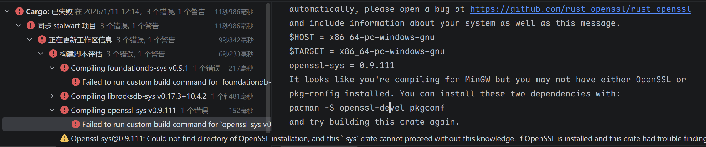
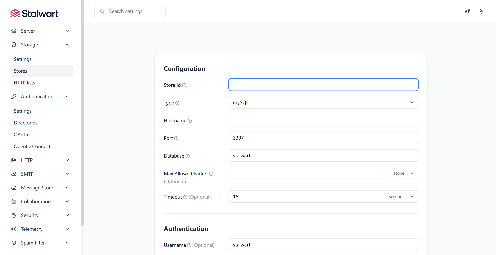
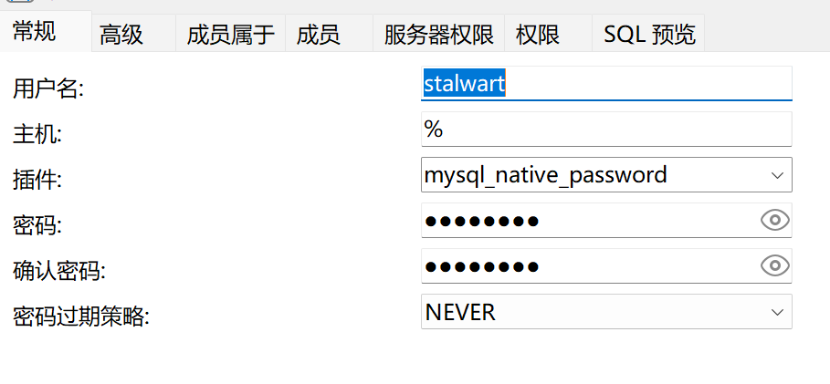
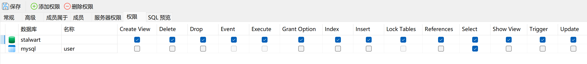
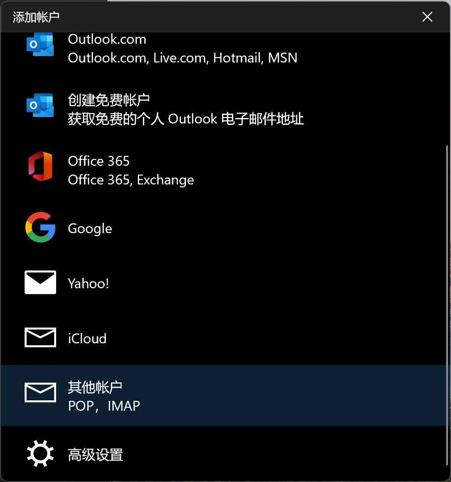
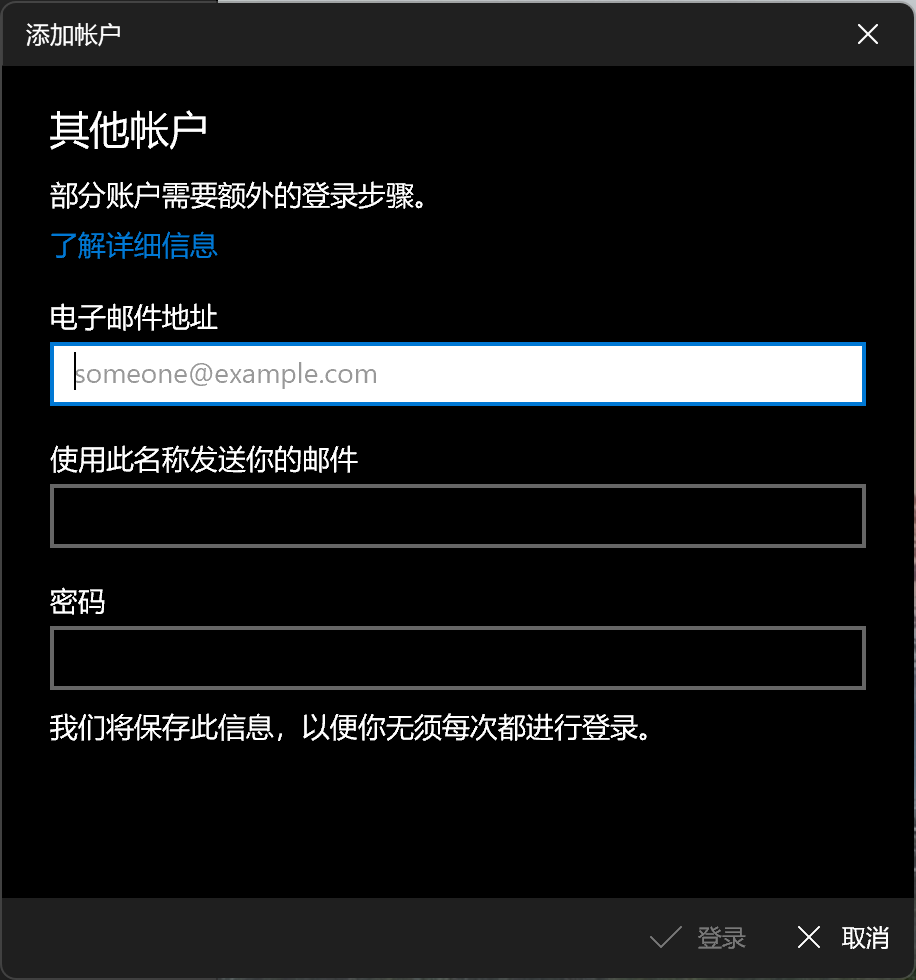
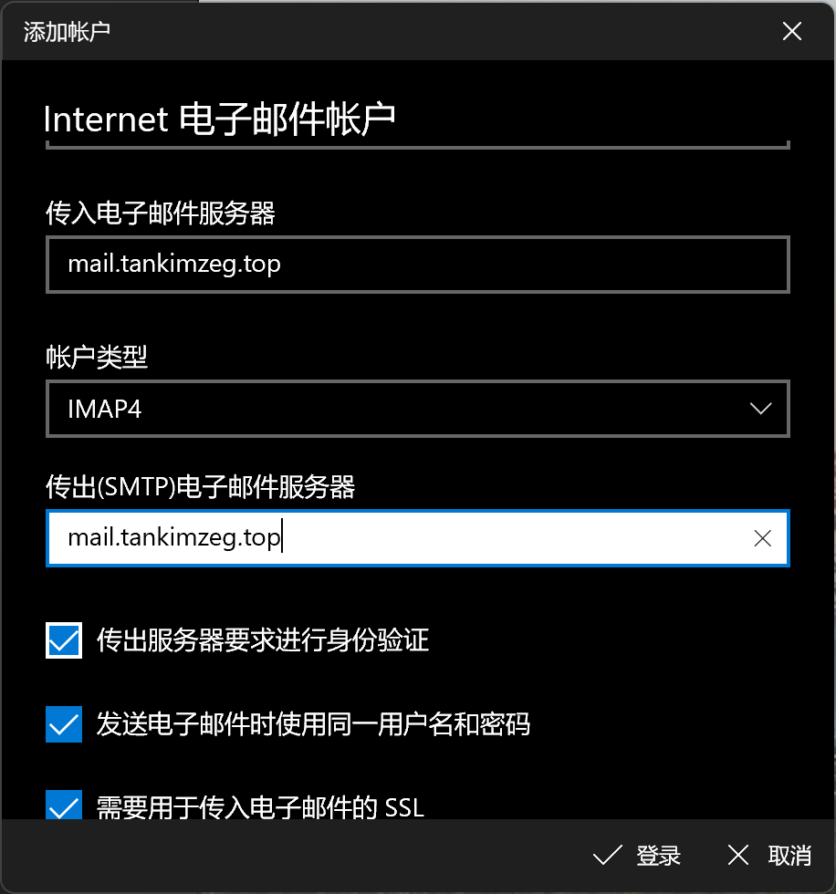
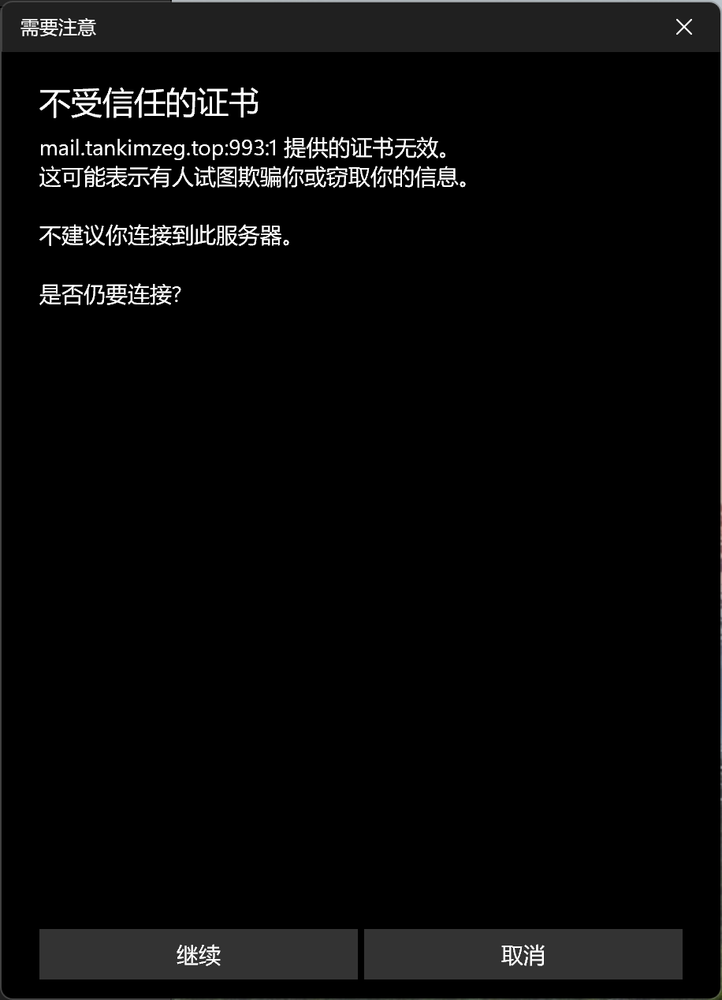
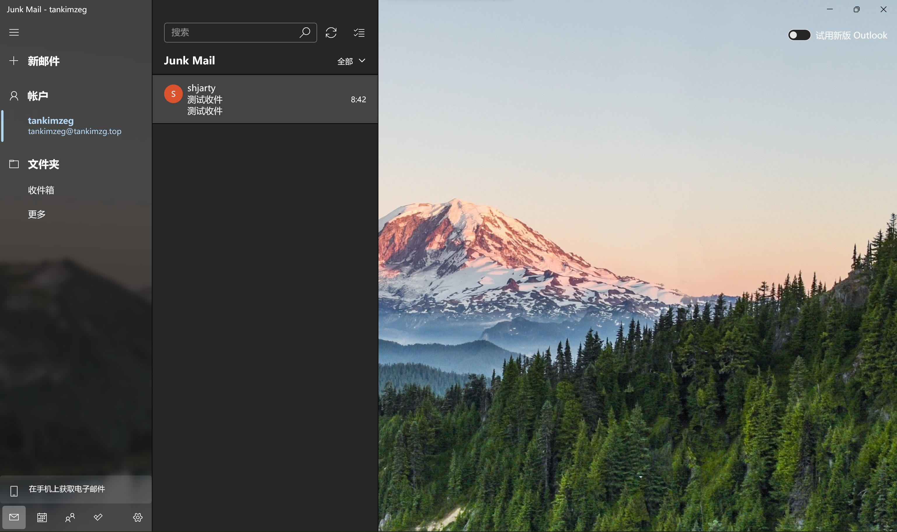

为了给我的服务器增加邮件服务，我选择了由Rust编写的邮件服务器[Stalwart](https://stalw.art/)。我跟随官方文档的指引，加上自己的探索，成功配置邮件服务器，还能重温计网邮件协议知识。本文详细记录部署过程。

首先我尝试了docker部署，但是 `docker pull` 就报错解压失败：

```
failed to register layer: Error processing tar file(exit status 1): archive/tar: invalid tar header
```

跟这个[ISSUE](https://github.com/stalwartlabs/stalwart/discussions/2242)是一样的，这个问题没有解决。或许是因为我的docker版本太老了。我只好采用Linux安装脚本。

成功安装后，命令行中有初始用户名和密码。网站默认使用8080端口。我先开放该端口：

```sh
sudo iptables -A INPUT -p tcp --dport 8080 -j ACCEPT
su root
sudo iptables-save > /etc/iptables/rules.v4

# 删除
sudo iptables -D INPUT [行数]
# 重启防火墙
sudo systemctl restart iptables 
```

HTTP访问8080端口，即可看到登陆页面。进一步配置Nginx反向代理，8080端口的入站规则可以修改为source仅允许localhost。再用Let's Encrypt签名启用HTTPS，具体可以参考[Frosti+Nginx+Waline建站全过程](https://tankimzeg.top/blog/frosti-nginx-waline-build-website/)

> [!NOTE]
> 我一开始如下操作使用外部数据库，结果始终无法登录创建的账户，bug查到红温，甚至把项目下载下来想要自己编译打断点（cargo下载了半个小时包结果编译失败🙄）！改为使用默认的rockdb才解决这个问题。以下内容记录踩坑，不建议实践，直接用默认设置，省时省力。
> 

我有Azure的MySQL服务器，所以在这个地方配置数据库：



初次之外，为了精细化访问控制，需要新增一个用户角色。在Navicat中，先连接到服务器，然后新建一个用户和数据库：


给用户配置权限，只需要该数据库和mysql数据库里面的user表（不然Navicat登录时会警告）



Azure MySQL默认使用SSL，记得勾选加密连接。

## DNS

查看域名的DNS 记录，非常多。根据需要去cloudflare添加DNS记录。TLSA我只添加了两条，不用的服务可以不添加（如POP3），涉及安全、签名的最好都添加，全部添加更好。另外还需要一条A记录，将 `mail.example.org` 指向服务器IP，这个应该是不能通过cloundflare代理的，否则用域名连接时会Timeout，把Proxy取消勾选。

同时开放服务器25,587（Submission）,993（IMAPS）端口。

## 发送邮件

为了进行快速便捷的测试，我使用JavaMail编写了一个Java程序发送邮件：

```xml
<?xml version="1.0" encoding="UTF-8"?>  
<project xmlns="http://maven.apache.org/POM/4.0.0"  
         xmlns:xsi="http://www.w3.org/2001/XMLSchema-instance"  
         xsi:schemaLocation="http://maven.apache.org/POM/4.0.0 http://maven.apache.org/xsd/maven-4.0.0.xsd">  
    <modelVersion>4.0.0</modelVersion>  
  
    <groupId>top.tankimzeg</groupId>  
    <artifactId>MailClient</artifactId>  
    <version>1.0-SNAPSHOT</version>  
  
    <properties>        
     <maven.compiler.source>25</maven.compiler.source>  
        <maven.compiler.target>25</maven.compiler.target>  
        <project.build.sourceEncoding>UTF-8</project.build.sourceEncoding>  
    </properties>  
    <dependencies>        
     <dependency>            
      <groupId>com.sun.mail</groupId>  
            <artifactId>javax.mail</artifactId>  
            <version>1.6.2</version>  
        </dependency>    
    </dependencies>
</project>
```

```java
package top.tankimzeg;

import javax.mail.*;
import javax.mail.internet.InternetAddress;
import javax.mail.internet.MimeMessage;
import java.io.UnsupportedEncodingException;
import java.util.Properties;

public class SendEmail {
    private static final String SMTP_HOST = "your_server";
    private static final String SMTP_PORT = "587";

    private static final String USERNAME = "user_name";
    private static final String PASSWD = "password";
    private static final String myAddress = "your_address";
    private static final String toAddress = "to_address";

    public static void main(String[] args) {
        // 配置发送邮件的环境属性
        final Properties props = getProps();
        // 构建授权信息，用于进行SMTP进行身份验证
        Authenticator authenticator = new Authenticator() {
            @Override
            protected PasswordAuthentication getPasswordAuthentication() {
                // 用户名、密码
                return new PasswordAuthentication(USERNAME, PASSWD);
            }
        };
        // 使用环境属性和授权信息，创建邮件会话
        Session mailSession = Session.getInstance(props, authenticator);
        // 创建邮件消息
        MimeMessage message = new MimeMessage(mailSession);
        try {
            // 设置发件人邮件地址和名称。填写控制台配置的发信地址,比如xxx@xxx.com。
            InternetAddress from = new InternetAddress(myAddress, "Tan Kimzeg");
            message.setFrom(from);
            //可选。设置回信地址
//            Address[] a = new Address[1];
//            a[0] = new InternetAddress("***");
//            message.setReplyTo(a);
            // 设置收件人邮件地址，比如yyy@yyy.com
            InternetAddress to = new InternetAddress(toAddress);
            message.setRecipient(MimeMessage.RecipientType.TO, to);
            //如果同时发给多人，才将上面两行替换为如下（因为部分收信系统的一些限制，尽量每次投递给一个人；同时我们限制单次允许发送的人数是50人）：
            //InternetAddress[] adds = new InternetAddress[2];
            //adds[0] = new InternetAddress("xxx@xxx.com");
            //adds[1] = new InternetAddress("xxx@xxx.com");
            //message.setRecipients(Message.RecipientType.TO, adds);

            // 设置邮件标题
            message.setSubject("测试邮件");
            message.setHeader("Content-Transfer-Encoding", "base64");
            // 设置邮件的内容体 type: text/plain（纯文本）text/html（HTML 文档）
            message.setContent("<!DOCTYPE html>\n<html>\n<head>\n<meta charset=\"utf-8\">\n<title>hello world</title>\n</head>\n<body>\n " + "<h1>我的第一个标题</h1>\n    <p>我的第一个段落。</p>\n</body>\n</html>", "text/html;charset=UTF-8");
            //发送邮件
            Transport.send(message);
        } catch (MessagingException | UnsupportedEncodingException e) {
            e.printStackTrace();
        }
    }

    private static Properties getProps() {
        final Properties props = new Properties();
        props.put("mail.debug", "true");
        props.put("mail.transport.protocol", "smtp");
        props.put("mail.smtp.auth", "true");
        props.put("mail.smtp.host", SMTP_HOST);
        props.put("mail.smtp.port", SMTP_PORT);

// STARTTLS 核心配置
        props.put("mail.smtp.starttls.enable", "true");
        props.put("mail.smtp.starttls.required", "true");

// 超时设置
        props.put("mail.smtp.connectiontimeout", "15000");
        props.put("mail.smtp.timeout", "30000");

// 如果服务器使用自签名证书，请添加以下信任设置
        props.put("mail.smtp.ssl.trust", "*");
        return props;
    }

}

```

成功发送的日志如下：

```log
DEBUG: JavaMail version 1.6.2
DEBUG: successfully loaded resource: /META-INF/javamail.default.address.map
DEBUG: getProvider() returning javax.mail.Provider[TRANSPORT,smtp,com.sun.mail.smtp.SMTPTransport,Oracle]
DEBUG SMTP: need username and password for authentication
DEBUG SMTP: protocolConnect returning false, host=mail.tankimzeg.top, user=tankimzeg, password=<null>
DEBUG SMTP: useEhlo true, useAuth true
DEBUG SMTP: trying to connect to host "mail.tankimzeg.top", port 587, isSSL false
220 mail.tankimzeg.top Stalwart ESMTP at your service
DEBUG SMTP: connected to host "mail.tankimzeg.top", port: 587
EHLO MyDell
250-mail.tankimzeg.top you had me at EHLO
250-STARTTLS
250-SMTPUTF8
250-SIZE 104857600
250-REQUIRETLS
250-PIPELINING
250-NO-SOLICITING
250-ENHANCEDSTATUSCODES
250-CHUNKING
250-BINARYMIME
250-AUTH XOAUTH2 OAUTHBEARER
250 8BITMIME
DEBUG SMTP: Found extension "STARTTLS", arg ""
DEBUG SMTP: Found extension "SMTPUTF8", arg ""
DEBUG SMTP: Found extension "SIZE", arg "104857600"
DEBUG SMTP: Found extension "REQUIRETLS", arg ""
DEBUG SMTP: Found extension "PIPELINING", arg ""
DEBUG SMTP: Found extension "NO-SOLICITING", arg ""
DEBUG SMTP: Found extension "ENHANCEDSTATUSCODES", arg ""
DEBUG SMTP: Found extension "CHUNKING", arg ""
DEBUG SMTP: Found extension "BINARYMIME", arg ""
DEBUG SMTP: Found extension "AUTH", arg "XOAUTH2 OAUTHBEARER"
DEBUG SMTP: Found extension "8BITMIME", arg ""
STARTTLS
220 2.0.0 Ready to start TLS.
EHLO MyDell
250-mail.tankimzeg.top you had me at EHLO
250-SMTPUTF8
250-SIZE 104857600
250-REQUIRETLS
250-PIPELINING
250-NO-SOLICITING
250-ENHANCEDSTATUSCODES
250-CHUNKING
250-BINARYMIME
250-AUTH PLAIN LOGIN XOAUTH2 OAUTHBEARER
250 8BITMIME
DEBUG SMTP: Found extension "SMTPUTF8", arg ""
DEBUG SMTP: Found extension "SIZE", arg "104857600"
DEBUG SMTP: Found extension "REQUIRETLS", arg ""
DEBUG SMTP: Found extension "PIPELINING", arg ""
DEBUG SMTP: Found extension "NO-SOLICITING", arg ""
DEBUG SMTP: Found extension "ENHANCEDSTATUSCODES", arg ""
DEBUG SMTP: Found extension "CHUNKING", arg ""
DEBUG SMTP: Found extension "BINARYMIME", arg ""
DEBUG SMTP: Found extension "AUTH", arg "PLAIN LOGIN XOAUTH2 OAUTHBEARER"
DEBUG SMTP: Found extension "8BITMIME", arg ""
DEBUG SMTP: protocolConnect login, host=mail.tankimzeg.top, user=tankimzeg, password=<non-null>
DEBUG SMTP: Attempt to authenticate using mechanisms: LOGIN PLAIN DIGEST-MD5 NTLM XOAUTH2 
DEBUG SMTP: Using mechanism LOGIN
DEBUG SMTP: AUTH LOGIN command trace suppressed
DEBUG SMTP: AUTH LOGIN succeeded
DEBUG SMTP: use8bit false
MAIL FROM:<tankimzeg@tankimzeg.top>
250 2.1.0 OK
RCPT TO:<xxx@gmail.com>
250 2.1.5 OK
DEBUG SMTP: Verified Addresses
DEBUG SMTP:   xxx@gmail.com
DATA
354 Start mail input; end with <CRLF>.<CRLF>
Date: Mon, 12 Jan 2026 08:06:12 +0800 (CST)
From: Tan Kimzeg <tankimzeg@tankimzeg.top>
To: xxx@gmail.com
Message-ID: <245565335.0.1768176372580@MyDell>
Subject: =?UTF-8?B?5rWL6K+V6YKu5Lu2?=
MIME-Version: 1.0
Content-Type: text/html;charset=UTF-8
Content-Transfer-Encoding: quoted-printable

<!DOCTYPE html>
<html>
<head>
<meta charset=3D"utf-8">
<title>hello world</title>
</head>
<body>
 <h1>=E6=88=91=E7=9A=84=E7=AC=AC=E4=B8=80=E4=B8=AA=E6=A0=87=E9=A2=98</h1>
    <p>=E6=88=91=E7=9A=84=E7=AC=AC=E4=B8=80=E4=B8=AA=E6=AE=B5=E8=90=BD=E3=
=80=82</p>
</body>
</html>
.
250 2.0.0 Message queued with id 3f481c415800015.
DEBUG SMTP: message successfully delivered to mail server
QUIT
221 2.0.0 Bye.
```

也可以通过

```shell
swaks --server <server ip>:587 --tls --auth LOGIN --auth-user test --auth-password test
```

来发送邮件

221并不意味着收到，只是加入了服务器的发送队列。查看日志，发现一直在 `IP LOOKUP` 和 `Connection timeout error` 之间重试……原来发送给了25端口：

```log
2026-01-11T15:54:01Z INFO Connection error (delivery.connect-error) queueId = 284931795407863938, queueName = "remote", from = "tankimzeg@tankimzeg.top", to = ["xxx@qq.com"], size = 586, total = 1, domain = "qq.com", hostname = "mx3.qq.com", localIp = 0.0.0.0, remoteIp = 240d:c040:1:40::133, remotePort = 25, causedBy = SMTP error occurred (smtp.error) { details = "I/O Error", reason = "Network is unreachable (os error 101)" }, elapsed = 0ms 
2026-01-11T15:54:01Z DEBUG IP address lookup (delivery.ip-lookup) queueId = 284931795407863938, queueName = "remote", from = "tankimzeg@tankimzeg.top", to = ["xxx@qq.com"], size = 586, total = 1, domain = "qq.com", hostname = "mx2.qq.com", details = [157.255.221.247, 58.254.165.82], limit = 2, elapsed = 60ms
```

回顾一下计算机网络的知识，像QQ、Gmail这样的公共邮件服务商，它们的服务器 (`mx1.qq.com`) 是面向**全球所有其他邮件服务器**的接收端点。它们不可能为每一个未知的服务器分配一个账户密码来认证（就像邮局不可能认识全世界所有来送信的邮递员）。因此，行业约定俗成，**服务器之间的对话，统一使用25端口**。

| 端口 | 官方名称 | 用途 | 类比 | 身份验证 |
| :--- | :--- | :--- | :--- | :--- |
| **25** | **SMTP** | **邮件传输**（MTA -> MTA）<br>**您的邮件服务器** 将邮件**传输/中继**到 **收件人的邮件服务器**（如QQ）。 | **两个邮局之间** 用邮车批量交换信件。 | **通常不需要**（依靠其他机制如SPF/DKIM建立信任）。 |
| **587** | **Submission** | **邮件提交**（MUA -> MSA）<br>您的邮件客户端/应用 **提交** 邮件到 **您自己的邮件服务器**。 | 您去**自家小区的邮局（您的Stalwart）** 寄信。 | **必须** 验证身份（用户名密码），确保是授权用户。 |
|**465** | **SMTPS**| 同上，历史遗留的另一种加密提交方式 | 加密的用户到快递收件点 | 必须认证，必须支持STARTTLS

由于各大云服务器商封禁了target 25端口出站，服务器无法直接与其他邮件服务器协商。在服务器上执行：

```shell
curl -m 5 -I  mx1.qq.com:25
curl: (28) Connection timed out after 5000 milliseconds
ping -c 3 mx1.qq.com
PING mx1.qq.com (162.62.116.184) 56(84) bytes of data.
64 bytes from 162.62.116.184 (162.62.116.184): icmp_seq=1 ttl=37 time=153 ms
64 bytes from 162.62.116.184 (162.62.116.184): icmp_seq=2 ttl=37 time=153 ms
64 bytes from 162.62.116.184 (162.62.116.184): icmp_seq=3 ttl=37 time=153 ms

--- mx1.qq.com ping statistics ---
3 packets transmitted, 3 received, 0% packet loss, time 2001ms
rtt min/avg/max/mdev = 152.690/152.735/152.761/0.032 ms
```

可以验证这一点。

也就是说，现在服务器只能收邮件，不能发邮件。来试试收邮件

## 收邮件

我通过QQ邮箱发送了一封测试邮件：

```log
2026-01-12T00:42:53Z INFO SMTP EHLO command (smtp.ehlo) listenerId = "smtp", localPort = 25, remoteIp = 162.62.57.49, remotePort = 38509, domain = "out162-62-57-49.mail.qq.com"
2026-01-12T00:42:53Z INFO SPF EHLO check failed (smtp.spf-ehlo-fail) listenerId = "smtp", localPort = 25, remoteIp = 162.62.57.49, remotePort = 38509, domain = "out162-62-57-49.mail.qq.com", result = No SPF record (spf.none), elapsed = 33ms
2026-01-12T00:42:54Z INFO TLS handshake (tls.handshake) listenerId = "smtp", localPort = 25, remoteIp = 162.62.57.49, remotePort = 38509, listenerId = "smtp", version = "TLSv1_2", details = "TLS_ECDHE_ECDSA_WITH_AES_256_GCM_SHA384"
2026-01-12T00:42:55Z INFO IPREV check passed (smtp.iprev-pass) listenerId = "smtp", localPort = 25, remoteIp = 162.62.57.49, remotePort = 38509, domain = "out162-62-57-49.mail.qq.com", result = IPREV check passed (iprev.pass) { details = ["out162-62-57-49.mail.qq.com."] }, elapsed = 96ms
2026-01-12T00:42:55Z INFO SPF From check passed (smtp.spf-from-pass) listenerId = "smtp", localPort = 25, remoteIp = 162.62.57.49, remotePort = 38509, domain = "out162-62-57-49.mail.qq.com", from = "xxx@qq.com", result = SPF check passed (spf.pass), elapsed = 72ms
2026-01-12T00:42:55Z INFO SMTP MAIL FROM command (smtp.mail-from) listenerId = "smtp", localPort = 25, remoteIp = 162.62.57.49, remotePort = 38509, from = "xxx@qq.com"
2026-01-12T00:42:55Z INFO SMTP RCPT TO command (smtp.rcpt-to) listenerId = "smtp", localPort = 25, remoteIp = 162.62.57.49, remotePort = 38509, to = "tankimzeg@tankimzeg.top"
2026-01-12T00:42:56Z INFO DKIM verification passed (smtp.dkim-pass) listenerId = "smtp", localPort = 25, remoteIp = 162.62.57.49, remotePort = 38509, strict = false, result = [DKIM verification passed (dkim.pass) { domain = "qq.com" }], elapsed = 29ms
2026-01-12T00:42:56Z INFO ARC verification passed (smtp.arc-pass) listenerId = "smtp", localPort = 25, remoteIp = 162.62.57.49, remotePort = 38509, strict = false, result = No DKIM signature (dkim.none), elapsed = 0ms
2026-01-12T00:42:56Z INFO DMARC check passed (smtp.dmarc-pass) listenerId = "smtp", localPort = 25, remoteIp = 162.62.57.49, remotePort = 38509, strict = false, domain = "qq.com", policy = "quarantine", result = DMARC check passed (dmarc.pass), elapsed = 31ms
2026-01-12T00:42:58Z INFO Queued message for delivery (queue.queue-message) listenerId = "smtp", localPort = 25, remoteIp = 162.62.57.49, remotePort = 38509, queueId = 284999972309434901, from = "xxx@qq.com", to = ["tankimzeg@tankimzeg.top"], size = 6046, nextRetry = 2026-01-12T00:42:58Z, nextDsn = 2026-01-13T00:42:58Z, expires = 2026-01-15T00:42:58Z
2026-01-12T00:42:58Z INFO Delivery attempt started (delivery.attempt-start) queueId = 284999972309434901, queueName = "local", from = "xxx@qq.com", to = ["tankimzeg@tankimzeg.top"], size = 6046, total = 1
2026-01-12T00:42:58Z INFO New delivery attempt for domain (delivery.domain-delivery-start) queueId = 284999972309434901, queueName = "local", from = "xxx@qq.com", to = ["tankimzeg@tankimzeg.top"], size = 6046, total = 1, domain = "tankimzeg.top"
2026-01-12T00:42:58Z INFO Possible spam message ingested (message-ingest.spam) queueId = 284999972309434901, queueName = "local", from = "xxx@qq.com", to = ["tankimzeg@tankimzeg.top"], size = 6046, total = 1, accountId = 2, documentId = 2, mailboxId = [2], blobId = "f5abd7301376899e9d052dbf4f4102858ab66e4edb1413b696516bf0ecb37644", changeId = 2, messageId = "tencent_DFC7F5E68C10CA54F70B3CEFD012A4504B06@qq.com", size = 6046, elapsed = 3ms
2026-01-12T00:42:58Z INFO DSN success notification (delivery.dsn-success) queueId = 284999972309434901, queueName = "local", from = "xxx@qq.com", to = ["tankimzeg@tankimzeg.top"], size = 6046, total = 1, to = "tankimzeg@tankimzeg.top", hostname = "localhost", code = 250, details = "OK"
2026-01-12T00:42:58Z INFO Delivery completed (delivery.completed) queueId = 284999972309434901, queueName = "local", from = "xxx@qq.com", to = ["tankimzeg@tankimzeg.top"], size = 6046, total = 1, elapsed = 0ms
2026-01-12T00:42:58Z INFO Delivery attempt ended (delivery.attempt-end) queueId = 284999972309434901, queueName = "local", from = "xxx@qq.com", to = ["tankimzeg@tankimzeg.top"], size = 6046, total = 1, elapsed = 5ms
```

这里一开始将 `qq.com` 标记位垃圾邮件，去 `Settings` -> `Spam Filter` -> `Lists` -> `Trusted Domains` 添加 `qq.com` 即可。

然后，试试IMAPS抓取邮件，我同样编写了一个Java程序：

```java
package top.tankimzeg;

import java.util.Properties;
import javax.mail.*;
import javax.mail.internet.InternetAddress;

public class FetchEmail {
    // 服务器配置
    private static final String HOST = "your_host"; // 你的邮箱域名或服务器IP
    private static final int PORT = 993; // IMAP SSL 端口
    private static final String PROTOCOL = "imaps"; // 协议：imaps 表示 IMAP over SSL
    private static final String USERNAME = "user_name";
    private static final String PASSWORD = "password";

    public static void main(String[] args) {
        Properties props = new Properties();

        // 设置协议和主机
        props.setProperty("mail.store.protocol", PROTOCOL);
        props.setProperty("mail.imap.host", HOST);
        props.setProperty("mail.imap.port", String.valueOf(PORT));

        // 使用 SSL
        props.setProperty("mail.imap.ssl.enable", "true");
        // 如果是自签名证书，需要信任所有（仅测试用）
        props.setProperty("mail.imap.ssl.trust", "*");

        // 可选：设置调试模式，查看协议交互详情
        props.setProperty("mail.debug", "true");

        try {
            // 1. 获取 Session 和 Store
            Session session = Session.getInstance(props);
            Store store = session.getStore(PROTOCOL);

            System.out.println("正在连接邮箱...");
            // 2. 连接到邮件服务器
            store.connect(HOST, USERNAME, PASSWORD);
            System.out.println("连接成功！");

            // 3. 打开收件箱 (INBOX)
            Folder inbox = store.getFolder("INBOX");
            inbox.open(Folder.READ_ONLY); // READ_ONLY 模式，不更改邮件状态

            // 4. 获取并遍历邮件
            Message[] messages = inbox.getMessages();
            System.out.println("收件箱共有邮件: " + messages.length + " 封");

            for (int i = 0; i < Math.min(messages.length, 10); i++) { // 只取前10封为例
                Message msg = messages[i];
                System.out.println("\n======= 邮件 #" + (i + 1) + " =======");
                System.out.println("主题: " + msg.getSubject());
                System.out.println("发件人: " + InternetAddress.toString(msg.getFrom()));
                System.out.println("发送日期: " + msg.getSentDate());
                System.out.println("大小: " + msg.getSize() + " 字节");

                // 获取邮件内容（文本部分）
                Object content = msg.getContent();
                if (content instanceof String) {
                    System.out.println("内容预览: " + ((String) content).substring(0, Math.min(100, ((String) content).length())) + "...");
                } else if (content instanceof Multipart) {
                    // 处理复杂邮件（带附件等）
                    System.out.println("这是一封复合邮件（可能包含附件）。");
                }
            }

            // 5. 关闭连接
            inbox.close(false);
            store.close();
            System.out.println("\n连接已关闭。");

        } catch (AuthenticationFailedException e) {
            System.err.println("认证失败！请检查用户名和密码。");
            e.printStackTrace();
        } catch (MessagingException e) {
            System.err.println("连接或读取邮件时出现协议错误。");
            e.printStackTrace();
        } catch (Exception e) {
            System.err.println("发生未知错误。");
            e.printStackTrace();
        }
    }
}

```

这里抓取了收件箱（`INBOX`）的邮件，不包括垃圾邮件：

```log
连接成功！
DEBUG IMAPS: connection available -- size: 1
A2 EXAMINE INBOX
* 1 EXISTS
* FLAGS (\Answered \Flagged \Deleted \Seen \Draft)
* 0 RECENT
* OK [PERMANENTFLAGS (\Deleted \Seen \Answered \Flagged \Draft \*)] All allowed
* OK [UIDVALIDITY 1012249414] UIDs valid
* OK [UIDNEXT 3] Next predicted UID
* OK [MAILBOXID (iaaaaaa)] Unique Mailbox ID
A2 OK [READ-ONLY] EXAMINE completed
收件箱共有邮件: 1 封

```

## 配置邮件客户端

这里以Windows自带的邮件客户端为例，Foxmail等应该也类似



输入个人信息



点击登录。这里可能由于网络原因，要多试几次。



如果后面配置SMTP中继服务，这里可能需要修改某个服务器……

会冒出证书警告，目前不知道怎么解决



点击继续，就可以操作邮箱啦~



## SMTP中继

解决target 25端口封禁的问题，只能通过中继服务器。

使用第三方**SMTP中继**服务（如SendGrid、Mailgun或Amazon SES）可以帮助内部邮件服务器可靠地发送外部邮件，避免被标记为垃圾邮件，并提高送达率。

进一步操作可以看：

[在Stalwart Mail Server中设置SMTP Relay](https://qing.su/article/stalwart-mail-set-up-smtp-relay.html)

[如何申请和使用Amazon SES](https://qing.su/article/amazon-ses-production-access-setup.html)

他的博客有很多详细的邮件服务部署文章。

> 忽然发现该博主的域名 `.su` 是苏联的国家域名，怎么搞到的呀，笑鼠了🥰

## 小结

我突然想搞邮件服务器的起因是前段时间有人要把我的联系信息放到学校通知里面，我不是很爽。他们这些人，根本就没有个人隐私的概念，就算放假了也要时不时在微信里面发个消息，你还不能不看。真的恶心啊，侵入个人生活。我现在已经建了个微信小号，希望能分开，但还是很不方便，微信只能登一个，另一个的消息查看就不及时。然后我就说，要不用邮箱呗，最后不了了之，没把我的个人信息公之于众。

我开始寻找邮件服务器，加上看到过别人自己域名下的邮箱地址，觉得挺有意思的，就想部署一个。我在Github上搜索，有挺多开源项目。中国人是真不爱用电子邮箱，很多项目都是英语的。因为如果我国人的用户多，肯定有人做i18n，当作“给开源项目提交PR”。我找到了Rust编写的Stalwart，看了一下文档。虽然手痒但有点麻烦。现在放假了有时间折腾。

SMTP中继服务器还没搞，一方面是我这个云服务器是学生套餐，后面得转移数据，如果用docker还好一点，可惜docker装不上。另一方面是需求不大，能收邮件装B就行了，paper里面通讯邮箱也可以写，发邮件可以用别的地址发。电子邮箱有很多使用技巧，Stalwart的功能也很强大，但是由于我们邮箱用的少，我甚至不太会那些技巧，什么抄送密送，屏蔽垃圾邮件，gmail在用户名后面加上 `+xxxx` 也能指向同一个地址，我曾用这个技巧，在用邮箱登录的服务创建多个账户薅羊毛。

电子邮箱确实是个好东西，可惜国内不流行。我在知乎看到过一篇帖子讲这个事情，许多人的感受跟我一样，工作就用电子邮件，下班了就管不着我，我也不会看，不要侵入我的假期好不好啊🤮。

[为什么在中国邮箱不流行 - 知乎](https://www.zhihu.com/question/378318261)
