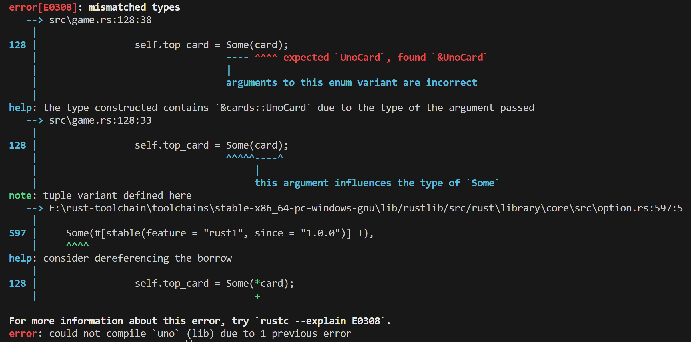

## 前言
只要你对计算机的知识感兴趣，欢迎你和我一起学习。我希望带你少走弯路，带你见识计算机世界的丰富多彩，相信你会找到感兴趣的领域。自学之余，感受计算机技术的魅力。

无论你想学习后端还是前端技术、计算机底层原理还是新兴的深度学习领域，都离不开编程的能力。在上大学之前，在应试教育的体制下少有人能称得上具有“编程能力”，即使高中接触过算法竞赛，也不一定真正了解该编程语言、具备做工程的能力。所以，完全可以假设大家都在同一水平。那为什么有的人能够在几年间一跃成为大牛，有的人Steam都装不上呢？我认为首先要培养观察问题和解决问题的能力。

作为一门工科，不像数学和理论物理，它是只要方法得当，时间投入，就能掌握的，完全不用感到如临大敌。在编程任务中，我们不可能像Linus那样一遍写对，难免疏漏遇到错误。不要一看到错误和英语就丧失了阅读的能力，比如下图：

即使这是你从未接触的编程语言，你仍然能够从编译错误信息中得知发生了什么，以及如何修复。红色信息说 `expected UnoCard, found &UnoCard`，绿色信息说在在 `Some(card)` 中加上星号。我们照做，果然修复了。

接着你注意到蓝色的help信息： `consider dereferencing the borrow` ，假如你被临时按进了这一世界公认的最难编程语言的Debug工作里，又不想像专业的开发人员那样翻阅文档，你可以向DeepSeek提问：

如果他说出了更多你不懂的东西，你可以继续追问，但他讲的故事也可能不对，或者由于幻觉故意绕晕你。你会进一步求助于CSDN等快餐。随着水平的提升，文档才是学习的归宿：

> 顺便提一句，把搜索引擎从百度换成必应

不要小看这些习惯，它能决定自学之路的效率和信心。

接下来，我要开始介绍学编程的经验。

## Hello, world之前
我推荐先学习C语言，再学习Python，然后你就可以游刃有余地去学习与你兴趣方向相关的技术栈和其他语言了。

选择一本好教程，例如《C语言程序设计：现代方法》。

选择新手友好的IDE: Red Panda C++。有的人会让你下载Dev-C++，但它已经十多年不再维护更新了，没有代码补全，有时会出现莫名其妙的Bug。有的人会向你推荐VSCode，但他们当年也许曾被环境配置难倒。我很幸运听说了这一小众免费开箱即用的IDE，给初学时的我很大帮助，这里推荐给大家。

当你输入一些莫名其妙的字母，最终出现黑窗口显式 `Hello, world!`时，不知道是什么心情？反正我没有那么激动，而是出现了更多的困惑。多年以后，我才认识到`printf`函数的复杂程度。

## Hello, world之后
正如我上面所说，`Hello, world`之后我们有了更多困惑，至少IDE的这个界面和功能是值得探索的

Release和Debug有什么区别？调试功能怎么用？编译、优化级别、Makefile又是什么意思？

试试对刚刚的hello world程序”生成汇编“呢？如果你着迷的话，可以了解一下逆向。这只是一个例子，希望你能建立探索的欲望。

在学C语言的同时，顺便学一些简单数据结构，例如栈、队列、链表、堆（树）。写成自己的库，要用的时候直接调用，这样就解决了”学了有什么用“的疑问。最后用一个小项目来练手，比如带历史记录管理的复数四则运算计算器。

学到内存分配之后，只需简单了解，不用去纠结C语言的文件IO。另外希望你了解一下如何编写多文件项目以及项目编译的过程。这样以上的问题应该都能回答了。

以后你会明白，C语言才是计算机与人类交互中最直白的语言。Linus说，他看C代码就好像能直接看到汇编，这就是大神的技术境界！

## 在Python中学习程序设计的艺术
你肯定在C语言编程的过程中饱受折磨，有时候要与编译器斗智斗勇，有时候程序异常退出却一脸懵，调试到深夜是常态。相比之下，Python的开发效率就高得多了。Python是世界公认的最简单的编程语言，但要写好Python，只会它的语法是远远不够的。Python面向对象编程，如果你不掌握程序自顶向下设计的艺术，你就无法体验到爽感，它就只是一个龟速、有Vec和HashMap、没有指针的C。在开发的过程中你将思考：如何设计高内聚低耦合的函数；包应该暴露什么接口，隐藏什么接口；某个执行逻辑应该放在外部主程序实现，还是下放到模块内实现；如何通过继承、重载写出整洁的代码；等等。作为没有系统学习过软件工程的非科班开发者，只能在实践中积累经验，慢慢体会，不断重构自己的代码。

这里我还要推荐一个写Python的好习惯：写类型注释。
真是奇怪，Python好不容易摆脱了那些冗余的类型定义，可以随心所欲的在列表里面放入任何类型的元素。解释器不要求的束缚，怎么还要自己钻进去？首先这会倒逼你在动手前想好函数的作用：接收什么参数，返回什么结果。其次，在函数的签名中含有变量的更多信息提示，提供完整的代码补全功能，提升开发和维护的效率。还有就是Pylance会自动检查调用的语境，提前发现错误，省去耗费心智。

## 把Linux当玩具
微软靠着卖操作系统赚了大家很多钱，于情于理都应该回馈一些福利给世界。通过学生认证，我们可以白嫖微软提供的不错的功能和服务。例如Gihub和Azure的学生认证。怎么搞学生认证，网上有很多博客教程。

通过学生认证后，租用一个[Azure云服务器](https://azure.microsoft.com/zh-cn/free/students/)，并且将服务器地理位置选在外国。有了一个外国公网VPS，能提供很多服务，例如Shadowsocks🚀、搭建自己的网站。当然这需要你不怕麻烦，动手操作，你将会发现黑窗口的效率和信息密度，比不断拖动鼠标高得多。

Linux的可玩性非常高，进入GNU/Linux世界，发现一种不一样的可能性，享受极客的感觉。来到这一步，Vim,Git,gcc,docker等工具链都学一下；除非看得懂，否则不要轻信AI给你的shell脚本。WSL是本地的“双系统”选择。如果想折腾不同的发行版和桌面环境，可以整虚拟机。想学OS内核的要把Linux当成一个重点研究样例。

## 走向广阔天地
学习过以上的技术，你已经从一无所知的小白转变为了具有技术力的大学生。现在，开拓自己的眼界，选择自己感兴趣的方向去深入学习。在浩如烟海的计算机学科中，永远保持最新的视界和对新技术的热忱。

> 年轻人，你渴望力量吗？

[CS自学指南](https://csdiy.wiki/)提供了一个总览，相信你能从中找到自己的兴趣方向。如果能学得进去两个领域，不用说在本校，就算是在985的非科班中都算优秀人才。

[Build Your own X](https://github.com/codecrafters-io/build-your-own-x)从头开始手搓项目

[LLMs From Scratch](https://github.com/rasbt/LLMs-from-scratch)亲手搭建大语言模型

## 网站/小程序开发
其实我不太懂这个，但是前端确实是最容易做出实实在在能给别人看的”成果“了，开发部会承接的任务大多是此类。应此现实需求，还是要讲一下的。以上的硬核内容就算不会也不影响前端设计。比如说，你想搞一个自己的个人网站，就可以去Github上寻找开源框架，然后自己稍作修改。WordPress,Hexo,Astro等都有免费的框架。对于迷你服务器来说，无法承载动态网页，最好用静态网页（如Astro）。就算是我这样不太懂的人，就着框架改一改都是没问题的。然后购买域名，托管到Cloudflare。接着配置Nginx的路由转发规则、注册HTTPS证书。

[搭建本站的过程](https://tankimzeg.top/blog/frosti-nginx-waline-build-website/)

## 总结
我在大一下学校教C语言之前就掌握了远高于学校课程要求的C语言，所以在大一下的C语言课上就可以用电脑搞其他东西了。到了大二反而不让用任何电子设备了，简直比大一还难受。所以想在时间碎片中苦苦挣扎，掌握一项拿手本领实属不易。如果不甘心还想涉猎广泛，跟你高中的选择电子信息类的其他同学碰一碰，那基本上要牺牲大量游戏时间以及假期时间！任何一项技能都要花费大量精力，我们希望你少走弯路，也需要你避免急功近利的心态。😎

