## Class Intro

ML ≈ Looking for Function:

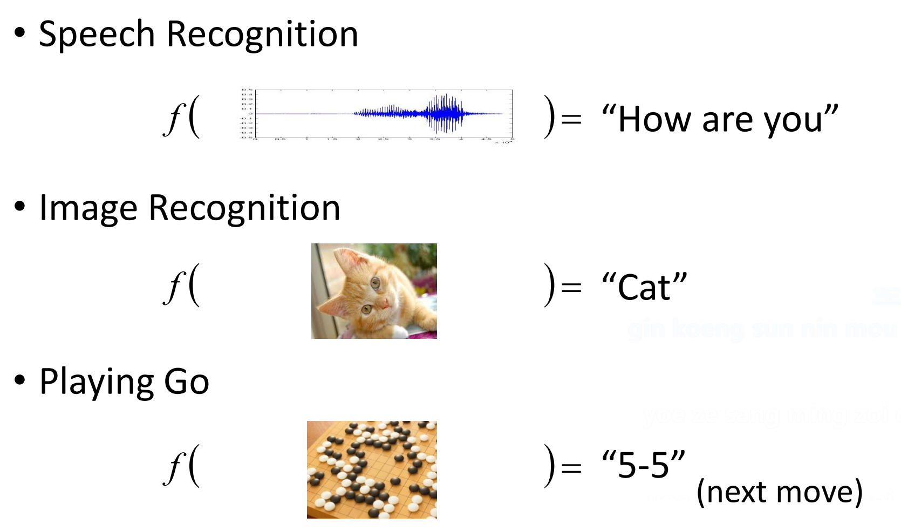

不同类型的函数：
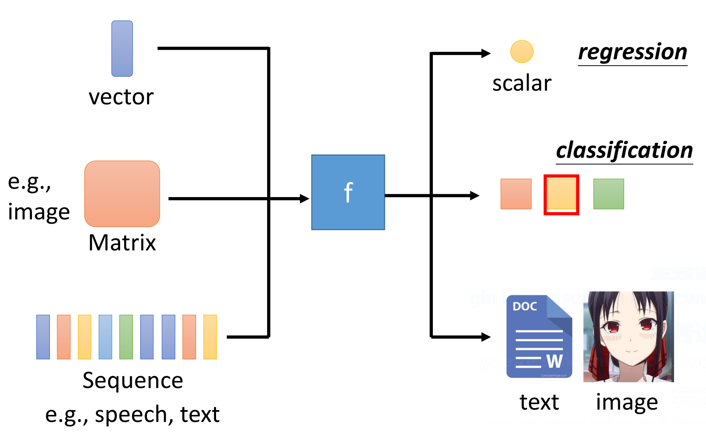

## Google Colab

关于Google Colab的使用方法，我找到了一篇详细的使用教程：[Colab使用教程（超级详细版）](https://zhuanlan.zhihu.com/p/527663163)

这个教程讲的过于详细，真实使用起来没有那么吓人。主要就是点击上传笔记本，选择运行时类型，然后就可以开始运行代码啦。我使用的免费版T4 GPU，感觉速度没有想象中的那么快，有些简单任务甚至比我的轻薄笔记本慢，参数大一些才能稍微快点。

另外，Colab 的介绍说他们推出了一个VSCode插件，但是我试用了一下，基本上处于不能用的状态。连上了也运行不了第二次。

## Pytorch

训练一个神经网络需要三个组成部分：定义神经网络架构、损失函数、优化算法：

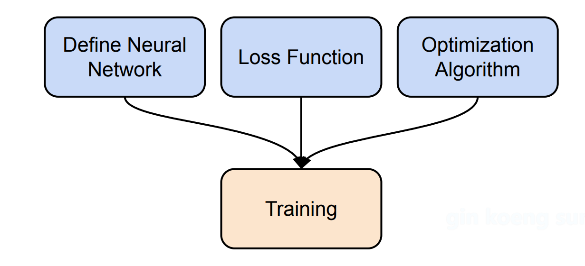

训练、验证和测试神经网络，反复训练和验证，最后才是测试：

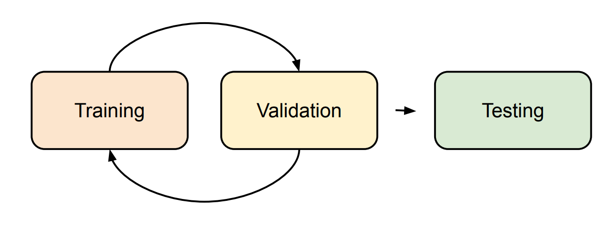

### Dataset & Dataloader

这三个过程，都需要把数据集准备好~
所以第一步是制作 `Dataset` & `Dataloader`。

- Dataser: 存储数据样本和期望值
- Dataloader: 将数据分组为批次
- `dataset = MyDateset(file)`
- `dataloader = Dataloader(dateset, batch_size, shuffle = if Training True else if Testing False)`

为了制作自己的Dataset，需要重写 `Dataset`类：

```python
from torch.utils.data import Dataset, DataLoader

class MyDataset(Dataset): 
 def __init__(self, file): 
  self.data = ... # 加载文件等预处理
 def __getitem__(self, index): 
  return self.data[index] 
 def __len__(self): 
  return len(self.data)
```

至少重写这三个方法。

### 梯度计算

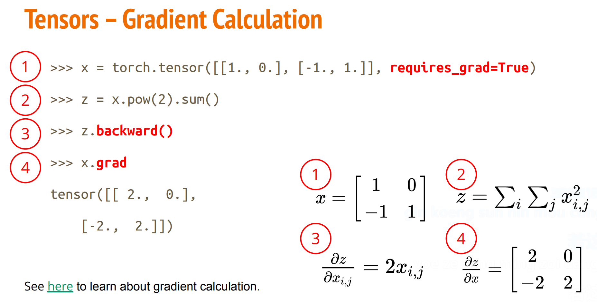

### 定义神经网络

线性层：`nn.Linear(in_features, out_features)
默认具有bias，即计算$\mathbf{W}\mathbf{x}+\mathbf{b}=\mathbf{y}$

非线性激活函数：
`nn.Sigmoid()` / `nn.ReLU()` 等

定义自己的神经网络：

```python
import torch.nn as nn 

class MyModel(nn.Module): 
 def __init__(self): 
  super(MyModel, self).__init__() 
  self.net = nn.Sequential( 
   nn.Linear(10, 32), 
   nn.Sigmoid(), 
   nn.Linear(32, 1) 
  ) 
 def forward(self, x): 
  return self.net(x)
```

需要重写这两个方法。

### 损失函数

- Mean Squared Error(for regression tasks): `criterion = nn.MSELoss()`
- Cross Entropy(for classificaion tasks): `criterion = nn.CrossEntropyLoss()`
- `loss = criterion(model_output, expected_value)`

### 优化算法

`torch.optim`

`optimizer = torch.optim.SGD(model.parameters(), lr, momentum = 0)`

For every batch of data:

1. Call optimizer.zero_grad() to reset gradients of model parameters.
2. Call loss.backward() to backpropagate gradients of prediction loss.
3. Call optimizer.step() to adjust model parameters.

### 训练循环


### 验证循环

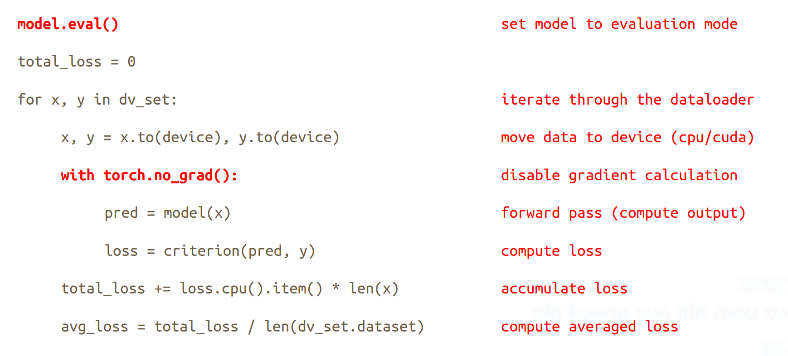

### 测试循环

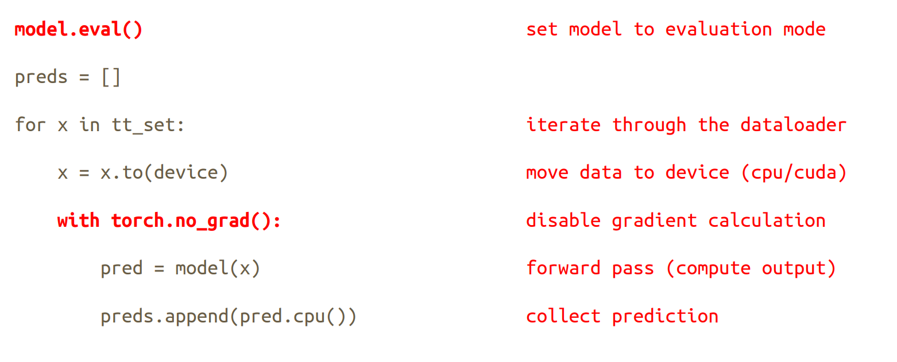

> 第一次有如此清晰的讲解，激动！

> `model.eval()`的作用是改变一些模型的层的行为，比如dropout和batch归一化
> `with torch.no_grad()`避免影响梯度计算图。避免在验证和测试的时候训练模型。

### 保存和加载模型

- 保存： `torch.save(model.state_dict, path)`
- 加载： `check_point = torch.load(path);model.load_state_dict(check_point)`

## HW 1: covid-19病例预测

首先运行示例代码

然后，我注意到数据集中前面38列是id和大量的0，没有训练意义，所以去掉这些列。

记得修改配置：

```python
device = 'cuda' if torch.cuda.is_available() else 'cpu'
import time
config = {
    'seed': 5201314,      # Your seed number, you can pick your lucky number. :)
    'select_all': False,   # Whether to use all features.
    'valid_ratio': 0.2,   # validation_size = train_size * valid_ratio
    'n_epochs': 3000,     # Number of epochs.            
    'batch_size': 256, 
    'learning_rate': 1e-5,              
    'early_stop': 400,    # If model has not improved for this many consecutive epochs, stop training.     
    'save_path': f'./models/model{time.strftime("%d%H%M")}.ckpt'  # Your model will be saved here.
}

print(f'Using device: {device}')
```

果然训练曲线表现出来的效果变好了：

```python
def select_feat(train_data, valid_data, test_data, select_all=True):
    '''Selects useful features to perform regression'''
    y_train, y_valid = train_data[:,-1], valid_data[:,-1]
    raw_x_train, raw_x_valid, raw_x_test = train_data[:,:-1], valid_data[:,:-1], test_data

    if select_all:
        feat_idx = list(range(raw_x_train.shape[1]))
    else:
        # feat_idx = [0,1,2,3,4] # TODO: Select suitable feature columns.
        feat_idx = list(range(38,raw_x_train.shape[1]))

    return raw_x_train[:,feat_idx], raw_x_valid[:,feat_idx], raw_x_test[:,feat_idx], y_train, y_valid
```

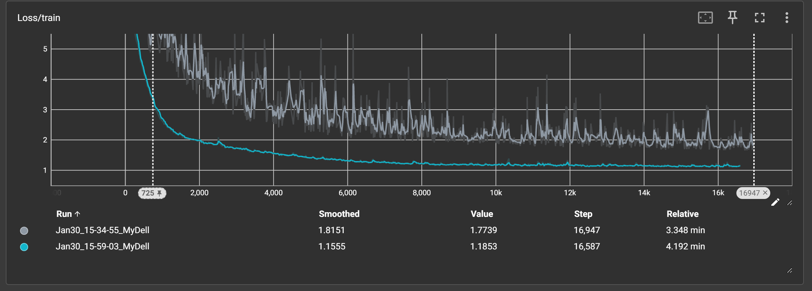


尝试了一下

`optimizer = torch.optim.ASGD(model.parameters(), lr=config['learning_rate'])`

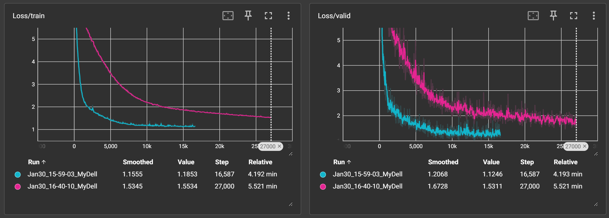

然后是著名的Adam优化器：

`optimizer = torch.optim.Adam(model.parameters(), lr=1e-4)`

```python
class My_Model(nn.Module):
    def __init__(self, input_dim):
        super(My_Model, self).__init__()
        # TODO: modify model's structure, be aware of dimensions.
        self.layers = nn.Sequential(
            nn.Linear(input_dim, 64),
            nn.ReLU(),
            nn.Linear(64, 16),
            nn.ReLU(),
            nn.Linear(16, 1),
        )

    def forward(self, x):
        x = self.layers(x)
        x = x.squeeze(1) # (B, 1) -> (B)
        return x
```

Train loss和Validation loss都达到了目前：

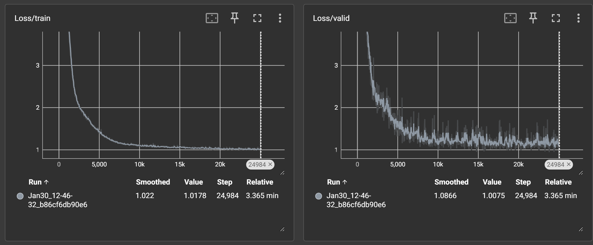

可是Kaggle上提交却效果不佳：


这意味着出现了过拟合的倾向。

看了一些别人的代码，随便选了几个特征，效果反而很好：

```python
def select_feat(train_data, valid_data, test_data, select_all=True):
    '''Selects useful features to perform regression'''
    y_train, y_valid = train_data[:,-1], valid_data[:,-1]
    raw_x_train, raw_x_valid, raw_x_test = train_data[:,:-1], valid_data[:,:-1], test_data

    if select_all:
        feat_idx = list(range(raw_x_train.shape[1]))
    else:
        feat_idx = []
        for i in range(1,5):
         feat_idx.append(16*i+37)

    return raw_x_train[:,feat_idx], raw_x_valid[:,feat_idx], raw_x_test[:,feat_idx], y_train, y_valid
```

也就意味着可以大胆去掉很多特征列。因此进行[特征工程](https://scikit-learn.org/stable/modules/feature_selection.html)：

先是选择37个特征，

```python
def select_feat(train_data, valid_data, test_data, select_all=True):
    '''Selects useful features to perform regression'''
    y_train, y_valid = train_data[:,-1], valid_data[:,-1]
    raw_x_train, raw_x_valid, raw_x_test = train_data[:,:-1], valid_data[:,:-1], test_data

    if select_all:
        feat_idx = list(range(raw_x_train.shape[1]))
    else:
        from sklearn.feature_selection import SelectKBest, f_regression
        selector = SelectKBest(score_func=f_regression, k=30)
        selector.fit(raw_x_train, y_train)
        feat_idx = selector.get_support(indices=True)

    return raw_x_train[:,feat_idx], raw_x_valid[:,feat_idx], raw_x_test[:,feat_idx], y_train, y_valid
```

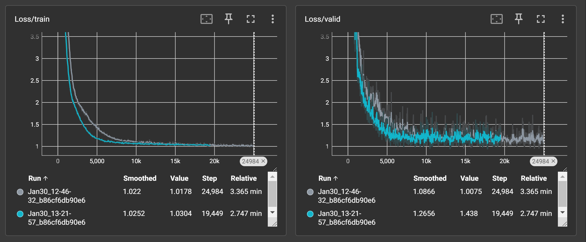

效果不佳：


将学习率改为1e-3，收敛速度和效果显著提升：


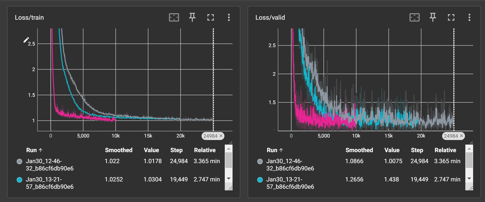

选择30个特征，效果还在提升！

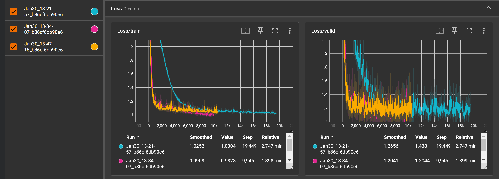

可以看到，虽然训练期间最后的loss不如刚才低，但kaggle上显示的实际效果却变好了~


可以看到，学习率是一个很敏感的参数。在机器学习中，还可以通过设置[学习率调度器](https://zhuanlan.zhihu.com/p/1899093462252520757)来动态调整学习率：

最终得到了一个不错的结果：

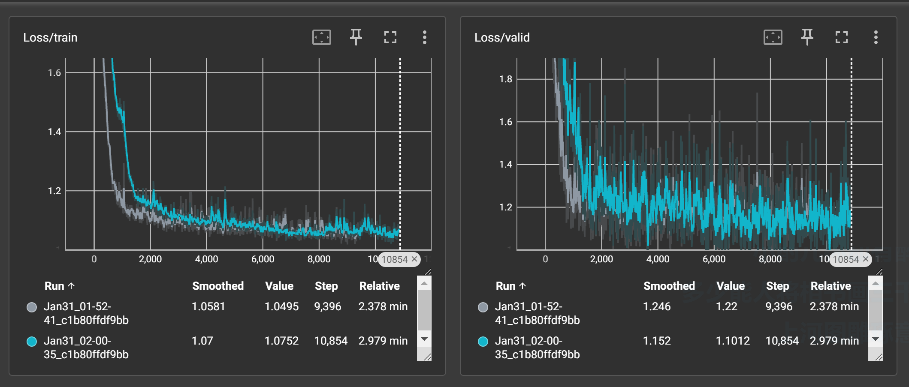

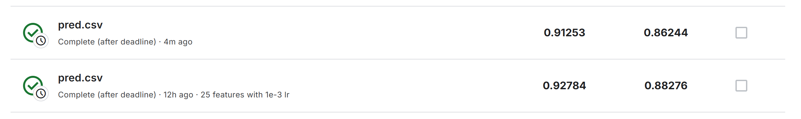

大部分参数来自 <https://zhuanlan.zhihu.com/p/522654254>

> 我的notebook: [HW01.ipynb](https://colab.research.google.com/drive/1V0lqS4U6FYBMSJ8ZS5TzEqciXpQe_bB4)
