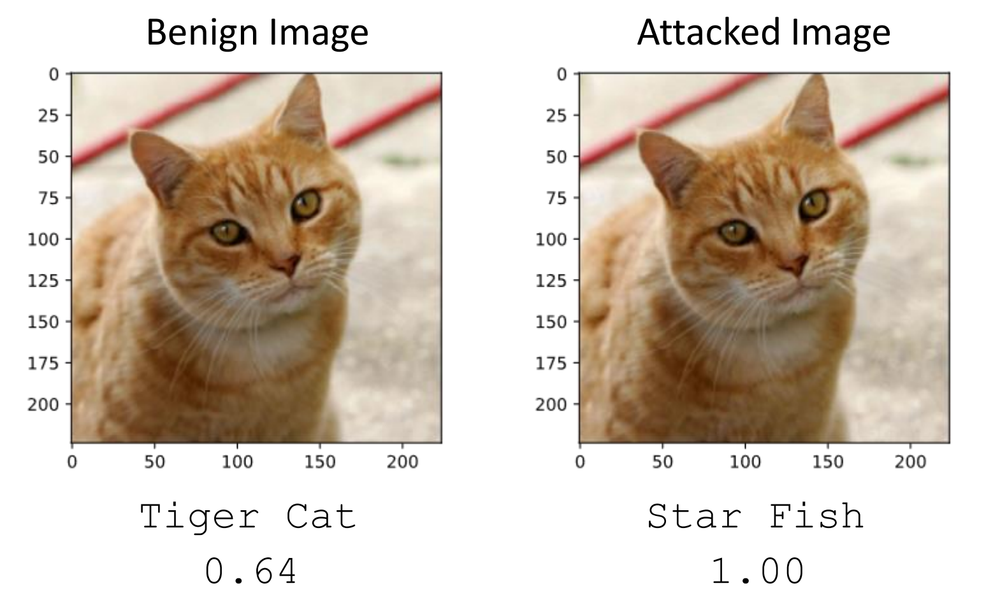
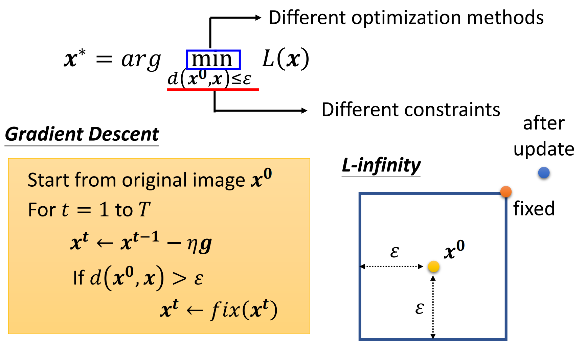
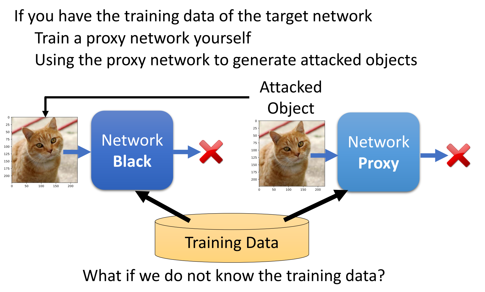
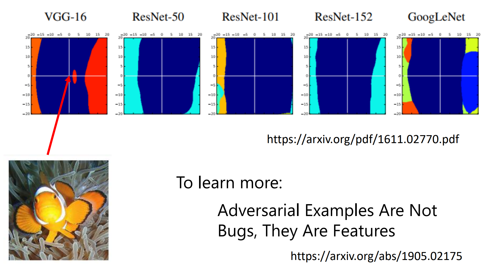
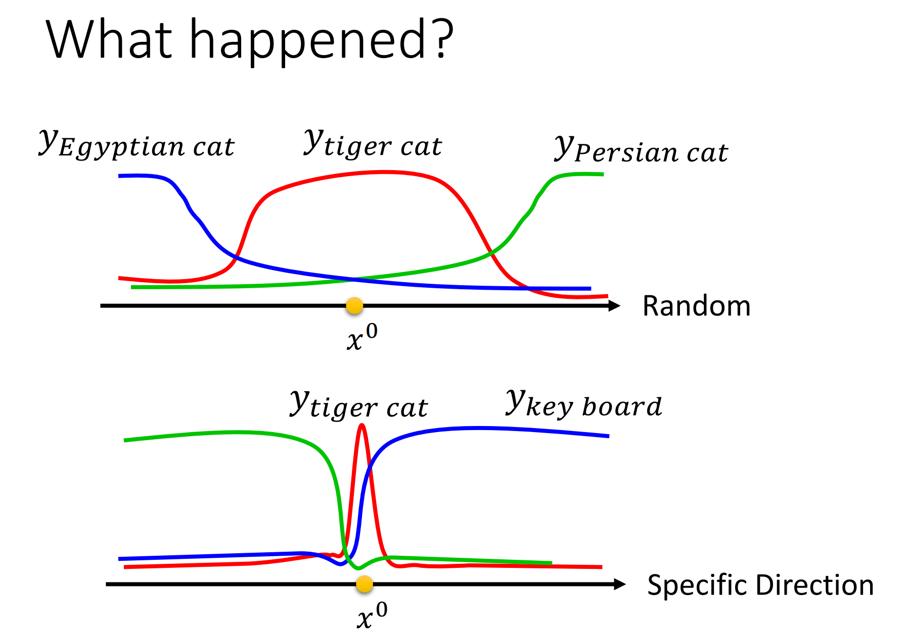
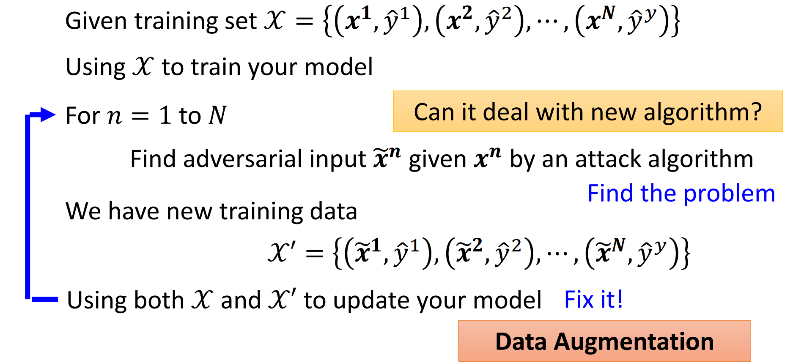
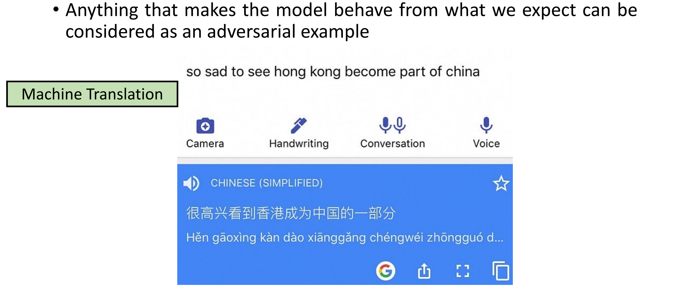
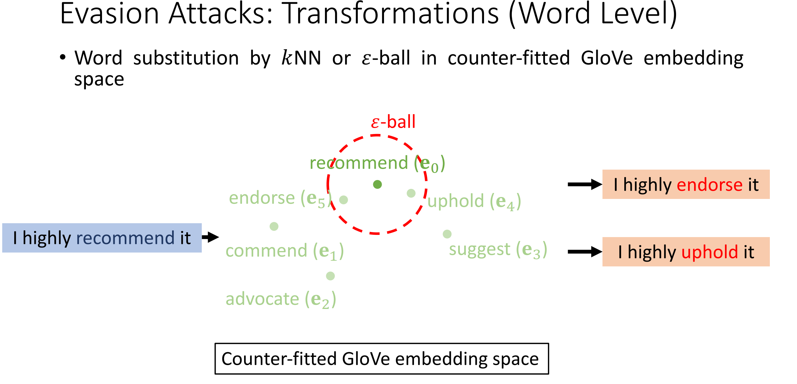

[Adversarial Attack](https://speech.ee.ntu.edu.tw/~hylee/ml/ml2021-course-data/attack_v3.pdf)

神经网络有正确率是不够的，还要能够应对恶意攻击。

## Example for attack

通过添加一点肉眼难以察觉的杂讯，能够使模型获得截然不同的输出。

## How to attack

修改损失函数

$$
L(x)=-e(y,\hat{y})+e(y,y^{target})
$$

同时

$$
d(x,x_{0})
$$

要尽量小。

$d$采用L无穷范数比较合理。

## 白箱和黑箱的攻击

前面的攻击方式是白箱，已知模型的参数来实施攻击。

- Ensemble Attack

可攻击可能是训练资料导致的。

- One pixel attack
- Universal Adversarial Attack

除了图像外，攻击还发生在语音、自然语言处理……

在现实世界种，还能带上花花眼镜骗过人脸识别系统、涂改交通标志干扰自动驾驶。鉴于Attack非常容易成功，感觉自动驾驶还是很危险啊！

Adversarial Reprogramming

投毒数据集训练出来的模型有“后门”。

## 防御

### 被动防御

原图片加上一层Filter再进入神经网络。

比如模糊处理、图片压缩、随机裁剪、通过Generator生成相似的图片……

### 主动防御

在训练期间，主动构造对抗性的输入。可以视为一种Data Augumentation的方式。

## Attacks in NLP

老师真是太幽默了😎

### 目标：What the attack aims to achieve

- Targeted classification
- Universal suffix dropper
- Wrong parse tree in dependency parsing

### Transformations: How to construct perturbations for possible adversaries

与图像模型的攻击相似，可以在不影响语义的情况下，找到一些近义词来替换。

KNN、$\varepsilon$-ball、BERT模型来找近义词。

### 

## HW10: Adversarial Attack

### Part 1: Attack

**根據你最好的實驗結果，簡述你是如何產生transferable noises, Judge Boi上Accuracy降到多少?**

> 结果需提交到Judge Boi才能看到Accuracy，非台大的学生不能提交。

但从[Notebook](https://www.kaggle.com/code/tankimzeg/ml2022-hw10/edit)的结果来看，ensemble_model的攻击效果已经使得ifgsm_acc = 0.00000, ifgsm_loss = 13.40670。

### Part 2: Defense

**當source model為resnet110_cifar10(from Pytorchcv), 使用最原始的fgsm 攻擊在dog2.png的圖片。**

1. **請問被攻擊後的預測的class是錯誤的嗎？(1pt) 有的話：變成哪個class? 沒有的話：則不用作答**

    是错误的，变成了cat。

2. **實作jpeg compression (compression rate=70%) 前處理圖片, 請問 prediction class是錯誤的嗎？同第一題作答 (1pt)**

    是正确的，依然为dog。

3. **Jpeg compression為什麼可以抵擋adversarial attack, 讓模型維持高正確率？ (1pt)**

    - 圖片壓縮時讓色彩更鮮豔
    - [x] 圖片壓縮時把雜訊減少
    - 圖片壓縮讓圖片品質下降
    - 圖片壓縮時雜訊反而變大
