## Preparation 1: 机器学习任务攻略

[機器學習任務攻略](https://speech.ee.ntu.edu.tw/~hylee/ml/ml2021-course-data/overfit-v6.pdf)

### ML的框架

训练数据：${(\mathbf{x_{1}},\hat{y_{1}}),(\mathbf{x_{2}},\hat{y_{2}}),\dots(\mathbf{x_{n}},\hat{y_{n}})}$

Step 1: function with unknown
$y=f_{\mathbf{\theta}}(\mathbf{x})$

Step 2: define loss from training data
$L(\mathbf{\theta})$

Step 3: optimization
$\mathbf{\theta}^*=arg \min_{\theta}L$

测试数据：${\mathbf{x_{n+1}},\mathbf{x_{n+2}},\dots,\mathbf{x_{n+m}}}$

$y=f_{\mathbf{\theta}^*}(\mathbf{x})$
得到${y_{n+1},y_{n+2},\dots,y_{n+m}}$ => 上传Kaggle

### 如何将模型变好？

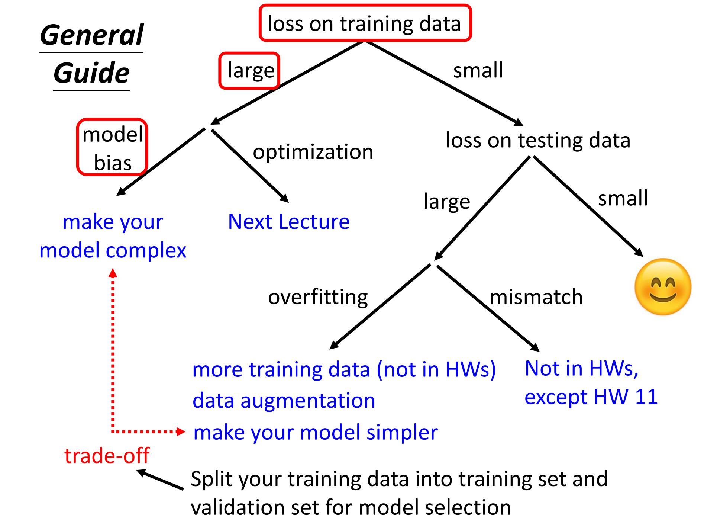

首先，检查training data loss。

如果loss比较大（左边的分支），有两个可能：

- model bias: 模型太简单
- optimization: 优化做得不好

#### Model Bias

可以让loss变低的function不在你的模型可以描述的范围内~

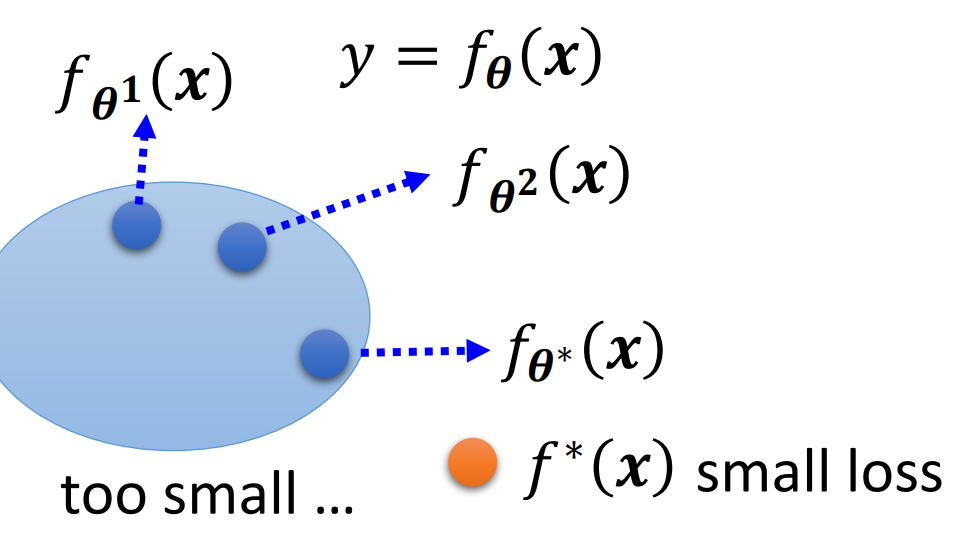

解决方法：重新设计模型，使其更加灵活。例如增加参数、层数、激活函数等。

#### Optimization Issue

局部最优问题

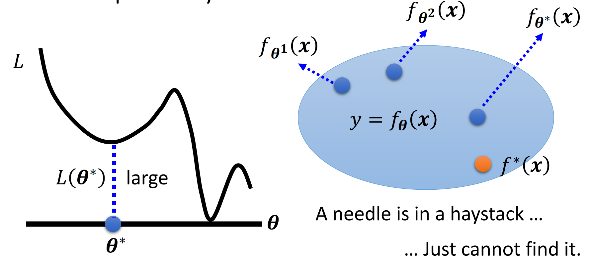

> 如何判断是哪一种情况？
> 设置不同的模型进行比较。可以先跑比较小的网络模型，是比较容易优化的。如果深的模型效果反而不如小模型的loss ，就说明是优化的问题。
> 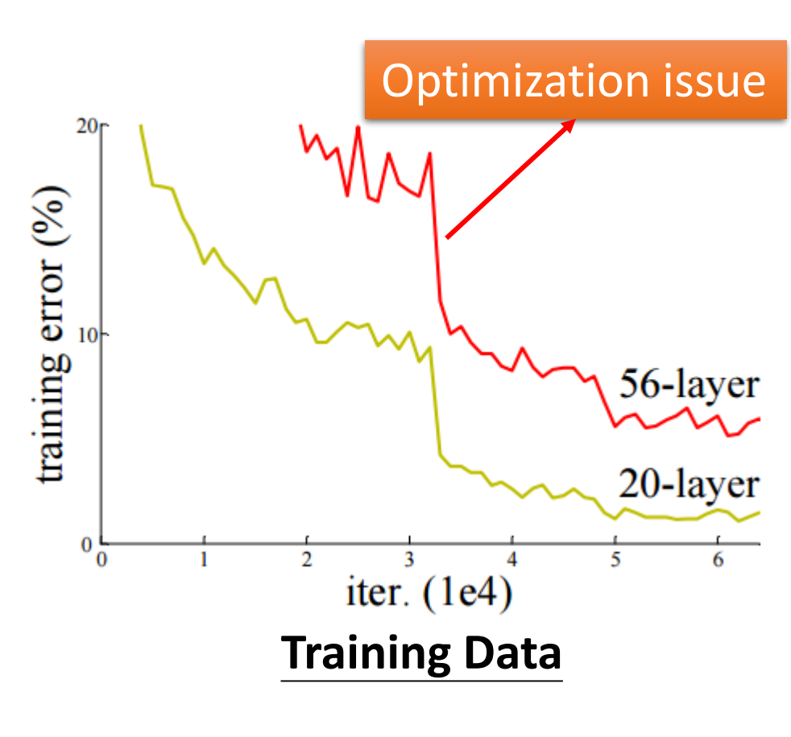

假设现在training data的loss已经变小了，再来看testing data 的Loss（右边的分支）。

#### Overfitting: 过拟合

training loss小，但是testing loss大，可以理解为模型背答案。遇到没见过的题目就不会了。

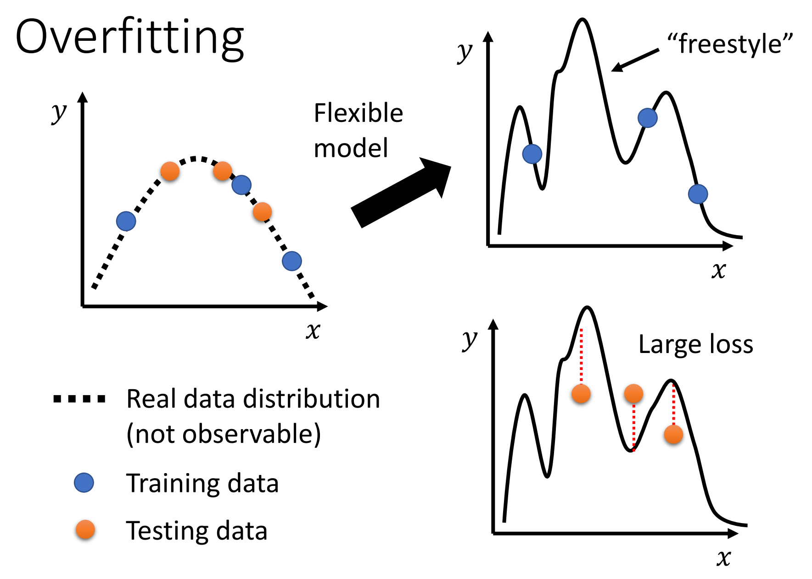

解决的办法之一就是增加训练数据。但是在作业里面无法实现这一点。

另一个解决办法是数据增广（data augmentation）

另一个解决办法是不要让模型太复杂，有太高的自由度。给模型增加限制：

- Less parameters, sharing parameters
- Less features
- Early stopping
- Regulation
- Dropout

所以啊，选择模型的复杂度需要达到平衡。

#### Cross Validation: 交叉验证

为了避免这类过拟合的问题，需要合理地分割数据。

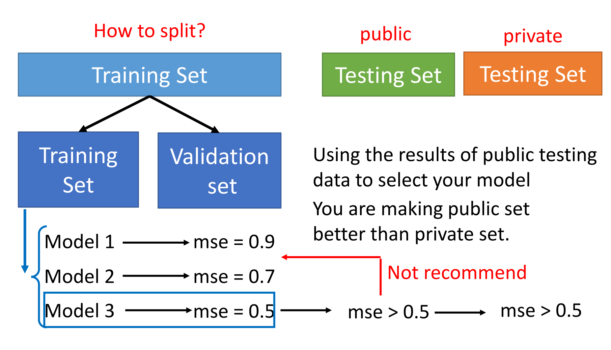

验证集不参与训练。所以最合理地做法是根据验证集挑选模型。如果根据public testing set去挑选模型，又有过拟合地风险。除此之外，不能通过试种子的方法去降低同一个模型的验证集loss，同样有参数随机到验证集的风险。

现在学界有的为了所谓可复现性固定了随机种子去搞，怎么降低这种情况下的可操作性呢？本来应该随机分，既然不能随机分了，那就多分几次，每次采用不同的部分去验证，这就是N折交叉验证（N-fold Validation）

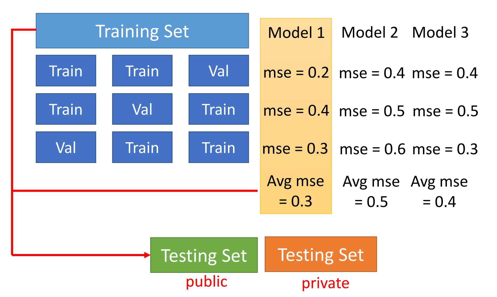

目前我还没看到公开论文采用这种优秀的方式，可能是大家默认留下的一块遮羞布吧🤭

#### Mismatch

训练数据和测试数据的分布从根本上就不一致，出现了反常情况

> 这节课很重要！讲了很多实用且重要的概念，我弄清楚了多年来没有完全掌握的知识。

## Preparation 2: 局部最小值与鞍点

[When gradient is small …](https://speech.ee.ntu.edu.tw/~hylee/ml/ml2021-course-data/small-gradient-v7.pdf)

有时候会发现啊，Loss优化着就不再下降了，反复震荡，但是却还依然没有达到理想的效果。这个时候梯度下降到了0，可能是达到了局部最小值或鞍点。

梯度下降到0，这两种点都是驻点。

### Math Warning

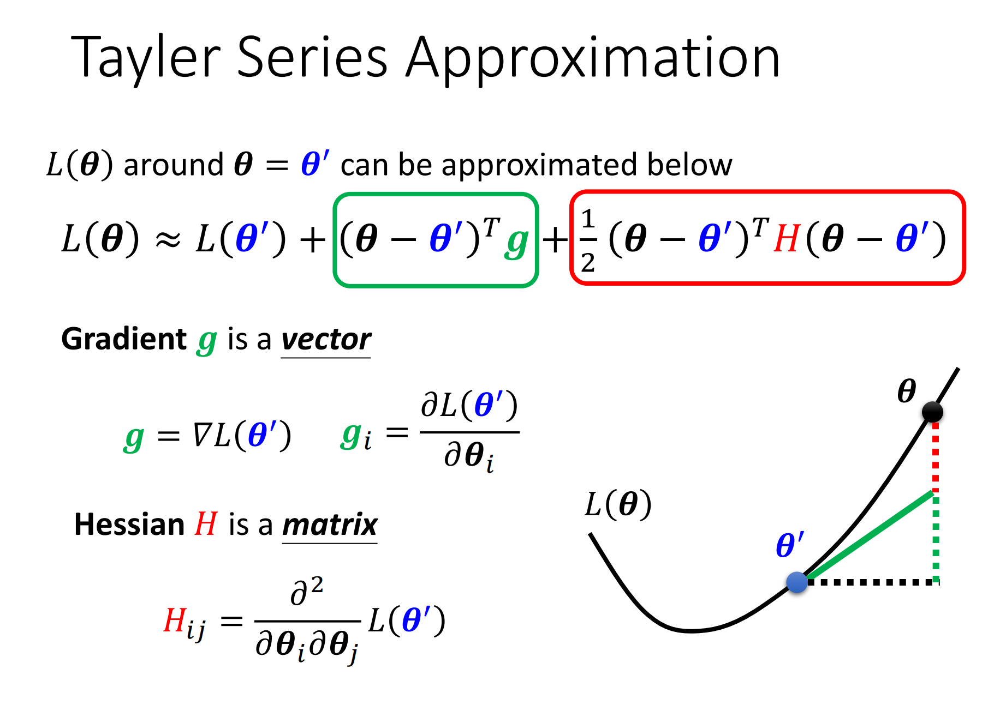

在驻点处，$g=0$，驻点属于哪一种类型就取决于这个黑塞矩阵了。

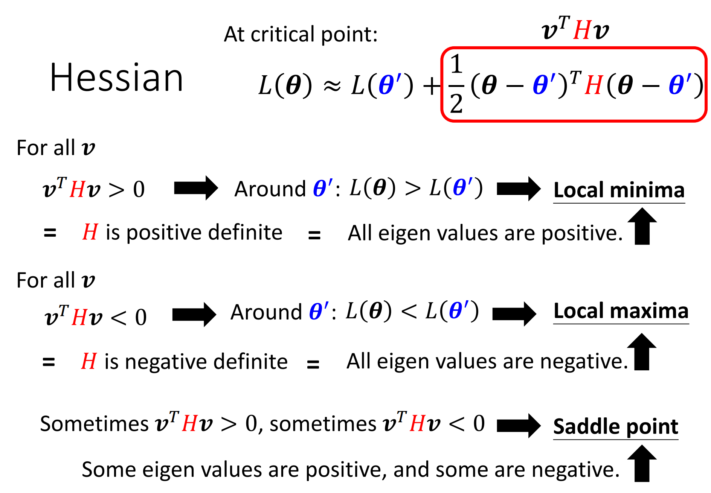

计算黑塞矩阵$\mathbf{H}$的特征值和特征向量，找到负特征值和对应的特征向量，在该特征向量的方向上，函数$L(\mathbf{\theta})$就会向量，沿着该方向就可以继续下降损失函数。

### Saddle Point VS Local Minima

当参数数量越大，矩阵维度越高时，驻点是真正的local minima其实很少见，**大多数情况都是鞍点**，也就是能找到继续优化的方向。

## Preparation 3: 批次与动量

### Batch

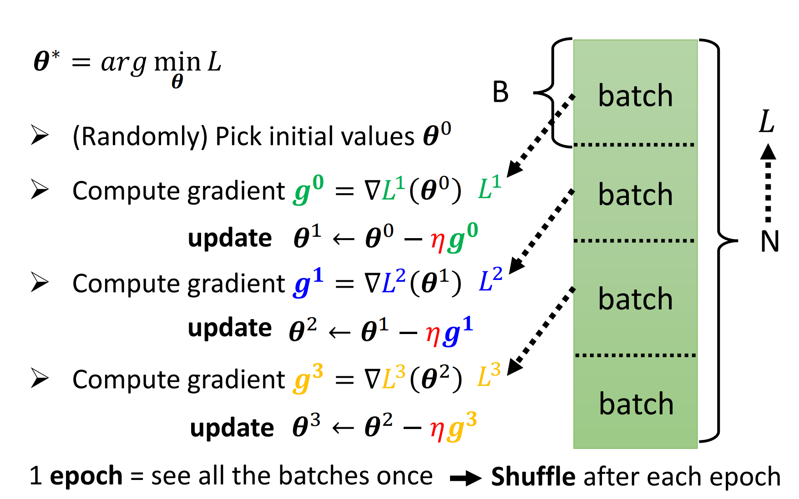

实际情况的训练过程将数据分为多个batch。模型每经过一个批次就会更新一次参数。遍历所有批次后为经过一个Epoch。然后打乱，再进行以上过程。

那么批次的大小有什么影响呢？从多个角度来分析了这个问题：

#### 参数更新

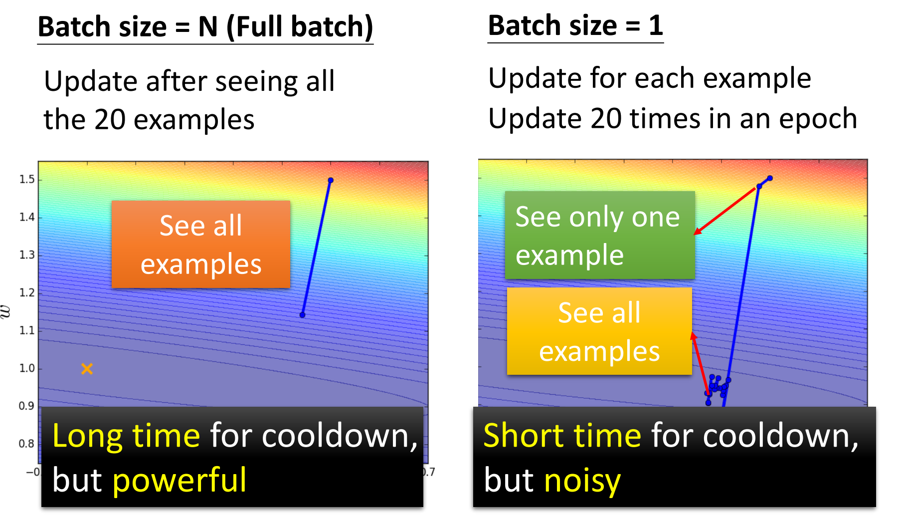

batch_size 小，参数更新显得不稳定

#### 运算时间

batch_size 大，有利于充分利用GPU的并行计算能力

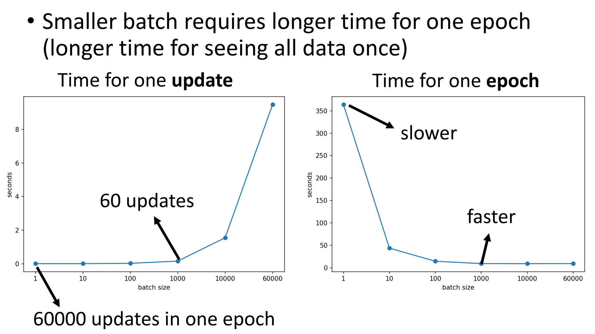

#### 训练效果

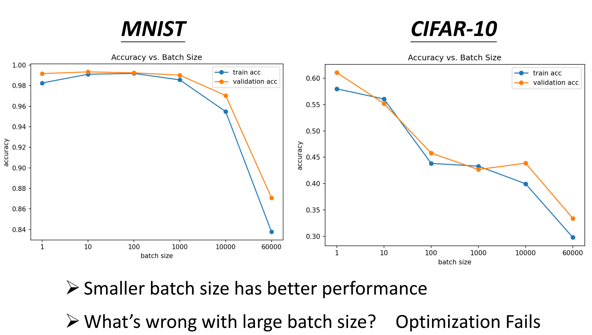

batch_size越小，训练的准确率越好。这是为什么呢？
因为参数震荡得比较激烈，容易跳出驻点。
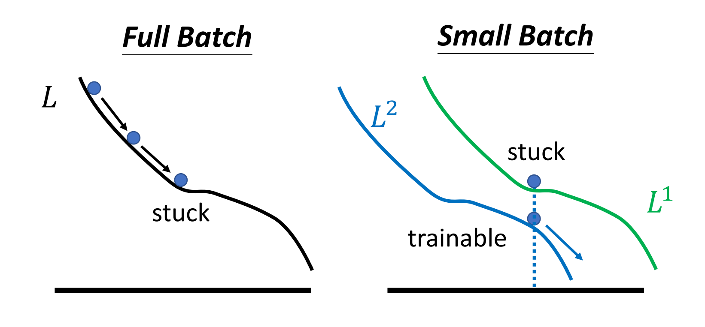

对于Full Batch的一个Epoch里面，参数没有变化，损失函数是固定的；对于Small Batch，就可能继续训练。

#### 测试效果

Large Batch就算调大学习率，还是容易产生关键参数的依赖，鲁棒性不够好。（Overfitting）
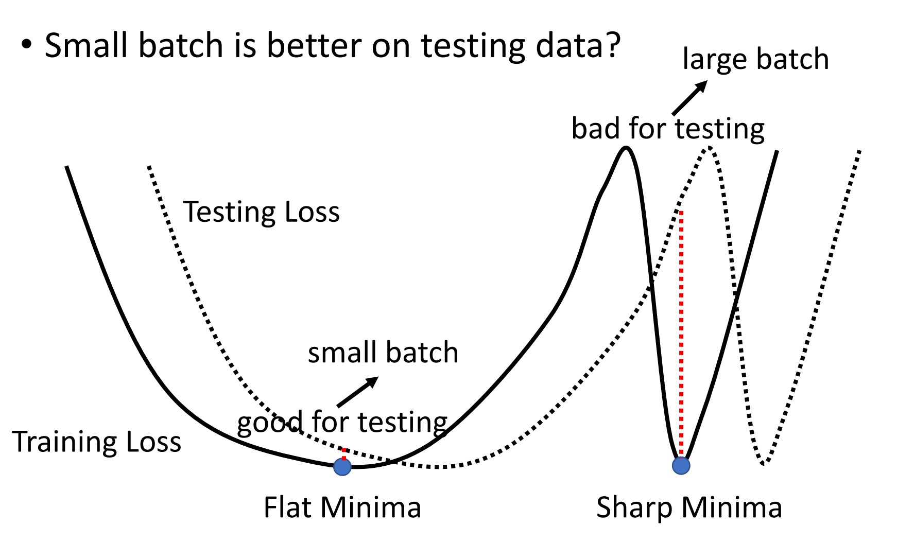

虽然极小值都差不多，但亦有好坏区别。这种Sharp Minima的泛化性就不好，而Flat Minima就算测试与训练有分布偏差，还是可以达到比较好的效果。

#### 小结

batch_size是一个需要自己权衡的超参数

| 性质             | 小批次 | 大批次 |
| -------------- | --- | --- |
| 更新速度<br>（没有并行） | 快   | 慢   |
| 更新速度<br>（并行）   | 差不多 | 差不多 |
| 一轮迭代的时间        | 慢   | 快   |
| 梯度             | 嘈杂  | 稳定  |
| 优化             | 更好  | 更坏  |
| 泛化性            | 更好  | 更坏  |

### Momentum

我理解为不直接更新速度，而是更新加速度，速度上还保留一定惯性。由于计算高维矩阵的特征值和特征向量的计算量太大，这是另一种可以避免陷入驻点后出不来的解决办法。

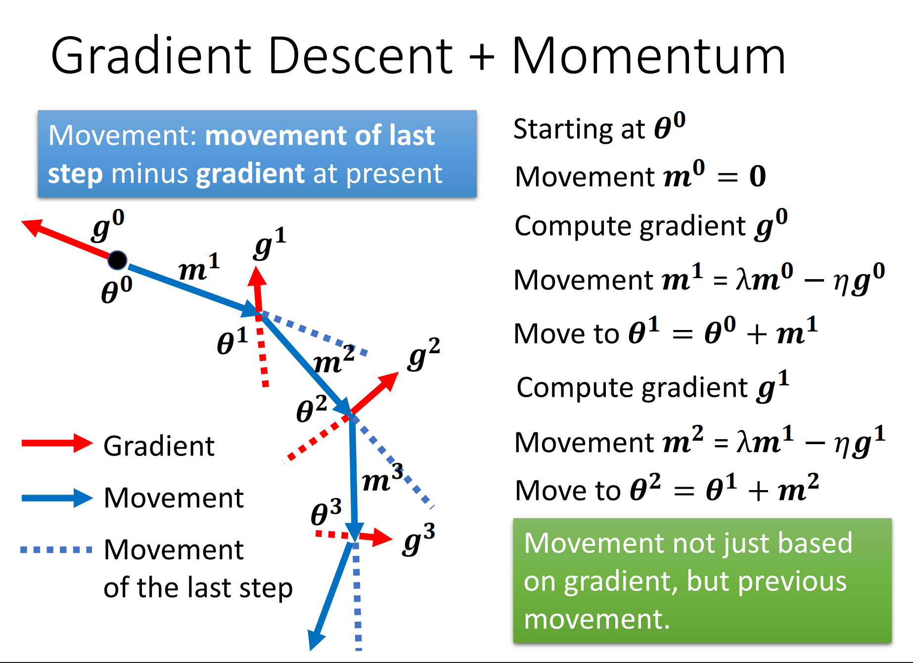

## Preparation 4: 自适应学习率

[Adaptive Learning Rate](https://speech.ee.ntu.edu.tw/~hylee/ml/ml2021-course-data/optimizer_v4.pdf)
发现Loss没有再下降，往往**不是**因为梯度下降到驻点。通过分析梯度，发现这个时候梯度不是0。

需要更好的梯度下降策略。

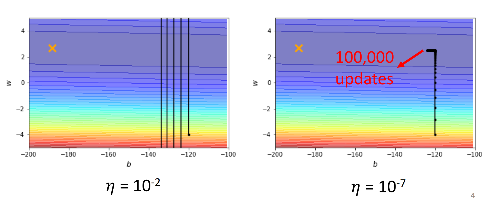

固定的learning rate，无法适应整个任务的不同阶段。

learning rate需要根据梯度的大小做动态的调整。梯度大的时候减小步幅；梯度小的时候增大步幅。

原来的更新方法
$$
\theta_{i}^{t+1} \gets \theta_{i}^{t}-\eta g_{i}^{t}
$$
其中
$$
g_{i}^t=\frac{\partial L}{\partial \theta_{i}}|_{\theta=\theta^t}
$$
现在$\eta$变成动态调整的
$$
\theta_{i}^{t+1} \gets \theta_{i}^{t}-\frac{\eta}{\sigma_{i}^t} g_{i}^{t}
$$

或者简记为
$$
\theta^{t+1} \gets \theta^{t}-\frac{\eta}{\sigma^t} g^{t}
$$

这个$\sigma$就与$g$正相关。根据$\eta$与$g$的关系，产生了多种不同的更新策略：

### Root Mean Square

平方平均
$$
\sigma^{0}=\sqrt{ (g^{0})^{2} }
$$
$$
\sigma^{1}=\sqrt{ \frac{1}{2}[(g^{0})^{2}+(g^{1})^{2}] }
$$
$$
\sigma^{2}=\sqrt{ \frac{1}{3}[(g^{0})^{2}+(g^{1})^{2}+(g^{2})^{2}] }
$$
即
$$
\sigma^t = \sqrt{ \frac{1}{t+1}\sum_{i=0}^t (g^i)^{2} }
$$

此策略为 `Adagrad` 所采用。

### RMSProp

$$
\sigma^{0}=\sqrt{ (g^{0})^{2} }
$$

$$
\sigma^{1} = \sqrt{ \alpha(\sigma^{0})^{2}+(1-\alpha(g^{1})^{2}) }
$$

$$
\sigma^{2} = \sqrt{ \alpha(\sigma^{1})^{2}+(1-\alpha(g^{2})^{2}) }
$$

即

$$
\sigma^{t} = \sqrt{ \alpha(\sigma^{t-1})^{2}+(1-\alpha(g^{t})^{2}) }
$$

其中$0<\alpha<1$是一个超参数

相比于刚才的平方平均，RMSProp 可以通过把$\alpha$设置小一点来增强敏感性。

`Adam` 采用RMSProp + Momentum。

### 学习率调度器

由于梯度长期很小，累积之下步幅越来越大，很容易又冲过头了。虽然最后还是能负反馈调节回来，但是效率就降低了。

我们观察到，随着训练的进行，参数越来越接近极值点，学习率总体上还是要呈现一个降低的趋势。

$$
\theta^{t+1} \gets \theta^{t} - \frac{\eta^{t}}{\sigma^{t}}g^{t}
$$

因此引入 Learning Rate Decay策略：

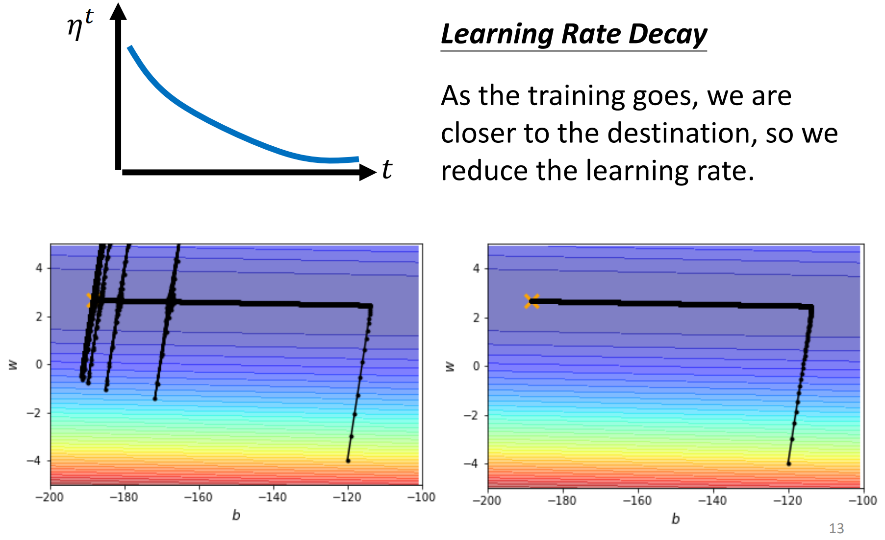

就可以缓解这个问题。

Warn up策略：

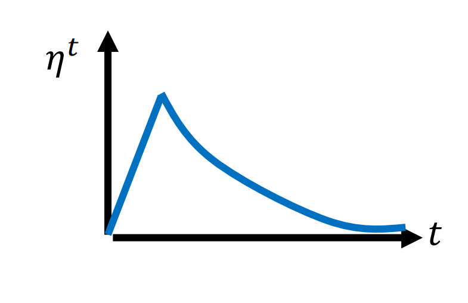

在一开始训练的时候，对于$\sigma^{t}$的评估不太稳定，就不能让步幅走得太大。

### 小结

至此，我们将Optimization从一开始简单的梯度下降变成现在这样的版本：

$$
\theta^{t+1} \gets \theta^{t} - \frac{\eta^{t}}{\sigma^{t}}m^{t}
$$

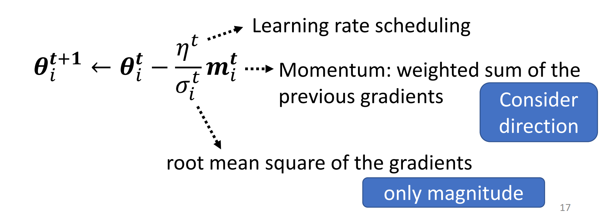

$m$和$\sigma$都和之前的梯度$g$有关，但一个是控制方向的矢量，一个是控制大小的标量。

针对$\eta$,$\sigma$,$m$采用不同策略，就形成了现在的优化器的基本算法。

## Preparation 5: 损失函数

[Logistic Regression](https://speech.ee.ntu.edu.tw/~hylee/ml/ml2021-course-data/classification_v2.pdf)

不同的损失函数，也会影响训练的难易程度。这节课程做了一些铺垫，讲了机器学习中的多分类任务。通过多分类任务中损失函数的选择来揭示这一道理。

分类任务就是离散回归任务，标签被转换为**独热编码（one-hot vector）**，以保证线性无关性。

例如
$$
\begin{bmatrix}
1\\0\\0
\end{bmatrix},
\begin{bmatrix}
0\\1\\0
\end{bmatrix},
\begin{bmatrix}
 0\\0\\1
\end{bmatrix}
$$

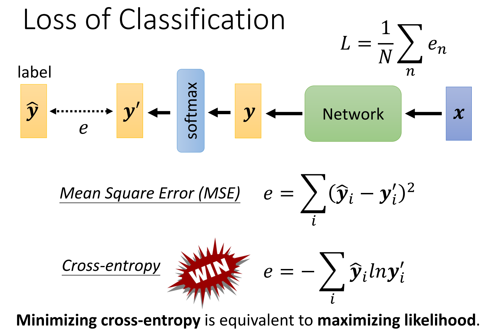

关于交叉熵损失函数设计，跟极大似然估计有很大关系。但在这里，我们研究的是它在做Optimization时跟MSE的区别。

`softmax`函数经常用在概率相关的任务中，它将各个输出节点的输出值范围映射到$[0, 1]$，并且约束各个输出节点的输出值的和为1。

$$
\text{softmax}(y_{i})=\frac{\exp(y_{i})}{\sum \exp(y_{j})}
$$

这是本节课程最后一张PPT，举了一个例子：

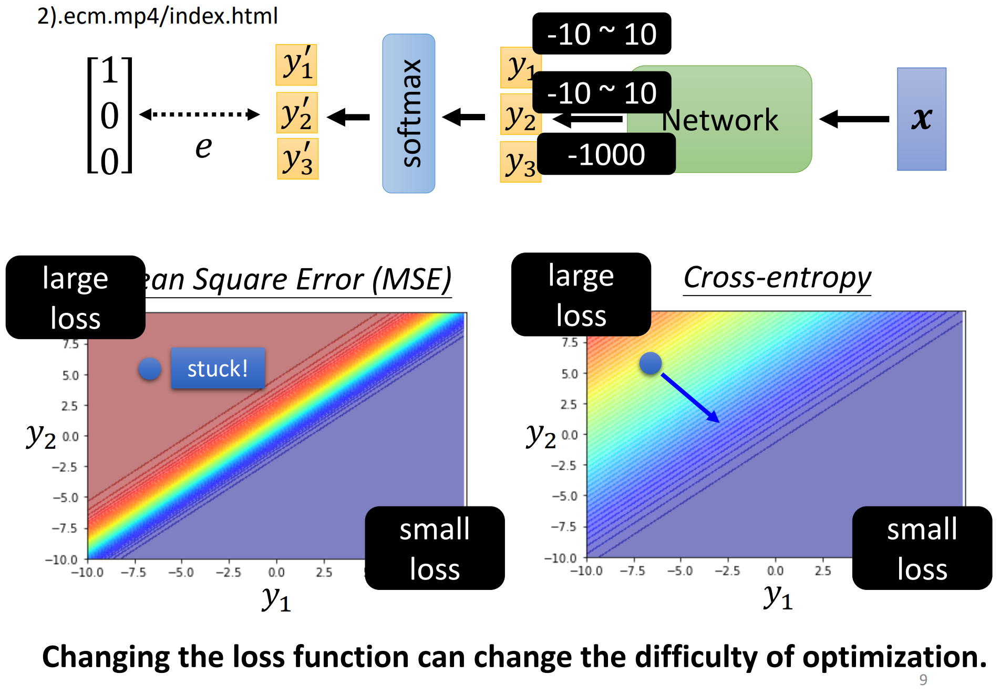

假设神经网络的输出中$y_{3}$很小，经过 `softmax` 后接近于0，从而loss主要跟$y_{1},y_{2}$有关：

$$
\text{MSE}(\mathbf{y})=(1-y_{1}')^{2}+y_{2}'^{2}
$$

$$
\text{CrossEntropy}(\mathbf{y})=-\ln y_{1}'
$$

这里幻灯片直接展示了两种损失函数的梯度的区别，并指出在损失较大（$y_{1}$小，$y_{2}$大）的情况下，**MSE函数梯度很小，而交叉熵损失函数反而有很大的梯度**，从而解释了在逻辑回归任务中采用交叉熵损失函数由于MSE的原因，进而印证了损失函数也对训练过程有影响，真实醍醐灌顶啊~

课程没有解释梯度不同的原因，这里我做一个简单证明。

分别计算其梯度：

$$
\nabla \text{MSE}=\left((2y_{1}'-2)\frac{ \partial y_{1}' }{ \partial y_{1} } ,2y_{2}'\frac{ \partial y_{2}' }{ \partial y_{2} } \right)=2\left( -(1-\alpha)^{2}\alpha, (1-\alpha)\alpha\right)
$$

其中

$$
\alpha=\frac{\exp(y_{1})}{\exp(y_{1})+\exp(y_{2})}
$$
$$
1-\alpha=\frac{\exp(y_{2})}{\exp(y_{1})+\exp(y_{2})}
$$

当$y_{1}$小，$y_{2}$大的时候，可以认为$\alpha \to 0$，而做商可以证明$(1-\alpha)^{2}\alpha, (1-\alpha)\alpha$都是$\alpha$的等价无穷小，所以也都接近0.

$$
\nabla \text{CrossEntropy}=\left( -\frac{1}{y_{1}'}\frac{ \partial y_{1}' }{ \partial y_{1} } ,0 \right)=\left( -\frac{\exp(y_{2})}{\exp(y_{1})+\exp(y_{2})},0 \right)
$$
则接近1.

## 分类器：浅谈机器学习原理

[寶可夢、數碼寶貝分類器](https://speech.ee.ntu.edu.tw/~hylee/ml/ml2022-course-data/theory%20(v7).pdf)

> 这节课程好像是在将数据集采样的事……尽量理论化，但还是有点牵强……

### 带有未知参数的函数

分类任务可以理解为找到一个阈值，大于这个阈值的是一类，小于这个阈值的是另一类。训练就是需要在阈值的取值范围$\mathcal{H}$内找到能使准确率达到最大的阈值。取值范围的大小$\left|\mathcal{H}\right|$就是这个模型的复杂程度。

$$
f_{h}(\mathbf{x})=\begin{cases}
\text{A} &\text{if }e(\mathbf{x})\ge h \\\text{B} & \text{if }e(\mathbf{x})\lt h
\end{cases}
$$

### 损失

给定一个数据集$$\mathcal{D}=\{ (x_{1},\hat{y}_{1}),(x_{2},\hat{y}_{2}),\dots,(x_{n},\hat{y}_{n}) \}$$

在阈值$h$下的损失可以表示为
$$
L(h,\mathcal{D})=\frac{1}{N}\sum_{i=1}^{N} l(h,x_{i},\hat{y}_{i})
$$

误分类率中，
$$
l(h,x_{i},\hat{y}_{i})
$$

可取为
$$
I(f_{h}(x_{i})\ne \hat{y}_{i})=\begin{cases}
1 & \text{if }f_{h}(x_{i})\ne \hat{y}_{i} \\
0 & \text{if }f_{h}(x_{i}) = \hat{y}_{i}
\end{cases}
$$

由于这个函数不连续，为了梯度下降，实际训练中设为交叉熵损失函数。

### 数据集采样

**理想**情况是用所有数据来训练：
$$
h_{all}=arg \min_{h}L(h,\mathcal{D}_{all})
$$

**现实**上只能找到部分数据来训练：
$$
h_{train}=arg \min_{h}L(h,\mathcal{
D_{train}
})
$$

我们希望$L(h,\mathcal{D}_{all})$和$L(h,\mathcal{D}_{train})$足够接近：

$$
L(h,\mathcal{D}_{all})-L(h,\mathcal{D}_{all})\le\delta
$$
其必要条件是
$$
\forall h \in \mathcal{H}, \left | L(h,\mathcal{D}_{train}) - L(h,\mathcal{D}_{all})\right | \le \frac{\delta}{2}
$$

以下证明:
由
$$
\begin{align}
L(h_{train},\mathcal{D}_{all}) &\le L(h_{train},\mathcal{D}_{all})+\frac{\delta}{2}  \\
&\le L(h_{all},\mathcal{D}_{train})+\frac{\delta}{2} \\
&\le L(h_{all},\mathcal{D}_{all})+\frac{\delta}{2}+\frac{\delta}{2} \\
&=L(h_{all},\mathcal{D}_{all})+\delta
\end{align}
$$

另$\varepsilon=\frac{\delta}{2}$，我们将满足
$$
\forall h \in \mathcal{H}, \left | L(h,\mathcal{D}_{train}) - L(h,\mathcal{D}_{all})\right | \le \varepsilon
$$

的$\mathcal{D}_{train}$称为好的采样。否则就是坏的采样。

那么发生坏的采样的概率是多少呢？如何避免坏的训练集？

坏的训练集$\mathcal{D}_{train}$就是
$$
\exists h\in \mathcal{H}, \left | L(h,\mathcal{D}_{train}) - L(h,\mathcal{D}_{all})\right | \le \varepsilon
$$

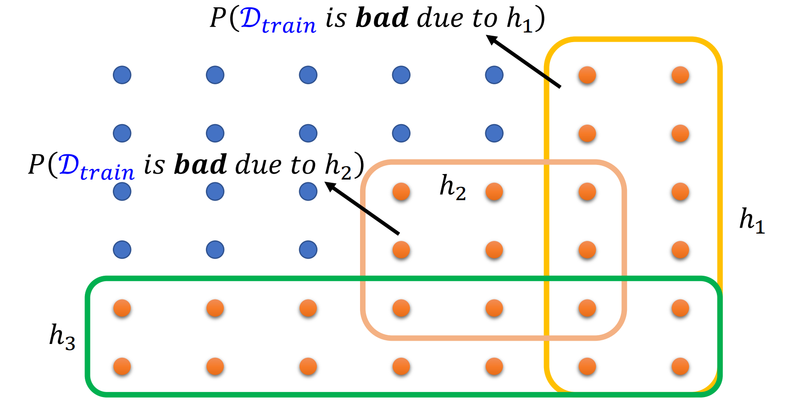

$$
\begin{align}
P(\mathcal{D}_{train} \text{ is bad})&=P\left( \bigcup_{h \in \mathcal{H}}\mathcal{D}_{train} \text{ is bad due to }h \right) \\
&\le \sum_{h\in \mathcal{H}}P(\mathcal{D}_{train} \text{ is bad due to }h)
\end{align}
$$

>这是一个很过分的放缩，我不是很认可，但最终通过满足某些取值仍然可以使其小于1。

霍夫丁不等式（Hoeffding’s Inequality):

$$
P(\mathcal{D}_{train} \text{ is bad due to }h) \le 2\exp(-2N\varepsilon^{2})
$$

其中$N$是$\mathcal{D}_{train}$中样本的数量。

那么

$$
\begin{align}
P(\mathcal{D}_{train} \text{ is bad})
&\le \sum_{h\in \mathcal{H}}P(\mathcal{D}_{train} \text{ is bad due to }h)  \\
&\le  \sum_{h\in \mathcal{H}}2\exp(-2N\varepsilon^{2}) \\
&=|\mathcal{H}|\cdot 2\exp(-2N\varepsilon^{2})
\end{align}
$$

所以，
$$
P(\mathcal{D}_{train} \text{ is bad})\le \delta
$$

的必要条件就是

$$
N \ge \frac{\log\left( \frac{2|\mathcal{H}|}{\delta} \right)}{2\varepsilon^{2}}
$$

> 我感觉这只是一种尽量的解释和理论化，实际上的神经网络模型参数空间$\mathcal{H}$非常大（VC-dimension），怎么可能得到那么大的样本嘛😅

大多数情况下，训练数据无法进一步增大，那么采用大的$\mathcal{H}$可以把$L(h_{all},\mathcal{D}_{all})$降下来，但意味着$L(h_{train},\mathcal{D}_{all})$跟$L(h_{all},\mathcal{D}_{all})$的差距大；反之，$L(h_{train},\mathcal{D}_{all})$跟$L(h_{all},\mathcal{D}_{all})$差距小，但模型效果不好，$L(h_{all},\mathcal{D}_{all})$本来就比较大。

> 鱼和熊掌可以兼得吗？

## HW2: Phoneme Classification

[Machine Learning HW2](https://speech.ee.ntu.edu.tw/~hylee/ml/ml2022-course-data/hw2_slides2022.pdf)

### 任务介绍

这是一次语音识别任务，根据音频材料训练并预测音素（phoneme）。音素是语音的基本单位，类似于字母在文字中的作用。

### 数据预处理

每25ms音频分割为一帧，从原始波形中提取39维的MFCC特征，这部分工作已经由助教做好了！

### 数据集

数据集是[LibriSpeech](https://www.openslr.org/12/)(subset of train-clean-100)

- Training: 4268预处理音频特征及其对应的标签（总共 2644158 帧）
- Testing: 1078预处理音频特征（总共 646268 帧）
- Label: 41个类别的标签，每个类别对应一个音素。

### 数据格式

```
libriphone/
    - train_split.txt (train metadata)
    - train_labels.txt (train labels)
    - test_split.txt (test metadata)
    - feat/
        - train/
        - test/
```

- `train_split.txt` 和 `test_split.txt` 包含了每个训练和测试音频的文件名（在 `feat/train` 和 `feat/test` 下）。
- `train_labels.txt` 包含了每个音频文件的标签信息。
- `feat/train/` 和 `feat/test/` 目录下分别存储了训练和测试音频的MFCC特征文件，每个文件有多个音频样本（形状为[seq_len, 39]）。

### 任务要求

水平 | 准确率
---|---
simple | 0.45797 (sample code)
medium | 0.69747 (concat n frames, add layers)
strong | 0.75028 (concat n, batchnorm, dropout, add layers)
boss |  0.82324 (sequence-labeling(using RNN))

### Simple Baseline

直接运行[示例代码](https://github.com/virginiakm1988/ML2022-Spring/blob/main/HW02/HW02.ipynb)


### Medium Baseline

连接`n_frame=19`，增加到三层`BasicBlock`网络。
学习率调度器使用余弦退火：

```python
scheduler = torch.optim.lr_scheduler.CosineAnnealingWarmRestarts(
    optimizer, T_0=10, T_mult=2, eta_min=1e-6)
```


### Strong Baseline

同时，每一层增加`batchnorm`和`dropout`：

```python
class BasicBlock(nn.Module):
    def __init__(self, input_dim, output_dim):
        super(BasicBlock, self).__init__()

        self.block = nn.Sequential(
            nn.Linear(input_dim, output_dim),
            nn.ReLU(),
            nn.BatchNorm1d(output_dim),
            nn.Dropout(0.2)
        )

    def forward(self, x):
        x = self.block(x)
        return x
```

注意到我们连接了19帧，本身特征就达到了39\*19，因此增加`hidden_dim`。

```python
# data prarameters
concat_nframes = 19             # the number of frames to concat with, n must be odd (total 2k+1 = n frames)
train_ratio = 0.8               # the ratio of data used for training, the rest will be used for validation

# training parameters
seed = 0                        # random seed
batch_size = 512                # batch size
num_epoch = 50                   # the number of training epoch
learning_rate = 0.0001          # learning rate
model_path = './model.ckpt'     # the path where the checkpoint will be saved

# model parameters
input_dim = 39 * concat_nframes # the input dim of the model, you should not change the value
hidden_layers = 3               # the number of hidden layers
hidden_dim = 1024                # the hidden dim
```

此时经过30个epoch的训练后就没什么进步了，甚至好像过拟合了……所以训练到60epoch的时候我就赶紧掐掉了。

```log
100%|██████████| 4134/4134 [00:37<00:00, 110.83it/s]
100%|██████████| 1031/1031 [00:05<00:00, 184.43it/s]
[028/080] Train Acc: 0.806332 Loss: 0.572783 | Val Acc: 0.749010 loss: 0.830200
saving model with acc 0.749
100%|██████████| 4134/4134 [00:37<00:00, 111.51it/s]
100%|██████████| 1031/1031 [00:05<00:00, 195.24it/s]
[029/080] Train Acc: 0.807738 Loss: 0.568986 | Val Acc: 0.749124 loss: 0.831292
saving model with acc 0.749
100%|██████████| 4134/4134 [00:37<00:00, 110.04it/s]
100%|██████████| 1031/1031 [00:05<00:00, 193.80it/s]
[030/080] Train Acc: 0.808039 Loss: 0.567000 | Val Acc: 0.749021 loss: 0.831178
100%|██████████| 4134/4134 [00:36<00:00, 111.94it/s]
100%|██████████| 1031/1031 [00:05<00:00, 186.39it/s]
[031/080] Train Acc: 0.785248 Loss: 0.640657 | Val Acc: 0.741230 loss: 0.842659
100%|██████████| 4134/4134 [00:37<00:00, 111.52it/s]
100%|██████████| 1031/1031 [00:05<00:00, 190.29it/s]
[032/080] Train Acc: 0.784388 Loss: 0.642653 | Val Acc: 0.741867 loss: 0.843050
100%|██████████| 4134/4134 [00:36<00:00, 111.89it/s]
100%|██████████| 1031/1031 [00:05<00:00, 189.24it/s]
...
...
[055/080] Train Acc: 0.829193 Loss: 0.495767 | Val Acc: 0.747598 loss: 0.870931
100%|██████████| 4134/4134 [00:37<00:00, 111.11it/s]
100%|██████████| 1031/1031 [00:05<00:00, 196.11it/s]
[056/080] Train Acc: 0.831027 Loss: 0.490183 | Val Acc: 0.748087 loss: 0.870781
100%|██████████| 4134/4134 [00:37<00:00, 111.36it/s]
100%|██████████| 1031/1031 [00:05<00:00, 175.55it/s]
[057/080] Train Acc: 0.832389 Loss: 0.485255 | Val Acc: 0.747782 loss: 0.871408
100%|██████████| 4134/4134 [00:37<00:00, 110.37it/s]
100%|██████████| 1031/1031 [00:05<00:00, 201.41it/s]
[058/080] Train Acc: 0.833472 Loss: 0.481230 | Val Acc: 0.748790 loss: 0.869592
100%|██████████| 4134/4134 [00:37<00:00, 111.45it/s]
100%|██████████| 1031/1031 [00:05<00:00, 177.09it/s]
```


### Boss Baseline

以上我们用的都是很简单的连接神经网络（就是一堆矩阵乘法罢了）然后在strong baseline里面加入了batchnorm和dropout。像这种时序分类问题啊，有点像我论文讨论的那个问题。因此时序分类任务我还是了解过几种深度学习算法的，例如LSTM和这里提示的RNN。为了达到boss baseline，需要朝这个方向做改进。

我首先尝试了RNN，10个epoch以内就不再增长了，收敛很快但是效果没有刚才好。


这些RNN，LSTM都是用最后一步的输出，但是我们的预测帧在中间，我以为这样不太好，就去改网络、损失的算法，结果效果不堪入目，改成三维数据还折腾了一天。后来找到了别人的实践，才改回来了，可以大胆增加LSTM的层数，LSTM的输出可以再放到全连接层里面……

`concat_nframes = 23`，
再大12.7GB系统RAM就装不下了……

```log
100%|██████████| 4381/4381 [01:54<00:00, 38.25it/s]
100%|██████████| 785/785 [00:06<00:00, 120.76it/s]
[001/015] Train Acc: 0.655396 Loss: 1.119341 | Val Acc: 0.674556 loss: 1.045279
saving model with acc 0.675
100%|██████████| 4381/4381 [01:59<00:00, 36.80it/s]
100%|██████████| 785/785 [00:07<00:00, 111.12it/s]
[002/015] Train Acc: 0.735927 Loss: 0.832867 | Val Acc: 0.690507 loss: 1.017421
saving model with acc 0.691
100%|██████████| 4381/4381 [01:59<00:00, 36.76it/s]
100%|██████████| 785/785 [00:06<00:00, 112.56it/s]
[003/015] Train Acc: 0.782831 Loss: 0.673428 | Val Acc: 0.691520 loss: 1.049682
saving model with acc 0.692
100%|██████████| 4381/4381 [01:59<00:00, 36.72it/s]
100%|██████████| 785/785 [00:06<00:00, 118.46it/s]
[004/015] Train Acc: 0.825613 Loss: 0.531372 | Val Acc: 0.689239 loss: 1.141714
100%|██████████| 4381/4381 [01:59<00:00, 36.76it/s]
100%|██████████| 785/785 [00:07<00:00, 111.97it/s]
[005/015] Train Acc: 0.867342 Loss: 0.397408 | Val Acc: 0.686937 loss: 1.269593
100%|██████████| 4381/4381 [01:58<00:00, 36.82it/s]
100%|██████████| 785/785 [00:07<00:00, 111.64it/s]
[006/015] Train Acc: 0.906736 Loss: 0.273127 | Val Acc: 0.686579 loss: 1.448474
100%|██████████| 4381/4381 [01:59<00:00, 36.80it/s]
100%|██████████| 785/785 [00:06<00:00, 119.00it/s]
[007/015] Train Acc: 0.942374 Loss: 0.165881 | Val Acc: 0.684778 loss: 1.703792
100%|██████████| 4381/4381 [01:59<00:00, 36.80it/s]
100%|██████████| 785/785 [00:06<00:00, 117.48it/s]
[008/015] Train Acc: 0.970304 Loss: 0.084912 | Val Acc: 0.685219 loss: 2.109468
```

采用双向LSTM+MLP已经是严重过拟合了。看了一下别人的实践，concat_frame调到61，这已经不是免费版Colab能承受的，遂作罢。而且LSTM的训练比RNN更耗时，每天的免费额度可能只能跑两次实验，非常折磨，效果也上不去。

模型架构大致如下：

```python
import torch
import torch.nn as nn
import torch.nn.functional as F

class BasicBlock(nn.Module):
    def __init__(self, input_dim, output_dim):
        super(BasicBlock, self).__init__()

        self.block = nn.Sequential(
            nn.Linear(input_dim, output_dim),
            nn.BatchNorm1d(output_dim),
            nn.ReLU(),
            nn.Dropout(0.2),
        )

    def forward(self, x):
        x = self.block(x)
        return x

class SimpleRNN(nn.Module):
    def __init__(self, feature_dim=39, hidden_dim=512, hidden_layers=3) -> None:
        super(SimpleRNN, self).__init__()
        self.feature_dim = feature_dim
        self.rnn = nn.RNN(feature_dim, hidden_dim, num_layers=hidden_layers, 
                          batch_first=True, dropout=0.25)

    def forward(self, x):
        # x: (batch_size, concat_n * feature_dim)
        x = x.view(x.size(0), -1, self.feature_dim)  # (batch_size, concat_nframes, feature_dim)
        out, _ = self.rnn(x)  # out: (batch_size, seq_len, hidden_size)
        # 取序列最后一个时间步的输出作为模型的输出
        out = out[:, -1, :]   # (batch_size, hidden_size)
        return out
    
class SimpleLSTM(nn.Module):
    def __init__(self, feature_dim=39, hidden_dim=512, hidden_layers=4) -> None:
        super(SimpleLSTM, self).__init__()
        self.feature_dim = feature_dim
        self.rnn = nn.LSTM(feature_dim, hidden_dim, num_layers=hidden_layers,
                           batch_first=True, dropout=0.25)

    def forward(self, x):
        # x: (batch_size, concat_nframes * feature_dim)
        x = x.view(x.size(0), -1, self.feature_dim)  # (batch_size, concat_nframes, feature_dim)
        out, _ = self.rnn(x)  # out: (batch_size, seq_len, hidden_dim)
        # 取序列最后一个时间步的输出作为模型的输出
        out = out[:, -1, :]   # (batch_size, hidden_size)
        return out

class Classifier(nn.Module):
    def __init__(self, input_dim, output_dim=41, hidden_layers=1, hidden_dim=256):
        super(Classifier, self).__init__()
        self.rnn_hidden_dim = 768
        self.rnn = SimpleRNN(
            feature_dim=input_dim, hidden_dim=self.rnn_hidden_dim
        )
        self.lstm = SimpleLSTM(
            feature_dim=input_dim, hidden_dim=self.rnn_hidden_dim
        )
        # 后接全连接层
        self.fc = nn.Sequential(
            # 修改成 2 * self.rnn_hidden_size 的原因是因为LSTM()中的bidirectional设置为了True，这表示使用Bi（双向）LSTM模型，所以需要修改输入维度以匹配
            BasicBlock(self.rnn_hidden_dim, hidden_dim),
            *[BasicBlock(hidden_dim, hidden_dim) for _ in range(hidden_layers)],
            nn.Linear(hidden_dim, output_dim)
        )

    def forward(self, x):
        # x: (batch_size, seq_len, rnn_input_dim=feature_dim)
        # x = self.lstm(x)  # (batch_size, seq_len, rnn_hidden_dim)
        x = self.rnn(x)  # (batch_size, seq_len, rnn_hidden_dim)

        # 通过全连接层得到 logits
        logits = self.fc(x)  # (batch_size, num_classes)
        return logits
```

### 参考资料

[【李宏毅机器学习HW2】-CSDN博客](https://blog.csdn.net/detemination_/article/details/127194301)

[Boss Baseline思路解析](https://github.com/Aaricis/Hung-yi-Lee-ML2022/blob/main/HW2/HW02_boss.ipynb)

### 小结

本次作业数据集较大，RAM内存有点不太够用。运行训练和测试代码之后即使调用了 `gc.collect()` 没有作用，内存占用依然没有下降，然后colab就变的很卡，下载 `pred.csv` 都不稳定，体验不佳。同时，训练时间也比上次作业多了很多。这个连接19帧的超参数我是直接看别人的实践，在免费额度的条件下一天内无法多试几个超参数。但是相比于HW01这次的方向倒是很明确，不像HW01没有确切的改进方向，一直在调超参数。而且HW02一改进就能看到成效，其实最让人容易崩溃的是HW01经常改了参数效果不升反降。

> 我的notebook: [HW02.ipynb](https://colab.research.google.com/drive/1UO6pYlGJ1Rs5iKpfd6NdOezxmsTWdbZS)
