## Preparation: 卷积神经网络

[Convolutional Neural Network (CNN)](https://speech.ee.ntu.edu.tw/~hylee/ml/ml2021-course-data/cnn_v4.pdf)

### 图像分类任务

所有输入图像都需要放缩（Rescale）到相同的大小。

如果采用全连接神经网络的架构，需要将其展平为一维的向量，再去处理……
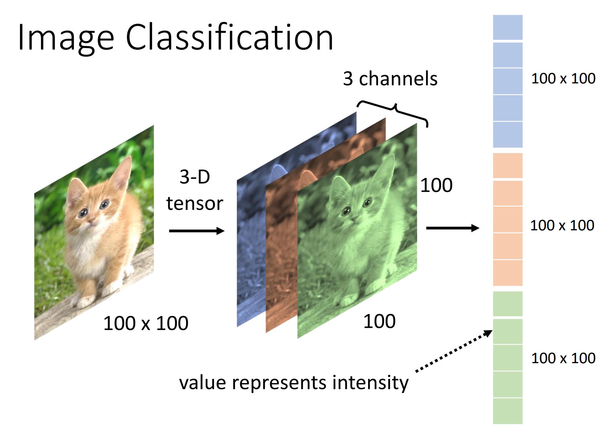

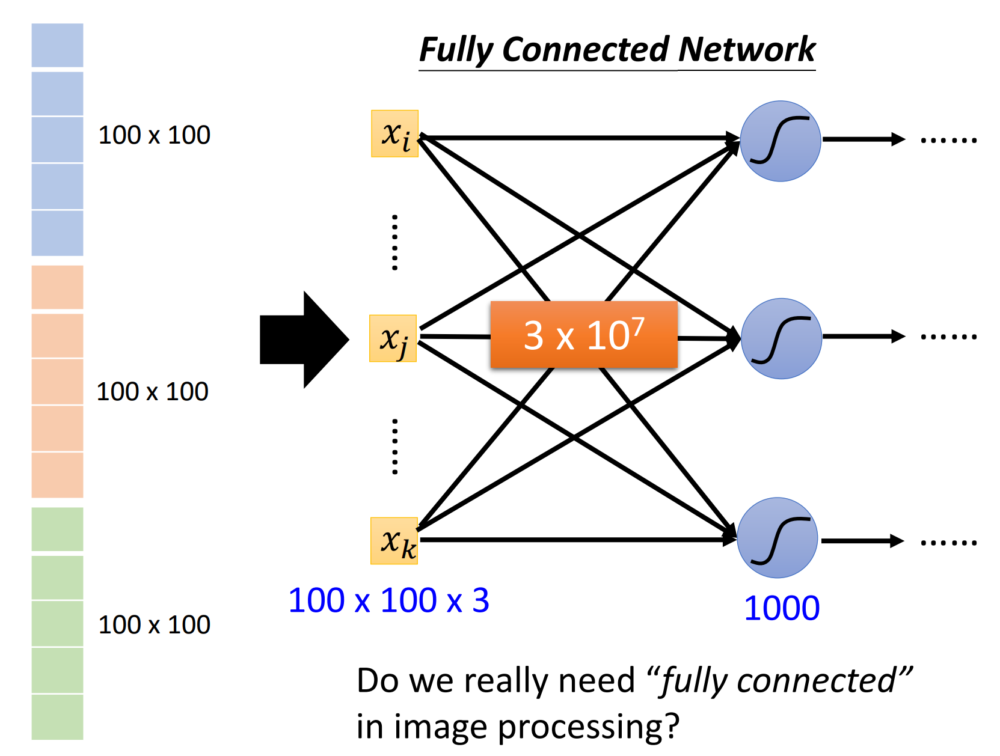

> Observation 1:

人类通过关键的图像模式来识别图像：

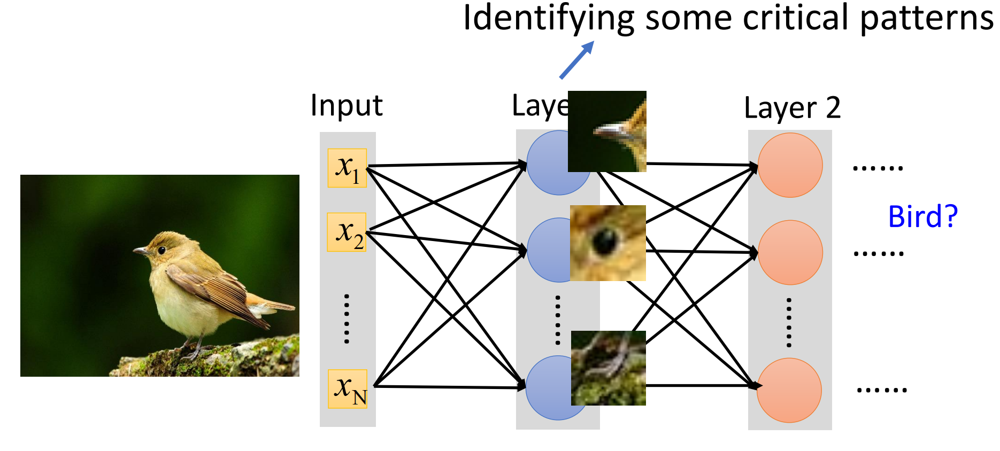

看到了鸟喙、爪和眼。

所以，这些神经元不需要能“看到”整个图像。

### Simplification 1

为此，可以做出第一种简化：感知域（Receptive Field）。
通过设置一些局部的范围（比如3×3像素），神经元需要的参数大大减少。

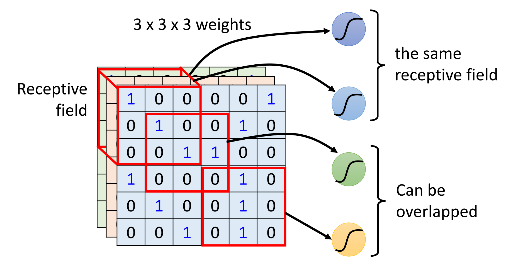

为了侦测处于交界上的模式，Receptive field应该相互有重合的部分；为了侦测不同的模式，同一个Receptive field应该由多个不同的神经元守备。

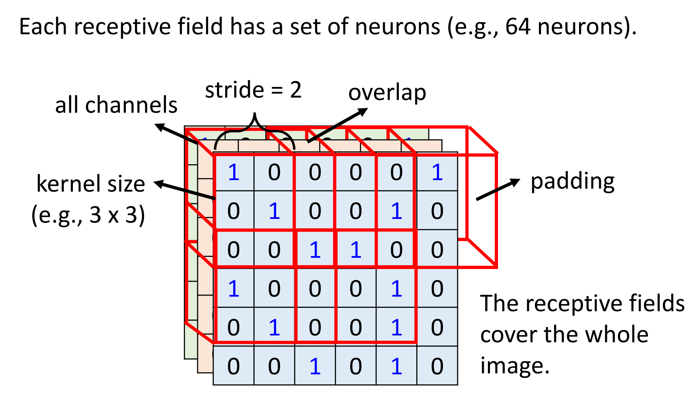

> Observation 2:

同一种模式会出现在不同的位置。

### Simplification 2

守备同一个模式的同类神经元共享参数。

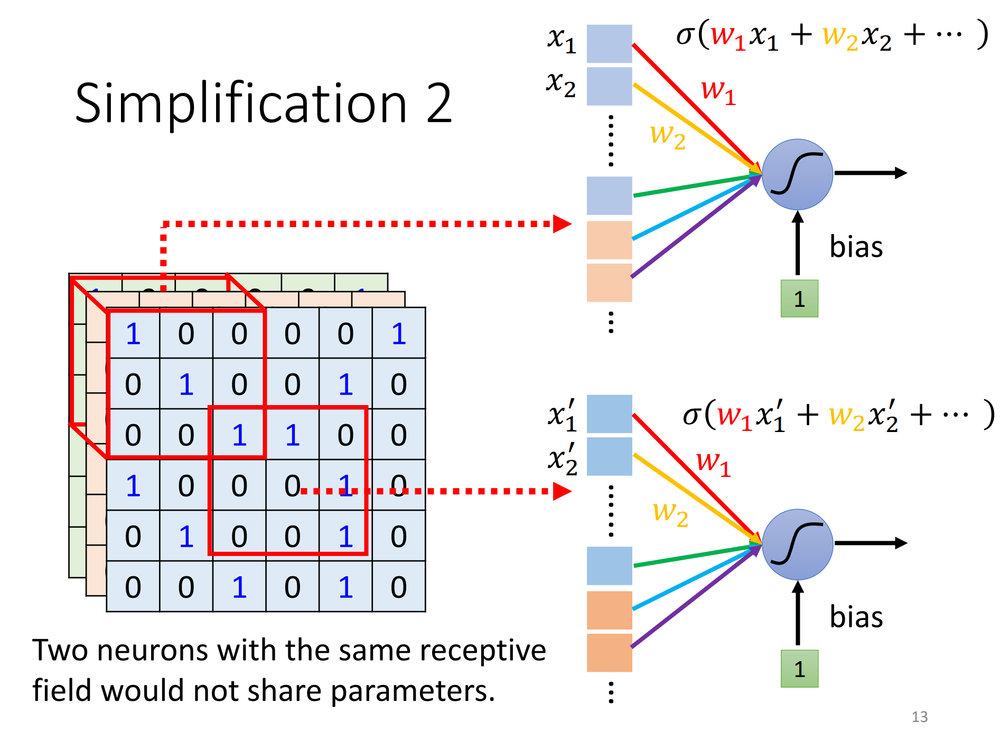

每个Receptive field有一组神经元，参数共享。

### 卷积层的作用

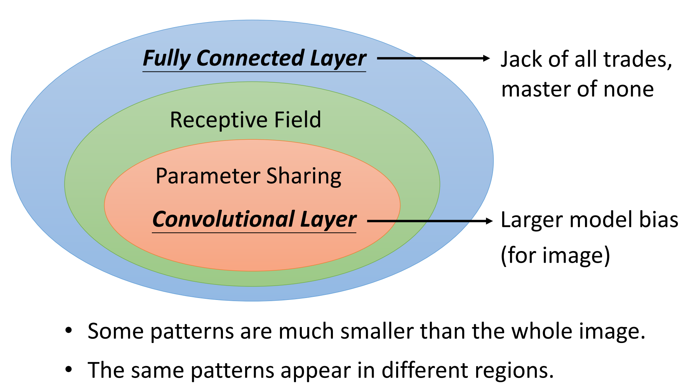

CNN是用在图像识别这一特定任务上的，相比于普通的全连接层具有较大的Model bias，但避免了过拟合问题，需要训练的参数也大幅减少。

> 通过非常简单的例子就说明了CNN的设计原理，真佩服！

### 卷积层

什么叫卷积层？就是里面有很多Filter。大小是 3×3×channel的张量，每一个Filter的作用是在图片里面捕捉某个模式。

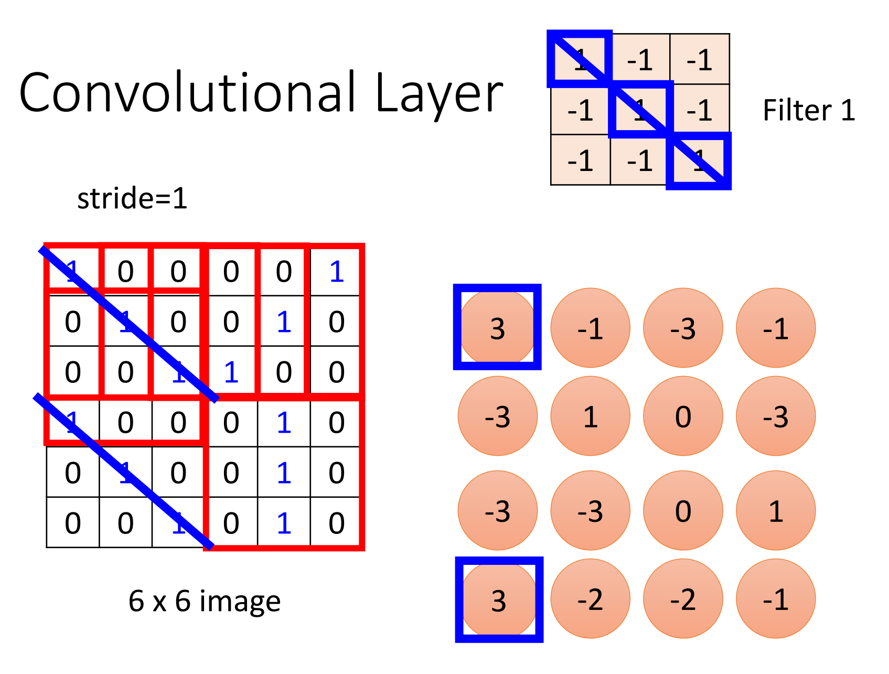

Filter与图像的Respective field算内积。

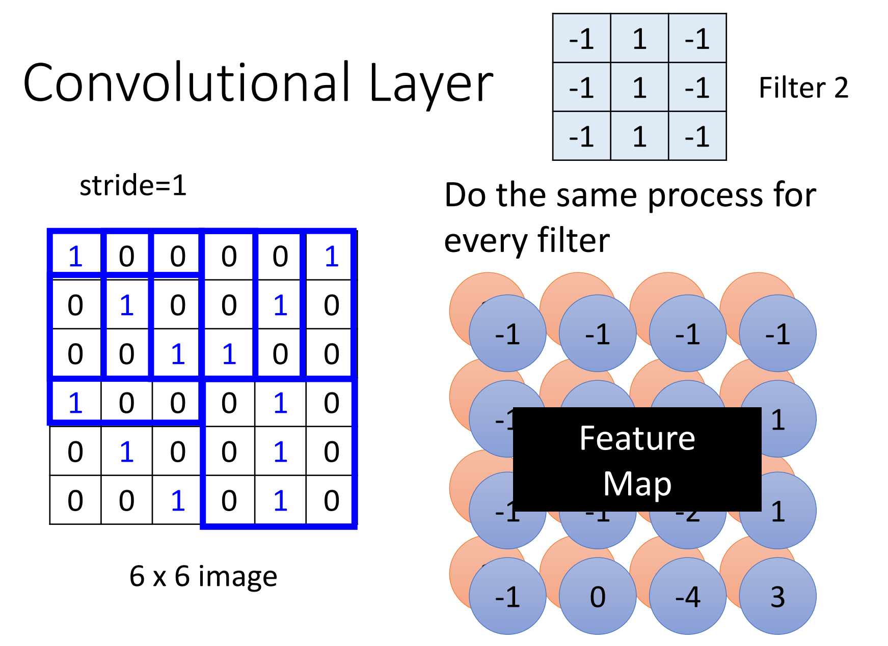

多个Filter并行计算得到多组结果，称为Feature Map，可以看作另一个有多个channel的“图像”。

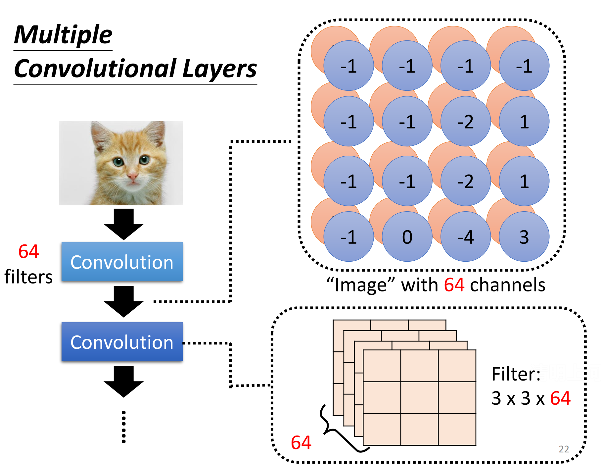

然后下一层的Filter，channel要跟前一个卷积层的Filter数目相同。

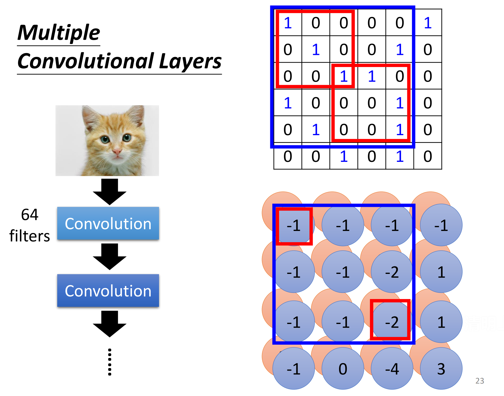

通过多层卷积层，侦测的范围变大。

把Filter扫过图片的过程，就是神经元共用参数，就是“卷积”这个名称的由来。

### 池化

> 把图片缩小，不会影响图片的分类。

做完卷积后往往会做池化，池化就相当于把图片变小，从而减少运算量。但是不是所有任务都适合、需要池化……

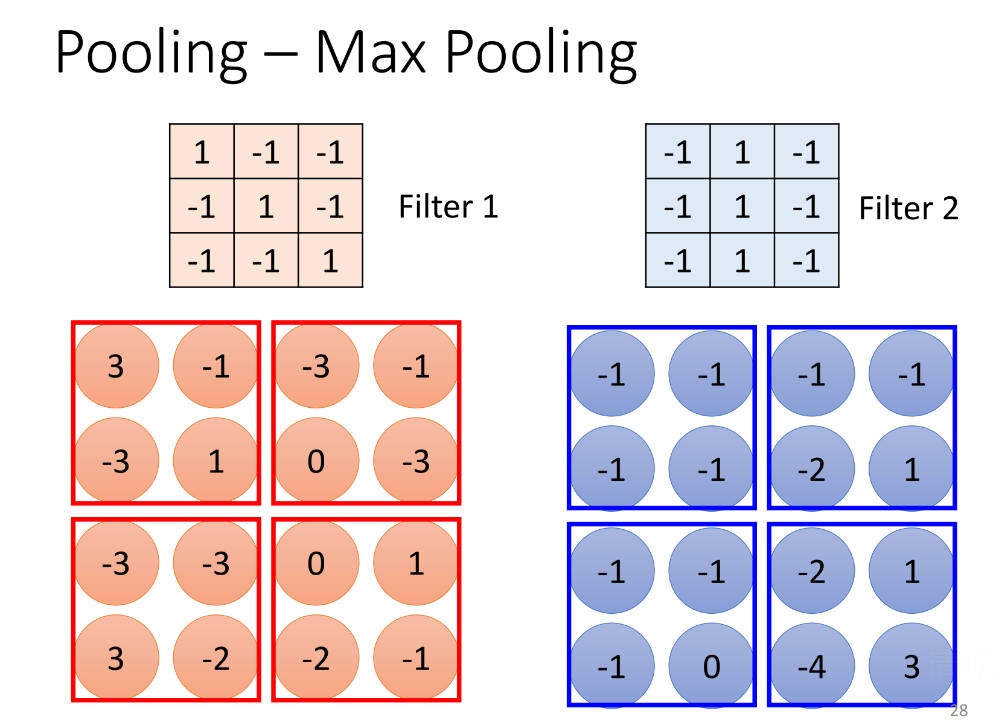

Max Pooling在每个区域取最大值，得到从4×4变成2×2的结果。

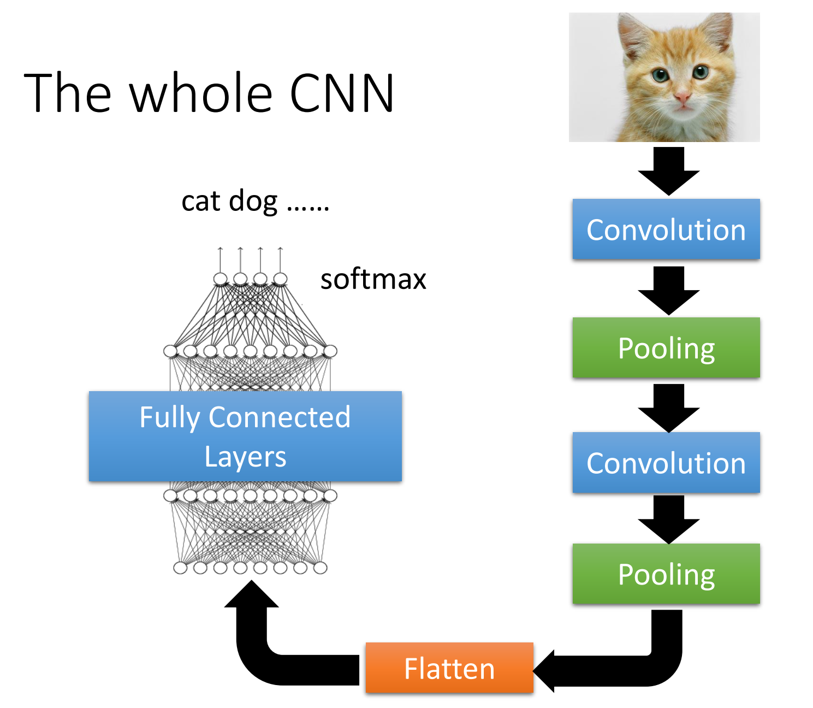

卷积和池化可以交替进行。差不多抽取出模式后展平，再通过全连接层去做分类。

### 应用

AlphaGo、语言、自然语言处理。根据不同的特性做不同的处理。

CNN并不能够处理图片放大缩小、旋转（需要数据增强）。

## 鱼和熊掌可以兼得的机器学习

[Why Deep Learning?](https://speech.ee.ntu.edu.tw/~hylee/ml/ml2022-course-data/whydeep%20(v4).pdf)

在Lecture 2中曾经提到陷入了一个[两难境地](Lecture-2.md#数据集采样)

但深度学习是一个鱼和熊掌可以兼得的方法，虽然$\mathcal{H}$小，但是里面的元素比较优秀，能够使得损失值比较小。

$$
h_{all}=arg \min_{\underbrace{ h \in \mathcal{H}}_{\text{Small}}} \overbrace {L(h,\mathcal{D}_{all})}^{\text{Still small}}
$$

本节课程就是在解释，为什么“深”是深度学习的优势。这是一个多年来我没有关注到甚至误解的知识。

### 激活函数

神经网络可以看作在每一维上的折线，而折线可以通过常数和多个激活函数的集合组成。

线性层相当于把激活函数做线性变换，可以产生各种组合。常见的激活函数有 Sigmoid 和 ReLU 等。

### Deep but not flat

接下来课程抛出一项经典研究，

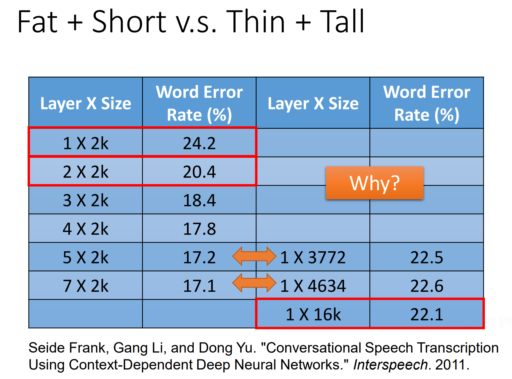

该研究指出，在相当的参数量下，深层神经网络的效果更好。

> 为什么这两个网络的参数量相当呢？我记得前段时间学习[LLM from Scratch]的时候，可以通过Pytorch的一段代码计算网络的参数量。那么神经网络的参数量是如何计算的呢？我找到了解答：[如何计算神经网络的参数量以及创建多隐藏层网络（总参数量接近）](https://zhuanlan.zhihu.com/p/614806254)，[参数量计算公式](https://cloud.tencent.com/developer/article/2409461)。
>
> 我们尝试验证一下：
> $$
> \begin{align}
> 3.772(i+1)+4.772o&=2(i+1)+2 \times 4 + 3o \\
> i + o &\approx  3.515
> \end{align}
> $$
>
> $$
> \begin{align}
> 4.634(i+1)+5.634o&=2(i+1)+2\times 6+3o \\
> i+o&\approx 3.556
> \end{align}
> $$
> 其中$i$是输入维度，$o$是输出维度，单位是k。
>
> 真的是这样吗？我也不太确定诶。[原文链接](https://www.microsoft.com/en-us/research/wp-content/uploads/2016/02/CD-DNN-HMM-SWB-Interspeech2011-Pub.pdf)

### Why we need deep?

理论上一层网络足以表示任何曲面，只是深层网络**效率更高**。

随着网络层数增加，“折线”的复杂程度呈指数级增加。随后，课程举了一个例子来说明这个事实：

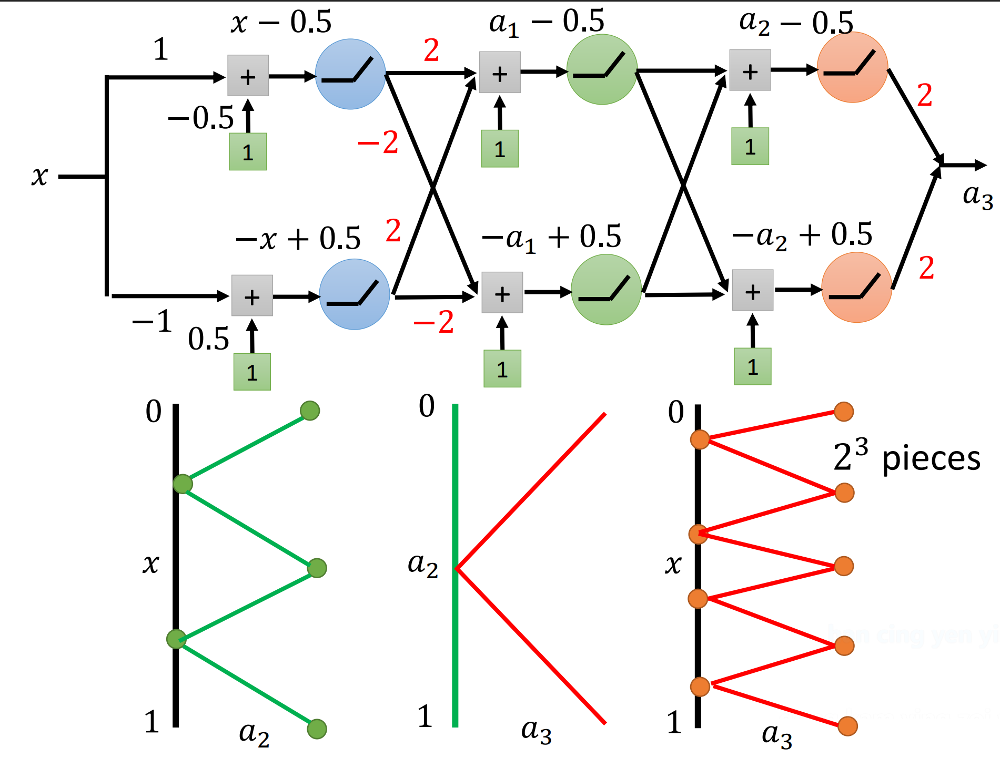

> 这张图已经是修正后的图了，不过感觉好像还是不太对……反正是这样设定的：

$$
a_{1}=\begin{cases}
-2x+1  & \text{ if } x\lt 0.5 \\
2x-1  & \text{ if } x\ge 0.5
\end{cases}
$$

$$
a_{2}=\begin{cases}
-2a_{1}+1  & \text{ if } a_{1}\lt 0.5 \\
2a_{1}-1  & \text{ if } a_{1}\ge 0.5
\end{cases}
$$

$$
a_{3}=\begin{cases}
-2a_{2}+1  & \text{ if } a_{2}\lt 0.5 \\
2a_{2}-1  & \text{ if } a_{2}\ge 0.5
\end{cases}
$$

在这个场景下，如果是一层的神经网络，采用Sigmoid函数就需要$2^{3}$个神经元，采用ReLU函数需要$2^{4}$个神经元，这就是差距。

与此同时，由于参数量更大了，一方面需要更多训练数据，另一方面容易出现过拟合的现象。因此就导出一个大家都有误解的结论，加深网络反而容易训练。为了达到一个相同的曲面，浅的网络具有更大的$\mathcal{H}$，而深的网络只需较小的$\mathcal{H}$。这就回答了最初的问题，深度学习是一个让鱼与熊掌可以兼得的方法。

$$
h_{all}=arg \min_{\underbrace{ h \in \mathcal{H}}_{\text{Small}}} \overbrace {L(h,\mathcal{D}_{all})}^{\text{Still small}}
$$

## HW03: Image Classification

[Machine Learning HW3](https://speech.ee.ntu.edu.tw/~hylee/ml/ml2022-course-data/Machine%20Learning%20HW3%20-%20Image%20Classification.pdf)

### 目标：图像分类

1. 要用CNN来完成图像分类的任务
2. 用数据增强(Data Augmentations)来提示效果
3. 了解一些常用的图像处理技巧，比如残差连接

### 任务介绍：食物分类

- 基于food-11数据集把食物分成11个类别
- 训练集：9866张照片
- 验证集：3430张照片
- 测试集：3347张照片

| 水平     | 准确率     | 方法                                                                                                             |
| ------ | ------- | -------------------------------------------------------------------------------------------------------------- |
| Simple | 0.50099 | 直接运行示例代码                                                                                                       |
| Medium | 0.73207 | Training Augmentation <br>Train Longer                                                                         |
| Strong | 0.81872 | Training Augmentation<br>Model Design<br>Train Longer<br>(Cross Validation+Ensemble)                           |
| Boss   | 0.88446 | Training Augmentation<br>Model Design<br>Test Time Augmentation<br>Train Longer<br>(Cross Validation+Ensemble) |

### 模型选择

- 在计算机视觉方面的torch是torchvision，查看[torchvision.models](https://pytorch.org/vision/stable/models.html)有一系列模型结构，或者到[timm](https://github.com/rwightman/pytorch-image-models)查看最新模型
- 设置 `pretrained=False`

### 数据增强（Data Augmentation）

只使用训练提供的照片容易过拟合，我们会把照片做一些不同的变换，一方面提供更多的训练数据，另一方面提供更多普遍的模式。通过旋转、负片等变换去做。[torchvision.transforms](https://pytorch.org/vision/stable/transforms.html) 提供不同的变换方法。

#### Mixup

把两张照片混合在一起，变成一个叠加的照片，lable也变成一半一半的概率。

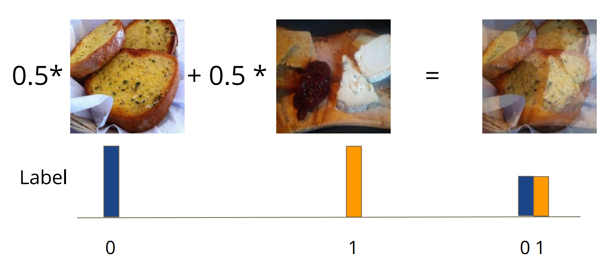

对应的需要修改 `torch.utils.Dataset` 的 `__getitem__()` 方法。 `CrossEntropyLoss()` 函数不支持多个标签，需要自己写一个损失函数。

#### Test Time Augmentation

TTA的过程如下：

1. 数据增强：

    - 在测试时，对每个测试样本应用随机的变换或扰动操作，生成多个增强样本。
    - 常用的数据增强操作包括随机翻转、随机旋转、随机裁剪、随机缩放等。这些操作可以增加样本的多样性，模拟真实世界中的不确定性和变化。
2. 多次预测：

    - 使用训练好的模型对生成的增强样本进行多次预测。
    - 对于每个增强样本，都会得到一个预测结果。
3. 预测结果集成：

    - 对多次预测的结果进行集成，常用的集成方式有多数投票和平均。
    - 对于分类任务，多数投票即选择预测结果中出现次数最多的类别作为最终的预测类别。对于回归任务，平均即将多次预测结果进行平均。

接下来针对性地对比分析下使用TTA带来的优点和缺点：

优点：

- 提高鲁棒性：通过应用数据增强，TTA可以增加样本的多样性和泛化能力，提高模型在面对未见过的输入分布和未知变化时的鲁棒性。
- 提高准确性：通过多次预测和集成，TTA可以减少预测结果的随机性和偶然误差，提高最终预测结果的稳定性和准确性。
- 模型评估和排名：TTA可以改变模型预测的不确定性，使得模型评估更可靠，能够更好地对不同模型进行性能排名。

缺点：

- 计算开销：生成和预测多个增强样本会增加计算量。特别是在大型模型和复杂任务中，可能导致推理时间的显著增加，限制了TTA的实际应用。
- 可能造成过拟合：对于已包含在训练数据中的变换或扰动，如果在测试时反复应用，可能会导致模型对这些特定样本的过拟合，从而影响模型的泛化能力。

### 交叉验证

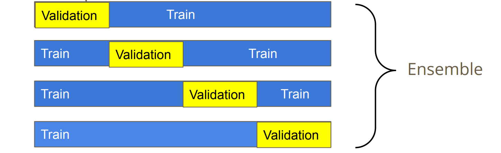

在不同的训练集验证集上训练模型，最后**集成**它们的预测结果。

### 集成(Ensemble)

两种常见方式

- 平均：需要详细的模型输出
- 投票：需要解决平手的问题

### Kaggle设置

> 本次作业由于数据集较大，推荐在Kaggle上运行，数据集跟competition绑定在一起。Kaggle的额度是每周30小时，有GPU T4×2以及GPU P100的配置，比Colab要耐用得多。~~怎么不早说……~~


为了使用GPU进行训练，我们需要先完成Kaggle的身份认证，手机号不支持验证，选择下方的Identity verification，用摄像头拍张照即可。

[ML2022HW3 - Sample Code - Training + Prediction](https://www.kaggle.com/code/a24998667/ml2022hw3-sample-code-training-prediction)

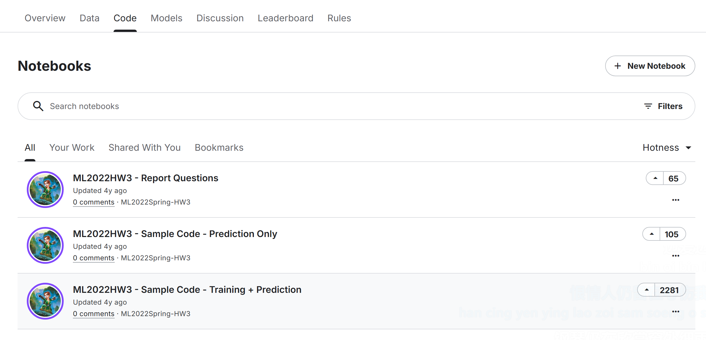

点击右上角"Copy & edit notebook"

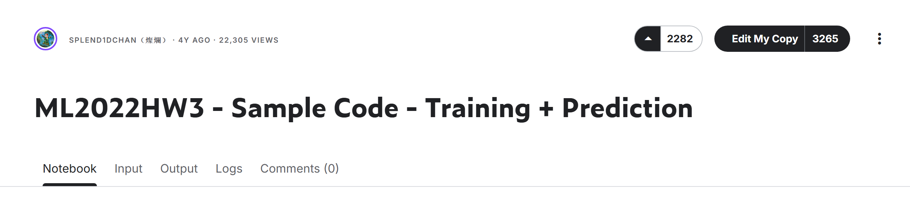

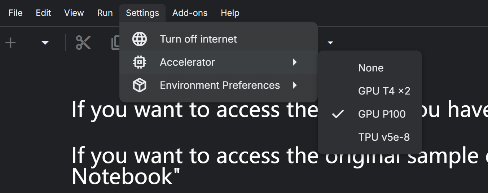

确保打开GPU配置。

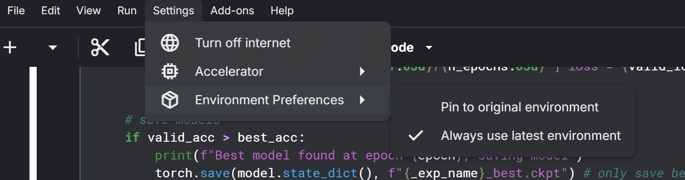

然后环境建议选择最新环境，可以使用torch的新API，页面的js也能适应进度条。

### 小技巧

- on Classification
  - [Label Smoothing Cross Entropy Loss](https://blog.csdn.net/weixin_43960370/article/details/130136227)
  - FocalLoss
- on Optimization
  - Dropout
  - [Gradient Accumulation](https://discuss.pytorch.org/t/why-do-we-need-to-set-the-gradients-manually-to-zero-in-pytorch/4903/20?u=alband)
  - BatchNorm
  - Image Normalization

对于Label Smoothing，现在的`nn.CrossEntropyLoss`函数支持指定 `label_smoothing`参数。

### Medium Baseline

仅仅是使用了一些变换

```python
train_tfm = transforms.Compose([
    # Resize the image into a fixed shape (height = width = 128)
    transforms.Resize((128, 128)),
    # You may add some transforms here.
    transforms.RandomOrder([
        transforms.ColorJitter(
            brightness=0.2,
            contrast=0.2,
            saturation=0.2,
            hue=0.1
        ),
        transforms.RandomChoice([
            transforms.RandomRotation(10),
            transforms.RandomAffine(degrees=0, translate=(0.1, 0.1)),
        ]),
        transforms.RandomHorizontalFlip(p=0.5),
        transforms.RandomChoice([
            transforms.GaussianBlur(kernel_size=3, sigma=(0.1, 2.0)),
            transforms.RandomAdjustSharpness(sharpness_factor=2),
        ]),        
    ]),
    # ToTensor() should be the last one of the transforms.
    transforms.ToTensor(),
])
```

以及label_smoothing

```python
# The number of training epochs and patience.
n_epochs = 100
patience = 10 # If no improvement in 'patience' epochs, early stop

criterion = nn.CrossEntropyLoss(label_smoothing=0.05)
```

50个epoch后不再提升，并且训练集出现了严重的过拟合现象。

```log
100%
 54/54 [00:17<00:00,  3.63it/s]
[ Valid | 049/700 ] loss = 1.15508, acc = 0.71610
[ Valid | 049/700 ] loss = 1.15508, acc = 0.71610 -> best
Best model found at epoch 48, saving model
100%
 155/155 [01:20<00:00,  1.94it/s]
[ Train | 050/700 ] loss = 0.45654, acc = 0.95258
100%
 54/54 [00:17<00:00,  3.95it/s]
[ Valid | 050/700 ] loss = 1.11048, acc = 0.72728
[ Valid | 050/700 ] loss = 1.11048, acc = 0.72728 -> best
Best model found at epoch 49, saving model
100%
 155/155 [01:19<00:00,  1.96it/s]
[ Train | 051/700 ] loss = 0.46660, acc = 0.94780
100%
 54/54 [00:17<00:00,  4.33it/s]
[ Valid | 051/700 ] loss = 1.18686, acc = 0.71176
[ Valid | 051/700 ] loss = 1.18686, acc = 0.71176
```

训练时长约一个半小时，通过了Medium Baseline。

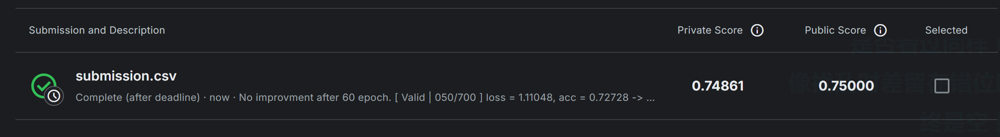

### Strong Baseline

为应对这一挑战，我采用了几项提升措施：

1. 修改卷积神经网络，增加残差连接和Dropout。
2. 训练阶段采用Mixup数据增强策略。
3. 采用4折交叉验证。

重写了大量代码，以下分别展示。

#### 网络设计

增加残差连接网络。

当维度（通道数或空间尺寸）变化时，残差分支需做“投影”以对齐形状。最常用方式是 1×1 卷积投影（带合适的 stride）+ BN。在Report Question Q2中则不存在这个问题，直接相加即可。

```python
class ResidualBlock(nn.Module):
    def __init__(self, in_channels, out_channels, stride=1):
        super().__init__()
        self.conv1 = nn.Conv2d(in_channels, out_channels, 3, stride, 1, bias=False)
        self.bn1   = nn.BatchNorm2d(out_channels)
        self.relu  = nn.ReLU(inplace=True)
        self.conv2 = nn.Conv2d(out_channels, out_channels, 3, 1, 1, bias=False)
        self.bn2   = nn.BatchNorm2d(out_channels)

        # 投影分支：当stride!=1或通道数变化时对齐维度
        self.downsample = None
        if stride != 1 or in_channels != out_channels:
            self.downsample = nn.Sequential(
                nn.Conv2d(in_channels, out_channels, 1, stride, bias=False),
                nn.BatchNorm2d(out_channels),
            )

    def forward(self, x):
        identity = x
        out = self.relu(self.bn1(self.conv1(x)))
        out = self.bn2(self.conv2(out))
        if self.downsample is not None:
            identity = self.downsample(identity)
        out = self.relu(out + identity)
        return out
```

考虑到刚才严重的过拟合现象，我在连接层增加了Dropout。

```python
class Classifier(nn.Module):
    def __init__(self, num_classes=11):
        super().__init__()
        self.stem = nn.Sequential(
            nn.Conv2d(3, 64, 3, 1, 1, bias=False),
            nn.BatchNorm2d(64),
            nn.ReLU(inplace=True),
        )
        # 128x128
        self.layer1 = nn.Sequential(
            ResidualBlock(64, 64, stride=1),
            ResidualBlock(64, 64, stride=1),
        )  # -> 128x128
        self.layer2 = nn.Sequential(
            ResidualBlock(64, 128, stride=2),   # -> 64x64
            ResidualBlock(128, 128, stride=1),
        )
        self.layer3 = nn.Sequential(
            ResidualBlock(128, 256, stride=2),  # -> 32x32
            ResidualBlock(256, 256, stride=1),
        )
        self.head = nn.Sequential(
            nn.AdaptiveMaxPool2d((4, 4)),       # -> 4x4
            nn.Flatten(),
            nn.Linear(256*4*4, 1024),
            nn.ReLU(inplace=True),
            nn.Dropout(0.2),
            nn.Linear(1024, 512),
            nn.ReLU(inplace=True),
            nn.Linear(512, num_classes),
        )

    def forward(self, x):
        x = self.stem(x)
        x = self.layer1(x)
        x = self.layer2(x)
        x = self.layer3(x)
        x = self.head(x)
        return x
```

#### Mixup数据增强

训练阶段数据增强来个[Mixup](https://zhuanlan.zhihu.com/p/345224408)，验证和测试不需要：

这是我手写的Mixup，但是在训练过程中一直提升不上去，代码可能有问题……

```python
from typing import Literal
from pathlib import Path
def mixup_data(ima, imb, lam=0.5):
    '''Returns mixed inputs, pairs of targets, and lambda'''
    mixed_x = lam * ima + (1 - lam) * imb
    return mixed_x

class FoodDataset(Dataset):
    def __init__(self,tfm, files: list[Path], split: Literal["train","valid","test"]):
        super(FoodDataset).__init__()
        if files != None:
            self.files = files
        print("One sample:",self.files[0])
        self.transform = tfm
        self.split = split
  
    def __len__(self):
        return len(self.files)
  
    def __getitem__(self, idx: int):
        f_a = self.files[idx]
        if self.split == "valid":
            im = Image.open(f_a)
            label = int(f_a.name.split("_")[0])
            return self.transform(im), label
        elif self.split == "train":
            # Mixup is applied in the training phase, but not in validation and testing.
            im_a = self.transform(Image.open(f_a))
            f_b = random.choice(self.files)
            im_b = self.transform(Image.open(f_b))
            mix_img = mixup_data(im_a, im_b)
            y_a = int(f_a.name.split("_")[0])
            y_b = int(f_b.name.split("_")[0])
            return mix_img, y_a, y_b
        else:
            im = Image.open(f_a)
            return self.transform(im)
```

对应地修改训练过程：

```python
# For the classification task, we use cross-entropy as the measurement of performance.
criterion = nn.CrossEntropyLoss(label_smoothing=0.05)
class MixupLoss(nn.Module):
    def __init__(self, criterion: nn.Module, lam=0.5):
        super().__init__()
        self.ce = criterion
        self.lam = lam

    def forward(self, preds, y_a, y_b):
        loss_a = self.ce(preds, y_a)
        loss_b = self.ce(preds, y_b)
        return self.lam * loss_a + (1 - self.lam) * loss_b
mixup_criterion = MixupLoss(criterion)

# Initialize optimizer, you may fine-tune some hyperparameters such as learning rate on your own.
optimizer = torch.optim.Adam(model.parameters(), lr=0.0003, weight_decay=1e-5) 

# Initialize trackers, these are not parameters and should not be changed
stale = 0
best_acc = 0

for epoch in range(n_epochs):

    # ---------- Training ----------
    # Make sure the model is in train mode before training.
    model.train()

    # These are used to record information in training.
    train_loss = []
    train_accs = []

    for batch in tqdm(train_loader):

        # A batch consists of image data and corresponding labels.
        mix_imgs, y_a, y_b = batch

        # Forward the data. (Make sure data and model are on the same device.)
        logits = model(mix_imgs.to(device))

        # Calculate the cross-entropy loss.
        # We don't need to apply softmax before computing cross-entropy as it is done automatically.
        loss = mixup_criterion(logits, y_a.to(device), y_b.to(device))

        # Gradients stored in the parameters in the previous step should be cleared out first.
        optimizer.zero_grad()

        # Compute the gradients for parameters.
        loss.backward()

        # Clip the gradient norms for stable training.
        grad_norm = nn.utils.clip_grad_norm_(model.parameters(), max_norm=10)

        # Update the parameters with computed gradients.
        optimizer.step()

        probs = torch.softmax(logits, dim=1)
        pa = probs.gather(1, y_a.to(device).unsqueeze(1)).squeeze()
        pb = probs.gather(1, y_b.to(device).unsqueeze(1)).squeeze()
        # Compute the accuracy for current batch.
        acc = (pa * mixup_criterion.lam + pb * (1 - mixup_criterion.lam)).mean().item()

        # Record the loss and accuracy.
        train_loss.append(loss.item())
        train_accs.append(acc)
        
    train_loss = sum(train_loss) / len(train_loss)
    train_acc = sum(train_accs) / len(train_accs)

    # Print the information.
    print(f"[ Train | {epoch + 1:03d}/{n_epochs:03d} ] loss = {train_loss:.5f}, acc = {train_acc:.5f}")
    # ---------- Validation ----------
    ...
```

查看了[别人的代码](https://github.com/Aaricis/Hung-yi-Lee-ML2022/blob/main/HW3/ml2022hw3-boss.ipynb)后我才发现有mixup相关的工具函数。但需要使用 `torchvision.transform.v2` （这就是我推荐升级最新工具链的原因）。现在代码只需要做如下修改：

```python
from torch.utils.data import default_collate

cutmix = transforms.CutMix(num_classes=11)
mixup = transforms.MixUp(num_classes=11)
cutmix_or_mixup = transforms.RandomChoice([cutmix, mixup])

def collate_fn(batch):
    return cutmix_or_mixup(*default_collate(batch))

...
train_loader = DataLoader(train_set, batch_size=batch_size, shuffle=True, num_workers=0, pin_memory=True, collate_fn=collate_fn)
```

#### N折交叉验证

`from sklearn.model_selection import KFold` 但反正都需要处理文件读取，不如自己写一个。

采用4折交叉验证，取平均值集成结果。

首先需要重新分配训练集和验证集：

```python
# N-fold cross validation
def split_dataset(files, valid_fold, n_splits=4):
    assert valid_fold < n_splits, "Fold index must be less than number of splits."
    random.shuffle(files)
    fold_size = len(files) // n_splits
    valid_files = files[valid_fold * fold_size:(valid_fold + 1) * fold_size]
    train_files = [f for f in files if f not in valid_files]
    return train_files, valid_files

data_files = (list(Path(_dataset_dir).joinpath("training").glob("*.jpg"))
              + list(Path(_dataset_dir).joinpath("validation").glob("*.jpg")))
valid_fold = 0  # You can change this to 0,1,2,3 for 4-fold cross validation
n_splits = 4
train_files, valid_files = split_dataset(data_files, valid_fold, n_splits)
train_set = FoodDataset(train_files, train_tfm)
train_loader = DataLoader(train_set, batch_size=batch_size, shuffle=True, num_workers=0, pin_memory=True, collate_fn=collate_fn)
valid_set = FoodDataset(valid_files, test_tfm)
valid_loader = DataLoader(valid_set, batch_size=batch_size, shuffle=True, num_workers=0, pin_memory=True)


_exp_name = f"mixup_{valid_fold}"

```

结果集成：

```python
if all(Path(f"mixup_{i}_final_preds.npy").exists() for i in range(n_splits)):
    final_preds_list = [np.load(f"mixup_{i}_final_preds.npy") for i in range(n_splits)]
    ensemble_final_preds = np.mean(final_preds_list, axis=0)  # 对4个fold的预测结果取平均
    prediction = np.argmax(ensemble_final_preds, axis=1)
    #create test csv
    def pad4(i):
        return "0"*(4-len(str(i)))+str(i)
    df = pd.DataFrame()
    df["Id"] = [pad4(i) for i in range(1,len(test_set)+1)]
    df["Category"] = prediction
    df.to_csv("submission.csv",index = False)
```

#### 小结

即使我调大了`batch_size`，但这次的训练速度还是慢了很多。一方面我认为可以一次性将所有图片打开放进内存里，而不是每次 `__getitem__()` 再去打开，减少IO开销。另一方面，Dropout在避免对训练数据的快速拟合的同时，训练曲线的波动性变大了，降低了整体的拟合速度。

以下是在数据集采样时减少IO开销的修改，效果显著，建议一开始就这样改动：

```python
from pathlib import Path
from typing import Literal
class FoodDataset(Dataset):
    def __init__(self,files: list[Path], tfm=test_tfm, split: Literal["train", "val", "test"]="train"):
        super(FoodDataset).__init__()
        self.files = files
        print(f"One sample: ",self.files[0])
        self.transform = tfm
        self.split = split
        self.data = dict()
        for f in self.files:
            self.data[str(f)] = self.transform(Image.open(f))
  
    def __len__(self):
        return len(self.files)
  
    def __getitem__(self,idx: int):
        fname = self.files[idx]
        if self.split in ["train", "val"]:
            label = int(fname.name.split("_")[0])
            return self.data[str(fname)],label
        else:
            return self.data[str(fname)]

```

### Boss Baseline

在原有代码

```python
test_files = sorted(list(Path(_dataset_dir).joinpath("test").glob("*.jpg")))
test_set = FoodDataset(test_files, tfm=test_tfm, split="test")
test_loader = DataLoader(test_set, batch_size=batch_size, shuffle=False, num_workers=0, pin_memory=True)

# model_best = ResNet50().to(device)
model_best = Classifier().to(device)
model_best.load_state_dict(torch.load(f"{_exp_name}_best.ckpt", map_location=device))
model_best.eval()

prediction = []
with torch.no_grad():
    for data in test_loader:
        logits: torch.Tensor = model_best(data.to(device))      # (B, 11)
        preds = logits.argmax(dim=1).cpu().numpy()              # (B,)
        prediction.extend(preds.tolist())

print("num test images:", len(test_set))
print("num predictions:", len(prediction))
assert len(prediction) == len(test_set)

def pad4(i: int) -> str:
    return "0"*(4-len(str(i)))+str(i)

df = pd.DataFrame()
df["Id"] = [pad4(i) for i in range(1, len(test_set)+1)]
df["Category"] = prediction
df.to_csv(f"{_exp_name}_submission.csv", index=False)
print(f"saved {_exp_name}_submission.csv")
```

的基础上增加了TTA的手动实践：

```python
test_loaders = []
test_loaders.append(test_loader)
for _ in range(5):
    test_set_i = FoodDataset(test_files, tfm=train_tfm, split="test")
    test_loaders.append(DataLoader(test_set_i, batch_size=batch_size, shuffle=False, num_workers=0, pin_memory=True))

# model_best = Classifier().to(device)
model_best = ResNet50().to(device)
model_best.load_state_dict(torch.load(f"{_exp_name}_best.ckpt"))
model_best.eval()
prediction = []
with torch.no_grad():
    for data in test_loader:
        test_pred = model_best(data.to(device))
        test_label = np.argmax(test_pred.cpu().data.numpy(), axis=1)
        prediction += test_label.squeeze().tolist()

preds = [list() for _ in range(6)]
for i, test_loader in enumerate(test_loaders):
    model_best.eval()
    with torch.no_grad():
        for j, data in enumerate(test_loader):
            test_pred = model_best(data.to(device))
            preds[i].extend(test_pred.cpu())
preds[-1] = prediction
preds_np = np.stack(preds, axis=0)  # shape: (6, 3347, 11)
# 对6个预测结果加权平均
weights = [0.1, 0.1, 0.1, 0.1, 0.1, 0.5]  # 可以根据需要调整权重
final_preds = np.tensordot(weights, preds_np, axes=([0], [0]))  # shape: (3347, 11)
prediction = np.argmax(final_preds, axis=1)     # shape: (3347,)
np.save(f"{_exp_name}_final_preds.npy", final_preds)

```

以及集成其他经过 `train_tfm` 处理的图片的预测结果：

```python
if all(Path(f"mixup_{i}_final_preds.npy").exists() for i in range(n_splits)):
    final_preds_list = [np.load(f"mixup_{i}_final_preds.npy") for i in range(n_splits)]
    ensemble_final_preds = np.mean(final_preds_list, axis=0)  # 对4个fold的预测结果取平均 shape: (3347, 11)
    prediction = np.argmax(ensemble_final_preds, axis=1)        # shape: (3347,)
    #create test csv
    def pad4(i):
        return "0"*(4-len(str(i)))+str(i)
    df = pd.DataFrame()
    df["Id"] = [pad4(i) for i in range(1,len(test_set)+1)]
    df["Category"] = prediction
    df.to_csv("submission.csv",index = False)
```

Image Normalization:

```python
# Normally, We don't need augmentations in testing and validation.
# All we need here is to resize the PIL image and transform it into Tensor.
test_tfm = transforms.Compose([
    transforms.Resize((128, 128)),
    transforms.ToImage(), 
    transforms.ToDtype(torch.float32, scale=True),
    # Image Normalization
    transforms.Normalize(mean=[0.485, 0.456, 0.406], std=[0.229, 0.224, 0.225])
])

# However, it is also possible to use augmentation in the testing phase.
# You may use train_tfm to produce a variety of images and then test using ensemble methods
train_tfm = transforms.Compose([
    transforms.RandomResizedCrop(128, antialias=True),
    transforms.RandomHorizontalFlip(0.5),
    transforms.RandomChoice([
        transforms.RandomOrder([
            transforms.ColorJitter(
                brightness=0.2,
                contrast=0.2,
                saturation=0.2,
                hue=0.1
            ),
            transforms.RandomChoice([
                transforms.RandomRotation(10),
                transforms.RandomAffine(degrees=0, translate=(0.1, 0.1)),
            ]),
            transforms.RandomHorizontalFlip(p=0.5),
            transforms.RandomChoice([
                transforms.GaussianBlur(kernel_size=3, sigma=(0.1, 2.0)),
                transforms.RandomAdjustSharpness(sharpness_factor=2),
            ]),        
        ]),
        transforms.TrivialAugmentWide(),
        transforms.Identity()
    ]),
    transforms.ToImage(), 
    transforms.ToDtype(torch.float32, scale=True),
    transforms.Normalize(mean=[0.485, 0.456, 0.406], std=[0.229, 0.224, 0.225])
])
```

前面没有用Mixup出现过拟合；加了Mixup之后，不知道是什么原因，到0.6就训练不上去，而且耗费了算力和大量时间调试参数，依然没有解决。


### 总结

在Boss Baseline的训练过程中的loss 和 acc一直有一个现象，就是初期Train acc很低的时候Valid acc已经远高于Train acc。这与过拟合的现象相反，是欠拟合吗？

```log
[ Train | 063/250 ] loss = 1.55735, acc = 0.34901
100%
 52/52 [00:01<00:00, 41.47it/s]
[ Valid | 063/250 ] loss = 1.09248, acc = 0.67037
[ Valid | 063/250 ] loss = 1.09248, acc = 0.67037 -> best
Best model found at epoch 62, saving model
100%
 156/156 [00:12<00:00, 12.85it/s]
[ Train | 064/250 ] loss = 1.56512, acc = 0.34489
100%
 52/52 [00:01<00:00, 41.97it/s]
[ Valid | 064/250 ] loss = 1.06584, acc = 0.67027
[ Valid | 064/250 ] loss = 1.06584, acc = 0.67027
100%
 156/156 [00:12<00:00, 12.87it/s]
 [ Train | 065/250 ] loss = 1.54000, acc = 0.35603
100%
 52/52 [00:01<00:00, 41.98it/s]
[ Valid | 065/250 ] loss = 1.07074, acc = 0.67169
[ Valid | 065/250 ] loss = 1.07074, acc = 0.67169 -> best
Best model found at epoch 64, saving model
```

随后很长一段时间valid acc不再提升，而是一直在低位震荡，等到Train acc提起来之后才能提升。使用resnet50的预训练权重，acc确实高，Strong Baseline，究竟是哪里出问题了呢？暂时搁置，等我用学校实验室的4090试试吧……本次HW到目前为止是失败了，即使我跟着别人的实践代码也做不出他声称的结果，非常奇怪😭

### Q1: Augmentation Implementation

```python
train_tfm = transforms.Compose([
    # Resize the image into a fixed shape (height = width = 128)
    transforms.Resize((128, 128)),
    # You need to add some transforms here.
    transforms.RandomHorizontalFlip(0.5),
    transforms.TrivialAugmentWide(),
    transforms.ToImage(), 
    transforms.ToDtype(torch.float32, scale=True),
])

from PIL import Image
test_files = list(Path(_dataset_dir).joinpath("test").glob("*.jpg"))

img = Image.open(random.choice(test_files))
display(img)
for _ in range(5):
    img_tfm = train_tfm(img)
    img_tfm_pil = transforms.ToPILImage()(img_tfm)
    display(img_tfm_pil)
```


将变换成以下五张图片：


这个颜色……看不出是鸡块了……


> 我的Notebook: [HW03.ipynb](https://www.kaggle.com/code/tankimzeg/ml2022hw3/edit/)

### 参考资料

- [李宏毅2022机器学习HW3解析](https://zhuanlan.zhihu.com/p/488970185)
- [李宏毅机器学习2022-HW3](https://blog.csdn.net/sama_AA/article/details/124614763)
- [李宏毅-ML2022-HW3-Image Classification](https://aaricis.github.io/posts/Homework-3-Image-Classification/)
- [李宏毅2023机器学习作业HW03解析和代码分享](https://blog.csdn.net/weixin_42426841/article/details/130139557)
