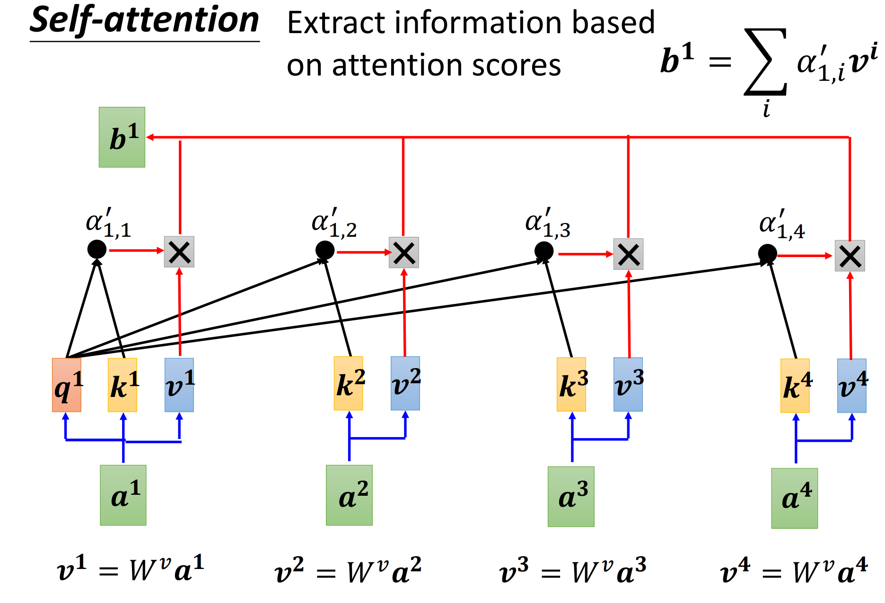
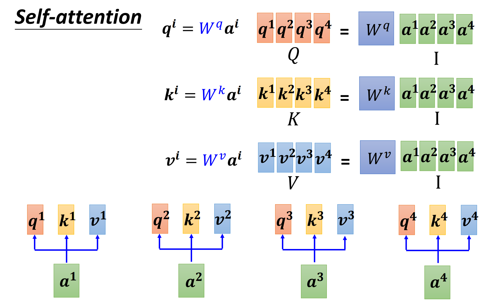
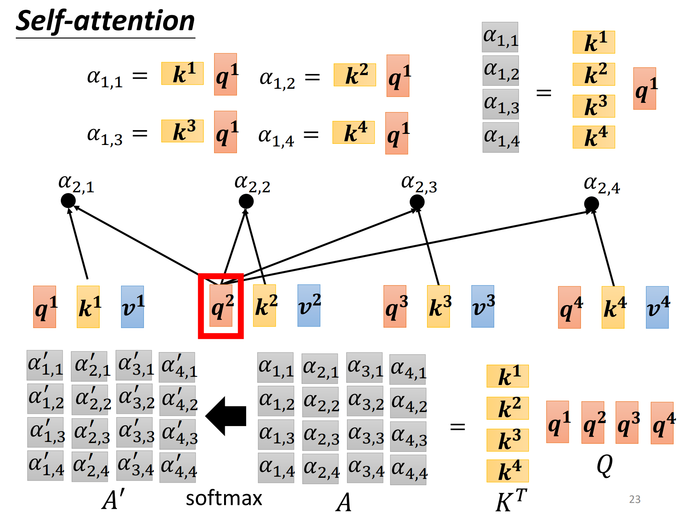
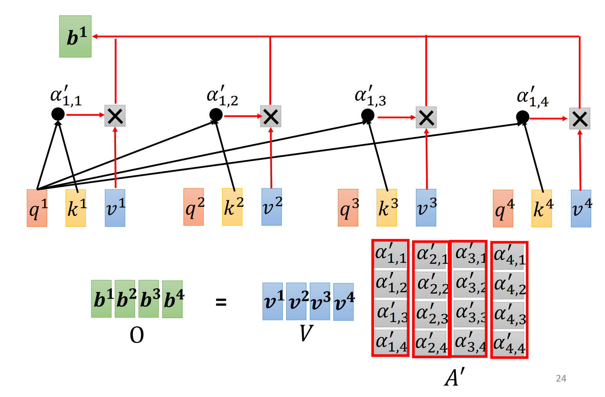
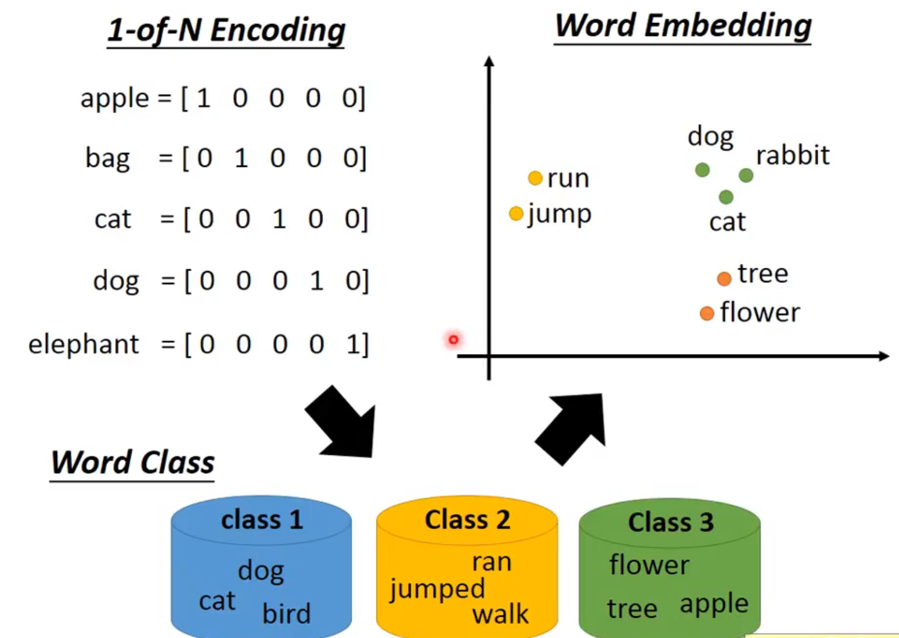
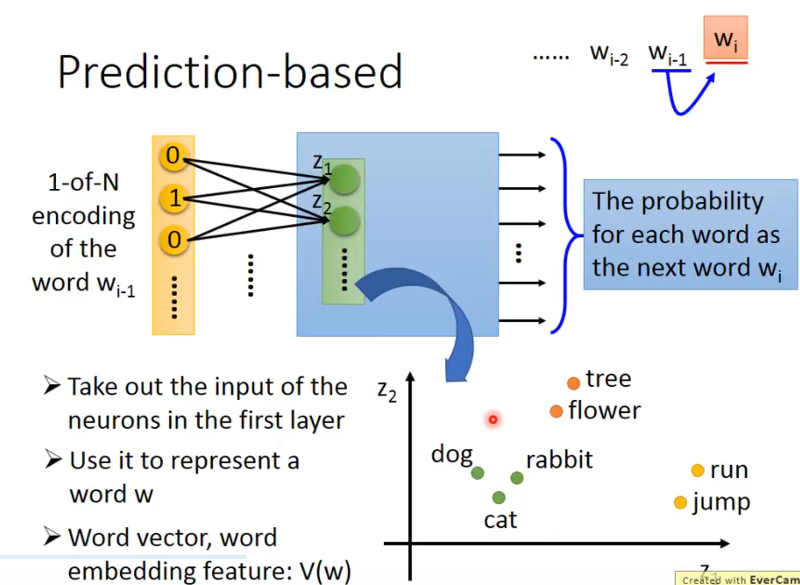
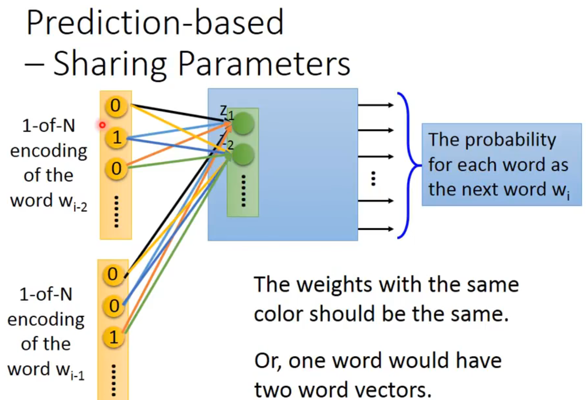
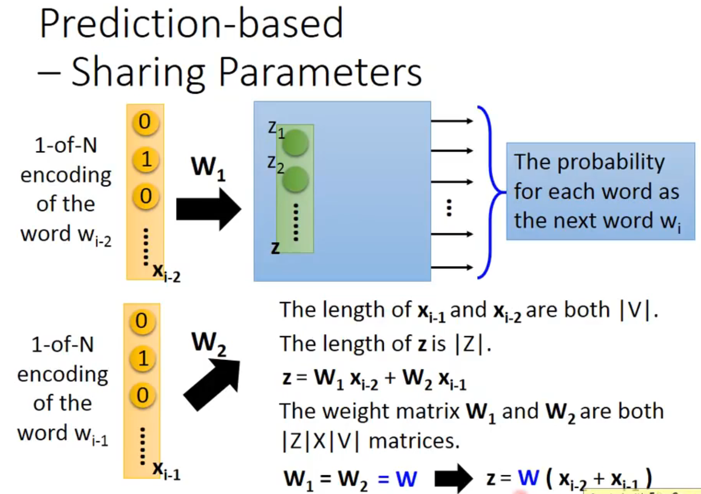
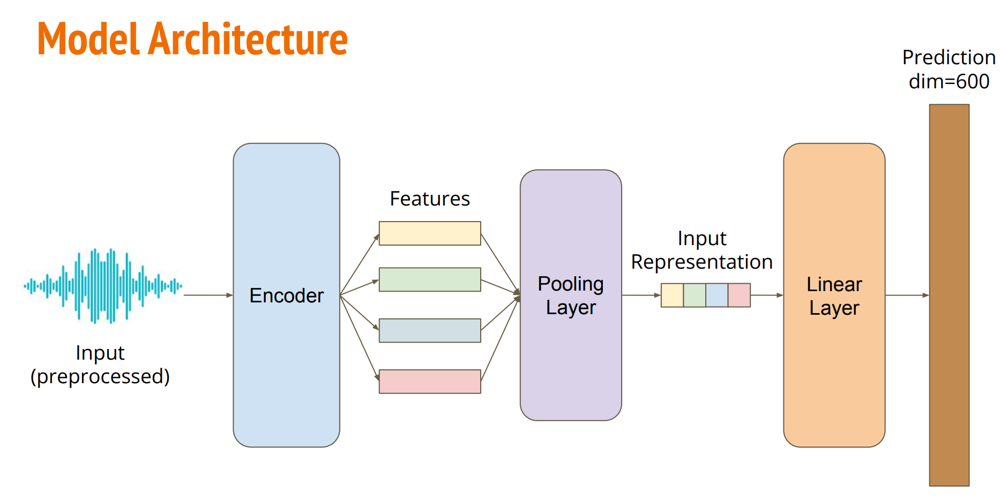

## Self Attention

[Self-attention](https://speech.ee.ntu.edu.tw/~hylee/ml/ml2021-course-data/self_v7.pdf)

向量序列作为输入，比如一个句子。我们需要将单词转换为向量。之前我们已经见过一种转换的方法是独热编码，但是这种方式假设类别之间无关，无法表示词汇之间的相似度。因此诞生了Word Embedding。

HW02中我们处理的声音信号就是这样的向量序列。

一个图也是一个向量序列。

输出是：

- 每个向量有一个标签（Sequence Labeling）
- 整个序列输出一个标签
- 模型决定标签的数量（翻译、语音识别seq2seq）



Self-attention天生便于并行计算





对于学习过[实现注意力机制](../从零构建大语言模型/实现注意力机制.md)的我来说算是重温，不难理解~



这里的图片演示非常清晰易懂。

整个架构里面只有$W^{q}$,$W^{k}$,$W^{v}$是需要训练的参数。跟机器学习的很多算法（比如LSTM）相比，attention其实非常简单。有时候过度设计是一种负优化，真正的巧妙都是演化的产物，在深度学习领域是这样，在其他领域也是这样。

### Multi-head

设计多头注意力，一方面是为了并行计算，另一方面是为了捕捉更多的“相关”形式，“相关”也有很多种不同的定义。就像CNN需要设置多个卷积核一样，负责捕捉不同的模式。

### 位置编码

self-attention算法本身不包含位置信息。在自然语言处理中，这些位置编码是直接加到词向量里面去的，再放进self-attention层面。

位置编码也有多种实践。

### CNN VS Self-attention

CNN只关注人为划定的感知域，而Self-attention可以自动学习想要关注的区域。也就是说Self-attention是复杂化的CNN；CNN是Self-attention的子集。

### RNN VS Self-attention

RNN有长距离记忆丢失问题、无法并行计算问题

## 无监督学习：Word Embedding

独热编码无法辨别相似语义的词汇。聚类又无法体现出差异，所以将每个词汇都投影到高维空间上面。



word2vec是一个无监督学习的问题。对于每一个输入，我们没有准确的输出，而是根据大量的训练资料。

馬英九520宣誓就職。

蔡英文520宣誓就職。

对于机器来说，前后都有相似的文字，就认为他们非常相似。基于这种思想来找出word embedding vector。

### Count Based 词频共现

 如果$w_{i}$和$w_{j}$常常共同出现，那么文章中的频率就比较相近
 Glove Vector

### Prediction Based


机器在第一层就转换为Embedding了，后面的层是在做预测（实际上这个网络层数很浅）所以用第一层作为Word Embedding即可。

为了减少参数，$w_{i-1}$和$w_{i-2}$参数共享。

架构有种种不同的变形。比如预测中间的词汇、预测两边的词汇。

Word Embedding 使得词汇之间具备了语义联系，例如：

$$
V(hotter) - V(hot) \approx V(bigger) - V(big)
$$

$$
V(Rome) - V(Italy)\approx V(Berlin) - V(Germany)
$$
$$
V(king) - V(que en) \approx V(uncle) - V(aunt)
$$

## HW04: Speaker Identification

[HW04: Speaker Identification](https://speech.ee.ntu.edu.tw/~hylee/ml/ml2022-course-data/Machine%20Learning%20HW4.pdf)

### 任务介绍

预测给定语音的发言者的多分类任务。使用Self-attention架构来解决这个问题。

### 数据集

[VoxCeleb2](https://www.robots.ox.ac.uk/~vgg/data/voxceleb/vox2.html)

- Training: 56666段有标签的预处理的音频特征
- Testing: 4000段没标签的预处理的音频特征
- Label: 600个类别，每个类别代表一个发言者

数据预处理的方法与[HW2: Phoneme Classification](Lecture-2.md#HW2%20Phoneme%20Classification)是类似的。

### 模型架构



[Sample Code](https://colab.research.google.com/drive/1gC2Gojv9ov9MUQ1a1WDpVBD6FOcLZsog?usp=sharing)中下载数据集的URL有404错误相应，我做了如下更正：

```shell
!gdown '1bmVAabVkUcZ-zwVrvfaZ7zJhWjmanDy8'
!tar zxf Dataset.tar.gz
```

| 水平     | 准确率     | 方法                                                                                                                                                                             |
| ------ | ------- | ------------------------------------------------------------------------------------------------------------------------------------------------------------------------------ |
| Simple | 0.60824 | Run sample code & <br>know how to use Transformer.                                                                                                                             |
| Medium | 0.70375 | Modify the parameters of the transformer<br> modules in the sample code                                                                                                        |
| Strong | 0.77750 | Construct [Conformer](https://arxiv.org/abs/2005.08100), <br>which is a variety of Transformer.                                                                                |
| Boss   | 0.86500 | Implement [Self-Attention Pooling](https://arxiv.org/pdf/2008.01077v1.pdf) & <br>[Additive Margin Softmax](https://arxiv.org/abs/1801.05599) to further boost the performance. |

### Medium Baseline

我在代码里面启用了 `nn.TransformerEncoder`，并稍微增加了一点参数，
明明

```log
Train:   1% 17/2000 [00:00<00:23, 84.07 step/s, accuracy=0.81, loss=0.60, step=150017]Step 150000, best model saved. (accuracy=0.7873)
Train: 100% 2000/2000 [00:24<00:00, 82.98 step/s, accuracy=0.59, loss=1.21, step=152000]
Valid: 100% 5664/5667 [00:01<00:00, 3794.83 uttr/s, accuracy=0.78, loss=1.02]
Train: 100% 2000/2000 [00:24<00:00, 83.04 step/s, accuracy=0.72, loss=0.97, step=154000]
Valid: 100% 5664/5667 [00:01<00:00, 3801.16 uttr/s, accuracy=0.78, loss=1.02]
Train: 100% 2000/2000 [00:24<00:00, 83.23 step/s, accuracy=0.81, loss=0.50, step=156000]
Valid: 100% 5664/5667 [00:01<00:00, 3767.70 uttr/s, accuracy=0.78, loss=1.02]
Train: 100% 2000/2000 [00:24<00:00, 81.41 step/s, accuracy=0.78, loss=0.64, step=158000]
Valid: 100% 5664/5667 [00:01<00:00, 3795.43 uttr/s, accuracy=0.78, loss=1.03]
Train: 100% 2000/2000 [00:24<00:00, 82.94 step/s, accuracy=0.69, loss=0.73, step=160000]
Valid: 100% 5664/5667 [00:01<00:00, 3751.82 uttr/s, accuracy=0.79, loss=1.02]
Train:   0% 0/2000 [00:00<?, ? step/s]
Step 160000, best model saved. (accuracy=0.7880)
```

结果


没有比Simple Baseline高多少。这就很奇怪啊，一般提交到Kaggle上的结果不会跟Validation的结果差多少，怎么差距这么大啊。我还想着这么轻松连Strong Baseline都能通过了www

然后就给了我一种过拟合的感觉，我就去调整Dropout又训练了几次，还是这样没啥区别。


真的很烦啊，又偷偷去看别人的实践，发现 `nn.TransformerEncoderLayer` 的 `d_model` 和 `nhead` 参数都要大幅提升，然后不需要 `nn.TransformerEncoder` （我试了一下训练不起来）。这么看来肯定就不是过拟合，那怎么刚才Valid的准确率那么高呢？

经过修正后：

```log
Train:   0% 7/2000 [00:00<01:35, 20.91 step/s, accuracy=0.91, loss=0.29, step=7e+4]Step 70000, best model saved. (accuracy=0.8254)
Train: 100% 2000/2000 [01:02<00:00, 32.24 step/s, accuracy=0.97, loss=0.25, step=72000]
Valid: 100% 5664/5667 [00:02<00:00, 2337.11 uttr/s, accuracy=0.83, loss=1.04]
Train: 100% 2000/2000 [01:01<00:00, 32.47 step/s, accuracy=0.97, loss=0.11, step=74000]
Valid: 100% 5664/5667 [00:02<00:00, 2344.39 uttr/s, accuracy=0.82, loss=1.02]
Train: 100% 2000/2000 [01:01<00:00, 32.43 step/s, accuracy=0.94, loss=0.17, step=76000]
Valid: 100% 5664/5667 [00:02<00:00, 2314.76 uttr/s, accuracy=0.82, loss=1.07]
Train: 100% 2000/2000 [01:01<00:00, 32.31 step/s, accuracy=0.97, loss=0.15, step=78000]
Valid: 100% 5664/5667 [00:02<00:00, 2314.21 uttr/s, accuracy=0.84, loss=0.99]
Train: 100% 2000/2000 [01:02<00:00, 32.03 step/s, accuracy=1.00, loss=0.10, step=8e+4]
Valid: 100% 5664/5667 [00:02<00:00, 2310.69 uttr/s, accuracy=0.83, loss=1.02]
Train:   0% 7/2000 [00:00<01:32, 21.51 step/s, accuracy=0.91, loss=0.19, step=8e+4]Step 80000, best model saved. (accuracy=0.8365)
Train: 100% 2000/2000 [01:02<00:00, 32.21 step/s, accuracy=0.97, loss=0.09, step=82000]
Valid: 100% 5664/5667 [00:02<00:00, 2346.74 uttr/s, accuracy=0.84, loss=0.99]
Train: 100% 2000/2000 [01:01<00:00, 32.41 step/s, accuracy=1.00, loss=0.02, step=84000]
Valid: 100% 5664/5667 [00:02<00:00, 2331.16 uttr/s, accuracy=0.84, loss=1.01]
Train: 100% 2000/2000 [01:01<00:00, 32.39 step/s, accuracy=0.94, loss=0.18, step=86000]
Valid: 100% 5664/5667 [00:02<00:00, 2352.69 uttr/s, accuracy=0.83, loss=1.03]
Train: 100% 2000/2000 [01:01<00:00, 32.28 step/s, accuracy=0.97, loss=0.06, step=88000]
Valid: 100% 5664/5667 [00:02<00:00, 2351.84 uttr/s, accuracy=0.84, loss=0.96]
Train: 100% 2000/2000 [01:01<00:00, 32.56 step/s, accuracy=0.97, loss=0.10, step=9e+4]
Valid: 100% 5664/5667 [00:02<00:00, 2201.88 uttr/s, accuracy=0.84, loss=1.00]
Train:   0% 7/2000 [00:00<01:53, 17.56 step/s, accuracy=0.94, loss=0.12, step=9e+4]Step 90000, best model saved. (accuracy=0.8441)
Train: 100% 2000/2000 [01:01<00:00, 32.27 step/s, accuracy=0.91, loss=0.32, step=92000]
Valid: 100% 5664/5667 [00:02<00:00, 2175.78 uttr/s, accuracy=0.83, loss=1.04]
Train: 100% 2000/2000 [01:02<00:00, 32.05 step/s, accuracy=0.97, loss=0.08, step=94000]
Valid: 100% 5664/5667 [00:02<00:00, 2025.89 uttr/s, accuracy=0.83, loss=1.00]
Train: 100% 2000/2000 [01:02<00:00, 32.24 step/s, accuracy=0.91, loss=0.19, step=96000]
Valid: 100% 5664/5667 [00:02<00:00, 2144.60 uttr/s, accuracy=0.84, loss=1.00]
Train: 100% 2000/2000 [01:01<00:00, 32.26 step/s, accuracy=0.97, loss=0.12, step=98000]
Valid: 100% 5664/5667 [00:02<00:00, 2268.63 uttr/s, accuracy=0.84, loss=0.98]
Train: 100% 2000/2000 [01:02<00:00, 32.24 step/s, accuracy=0.88, loss=0.36, step=1e+5]
Valid: 100% 5664/5667 [00:02<00:00, 2326.65 uttr/s, accuracy=0.84, loss=0.99]
Train:   0% 0/2000 [00:00<?, ? step/s]
Step 100000, best model saved. (accuracy=0.8441)
```

现在看起来acc的提升速度变快了，而且接近Strong Baseline


```log
Train: 100% 2000/2000 [00:40<00:00, 49.12 step/s, accuracy=0.22, loss=3.92, step=2000]
Valid: 100% 5664/5667 [00:02<00:00, 2481.03 uttr/s, accuracy=0.21, loss=3.85]
Train: 100% 2000/2000 [00:41<00:00, 48.14 step/s, accuracy=0.44, loss=2.35, step=4000]
Valid: 100% 5664/5667 [00:01<00:00, 3133.58 uttr/s, accuracy=0.43, loss=2.58]
Train: 100% 2000/2000 [00:41<00:00, 47.94 step/s, accuracy=0.28, loss=2.76, step=6000]
Valid: 100% 5664/5667 [00:01<00:00, 3059.47 uttr/s, accuracy=0.47, loss=2.39]
Train: 100% 2000/2000 [00:42<00:00, 46.57 step/s, accuracy=0.69, loss=1.45, step=8000]
Valid: 100% 5664/5667 [00:01<00:00, 2898.97 uttr/s, accuracy=0.54, loss=2.12]
Train: 100% 2000/2000 [00:42<00:00, 47.24 step/s, accuracy=0.59, loss=1.48, step=1e+4]
Valid: 100% 5664/5667 [00:01<00:00, 3073.42 uttr/s, accuracy=0.58, loss=1.91]
Train:   0% 9/2000 [00:00<00:45, 43.89 step/s, accuracy=0.72, loss=1.08, step=1e+4]Step 10000, best model saved. (accuracy=0.5821)
Train: 100% 2000/2000 [00:42<00:00, 46.79 step/s, accuracy=0.62, loss=1.36, step=12000]
Valid: 100% 5664/5667 [00:02<00:00, 2766.58 uttr/s, accuracy=0.61, loss=1.73]
Train: 100% 2000/2000 [00:42<00:00, 46.58 step/s, accuracy=0.66, loss=1.05, step=14000]
Valid: 100% 5664/5667 [00:01<00:00, 3079.25 uttr/s, accuracy=0.63, loss=1.65]
Train: 100% 2000/2000 [00:45<00:00, 44.00 step/s, accuracy=0.66, loss=1.51, step=16000]
Valid: 100% 5664/5667 [00:01<00:00, 2916.50 uttr/s, accuracy=0.66, loss=1.50]
Train: 100% 2000/2000 [00:44<00:00, 45.35 step/s, accuracy=0.69, loss=1.57, step=18000]
Valid: 100% 5664/5667 [00:02<00:00, 2477.75 uttr/s, accuracy=0.64, loss=1.63]
Train: 100% 2000/2000 [00:44<00:00, 44.73 step/s, accuracy=0.78, loss=1.27, step=2e+4]
Valid: 100% 5664/5667 [00:01<00:00, 3105.78 uttr/s, accuracy=0.68, loss=1.38]
Train:   0% 9/2000 [00:00<00:47, 41.98 step/s, accuracy=0.78, loss=0.81, step=2e+4]Step 20000, best model saved. (accuracy=0.6833)
Train: 100% 2000/2000 [00:44<00:00, 45.12 step/s, accuracy=0.81, loss=0.67, step=22000]
Valid: 100% 5664/5667 [00:01<00:00, 3066.31 uttr/s, accuracy=0.67, loss=1.47]
Train: 100% 2000/2000 [00:44<00:00, 44.81 step/s, accuracy=0.81, loss=0.76, step=24000]
Valid: 100% 5664/5667 [00:02<00:00, 2634.75 uttr/s, accuracy=0.72, loss=1.25]
Train: 100% 2000/2000 [00:44<00:00, 45.37 step/s, accuracy=0.84, loss=0.75, step=26000]
Valid: 100% 5664/5667 [00:01<00:00, 3078.40 uttr/s, accuracy=0.71, loss=1.27]
Train: 100% 2000/2000 [00:44<00:00, 45.43 step/s, accuracy=0.75, loss=1.00, step=28000]
Valid: 100% 5664/5667 [00:02<00:00, 2621.91 uttr/s, accuracy=0.72, loss=1.26]
Train: 100% 2000/2000 [00:43<00:00, 45.47 step/s, accuracy=0.84, loss=0.89, step=3e+4]
Valid: 100% 5664/5667 [00:01<00:00, 3074.38 uttr/s, accuracy=0.73, loss=1.22]
Train:   0% 9/2000 [00:00<00:46, 43.13 step/s, accuracy=0.81, loss=0.56, step=3e+4]Step 30000, best model saved. (accuracy=0.7263)
Train: 100% 2000/2000 [00:44<00:00, 44.61 step/s, accuracy=0.84, loss=0.57, step=32000]
Valid: 100% 5664/5667 [00:01<00:00, 3087.57 uttr/s, accuracy=0.74, loss=1.17]
Train: 100% 2000/2000 [00:44<00:00, 45.12 step/s, accuracy=0.84, loss=0.70, step=34000]
Valid: 100% 5664/5667 [00:02<00:00, 2332.87 uttr/s, accuracy=0.74, loss=1.18]
Train: 100% 2000/2000 [00:44<00:00, 45.24 step/s, accuracy=0.81, loss=0.80, step=36000]
Valid: 100% 5664/5667 [00:01<00:00, 3089.25 uttr/s, accuracy=0.76, loss=1.09]
Train: 100% 2000/2000 [00:44<00:00, 45.29 step/s, accuracy=0.94, loss=0.56, step=38000]
Valid: 100% 5664/5667 [00:01<00:00, 3130.94 uttr/s, accuracy=0.77, loss=1.04]
Train: 100% 2000/2000 [00:44<00:00, 44.85 step/s, accuracy=0.91, loss=0.39, step=4e+4]
Valid: 100% 5664/5667 [00:02<00:00, 2547.35 uttr/s, accuracy=0.77, loss=1.07]
Train:   0% 8/2000 [00:00<00:52, 37.85 step/s, accuracy=0.88, loss=0.26, step=4e+4]Step 40000, best model saved. (accuracy=0.7735)
Train: 100% 2000/2000 [00:44<00:00, 45.45 step/s, accuracy=0.78, loss=0.90, step=42000]
Valid: 100% 5664/5667 [00:01<00:00, 3077.90 uttr/s, accuracy=0.78, loss=1.03]
Train: 100% 2000/2000 [00:44<00:00, 45.27 step/s, accuracy=0.94, loss=0.41, step=44000]
Valid: 100% 5664/5667 [00:01<00:00, 2933.61 uttr/s, accuracy=0.79, loss=0.98]
Train: 100% 2000/2000 [00:44<00:00, 45.40 step/s, accuracy=0.84, loss=0.59, step=46000]
Valid: 100% 5664/5667 [00:01<00:00, 3054.44 uttr/s, accuracy=0.79, loss=0.99]
Train: 100% 2000/2000 [00:44<00:00, 44.58 step/s, accuracy=0.84, loss=0.42, step=48000]
Valid: 100% 5664/5667 [00:01<00:00, 3082.42 uttr/s, accuracy=0.80, loss=0.94]
Train: 100% 2000/2000 [00:44<00:00, 45.29 step/s, accuracy=0.91, loss=0.79, step=5e+4]
Valid: 100% 5664/5667 [00:02<00:00, 2519.44 uttr/s, accuracy=0.80, loss=0.91]
Train:   0% 9/2000 [00:00<00:46, 42.49 step/s, accuracy=0.91, loss=0.30, step=5e+4]Step 50000, best model saved. (accuracy=0.8047)
Train: 100% 2000/2000 [00:44<00:00, 45.35 step/s, accuracy=0.91, loss=0.60, step=52000]
Valid: 100% 5664/5667 [00:01<00:00, 3131.26 uttr/s, accuracy=0.81, loss=0.93]
Train: 100% 2000/2000 [00:44<00:00, 45.32 step/s, accuracy=0.97, loss=0.11, step=54000]
Valid: 100% 5664/5667 [00:01<00:00, 3119.73 uttr/s, accuracy=0.82, loss=0.85]
Train: 100% 2000/2000 [00:44<00:00, 45.12 step/s, accuracy=0.91, loss=0.33, step=56000]
Valid: 100% 5664/5667 [00:02<00:00, 2299.67 uttr/s, accuracy=0.82, loss=0.84]
Train: 100% 2000/2000 [00:43<00:00, 45.56 step/s, accuracy=0.84, loss=0.51, step=58000]
Valid: 100% 5664/5667 [00:01<00:00, 3124.91 uttr/s, accuracy=0.82, loss=0.86]
Train: 100% 2000/2000 [00:44<00:00, 45.35 step/s, accuracy=0.97, loss=0.20, step=6e+4]
Valid: 100% 5664/5667 [00:01<00:00, 3104.08 uttr/s, accuracy=0.83, loss=0.81]
Train:   0% 9/2000 [00:00<00:47, 42.35 step/s, accuracy=0.94, loss=0.17, step=6e+4]Step 60000, best model saved. (accuracy=0.8335)
Train: 100% 2000/2000 [00:44<00:00, 45.33 step/s, accuracy=0.84, loss=0.55, step=62000]
Valid: 100% 5664/5667 [00:01<00:00, 3118.99 uttr/s, accuracy=0.84, loss=0.78]
Train: 100% 2000/2000 [00:44<00:00, 44.61 step/s, accuracy=0.94, loss=0.27, step=64000]
Valid: 100% 5664/5667 [00:01<00:00, 3045.98 uttr/s, accuracy=0.85, loss=0.75]
Train: 100% 2000/2000 [00:44<00:00, 45.27 step/s, accuracy=0.81, loss=0.54, step=66000]
Valid: 100% 5664/5667 [00:02<00:00, 2722.84 uttr/s, accuracy=0.84, loss=0.76]
Train: 100% 2000/2000 [00:44<00:00, 45.32 step/s, accuracy=0.97, loss=0.14, step=68000]
Valid: 100% 5664/5667 [00:01<00:00, 3081.48 uttr/s, accuracy=0.84, loss=0.77]
Train: 100% 2000/2000 [00:44<00:00, 44.97 step/s, accuracy=1.00, loss=0.11, step=7e+4]
Valid: 100% 5664/5667 [00:01<00:00, 2992.39 uttr/s, accuracy=0.85, loss=0.75]
Train:   0% 9/2000 [00:00<00:47, 42.29 step/s, accuracy=0.94, loss=0.16, step=7e+4]Step 70000, best model saved. (accuracy=0.8485)
Train: 100% 2000/2000 [00:44<00:00, 44.73 step/s, accuracy=0.94, loss=0.28, step=72000]
Valid: 100% 5664/5667 [00:02<00:00, 2201.38 uttr/s, accuracy=0.86, loss=0.69]
Train: 100% 2000/2000 [00:44<00:00, 45.32 step/s, accuracy=1.00, loss=0.06, step=74000]
Valid: 100% 5664/5667 [00:01<00:00, 3047.39 uttr/s, accuracy=0.87, loss=0.67]
Train: 100% 2000/2000 [00:44<00:00, 45.23 step/s, accuracy=0.97, loss=0.14, step=76000]
Valid: 100% 5664/5667 [00:01<00:00, 3047.52 uttr/s, accuracy=0.86, loss=0.72]
Train: 100% 2000/2000 [00:44<00:00, 45.43 step/s, accuracy=1.00, loss=0.07, step=78000]
Valid: 100% 5664/5667 [00:02<00:00, 2631.81 uttr/s, accuracy=0.86, loss=0.66]
Train: 100% 2000/2000 [00:45<00:00, 44.33 step/s, accuracy=0.97, loss=0.18, step=8e+4]
Valid: 100% 5664/5667 [00:01<00:00, 3025.14 uttr/s, accuracy=0.87, loss=0.65]
Train:   0% 9/2000 [00:00<00:47, 41.59 step/s, accuracy=0.94, loss=0.29, step=8e+4]Step 80000, best model saved. (accuracy=0.8720)
Train: 100% 2000/2000 [00:44<00:00, 45.01 step/s, accuracy=1.00, loss=0.09, step=82000]
Valid: 100% 5664/5667 [00:01<00:00, 3058.89 uttr/s, accuracy=0.87, loss=0.65]
Train: 100% 2000/2000 [00:43<00:00, 45.56 step/s, accuracy=0.97, loss=0.26, step=84000]
Valid: 100% 5664/5667 [00:01<00:00, 3103.85 uttr/s, accuracy=0.88, loss=0.64]
Train: 100% 2000/2000 [00:44<00:00, 45.26 step/s, accuracy=0.97, loss=0.18, step=86000]
Valid: 100% 5664/5667 [00:01<00:00, 3005.81 uttr/s, accuracy=0.87, loss=0.66]
Train: 100% 2000/2000 [00:44<00:00, 44.62 step/s, accuracy=0.97, loss=0.21, step=88000]
Valid: 100% 5664/5667 [00:02<00:00, 2547.59 uttr/s, accuracy=0.87, loss=0.69]
Train: 100% 2000/2000 [00:44<00:00, 45.37 step/s, accuracy=0.97, loss=0.10, step=9e+4]
Valid: 100% 5664/5667 [00:01<00:00, 3017.45 uttr/s, accuracy=0.88, loss=0.63]
Train:   0% 9/2000 [00:00<00:46, 42.98 step/s, accuracy=0.88, loss=0.22, step=9e+4]Step 90000, best model saved. (accuracy=0.8773)
Train: 100% 2000/2000 [00:44<00:00, 45.29 step/s, accuracy=1.00, loss=0.08, step=92000]
Valid: 100% 5664/5667 [00:01<00:00, 3105.50 uttr/s, accuracy=0.88, loss=0.63]
Train: 100% 2000/2000 [00:44<00:00, 44.80 step/s, accuracy=1.00, loss=0.02, step=94000]
Valid: 100% 5664/5667 [00:02<00:00, 2219.32 uttr/s, accuracy=0.87, loss=0.65]
Train: 100% 2000/2000 [00:44<00:00, 45.38 step/s, accuracy=0.97, loss=0.10, step=96000]
Valid: 100% 5664/5667 [00:01<00:00, 3072.63 uttr/s, accuracy=0.88, loss=0.61]
Train: 100% 2000/2000 [00:44<00:00, 45.30 step/s, accuracy=1.00, loss=0.08, step=98000]
Valid: 100% 5664/5667 [00:01<00:00, 2899.62 uttr/s, accuracy=0.88, loss=0.61]
Train: 100% 2000/2000 [00:44<00:00, 45.43 step/s, accuracy=0.97, loss=0.07, step=1e+5]
Valid: 100% 5664/5667 [00:02<00:00, 2488.83 uttr/s, accuracy=0.88, loss=0.61]
Train:   0% 0/2000 [00:00<?, ? step/s]
Step 100000, best model saved. (accuracy=0.8849)
```

### Strong Baseline

提示我们实践[Conformer](https://arxiv.org/pdf/2005.08100)。我了解了一下，这是讲CNN与Self-attention相结合的架构，在声音处理上非常著名。网上有很多文章介绍：[[细读经典]Conformer: 用卷积增强的transformer来做ASR](https://zhuanlan.zhihu.com/p/415743334)。先进行Self-attention再进行CNN，与我的直觉相反~~不应该是先CNN减少参数吗？~~。我还阅读了一下Conformer实现代码。可通过

```shell
uv add conformer
```

来安装conformer库。同时 `from torchaudio.models import Conformer` 也提供了Conformer模块，但API不同相同。

```python
# Conformer 期望输入格式 (batch_size, seq_len, d_model)，无需 permute
lengths = torch.full((out.shape[0],),out.shape[1]).to(out.device)
out, _ = self.encoder(out, lengths)
```

>[!NOTE]
>
> - Conformer的输入形状为(batch_size, seq_len, d_model)，输出形状相同；
> - `Conformer.forward()`需要额外输入`lengths`,是一个张量，表示每个输入序列的实际长度，以便模型在处理时可以忽略填充部分（padding）；

不是很懂什么意思诶~

反正是成功训练起来了，
训练速度非常慢，但Step 10000第一次保存check point就达到了0.6799的惊人准确率。

```log
Train:   0% 2/2000 [00:00<03:22,  9.85 step/s, accuracy=0.97, loss=0.18, step=6e+4]Step 60000, best model saved. (accuracy=0.9059)
Train: 100% 2000/2000 [02:55<00:00, 11.40 step/s, accuracy=0.97, loss=0.11, step=62000]
Valid: 100% 5664/5667 [00:05<00:00, 1081.67 uttr/s, accuracy=0.90, loss=0.46]
Train: 100% 2000/2000 [02:55<00:00, 11.38 step/s, accuracy=0.97, loss=0.11, step=64000]
Valid: 100% 5664/5667 [00:05<00:00, 1093.27 uttr/s, accuracy=0.90, loss=0.48]
Train: 100% 2000/2000 [02:55<00:00, 11.40 step/s, accuracy=1.00, loss=0.02, step=66000]
Valid: 100% 5664/5667 [00:05<00:00, 1060.33 uttr/s, accuracy=0.91, loss=0.46]
Train: 100% 2000/2000 [02:55<00:00, 11.41 step/s, accuracy=1.00, loss=0.02, step=68000]
Valid: 100% 5664/5667 [00:05<00:00, 1062.96 uttr/s, accuracy=0.91, loss=0.42]
Train: 100% 2000/2000 [02:55<00:00, 11.40 step/s, accuracy=1.00, loss=0.01, step=7e+4]
Valid: 100% 5664/5667 [00:05<00:00, 1093.19 uttr/s, accuracy=0.91, loss=0.45]
Train:   0% 2/2000 [00:00<03:00, 11.04 step/s, accuracy=1.00, loss=0.02, step=7e+4]Step 70000, best model saved. (accuracy=0.9114)
Train: 100% 2000/2000 [02:55<00:00, 11.38 step/s, accuracy=1.00, loss=0.03, step=72000]
Valid: 100% 5664/5667 [00:05<00:00, 1078.82 uttr/s, accuracy=0.92, loss=0.39]
Train: 100% 2000/2000 [02:55<00:00, 11.41 step/s, accuracy=0.97, loss=0.12, step=74000]
Valid: 100% 5664/5667 [00:05<00:00, 1094.08 uttr/s, accuracy=0.92, loss=0.43]
Train: 100% 2000/2000 [02:55<00:00, 11.42 step/s, accuracy=1.00, loss=0.06, step=76000]
Valid: 100% 5664/5667 [00:05<00:00, 1074.36 uttr/s, accuracy=0.92, loss=0.40]
Train: 100% 2000/2000 [02:55<00:00, 11.41 step/s, accuracy=1.00, loss=0.01, step=78000]
Valid: 100% 5664/5667 [00:05<00:00, 1094.67 uttr/s, accuracy=0.92, loss=0.38]
Train: 100% 2000/2000 [02:55<00:00, 11.39 step/s, accuracy=1.00, loss=0.01, step=8e+4]
Valid: 100% 5664/5667 [00:05<00:00, 1052.86 uttr/s, accuracy=0.92, loss=0.39]
Train:   0% 2/2000 [00:00<02:54, 11.44 step/s, accuracy=1.00, loss=0.01, step=8e+4]Step 80000, best model saved. (accuracy=0.9214)
```

Public已经超过Boss Baseline!感觉再训练一会就能双过Boss Baseline。跑一次这个结果就已经用完了一天的Colab免费额度，我不敢贪，赶紧掐掉训练，运行测试后提交。明天再把这个28MB的check point拿去训练一会，感觉就可以了。可惜我还没下载下来就给我断了，太恶心了。


### Boss Baseline

每天的免费额度大约就是一个半小时，而完整跑完大约2小时。除非几天不用就能用三四个小时，然后check point文件一直下不下来，非常恶心。

攒了几天的免费额度，跑三个小时120000 step终于通过！


模型设计如下：

```python
import torch
import torch.nn as nn
import torch.nn.functional as F
from torchaudio.models import Conformer

class Classifier(nn.Module):
    def __init__(self, d_model=512, n_spks=600, dropout=0.1):
        super().__init__()
        # Project the dimension of features from that of input into d_model.
        self.prenet = nn.Linear(40, d_model)
        # TODO:
        #   Change Transformer to Conformer.
        #   https://arxiv.org/abs/2005.08100
        self.encoder = Conformer(
            input_dim=d_model,  # 输入特征维度
            num_heads=2,  # 注意力头数
            ffn_dim=256,  # Feed-forward 层隐藏维度
            num_layers=3,  # Conformer 层数
            depthwise_conv_kernel_size=31,  # 深度卷积核大小
            dropout=dropout,
        )
        # self.encoder = nn.TransformerEncoder(self.encoder_layer, num_layers=2)

        # Project the the dimension of features from d_model into speaker nums.
        # 预测层（BatchNorm + 线性分类层）
        self.pred_layer = nn.Sequential(
            nn.BatchNorm1d(d_model),
            nn.Linear(d_model, n_spks),
        )

    def forward(self, mels):
        """
        args:
            mels: (batch size, length, 40)
        return:
            out: (batch size, n_spks)
        """
        # out: (batch size, length, d_model)
        out: torch.Tensor = self.prenet(mels)
        # out: (length, batch size, d_model)
        
        # Conformer 期望输入格式 (batch_size, seq_len, d_model)，无需 permute
        lengths = torch.full((out.shape[0],),out.shape[1]).to(out.device)
        out, _ = self.encoder(out, lengths)
        
        # Mean Pooling 取全局信息
        stats = out.mean(dim=1)  # (batch_size, d_model)
        # out: (batch, n_spks)
        out = self.pred_layer(stats)
        return out
```

### 参考资料

[李宏毅2022机器学习HW4解析](https://zhuanlan.zhihu.com/p/494951955)

[李宏毅-ML2022-HW4-Self-attention](https://aaricis.github.io/posts/Homework-4-Self-attention/)

> 我的Notebook: [HW04.ipynb](https://colab.research.google.com/drive/1271aDnVmfYObJoYHPnEcq-Iv8HOUIwzr)
