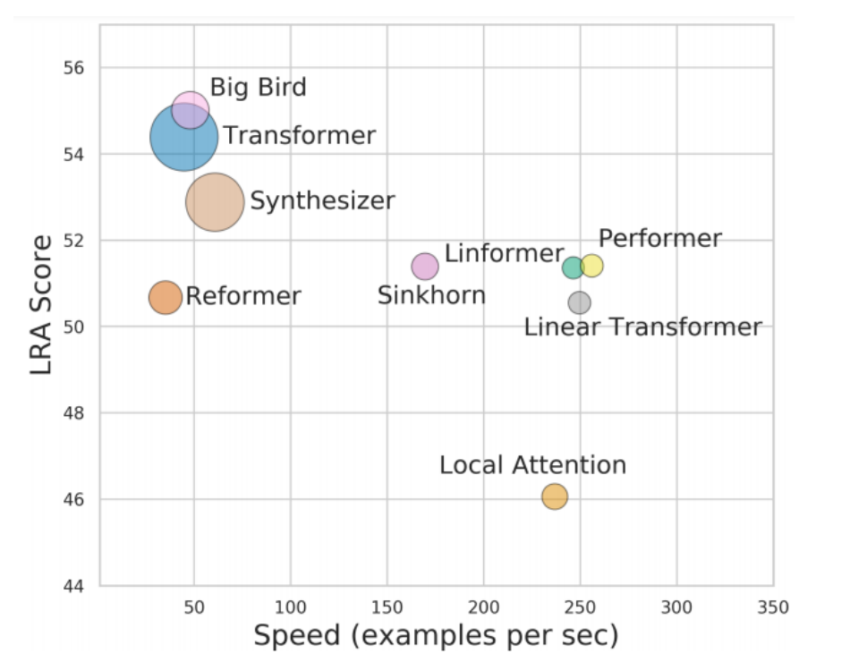
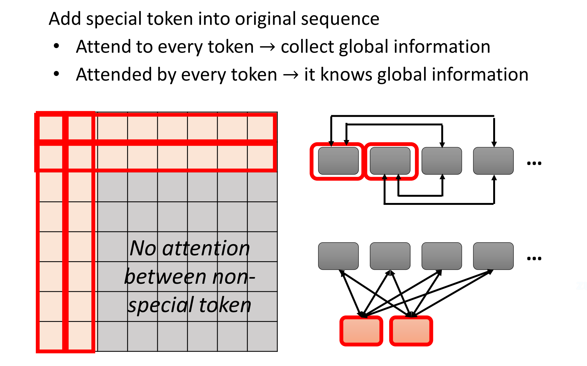
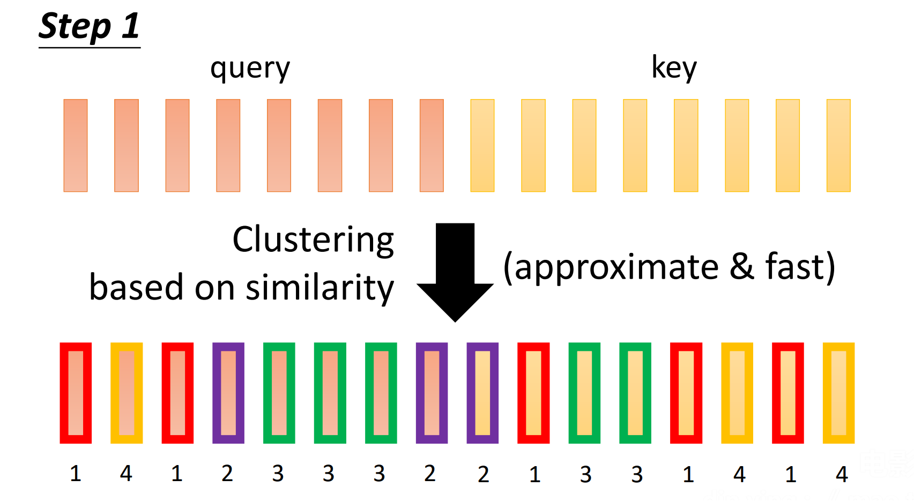
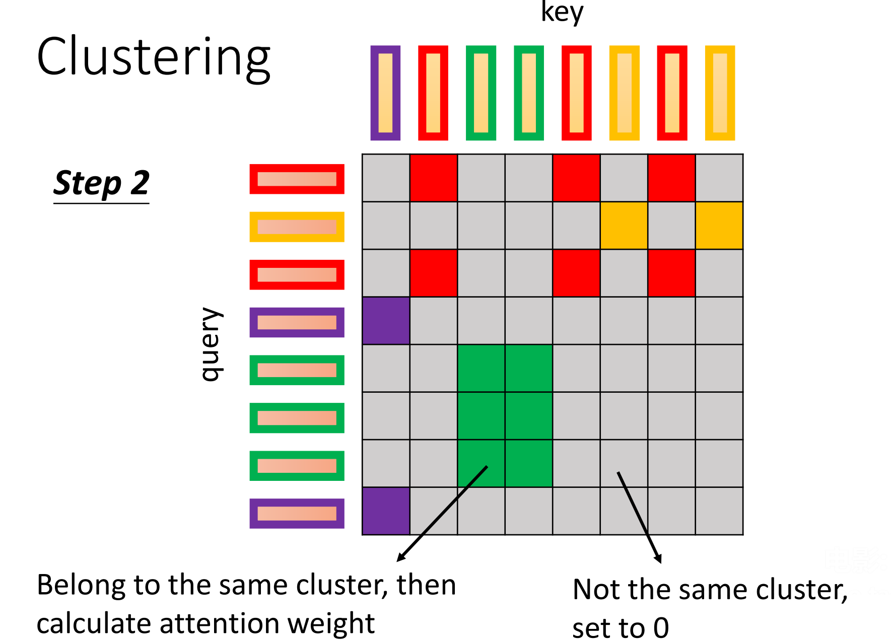
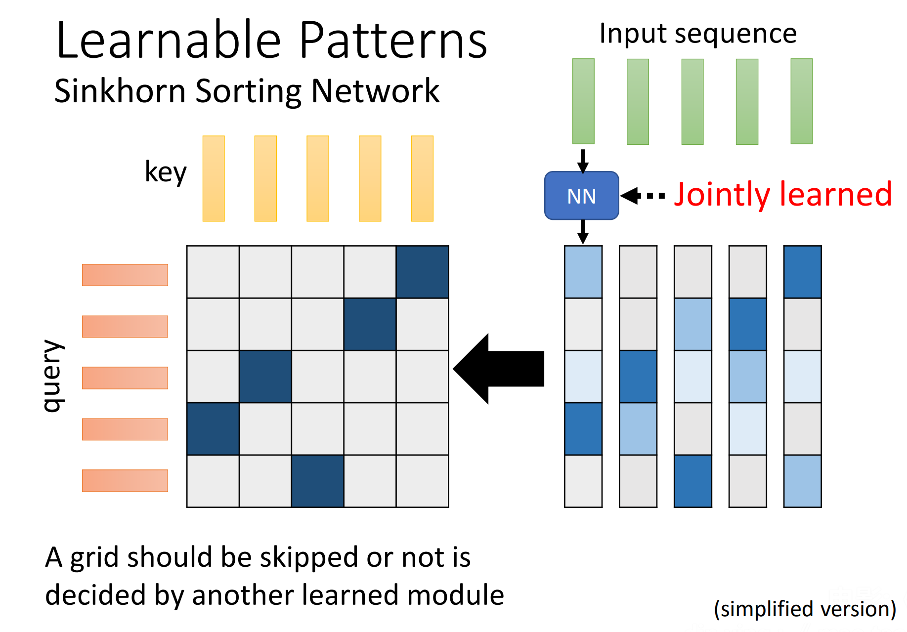
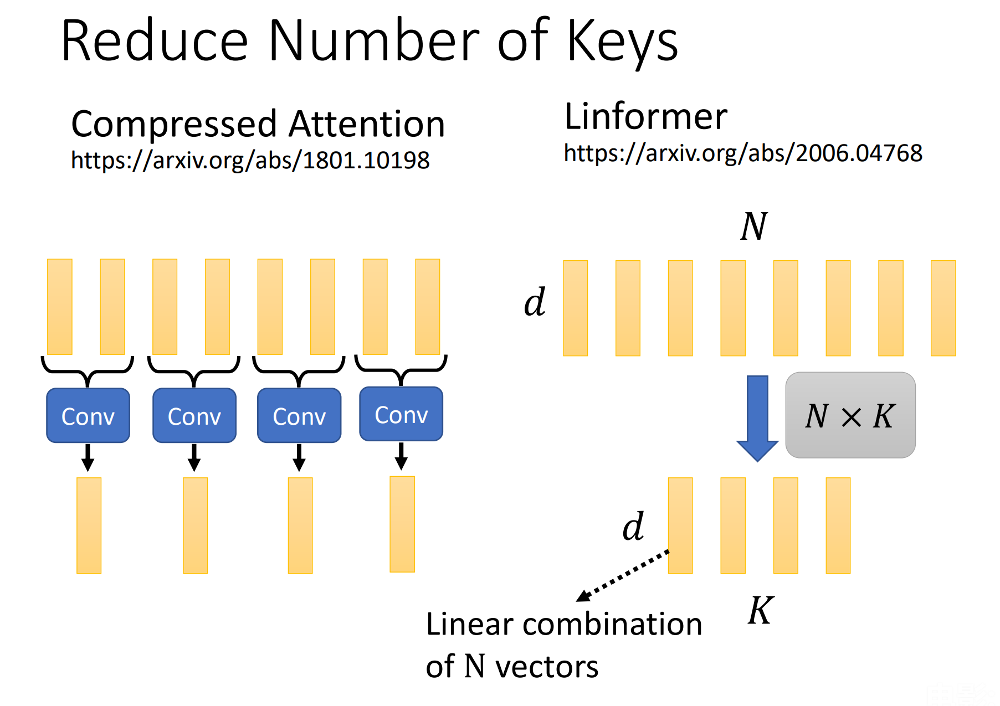
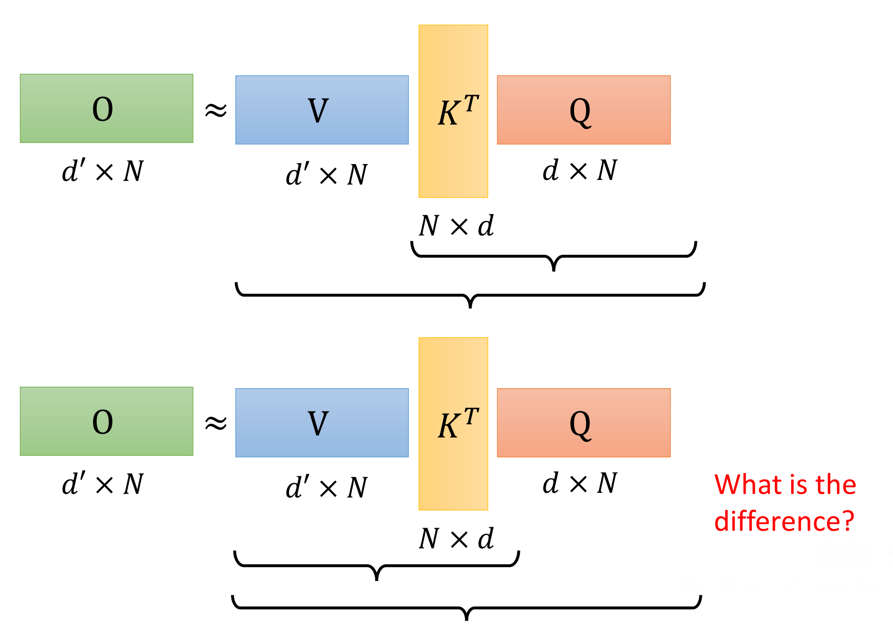
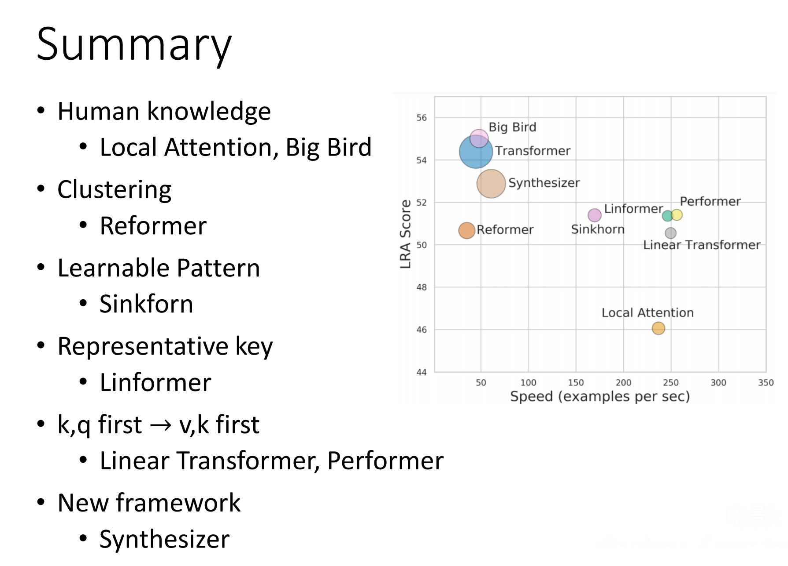
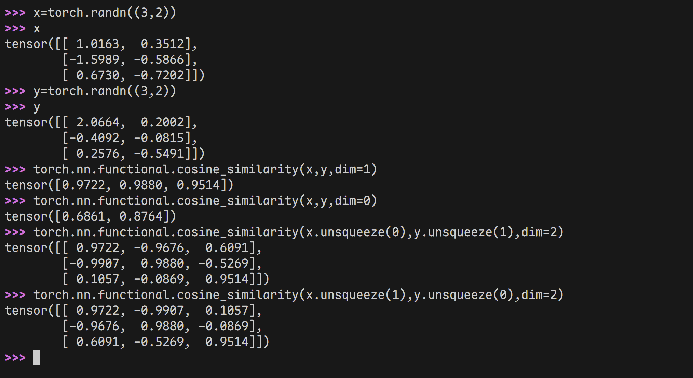
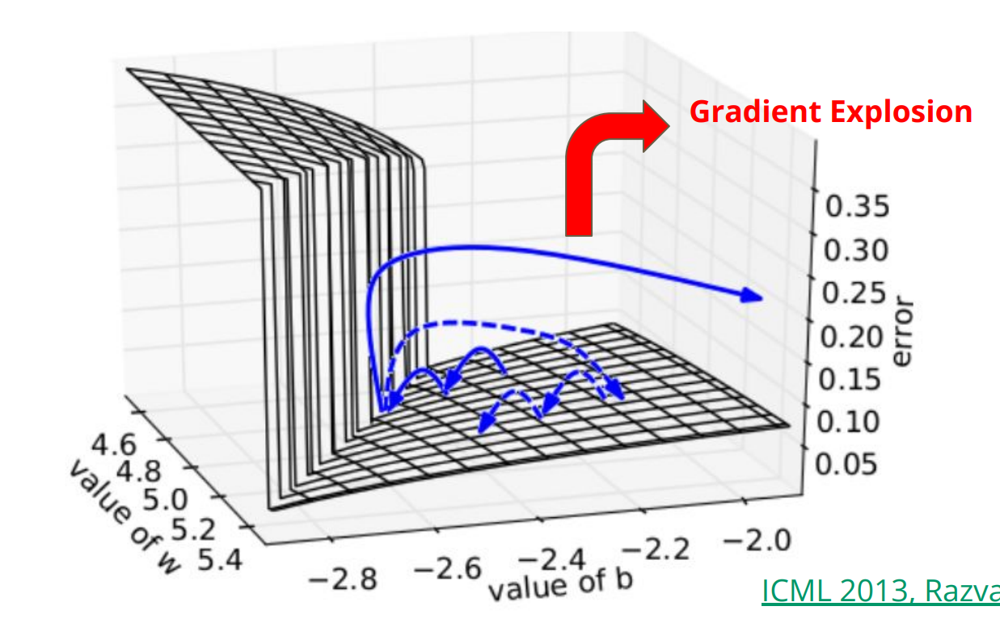

## Batch Normalization

[Quick Introduction of Batch Normalization](https://speech.ee.ntu.edu.tw/~hylee/ml/ml2021-course-data/normalization_v4.pdf)

之前在讲[学习率调度器](Lecture-2.md#学习率调度器)的时候说，比如两个参数一个下降得很快一个下降得很慢的时候，这种error surface是不利于训练的。那么出现这种情况得原因是什么呢？本次课程分析了这种情况，并提出Batch Normalization的方法来解决这个问题。


如果$x_{1}$的数值较小，更新$w_{1}$的权重$w_{1}+\Delta w$对$L$的影响不大；如果$x_{2}$的数值大，更新$w_{2}$的权重$w_{2}+\Delta w$对$L$的影响就很大。在这个简单的模型里，

$$
\Delta L\approx\Delta w_{1}\cdot x_{1}+\Delta w_{2}\cdot x_{2}
$$

所以应该让不同维度上的数据具有同样的数值范围。这类方法统称为Feature Normalization。

### Feature Normalization

对不同维度上的所有特征做归一化处理：

$$
\tilde{\mathbf{x}}_{i} \gets \frac{\mathbf{x}_{i} - \mathbf{\mu}}{\mathbf{\sigma}}
$$

归一化放在激活函数前后的差别*可能*不大。


现在$\tilde{x}$,$\tilde{z}$的均值变成了0，方差变成了1，这样会给神经网络可能带来一些限制，所以实践上又给它加上了一些偏移：

$$
\tilde{\mathbf{z}}=\gamma \odot \tilde{\mathbf{z}} + \beta
$$

### 测试时

测试时不一定有一个batch来计算均值和标准差。在Pytorch中，BatchNorm使用在训练时计算的均值和标准差的*moving average*：

$$
\bar{\mu} \gets p\bar{\mu}+(1-p)\mu_{t}
$$
$$
\bar{\sigma}=p\bar{\sigma}+(1-p)\sigma_{t}
$$
其中$p\in(0,1)$，
那么训练时就直接使用

$$
\tilde{\mathbf{z}}=\frac{\mathbf{z}-\bar{\mu}}{\bar{\sigma}}
$$

### 效果

由于损失函数比较陡峭，更好训练，可以把learning rate增大，训练时间也会缩短。

还讨论了一些其他特点。

## Transformer

[Transformer](https://speech.ee.ntu.edu.tw/~hylee/ml/ml2021-course-data/seq2seq_v9.pdf)讲解Transformer架构。

### 应用领域

在机器翻译、语音辨识、聊天问答等任务中处理的就是Seq2seq问题，输入和输出的长度不同，由机器决定输出序列的长度和内容。

- Natural Language Processing
- Seq2seq for Syntactic Parsing
- Seq2seq for Multi-label Classification
- Seq2seq for Object Detection

### 架构

$$
\text{Input sequence} \to \text{Encoder} \to \text{Decoder} \to \text{Output sequence}
$$


#### Encoder

其中$\text{Encoder}$可以采用不同的模型（RNN、CNN），而Transformer采用的基于Self-attention的模型。


在Transformer的设计里，这个$\text{Encoder}$里面有多个相同的模块。


经过Self-attention的输出还要做残差连接和LayerNorm（注意不是BatchNorm，在NLP领域用是LayerNorm，而图像处理领域用的是BatchNorm。**BatchNorm和LayerNorm的主要区别在于它们归一化的维度不同**。BatchNorm是在批次的维度上进行归一化，而LayerNorm则是在特征的维度上进行归一化。LayerNorm保留了同一样本内不同特征之间的大小关系）。

BERT的架构用的就是Transformer的$\text{Encoder}$。

#### Decoder

Transformer的$\text{Decoder}$用的是自回归模型。


什么叫自回归呢？就是用前面的输出作为输入再去生成输出，如此循环。所以$\text{Decoder}$是看不到未输出的部分的。因此Self-attention设置了掩码。
最开始的输入是BEGIN特殊符号，最后的输出是END特殊符号。在$\text{Decoder}$中融入了$\text{Encoder}$的输出。

> 还有一种$\text{Decoder}$使用非自回归模型，但效果往往不如自回归模型。

#### Encoder -> Decoder: Cross Attention

这部分内容就来讲解$\text{Encoder}$的输出如何加入$\text{Decoder}$。


$W^{k},W^{q},W^{v}$三个矩阵中，$W^{q}$作用于$\text{Decoder}$中第一层Self-attention的输出，而$W^{k},W^{v}$作用于$\text{Encoder}$的输出。这就是第二层的Cross attention机制。


关于多层Cross attention的多种设计↑。

### 训练


$\text{Decoder}$训练时使用Teacher Forcing策略，以“正确答案”作为输入，输出中取概率得分最高的一个（跟分类一样）。


> 那$\text{Encoder}$是怎么训练的？

### 小技巧

其他讨论：

- Copy Machine
- Guided Attention
- Beam Search（束搜索）不如允许一些随机性
- Blue Score
- Schedule Sampling: 给$\text{Decoder}$故意训练一些错误的资料，增强泛化能力，避免因输入错误而崩溃

## 各式各样的Attention

[各式各樣的 Attention](https://speech.ee.ntu.edu.tw/~hylee/ml/ml2022-course-data/xformer%20(v8).pdf)

Attention矩阵的计算量太大了，所以出现了一些减小计算量的机制。



本节课程就是介绍了这些改版Transformer改版的设计和原理。

### Local Attention / Truncated Attention

只关心相近的权重，其他设为0。


### Stride Attention

不看邻居，空一格、两格、三格……


### Global Attention



只考虑前面两个special元素与其他元素的相关性，不考虑剩下元素之间的关系。

> Different heads use different patterns.可以在不同head中融入不同的Attention模式。

保留具有较大的attention权重的位置，较小的权重的位置直接设置成0.

### 聚类

把query和key拿出来分别计算相似度，



属于同一个聚类才去计算attention weight；不同聚类的权重设置为0。



### Learnable Patterns



用另一个神经网络决定哪些attention matrix的掩码。

### 减小Key的数量



### 改变矩阵乘法的顺序



原始的Self-attention机制是上面那样，但从线性代数的角度看，如果按下面的顺序计算能减小很多计算量，唯一阻碍使用这一方法的就是$\mathbf{K}^T\mathbf{Q}$之后的softmax函数。

如果能找到一个$\phi$使得 $\exp(\mathbf{q}\cdot \mathbf{k})\approx \phi(\mathbf{q})\cdot \phi (\mathbf{k})$，那么通过一些代数可以证明等价。这个$\phi$成为了几种改进Self-attention机制的核心。

### 总结



## HW05: Machine Translation

[HW05: Machine Translation](https://speech.ee.ntu.edu.tw/~hylee/ml/ml2022-course-data/HW05.pdf)

这次的Homework将完成从英语到國語的机器翻译任务。这是一个Seq2seq任务。

- Thank you so much, Chris. -> 非常謝謝你，克里斯。

### 评估方法

BLEU分数：

$$
BP=\begin{cases}
1 && \text{if }c \gt r \\
e^{ 1-r/c } && \text{if } c \le r
\end{cases}
$$

source: Cats are so cute
target: ==貓==咪真==可愛==
output: ==貓==好==可愛==

反正意思就是output中出现target中的字越多效果越好。

### 小技巧

- Tokenize data with sub-word units
- Label smoothing regularization
- Learning rate scheduling
- Back-translation

#### Tokenize

学习GPT模型就知道它是用这种方式来分割单词：[文本分词](../从零构建大语言模型/处理文本数据.md#文本分词)。将单词分割为词根，可以减小词汇表的大小、处理没训练过的单词。

#### Label Smoothing

常用于分类任务中。在[小技巧](Lecture-3.md#小技巧)中曾经采用过，可以减轻过拟合。我看现在的 `nn.CrossEntropyLoss` 支持指定 `label_smoothing` 参数。

#### Back translation：反向翻译

单一的目标语言句子y是容易收集的，用训练好的**目标语言到源语言**的翻译模型生成对应的源语言x'，加入到句对中一起训练。因为y是高质量的单语语料，x'可能包含一些错误的句法等，质量较差。这样训练可以当作是有噪声训练的形式。在有噪声的情况下，训练x->y的翻译模型还能提升泛化性能。

一般先用高质量的句对训练好初始模型后，将反向翻译的句对(x',y)和训练语料混合，再次训练。

### Baselines

| Baseline | Public score | Time(Kaggle) |
| -------- | ------------ | ------------ |
| Simple   | 14.58        | 1h           |
| Medium   | 18.04        | 1h40m        |
| Strong   | 25.20        | 3h           |
| Boss     | 29.13        | >12h         |

- Simple Baseline: Train a simple RNN seq2seq to acheive translation
- Medium Baseline: Add learning rate scheduler and train longer
- Strong Baseline: Switch to Transformer and tuning hyperparameter
- Boss Baseline: Apply back-translation

### Simple Baseline

直接运行示例代码即可

### Medium Baseline

增加学习率调度器并且训练更长时间。

$$lrate = d_{\text{model}}^{-0.5}\cdot\min({step\_num}^{-0.5},{step\_num}\cdot{warmup\_steps}^{-1.5})$$

```python
def get_rate(d_model, step_num, warmup_step) -> float:
 # TODO
 lr = 0.001
 return lr
```

```python
config = Namespace(
 ...
 max_epoch = 15, # medium -> 30
 ...
)
```

### Strong Baseline

转而采用Transformer并且调整超参数。

```python
encoder = RNNEncoder(args, src_dict, encoder_embed_tokens)
 decoder = RNNDecoder(args, tgt_dict, decoder_embed_tokens)
-> # encoder = TransformerEncoder(args, src_dict, encoder_embed_tokens)
 # decoder = TransformerDecoder(args, tgt_dict, decoder_embed_tokens)
```

<br>

```python
arch_args = Namespace(
    encoder_embed_dim=256,
    encoder_ffn_embed_dim=512,
    encoder_layers=1, # recommend to increase -> 4
    decoder_embed_dim=256,
    decoder_ffn_embed_dim=1024,
    decoder_layers=1, # recommend to increase -> 4
    share_decoder_input_output_embed=True,
    dropout=0.3,
)

"""
for other hyperparameters for
transformer-base, pleaserefer to
Table 3 in [Attention is all you need](https://arxiv.org/abs/1706.03762)
"""
```

### Boss Baseline

实施反向翻译

1. Train a backward model by switching languages

2. Translate monolingual data with backward model to obtain synthetic data

- Complete TODOs in the sample code
- All the TODOs can be completed by using commands from earlier cells

1. Train a stronger forward model with the new data

- If done correctly, ~30 epochs on new data should pass the baseline

### Report

- Problem 1
- Problem 2

#### Problem 1: Visualize Positional Embedding

对于给定的N×D的位置编码表，我们将计算它们之间的相似度矩阵N×N。我们将使用decoder的位置编码。

预期的相似度矩阵是对角线对称的，并且位置相近的向量之间相似度高。

采用**余弦相似度**来衡量两个向量之间的相似度：

$$
\text{similarity}(\mathbf{x_{1}},\mathbf{x_{2}}) = \frac{\mathbf{x_{1}}\cdot \mathbf{x_{2}}}{\max(\left \|\mathbf{x_{1}}\right \|_{2},\epsilon)\cdot \max(\left \|\mathbf{x_{2}}\right \|,\epsilon)}
$$
其中
$$
\left \| \mathbf{x} \right\|_{p} := \left( \sum_{i=1}^{n} \left |x_{i}\right|^{p} \right)^{1/p}
$$

$$
\left \| \mathbf{x}\right \|_{2}=\sqrt{ \sum_{i=1}^{n} x_{i}^{2} }
$$

向量之间就是这么算，但是对于问题中的二维矩阵来说，就需要处理 `dim` 这个参数，详见[torch.nn.functional.cosine_similarity](https://docs.pytorch.org/docs/stable/generated/torch.nn.functional.cosine_similarity.html)。绕的我有点晕晕的……



`consine_similarity(x,ydim=1)` 相当于`x`,`y`的相同行之间两两计算，所以最后是三个数；`consine_similarity(x,ydim=1)` 相当于`x`,`y`的相同行之间两两计算，所以最后是三个数。为了所有行之间两两计算，需要使用 `unsqueeze` 增加矩阵的维度。这个 `unsqueeze` 相当于在指定的维度上套上方括号，在该维度前增加一维。比如上面的 `x.unsqueeze(0)` 的形状变成1×3×2； `x.unsqueeze(1)` 的形状变成3×1×2。😵‍💫

```python
from torch.nn.functional import cosine_similarity as cs
pos_emb = model.decoder.embed_positions.weights.cpu().detach()
print('Size of pos_emb', pos_emb.size())
sim = cs(pos_emb.unsqueeze(0), pos_emb.unsqueeze(1), dim=2)
  
plt.imshow(sim, cmap="hot", vmin=0, vmax=1)
plt.colorbar()
  
plt.show()
```

#### Problem 2: Gradient Explosion



有时error surface有很陡峭的地方，梯度很大，使得更新参数太大。这就是梯度爆炸问题，导致模型的训练过程不稳定、难收敛。

为了解决这个问题，引入了[梯度裁剪（Gradient Clipping）](https://blog.csdn.net/ZacharyGz/article/details/135410610)

这里用的是范数裁剪（Clipping Gradient Norm）：梯度范数裁剪通过调整整个参数梯度向量来保持其总体范数不超过**特定阈值**。它不关注单个梯度的值，而是关注所有梯度构成的整体范数。如果梯度的范数超过了指定的阈值，则会**按比例缩小梯度向量的每个分量**，使得整体范数等于或小于该阈值。

通过使用[torch.nn.utils.clip_grad_norm_](https://docs.pytorch.org/docs/stable/generated/torch.nn.utils.clip_grad_norm_.html)函数实现范数梯度裁剪，避免梯度爆炸。

此外，本次HW还引入了[wandb](https://docs.wandb.ai/models)对深度学习实验过程进行监控与可视化。它与HW01的tensorboard，是我们以后写深度学习代码应该多采用的强大工具，以后有需要去学习一下。
