## Batch Normalization

[Quick Introduction of Batch Normalization](https://speech.ee.ntu.edu.tw/~hylee/ml/ml2021-course-data/normalization_v4.pdf)

之前在讲[学习率调度器](Lecture-2.md#学习率调度器)的时候说，比如两个参数一个下降得很快一个下降得很慢的时候，这种error surface是不利于训练的。那么出现这种情况得原因是什么呢？本次课程分析了这种情况，并提出Batch Normalization的方法来解决这个问题。

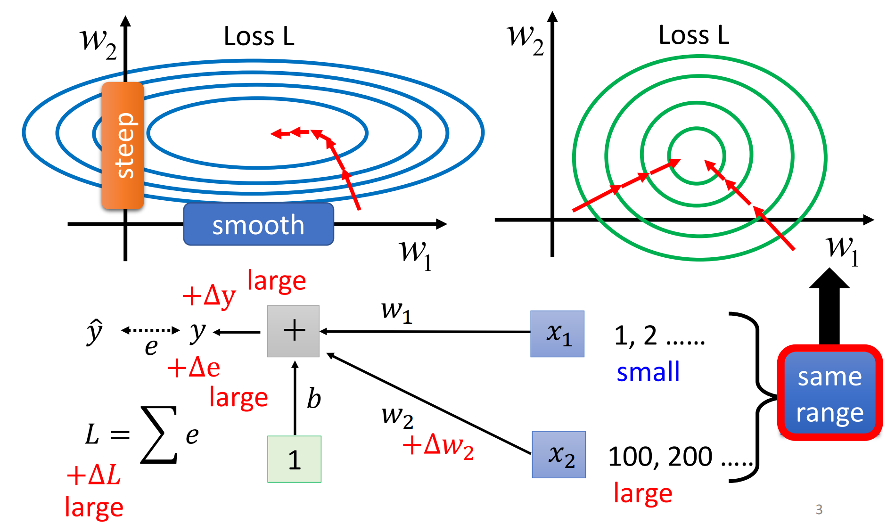

如果$x_{1}$的数值较小，更新$w_{1}$的权重$w_{1}+\Delta w$对$L$的影响不大；如果$x_{2}$的数值大，更新$w_{2}$的权重$w_{2}+\Delta w$对$L$的影响就很大。在这个简单的模型里，

$$
\Delta L\approx\Delta w_{1}\cdot x_{1}+\Delta w_{2}\cdot x_{2}
$$

所以应该让不同维度上的数据具有同样的数值范围。这类方法统称为Feature Normalization。

### Feature Normalization

对不同维度上的所有特征做归一化处理：

$$
\tilde{\mathbf{x}}_{i} \gets \frac{\mathbf{x}_{i} - \mathbf{\mu}}{\mathbf{\sigma}}
$$

归一化放在激活函数前后的差别*可能*不大。

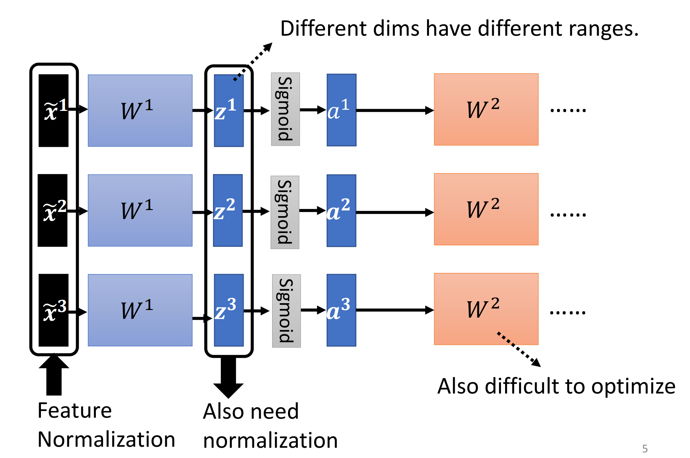

现在$\tilde{x}$,$\tilde{z}$的均值变成了0，方差变成了1，这样会给神经网络可能带来一些限制，所以实践上又给它加上了一些偏移：

$$
\tilde{\mathbf{z}}=\gamma \odot \tilde{\mathbf{z}} + \beta
$$

### 测试时

测试时不一定有一个batch来计算均值和标准差。在Pytorch中，BatchNorm使用在训练时计算的均值和标准差的*moving average*：

$$
\bar{\mu} \gets p\bar{\mu}+(1-p)\mu_{t}
$$
$$
\bar{\sigma}=p\bar{\sigma}+(1-p)\sigma_{t}
$$
其中$p\in(0,1)$，
那么训练时就直接使用

$$
\tilde{\mathbf{z}}=\frac{\mathbf{z}-\bar{\mu}}{\bar{\sigma}}
$$

### 效果

由于损失函数比较陡峭，更好训练，可以把learning rate增大，训练时间也会缩短。

还讨论了一些其他特点。

## Transformer

[Transformer](https://speech.ee.ntu.edu.tw/~hylee/ml/ml2021-course-data/seq2seq_v9.pdf)讲解Transformer架构。

### 应用领域

在机器翻译、语音辨识、聊天问答等任务中处理的就是Seq2seq问题，输入和输出的长度不同，由机器决定输出序列的长度和内容。

- Natural Language Processing
- Seq2seq for Syntactic Parsing
- Seq2seq for Multi-label Classification
- Seq2seq for Object Detection

### 架构

$$
\text{Input sequence} \to \text{Encoder} \to \text{Decoder} \to \text{Output sequence}
$$
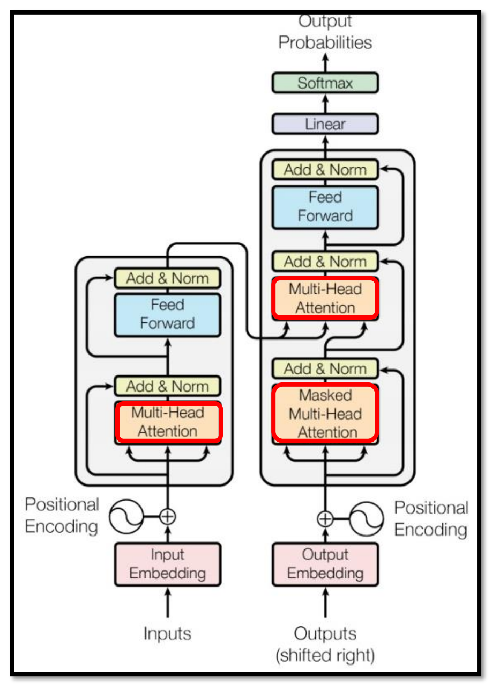

#### Encoder

其中$\text{Encoder}$可以采用不同的模型（RNN、CNN），而Transformer采用的基于Self-attention的模型。

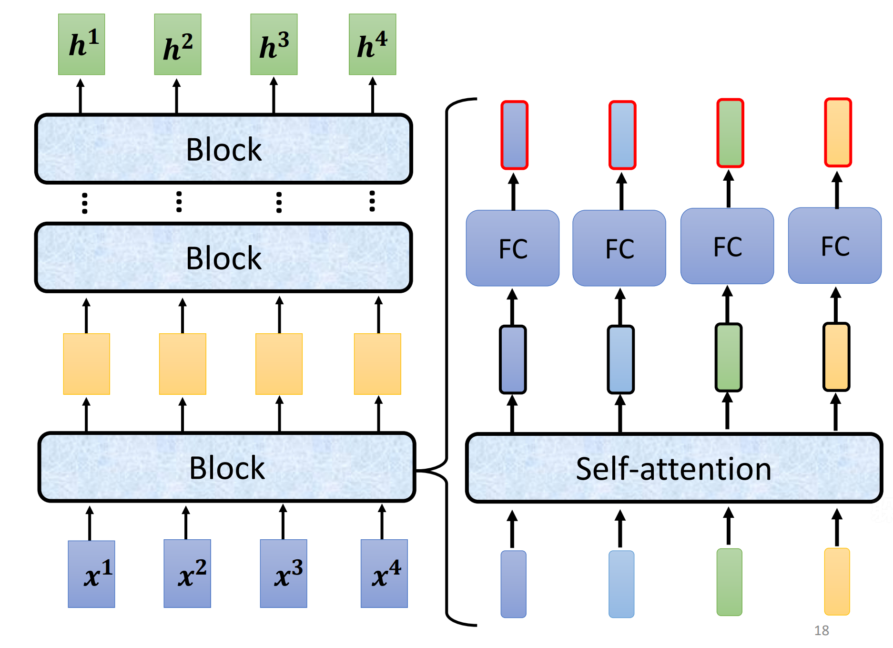

在Transformer的设计里，这个$\text{Encoder}$里面有多个相同的模块。

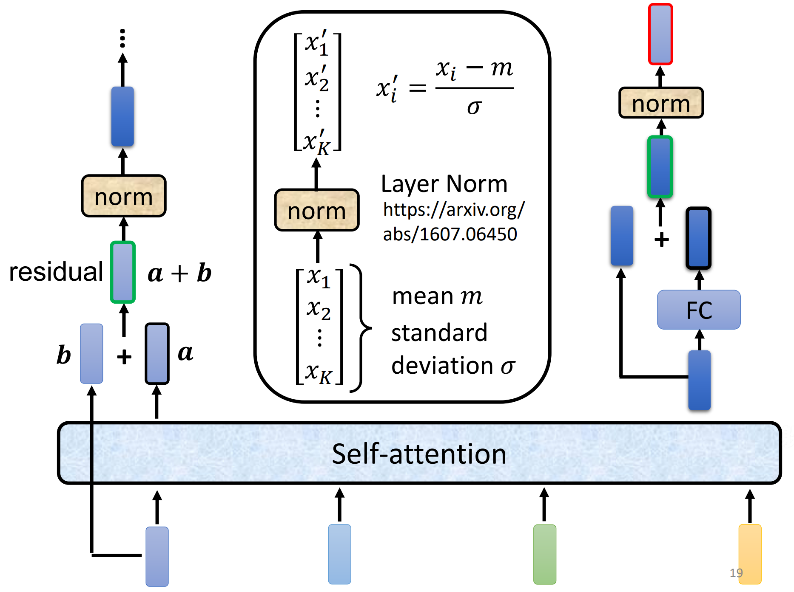

经过Self-attention的输出还要做残差连接和LayerNorm（注意不是BatchNorm，在NLP领域用是LayerNorm，而图像处理领域用的是BatchNorm。**BatchNorm和LayerNorm的主要区别在于它们归一化的维度不同**。BatchNorm是在批次的维度上进行归一化，而LayerNorm则是在特征的维度上进行归一化。LayerNorm保留了同一样本内不同特征之间的大小关系）。

BERT的架构用的就是Transformer的$\text{Encoder}$。

#### Decoder

Transformer的$\text{Decoder}$用的是自回归模型。

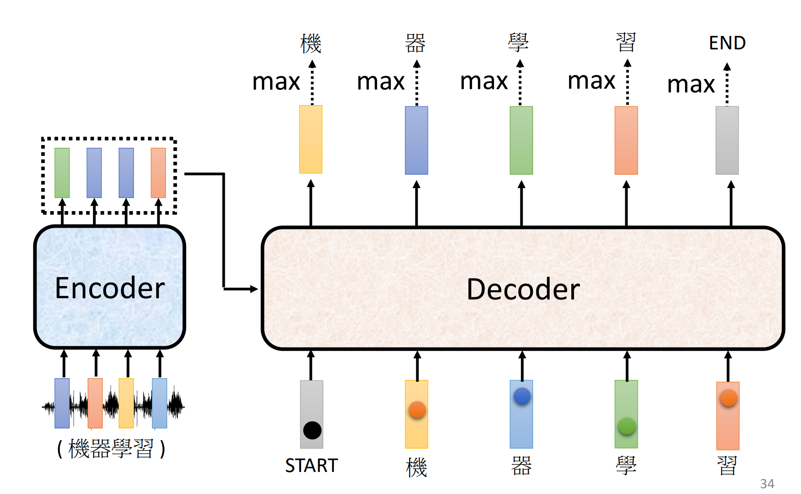

什么叫自回归呢？就是用前面的输出作为输入再去生成输出，如此循环。所以$\text{Decoder}$是看不到未输出的部分的。因此Self-attention设置了掩码。
最开始的输入是BEGIN特殊符号，最后的输出是END特殊符号。在$\text{Decoder}$中融入了$\text{Encoder}$的输出。

> 还有一种$\text{Decoder}$使用非自回归模型，但效果往往不如自回归模型。

#### Encoder -> Decoder: Cross Attention

这部分内容就来讲解$\text{Encoder}$的输出如何加入$\text{Decoder}$。

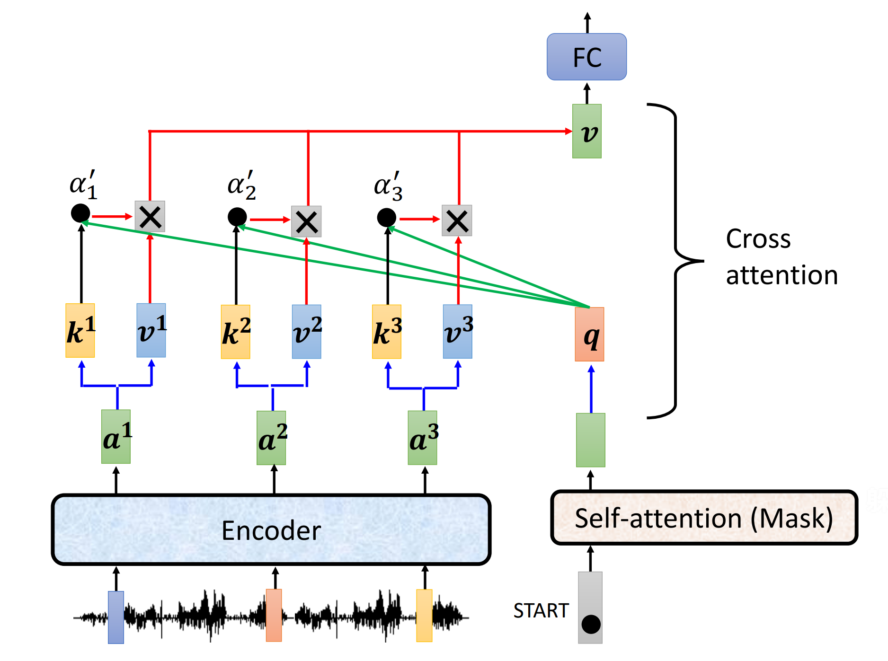

$W^{k},W^{q},W^{v}$三个矩阵中，$W^{q}$作用于$\text{Decoder}$中第一层Self-attention的输出，而$W^{k},W^{v}$作用于$\text{Encoder}$的输出。这就是第二层的Cross attention机制。

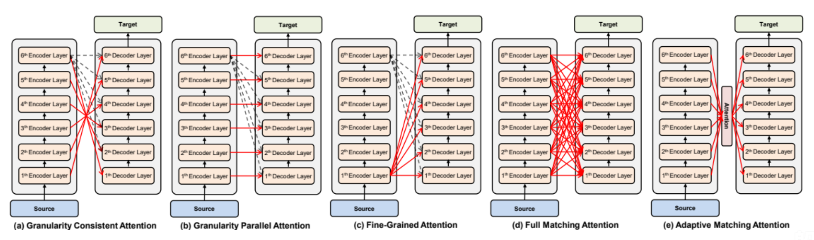

关于多层Cross attention的多种设计↑。

### 训练

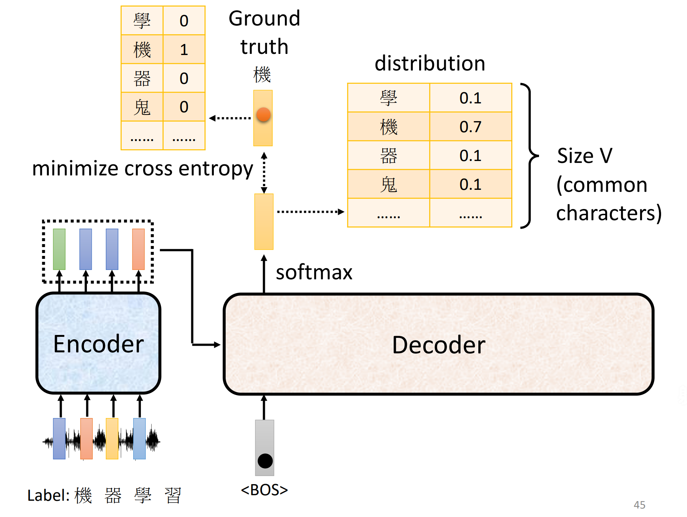

$\text{Decoder}$训练时使用Teacher Forcing策略，以“正确答案”作为输入，输出中取概率得分最高的一个（跟分类一样）。

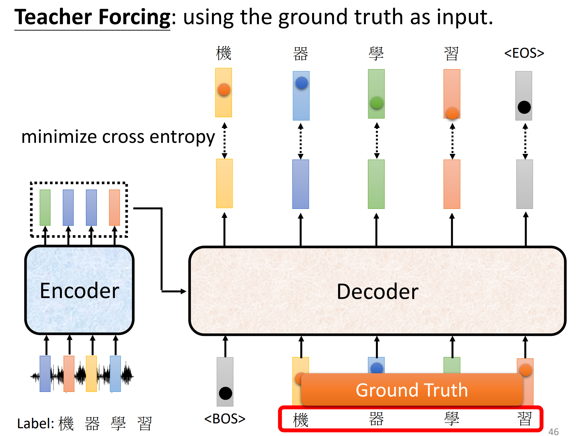

> 那$\text{Encoder}$是怎么训练的？

### 小技巧

其他讨论：

- Copy Machine
- Guided Attention
- Beam Search（束搜索）不如允许一些随机性
- Blue Score
- Schedule Sampling: 给$\text{Decoder}$故意训练一些错误的资料，增强泛化能力，避免因输入错误而崩溃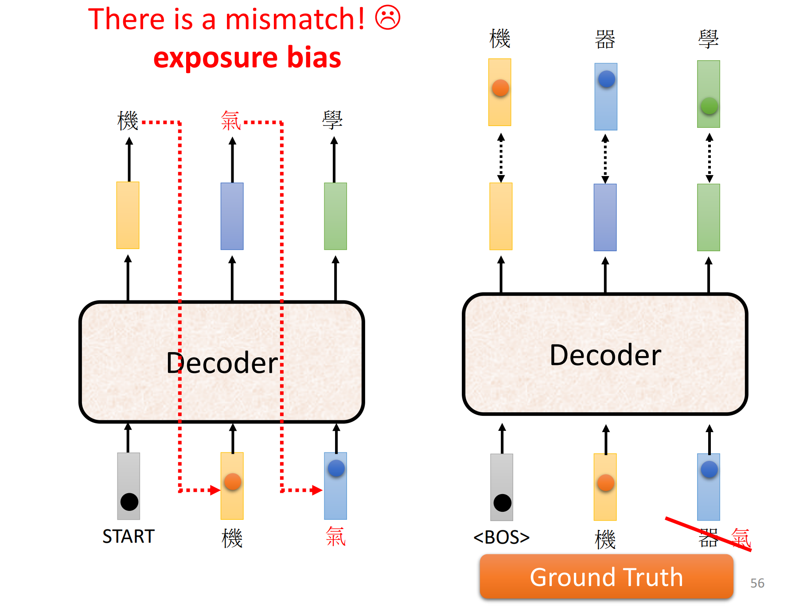

## 各式各样的Attention

[各式各樣的 Attention](https://speech.ee.ntu.edu.tw/~hylee/ml/ml2022-course-data/xformer%20(v8).pdf)

Attention矩阵的计算量太大了，所以在图像处理领域出现了一些计算量减少的机制。

### Local Attention / Truncated Attention

只关心相近的权重，其他设为0。

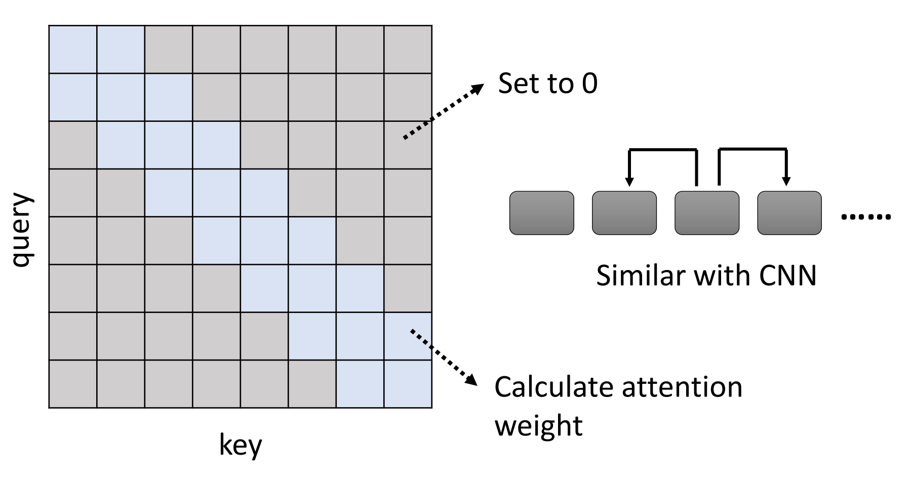

### Stride Attention

不看邻居，空一格、两格、三格……

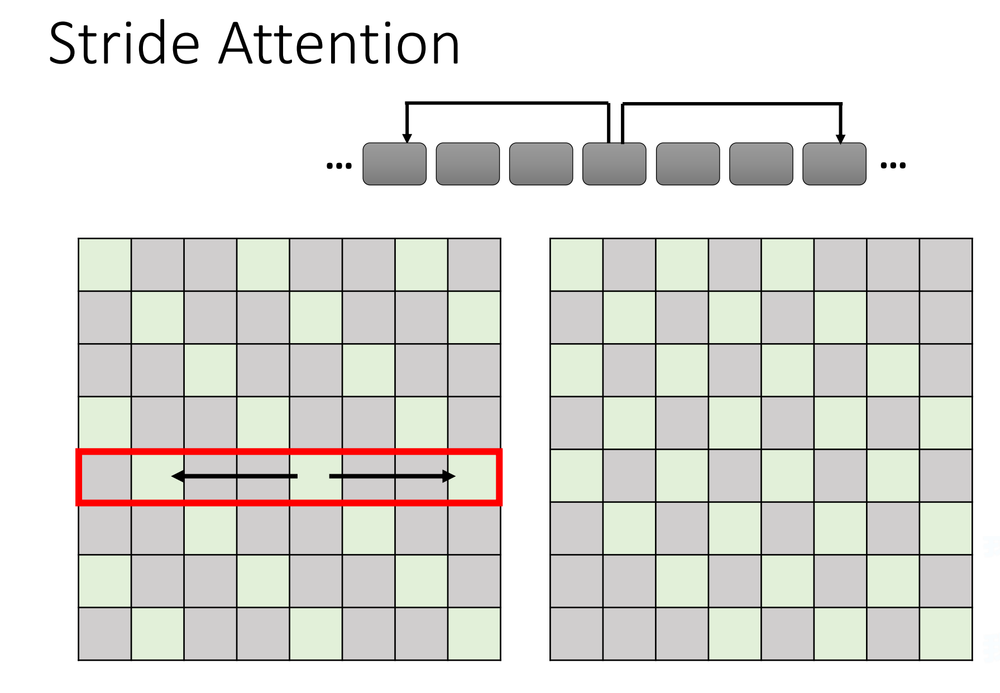
