## 生成式对抗网络（GAN）

[Generation](https://speech.ee.ntu.edu.tw/~hylee/ml/ml2021-course-data/gan_v10.pdf)

### Network as Generator

现在的任务是生成，而不是以前的预测、分类任务。所以采用之前的神经网络架构是不能达到效果的。

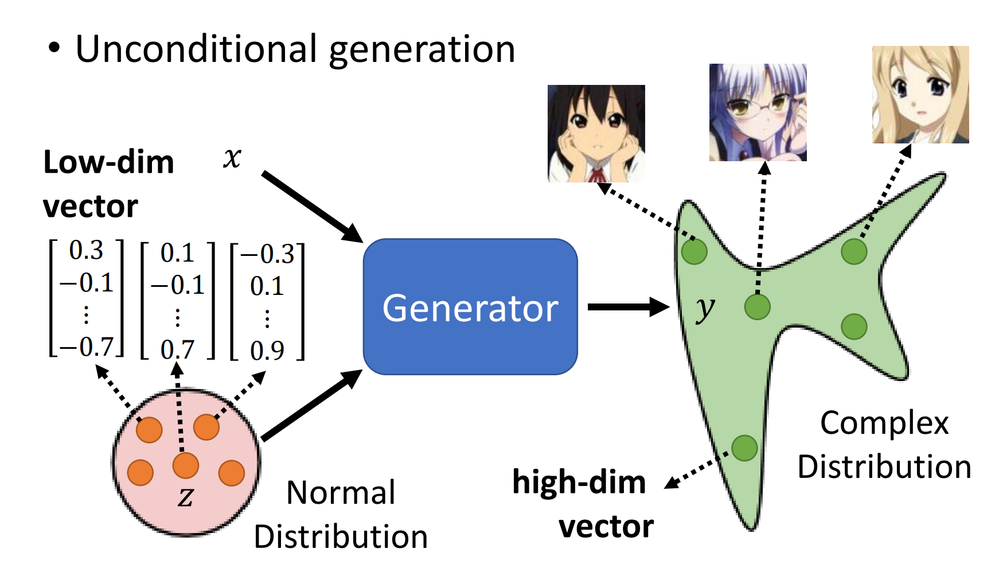

生成器在原来输入$x$的基础上增加的一个随机$z$的输入，它是从分布中采样得到的。就算相同的$x$作为输入，不同的$z$也会产生不同的输出。也就是将简单的分布映射为一个复杂的分布。

### Discriminator

其实就是一个二元分类器。Larger means real, smaller value fake.
它会对输入分类为真实样本和机器生成的两种。深度伪造检测。

### GAN的基本算法

Discriminator与Generator协同进化，目的是让Generator生成Discriminator无法区分真伪的输出。有点像通过图灵测试。这就是叫做“对抗”的原因。

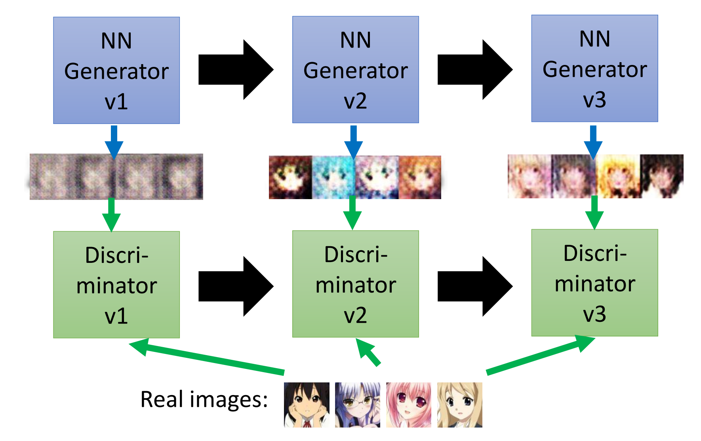

GAN的基本原理其实非常简单，这里以生成图片为例进行说明。假设我们有两个网络，G（Generator）和D（Discriminator）。正如它的名字所暗示的那样，它们的功能分别是：

- G是一个生成图片的网络，它接收一个随机的噪声z，通过这个噪声生成图片，记做G(z)。  

- D是一个判别网络，判别一张图片是不是“真实的”。它的输入参数是x，x代表一张图片，输出D（x）代表x为真实图片的概率，如果为1，就代表100%是真实的图片，而输出为0，就代表不可能是真实的图片。

在训练过程中，**生成网络G的目标就是尽量生成真实的图片去欺骗判别网络D。而D的目标就是尽量把G生成的图片和真实的图片分别开来。** 这样，G和D构成了一个动态的“博弈过程”。

#### Step 1

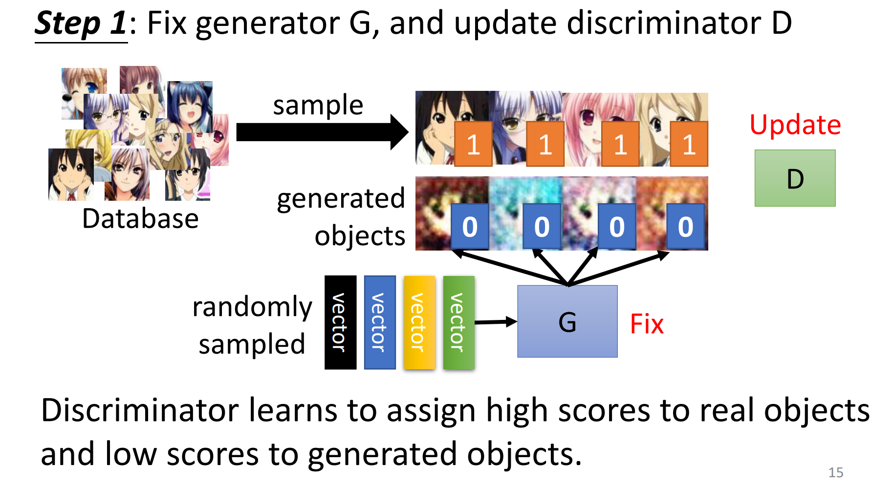

#### Step 2

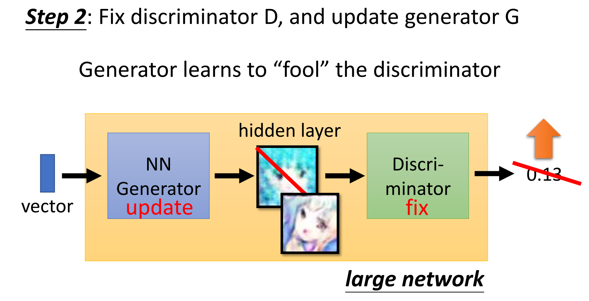

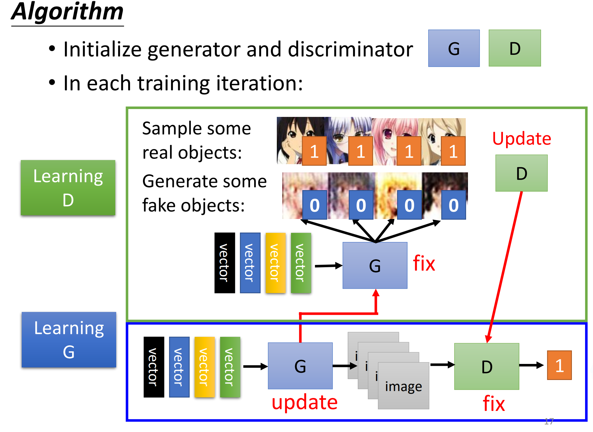

### Theory behind GAN

### 我们的目标

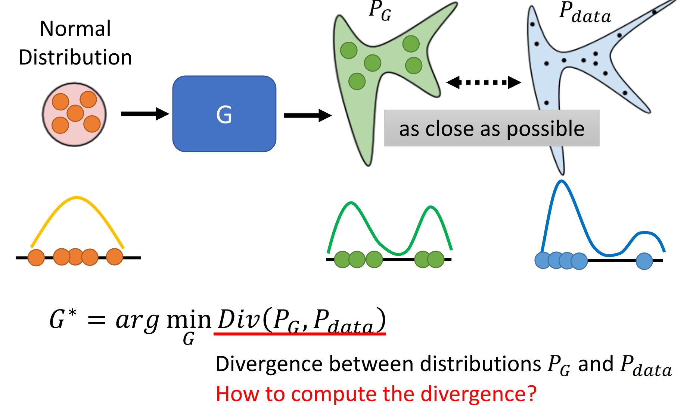

生成的$P_{G}$分布越接近真实数据$P_{data}$。也就是 找到一个$G^*$使得

$$
G^{*} = arg \min_{G}\text{Div}(P_{g},P_{data})
$$

$\text{Div}$就是散度(divergence)。

### Discriminator

这种散度比较复杂，难以KL散度这些公式衡量。所以通过训练Discriminator来衡量。

在最初的GAN中，设计Discriminator来做一个二元分类器。

$$
D^{*} = arg \max_{D}V(D,G)
$$

$D$的目标函数$V(D,G)$与JS散度相关。

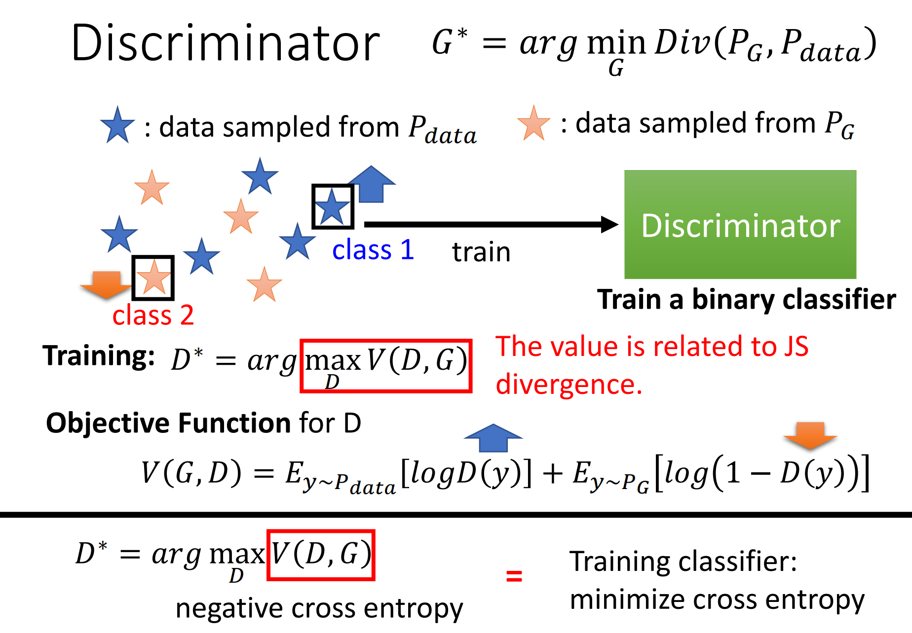

> Can we use other divergence? Using the divergence you like.😄

### Tips for GAN：生成器效能评估

GAN is difficult to train.

上节最后提到，那些散度方程的结果差别不大，而且GAN非常难训练。问题出在哪里呢？实际上，在大多数情况下$P_{G}$和$P_{data}$的分布并不重合。

- 在高维空间中，本身$P_{G}$和$P_{data}$的分布就很狭窄，因此不容易重合。
- 就算可能有重合的地方，离散的采样进一步降低了分布的重合程度。

这就导致难以训练的问题。二元的分类器很容易达到100%的过拟合效果；JS散度对于不重合的分布，结果都是1，不管分布的接近程度。

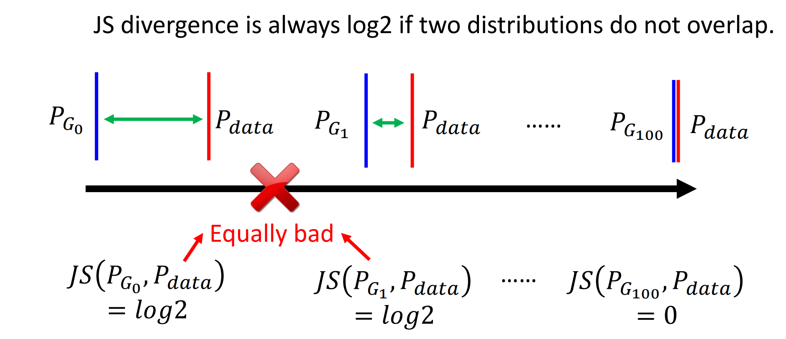

为此引入了Wasserstein distance，这是一种[距离定义](https://zhuanlan.zhihu.com/p/58506295)

采用Wasserstein distance作为Discrimator的就是WGAN：

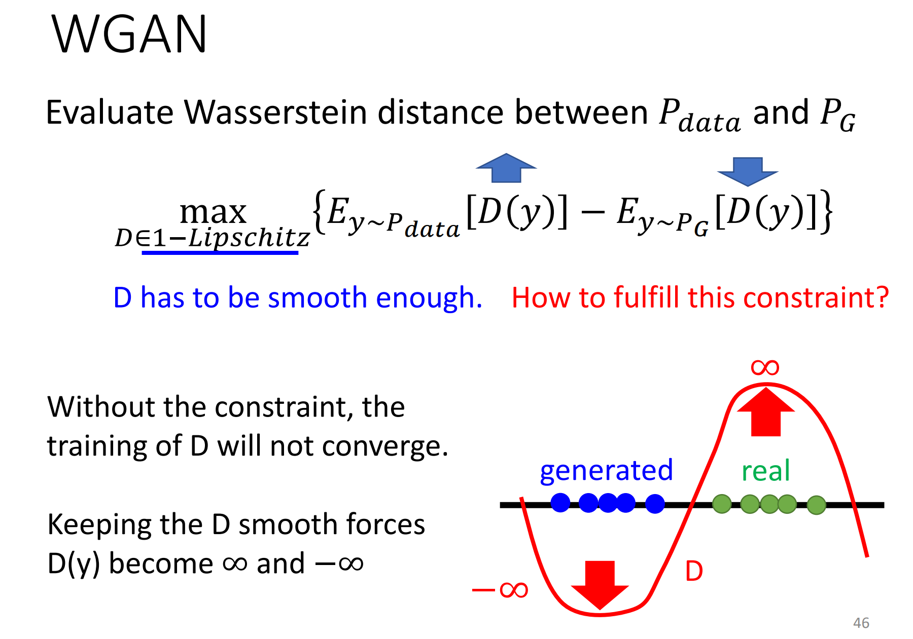

在实践上Wasserstein distance为了达到1-Lipschitz有很多不同的方式。（Keep gradient norm smaller than 1 everywhere）

> GAN的概念和策略比较多、比较难理解哦

依然面临Model Collapse, Model Dropping的问题。评估多样性：Fréchet Inception Distance (FID) ……

### Conditional Generation：条件式生成

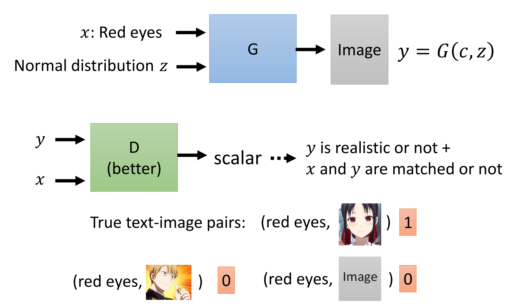

GAN+supervised

### Circle GAN

$$
G:\mathcal{X} \to \mathcal{Y}
$$

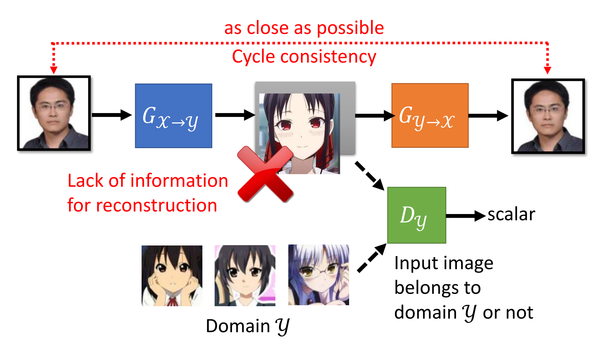

为了避免生成一个无关、“万能”的输出，训练另一个$G_{\mathcal{Y}\to \mathcal{X}}$。

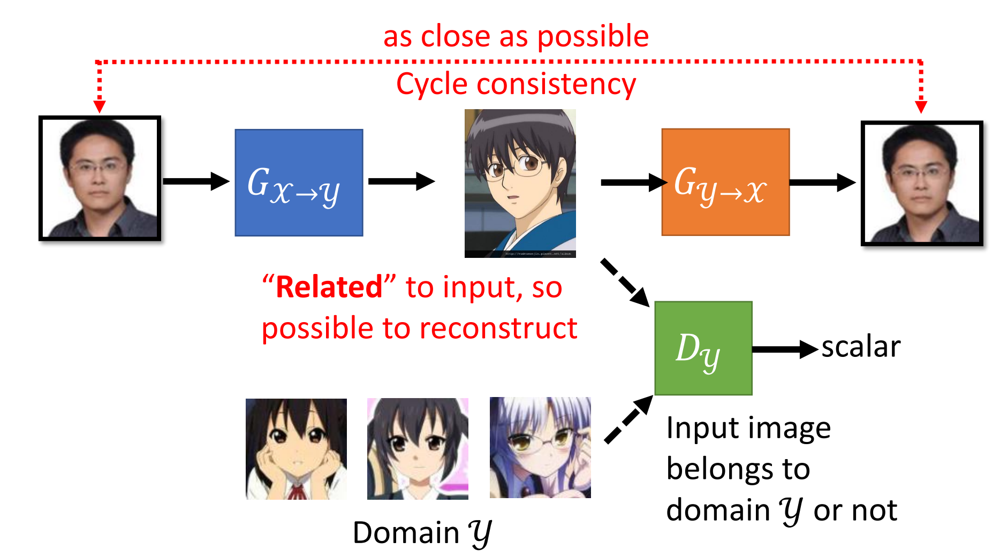

有点像HW05中的Back-translate设计。

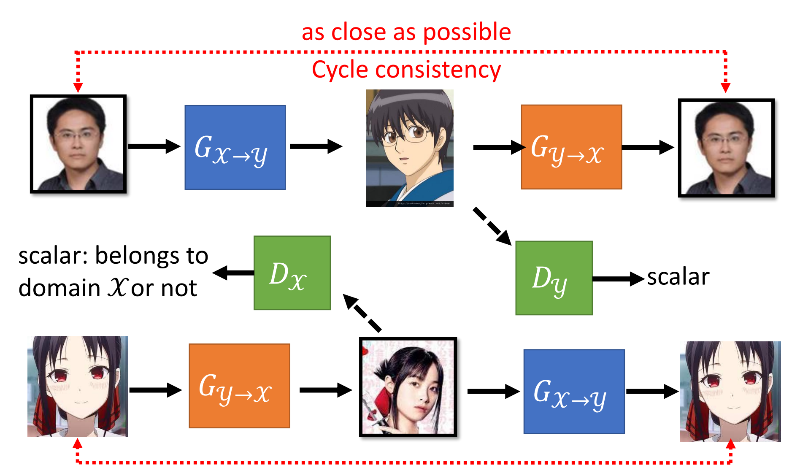

GAN与无监督学习的其他应用：

- [Unsupervised Abstractive Summarization](https://arxiv.org/abs/1810.02851)
- [Unsupervised Translation](https://arxiv.org/abs/1710.04087),[Unsupervised Translation](https://arxiv.org/abs/1710.11041)
- [Unsupervised ASR](https://arxiv.org/abs/1804.00316),[Unsupervised ASR](https://arxiv.org/abs/1812.09323),[Unsupervised ASR](https://arxiv.org/abs/1904.04100)

## HW06

[HW06: Generative Adversarial Network](https://speech.ee.ntu.edu.tw/~hylee/ml/ml2022-course-data/Machine%20Learning%20HW6.pdf)

### 任务介绍

动漫头像生成

- 输入：随机数
- 输出：动漫头像
- 架构：DCGAN/WGAN/WGAN-GP

### 评估标准

FID (Frechet Inception Distance) score

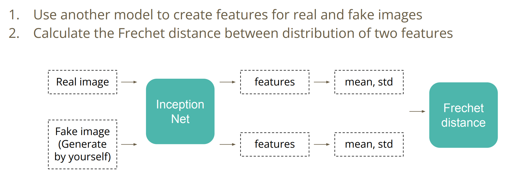

AFD (Anime face detection) rate

Submission中有多少辨认出是动漫头像，越多效果越好。

### 数据集

数据集来自[Crypko](https://crypko.ai/)这个网站可以生成动漫头像。但是当我打开这个网站的时候，该网站提示已经停止了相关服务了。

不过示例代码里面有收集好的图片。总共有71314张图片在 `faces` 文件夹里。与其他HW不同，这次HW允许自己增加图片来提示训练效果。

### Baselines

| Baseline | Suggestion                 | 预估时间     | FID score  | AFD rate |
| -------- | -------------------------- | -------- | ---------- | -------- |
| Simple   | Use sample code(DCGAN)     | < 1h     | FID<=30000 | AFD>=0   |
| Medium   | Use DCGAN with more epochs | 1 ~ 1.5h | FID<=12000 | AFD>=0.4 |
| Strong   | Use WGAN or WGAN-GP        | 2 ~ 3h   | FID<=10000 | AFD>=0.5 |
| Boss     | StyleGAN                   | < 5h     | FID<= 9000 | AFD>=0.6 |

### Medium Baseline

```python
config = {
    "model_type": "GAN",
    "batch_size": 64,
    "lr": 1e-4,
    "n_epoch": 45,
    "n_critic": 2,
    "z_dim": 100,
    "workspace_dir": workspace_dir, # define in the environment setting
}
```

这是第一个epoch:

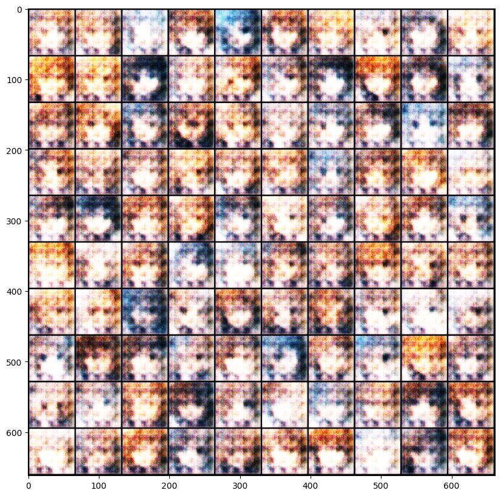

```log
Epoch 1: 100%|██████████| 1115/1115 [02:03<00:00,  9.02it/s, loss_D=0.0816, loss_G=3.91]
```

这是第11个epoch:

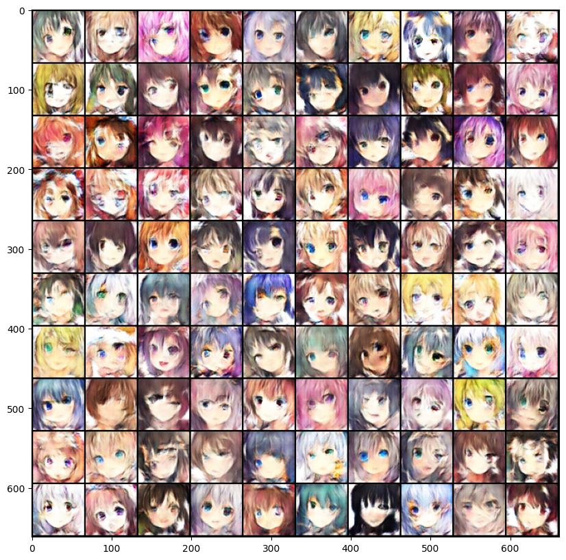

```log
Epoch 11: 100%|██████████| 1115/1115 [02:09<00:00,  8.63it/s, loss_D=0.0425, loss_G=4.35]
```

看起来像蜡笔画一样，挺有意思的。

### Strong Baseline

```python
config = {
    "model_type": "WGAN",
    "batch_size": 64,
    "lr": 1e-4,
    "n_epoch": 45,
    "n_critic": 2,
    "z_dim": 100,
    "workspace_dir": workspace_dir, # define in the environment setting
    "clip_value": 1,
}
```

训练的过程变得很不稳定：

```log
Epoch 8: 100%|██████████| 1115/1115 [02:26<00:00,  7.61it/s, loss_D=-6.5e+3, loss_G=4.18e+3]
```

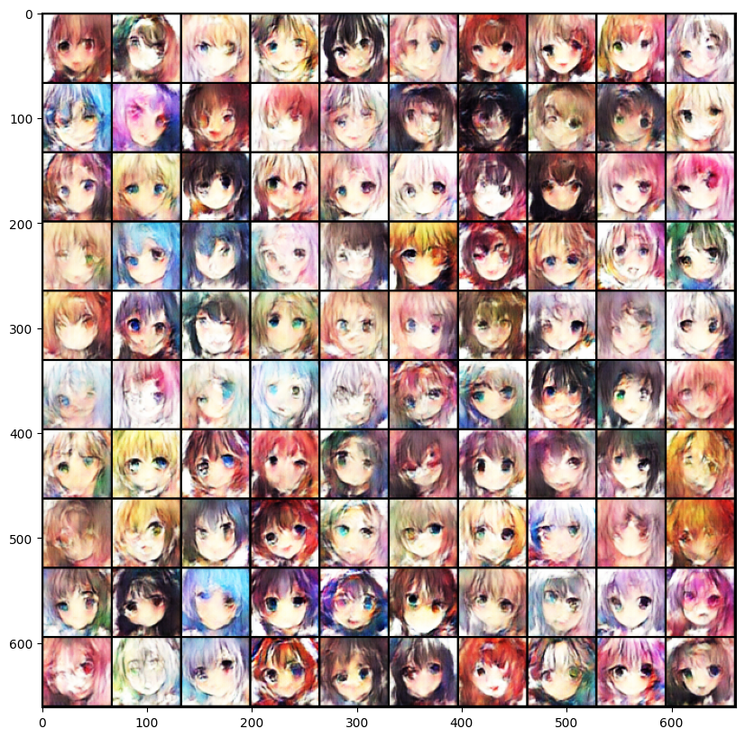

```
Epoch 9: 100%|██████████| 1115/1115 [02:26<00:00,  7.63it/s, loss_D=-1.39e+4, loss_G=6.49e+3]
```

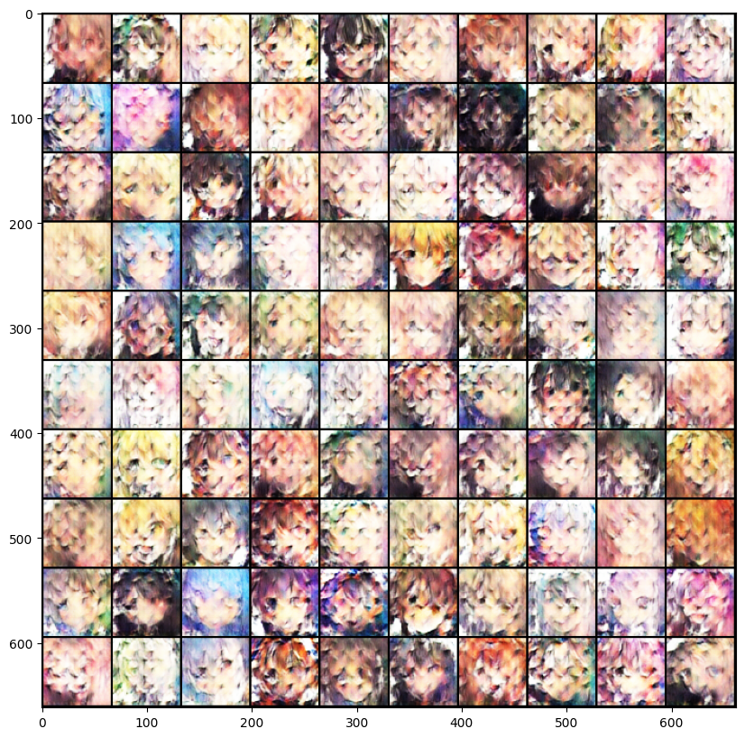

```
Epoch 10: 100%|██████████| 1115/1115 [02:25<00:00,  7.65it/s, loss_D=-1.46e+4, loss_G=6.71e+3]
```

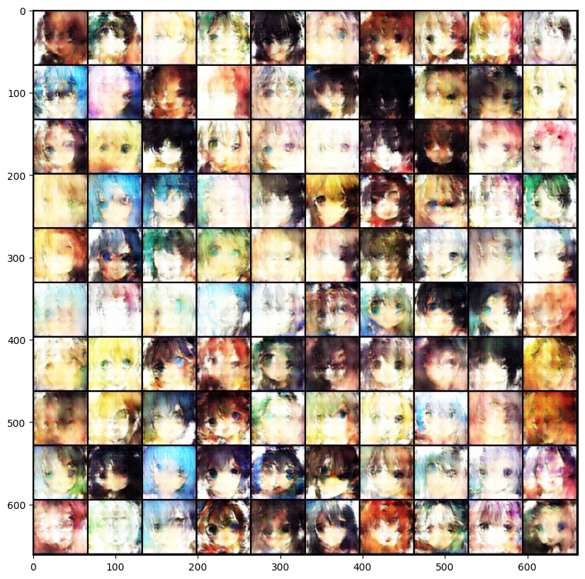

甚至

```
Epoch 11: 100%|██████████| 1115/1115 [02:26<00:00,  7.62it/s, loss_D=-1.51e+4, loss_G=7.03e+3]
```

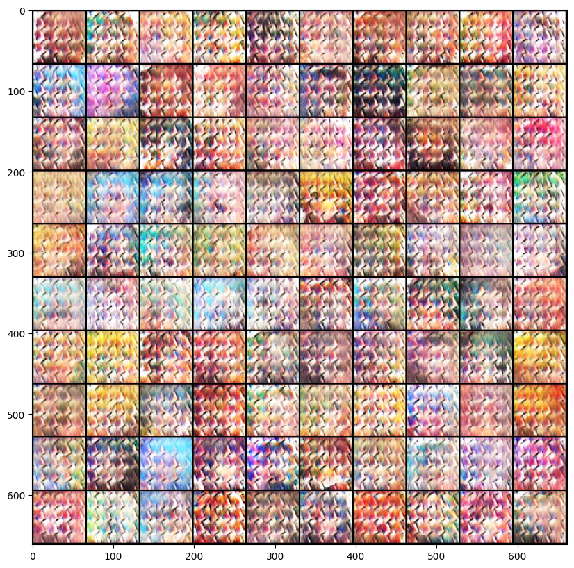

最初，我改用 `torchvision.transforms.v2` 的API后出现了这样的情况：

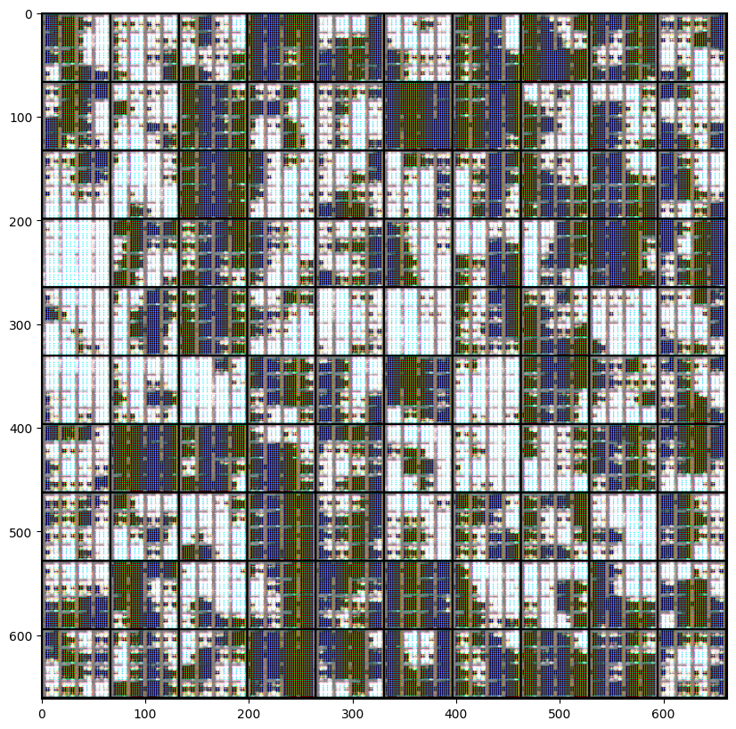

这是因为我的变换是这么写的：

```python
    compose = [
        transforms.ToPILImage(),
        transforms.Resize((64, 64)),
        transforms.ToImage(),
        transforms.ToDtype(torch.float32, scale=True),
        transforms.Normalize(mean=(0.5, 0.5, 0.5), std=(0.5, 0.5, 0.5)),
    ]
```

改成

```python
    compose = [
        transforms.Resize((64, 64)),
        transforms.ToDtype(torch.float32, scale=True),
        transforms.Normalize(mean=(0.5, 0.5, 0.5), std=(0.5, 0.5, 0.5)),
    ]
```

就好了🙄我对torchvision的API不太清楚，我怀疑[Lecture-3](Lecture-3.md)的CNN训练不起来就是因为用了 `ToImage` ，赶紧去掉试试……

epoch 12:

```log
Epoch 12: 100%|██████████| 1115/1115 [02:26<00:00,  7.62it/s, loss_D=-1.5e+4, loss_G=7.14e+3]
```

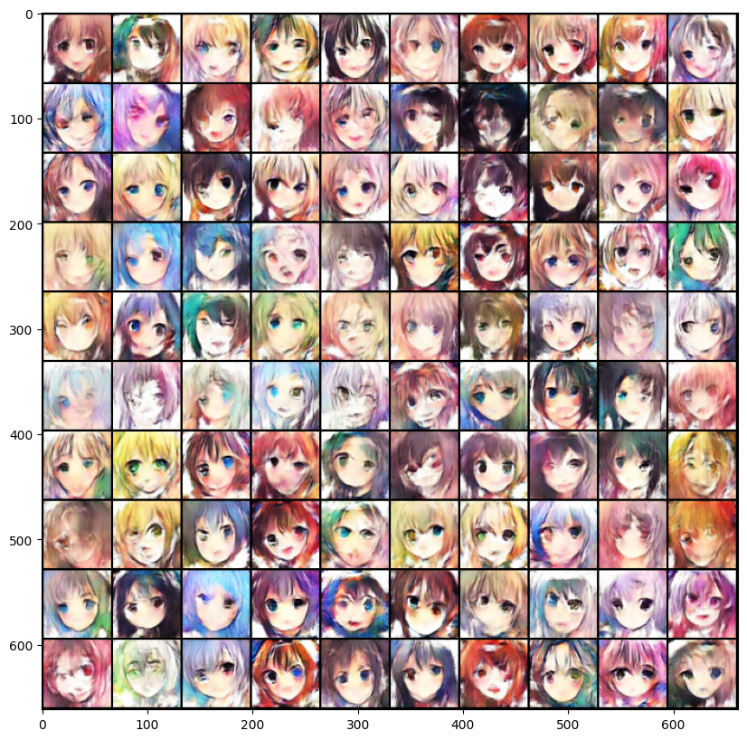

第32个epoch:

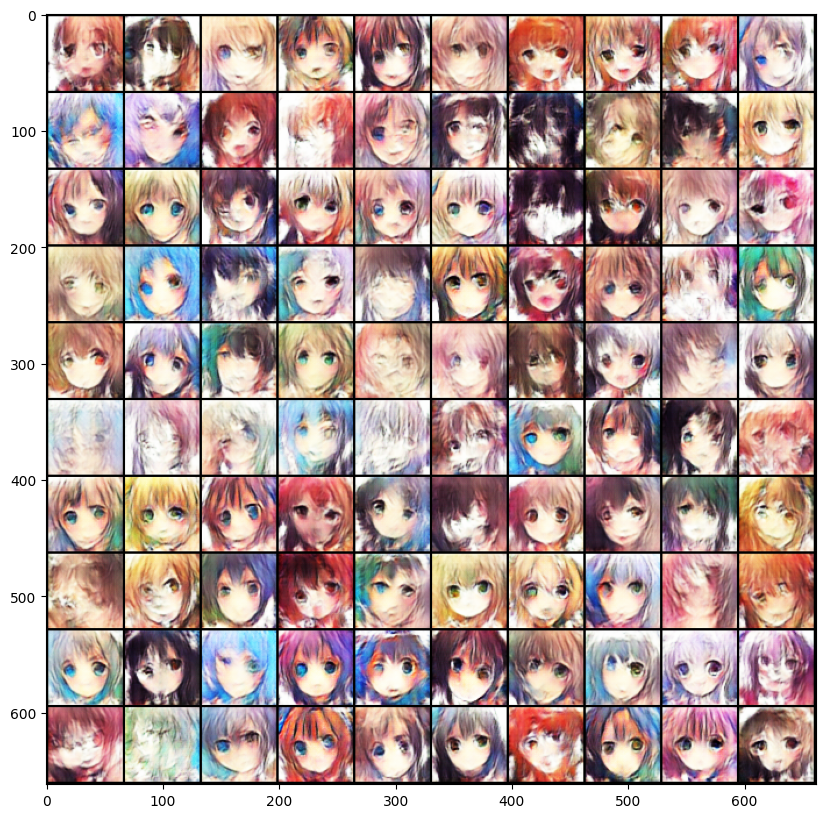

效果不太好。

我的notebook: [HW06.ipynb](https://colab.research.google.com/drive/1wM-p802RKDfQTGD0QanqQUg9vJZ_7sCR)

### 参考资料

- <https://zhuanlan.zhihu.com/p/499841929>

- <https://aaricis.github.io/posts/Homework-6-GAN/>
