## Self-supervised learning for NLP

[Recent Advance of Self-supervised learning for NLP](https://speech.ee.ntu.edu.tw/~hylee/ml/ml2021-course-data/bert_v8.pdf)

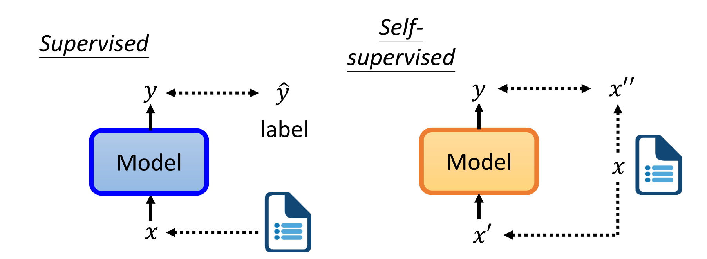

自监督学习就是把$x$分成两部分$x'$和$x''$。把$x'$输入到模型里面输出$y$，想办法让$y$跟$x''$越接近越好。

### BERT 介绍

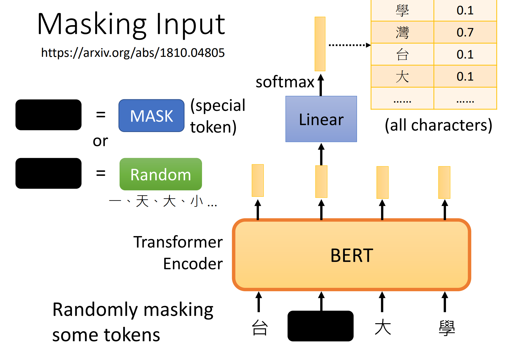

其实这不难做到。经典的就是BERT模型。通过随机位置上的MASK（特殊记号）或Random（随机汉字），让模型预测该位置的汉字，就实现了自监督学习。

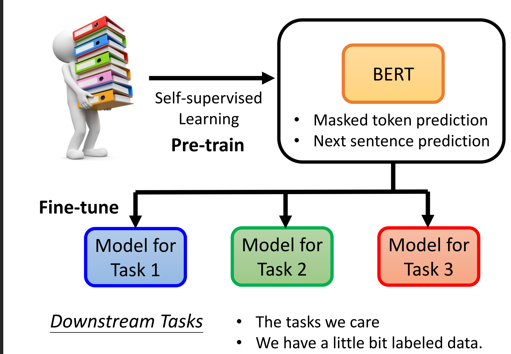

接下来讲的是BERT“理解”语义后，经过一些微调就能做一些下游任务。其实我在[用于分类任务的微调](../从零构建大语言模型/用于分类任务的微调.md)中曾经用GPT类模型做这种微调任务。BERT是$\text{Encoder}$部分，而GPT是$\text{Decoder}$部分。

### 如何使用BERT

Input: sequence; output: class

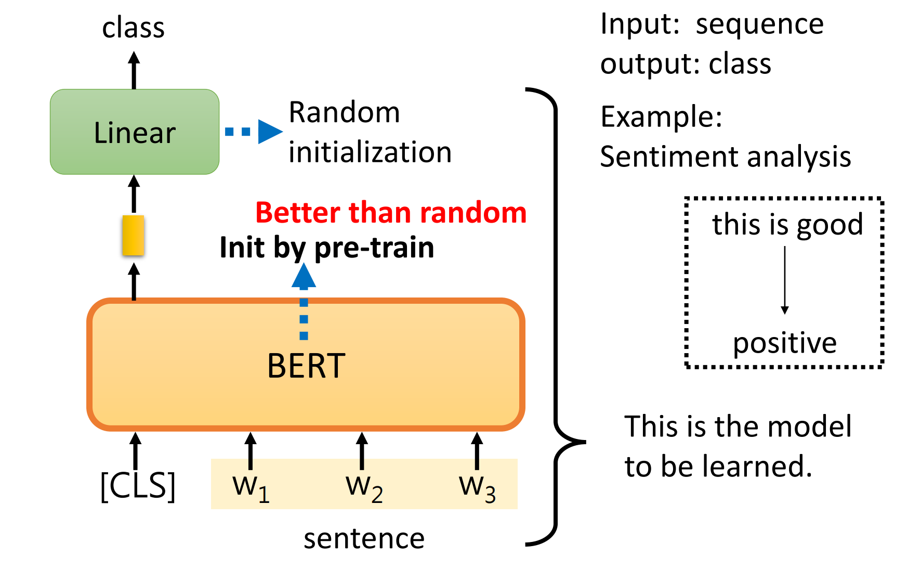

Input: sequence; output: same as input

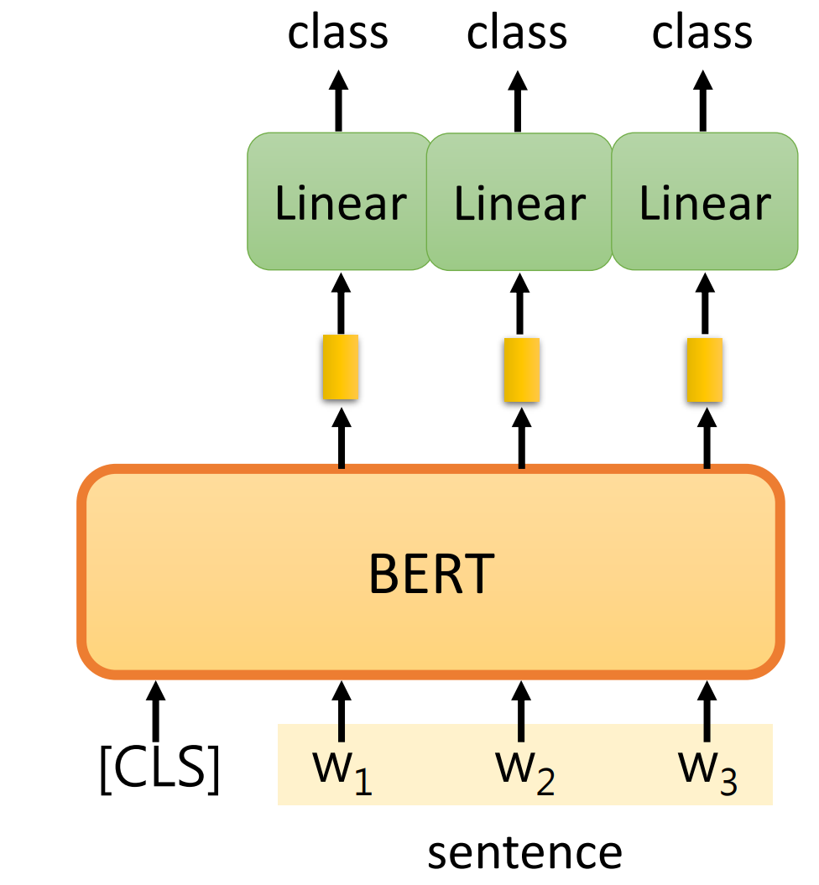

Input: two sequences; Output: a class

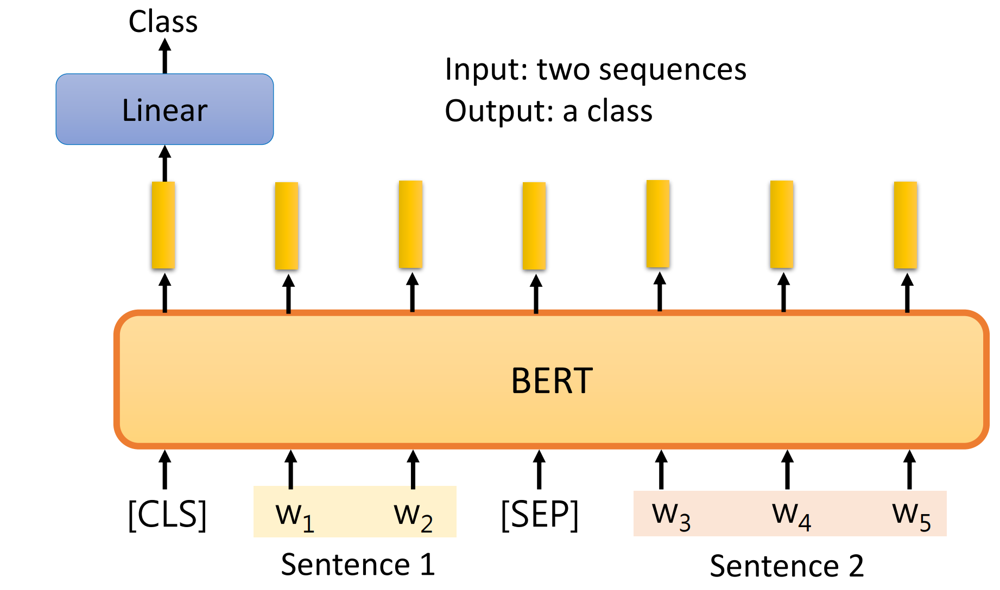

Extraction-based Question Answering (QA)

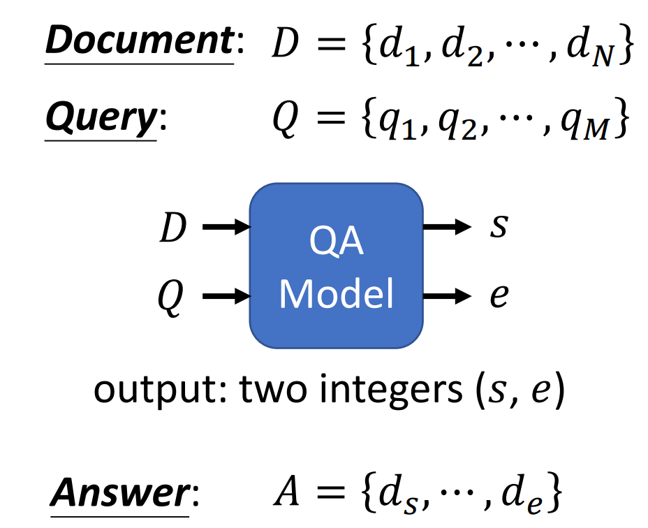

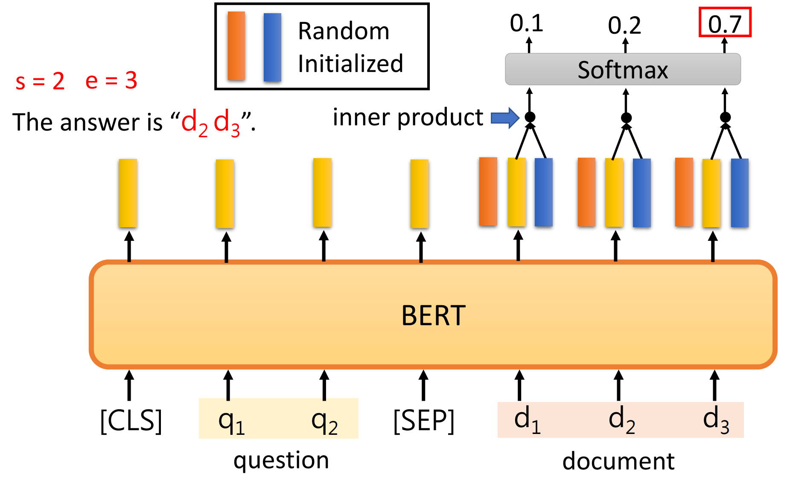

训练的是开始和结束位置两个向量。

### BERT为什么能行

BERT是一个更高级的word embedding~

## Pre-trained Language Models

[Recent Advances in Pre-trained Language Models](https://speech.ee.ntu.edu.tw/~hylee/ml/ml2022-course-data/PLM.pdf)

这部分其实讲的就是[用于分类任务的微调](../从零构建大语言模型/用于分类任务的微调.md)以及[指令遵循微调](../从零构建大语言模型/指令遵循微调.md)。

先是讲了Pre-trained Language Models(PLM)

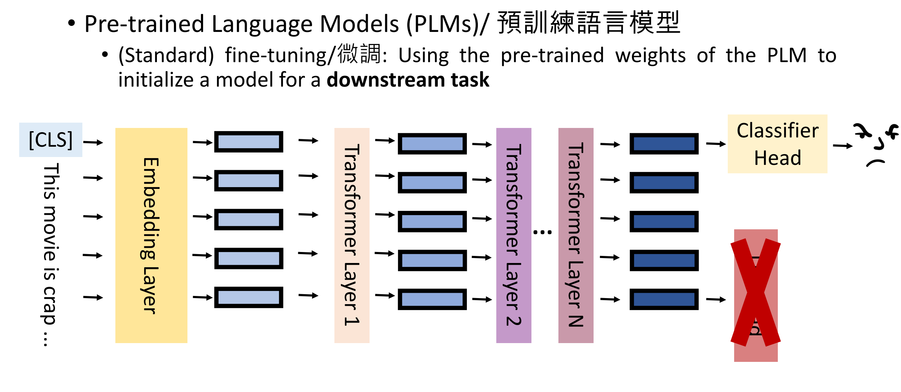

有一些问题：

- 下游任务的数据集不宜获取
- 模型太大，每一种任务都要一份PLM的参数

为此，转向Data-Efficient Fine-tuning: Prompt Tuning，也就是指令遵循微调。

- Few-shot learning: We have some labeled training data
- Semi-Supervised learning: We have some labeled training data and a large amount of unlabeled data

### Prompt Tuning

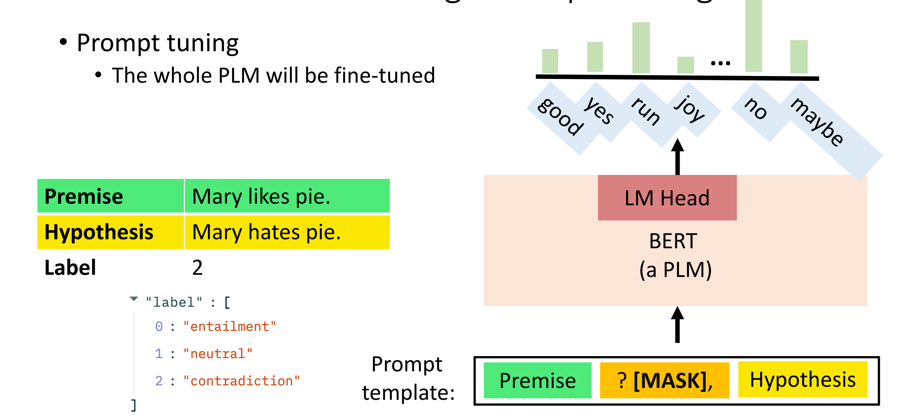

效果原来比更改架构的微调更好🤔：

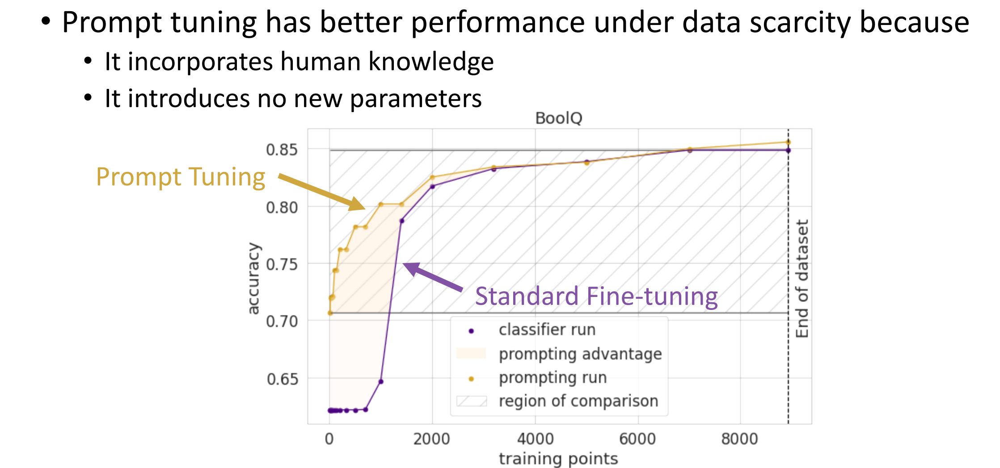

### Few-shot Learning

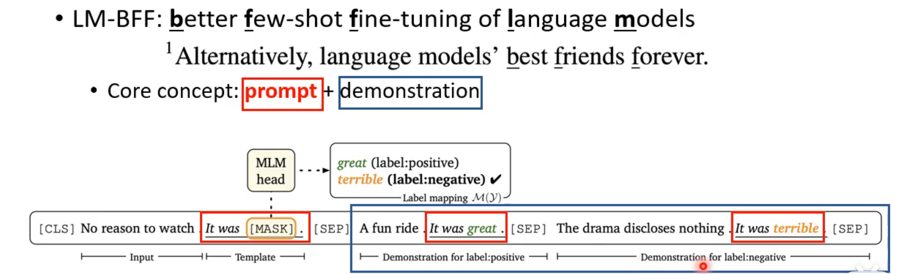

### Semi-supervised Learning

Pattern-Exploiting Training (PET)

- Step 1: Use different prompts and verbalizer to prompt-tune different PLMs on the labeled dataset. 在标签数据上训练多个不同的模型

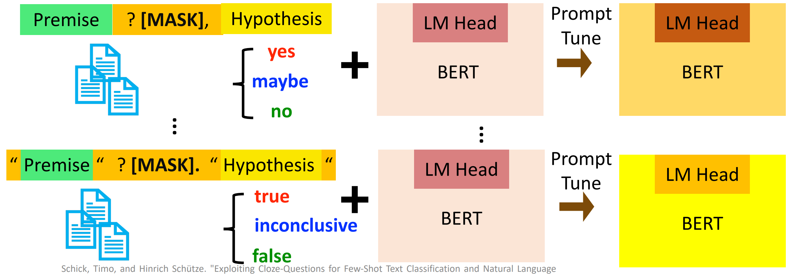

- Step 2: Predict the unlabeled dataset and combine the predictions from different models。有点像交叉验证

- Step 3: Use a PLM with classifier head to train on the **soft-labeled** data set

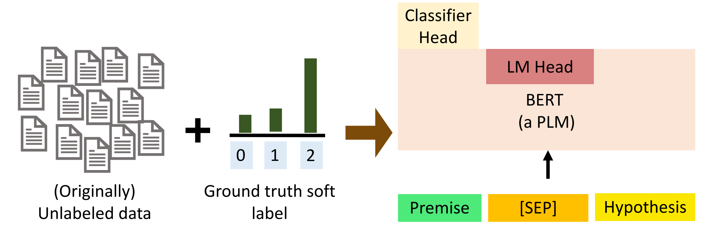

### Zero-shot

只有模型足够大才能做到。

> 助教讲的好杂乱啊🤮暂时跳过……

## Self-supervised learning for Speech and Image

[Self-supervised Learning for Speech and Image](https://speech.ee.ntu.edu.tw/~hylee/ml/ml2022-course-data/SSL_speech_image%20(v9).pdf)

同样是自监督学习，把原来用在文本上的BERT迁移到语音和影像任务上来。

用大量的不需要标注的声音讯号，训练一个语音版的BERT模型出来。

现在，假如要训练一个语音辨识任务的模型，在没有预训练BERT模型之前，我们需要大量的有标注的训练数据：

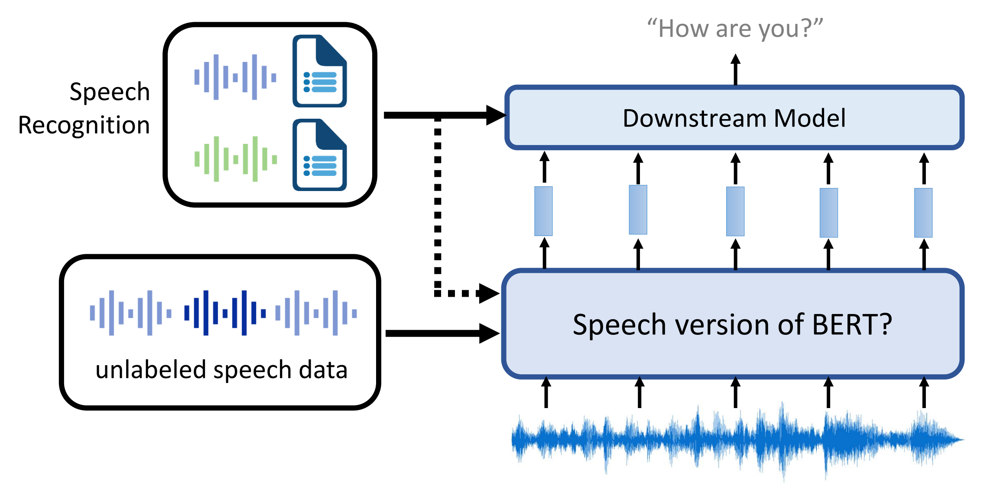

但是通过利用预训练的语音版BERT模型，只需要少量的标注数据，加上下游任务的模型就可以实现。

### Generative Approaches

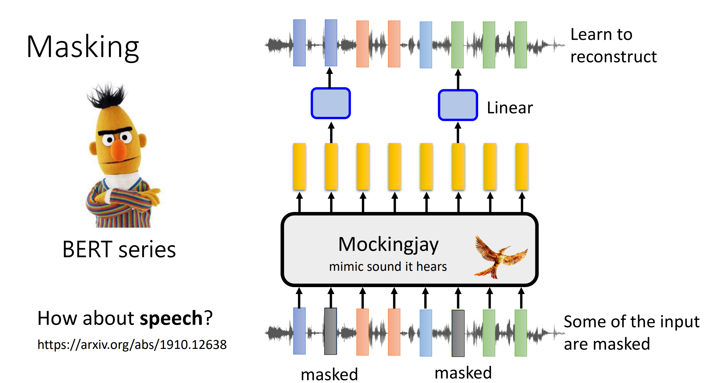

把某些部分的输入用掩码遮住，经过BERT还原回去，跟训练文字的BERT是很相似的。

语音跟文字还是有一些特征、性质上的差异，因此掩码的使用策略可以略有不同。

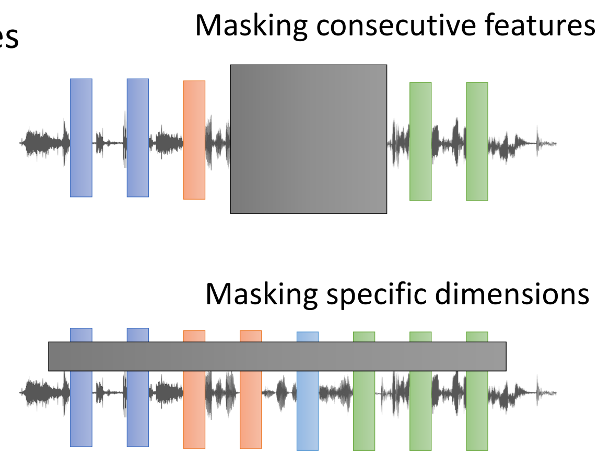

> 能不能把打乱的拼图还原回去？

在语音任务上，GPT系列不同于文本任务的预测下一个token，而是通常预测三个音素。

在影像任务上表现为AI扩图。

### Predictive Approach

预测图片的旋转角度、图片分割后各部分之间的相对位置

### Contrastive Learning

对比学习的基本理念：

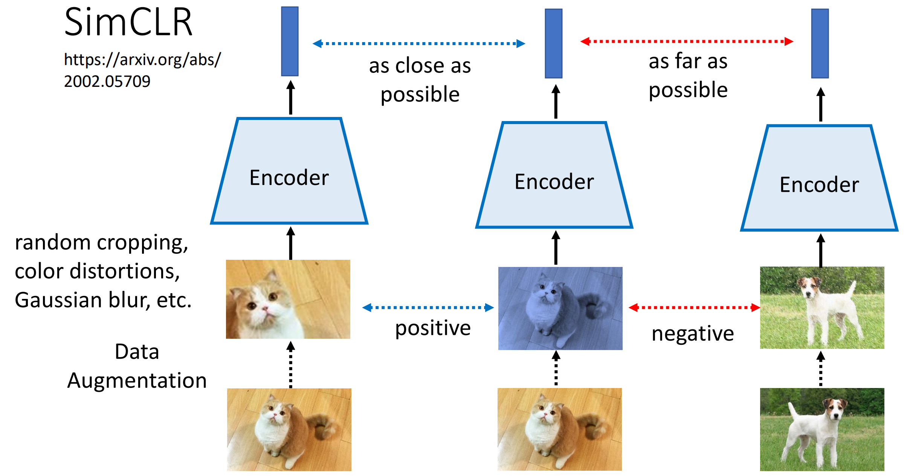

GRU in CPC, CNN in Wav2vec

## HW7: BERT

[Machine Learning HW7: BERT](https://speech.ee.ntu.edu.tw/~hylee/ml/ml2022-course-data/hw7_slides.pdf)

### 任务介绍

中文阅读理解问答任务：使用Bert模型进行抽取式问答（Extractive Question Answering）。输入文本和问题，返回答案在文本中开始和结束的位置。


### 数据集

中文阅读理解

**文本段落：**

新加坡、馬來西亞的華文學術界在==1970==年代後開始統一使用簡體中文；然而==繁體字==在媒體中普遍存在著，例如華人商店的招牌、舊告示及許多非學術類中文書籍，香港和臺灣所出版的書籍也有在市場上流動。當地許 多中文報章都會使用「標題繁體字， 內容簡化字」的方式讓簡繁中文並存。除此之外，馬來西亞所有本地中文 報章之官方網站都是以繁體中文為主要文字。

**问题：**

新加坡的華文學術界在哪個年代後開始使用簡體中文 ?

**答案：**

1970

**问题：**

馬來西亞的華人商店招牌主要使用什麼文字 ?

**答案：**

繁體字

### Tips

- Automatic mixed precision (fp16)
通过降低到FP16的精度，带来两三倍的速度提升！

- Gradient accumulation
如果模型太大，batch_size太大，显存可能不够用。这时候通过单纯减小batch_size可能效果不如大的batch_size。但是通过梯度积累，训练几个批次再更新参数，也可以达到相当于大batch_size的效果。

```python
 if ((batch_idx + 1) % accum_iter == 0) or (batch_idx + 1 == len(train_loader)):
  optimizer.step()
  optimizer.zero_grad()
```

- Ensemble

### Baselines

| Baselines | Score   |
| --------- | ------- |
| Simple    | 0.45139 |
| Medium    | 0.65792 |
| Strong    | 0.78136 |
| Boss      | 0.84388 |

#### Simple Baseline

- Sample Code

#### Medium Baseline

- Apply linear learning rate decay

可以使用Hugging face或pytorch提供的学习率调度器。

- Change value of “doc_stride”

两个窗口之间应该又重叠的部分，避免答案卡在中间。GPT也是这样设置的。

```log
100%
 991/991 [19:49<00:00,  1.18s/it]
Epoch 3 | Step 100 | loss = 0.485, acc = 0.765
Epoch 3 | Step 200 | loss = 0.471, acc = 0.783
Epoch 3 | Step 300 | loss = 0.466, acc = 0.774
Epoch 3 | Step 400 | loss = 0.476, acc = 0.786
Epoch 3 | Step 500 | loss = 0.497, acc = 0.775
Epoch 3 | Step 600 | loss = 0.453, acc = 0.784
Epoch 3 | Step 700 | loss = 0.447, acc = 0.782
Epoch 3 | Step 800 | loss = 0.455, acc = 0.790
Epoch 3 | Step 900 | loss = 0.462, acc = 0.785
Evaluating Dev Set ...
100%
 4131/4131 [13:06<00:00,  5.24it/s]
Validation | Epoch 3 | acc = 0.722
100%
 991/991 [19:48<00:00,  1.18s/it]
Epoch 4 | Step 100 | loss = 0.415, acc = 0.784
Epoch 4 | Step 200 | loss = 0.369, acc = 0.816
Epoch 4 | Step 300 | loss = 0.388, acc = 0.805
Epoch 4 | Step 400 | loss = 0.428, acc = 0.797
Epoch 4 | Step 500 | loss = 0.411, acc = 0.793
Epoch 4 | Step 600 | loss = 0.404, acc = 0.818
Epoch 4 | Step 700 | loss = 0.425, acc = 0.791
Epoch 4 | Step 800 | loss = 0.384, acc = 0.807
Epoch 4 | Step 900 | loss = 0.423, acc = 0.796
Evaluating Dev Set ...
100%
 4131/4131 [13:05<00:00,  5.24it/s]
Validation | Epoch 4 | acc = 0.722
Saving Model ...
Writing model shards: 100%
 1/1 [00:07<00:00,  7.34s/it]
```

#### Strong Baseline

- Improve preprocessing

Sample Code把答案设置在窗口的中间位置，可能导致BERT误以为答案总是在中间。应该添加随机的偏移。

Kaggle提交结果：

Private Score: 0.72558; Public Score: 0.71722

- Try other pretrained models

使用其他[BERT变种的预训练模型](https://huggingface.co/models)

搜索 `chinese` / `wwm` / `QuestionAnswer` 等关键词可以找到很多模型，我这边试试 `luhua/chinese_pretrain_mrc_roberta_wwm_ext_large` 这个模型：

```python
model = BertForQuestionAnswering.from_pretrained("luhua/chinese_pretrain_mrc_roberta_wwm_ext_large").to(device)
tokenizer = BertTokenizer.from_pretrained("luhua/chinese_pretrain_mrc_roberta_wwm_ext_large")
```

然后把 `batch_size` 改成16就不会出现"CUDA out of memory"。

Colab这边最多存5小时，不知道怎么回事 `Accelerator` 没有起作用，每一个epoch（含验证）要跑一个多小时，我只能设置3个epoch。

```log
Start Training ...
100%
 1981/1981 [56:22<00:00,  1.62s/it]
Epoch 1 | Step 100 | loss = 1.375, acc = 0.569
Epoch 1 | Step 200 | loss = 0.933, acc = 0.658
Epoch 1 | Step 300 | loss = 0.658, acc = 0.722
Epoch 1 | Step 400 | loss = 0.571, acc = 0.757
Epoch 1 | Step 500 | loss = 0.552, acc = 0.753
Epoch 1 | Step 600 | loss = 0.509, acc = 0.782
Epoch 1 | Step 700 | loss = 0.460, acc = 0.796
Epoch 1 | Step 800 | loss = 0.517, acc = 0.782
Epoch 1 | Step 900 | loss = 0.474, acc = 0.787
Epoch 1 | Step 1000 | loss = 0.458, acc = 0.791
Epoch 1 | Step 1100 | loss = 0.456, acc = 0.799
Epoch 1 | Step 1200 | loss = 0.411, acc = 0.809
Epoch 1 | Step 1300 | loss = 0.410, acc = 0.813
Epoch 1 | Step 1400 | loss = 0.415, acc = 0.807
Epoch 1 | Step 1500 | loss = 0.397, acc = 0.808
Epoch 1 | Step 1600 | loss = 0.411, acc = 0.823
Epoch 1 | Step 1700 | loss = 0.400, acc = 0.834
Epoch 1 | Step 1800 | loss = 0.406, acc = 0.832
Epoch 1 | Step 1900 | loss = 0.389, acc = 0.825
Evaluating Dev Set ...
100%
 4131/4131 [36:02<00:00,  1.92it/s]
Validation | Epoch 1 | acc = 0.779
100%
 1981/1981 [56:24<00:00,  1.62s/it]
Epoch 2 | Step 100 | loss = 0.268, acc = 0.852
Epoch 2 | Step 200 | loss = 0.230, acc = 0.879
Epoch 2 | Step 300 | loss = 0.259, acc = 0.887
Epoch 2 | Step 400 | loss = 0.247, acc = 0.881
Epoch 2 | Step 500 | loss = 0.241, acc = 0.877
Epoch 2 | Step 600 | loss = 0.238, acc = 0.879
Epoch 2 | Step 700 | loss = 0.248, acc = 0.877
Epoch 2 | Step 800 | loss = 0.231, acc = 0.883
Epoch 2 | Step 900 | loss = 0.258, acc = 0.864
Epoch 2 | Step 1000 | loss = 0.218, acc = 0.889
Epoch 2 | Step 1100 | loss = 0.229, acc = 0.884
Epoch 2 | Step 1200 | loss = 0.230, acc = 0.881
Epoch 2 | Step 1300 | loss = 0.268, acc = 0.874
Epoch 2 | Step 1400 | loss = 0.242, acc = 0.871
Epoch 2 | Step 1500 | loss = 0.246, acc = 0.872
Epoch 2 | Step 1600 | loss = 0.266, acc = 0.874
Epoch 2 | Step 1700 | loss = 0.247, acc = 0.874
Epoch 2 | Step 1800 | loss = 0.228, acc = 0.887
Epoch 2 | Step 1900 | loss = 0.241, acc = 0.886
Evaluating Dev Set ...
100%
 4131/4131 [36:03<00:00,  1.92it/s]
Validation | Epoch 2 | acc = 0.792
100%
 1981/1981 [56:26<00:00,  1.63s/it]
Epoch 3 | Step 100 | loss = 0.145, acc = 0.915
Epoch 3 | Step 200 | loss = 0.148, acc = 0.915
Epoch 3 | Step 300 | loss = 0.151, acc = 0.919
Epoch 3 | Step 400 | loss = 0.147, acc = 0.923
Epoch 3 | Step 500 | loss = 0.142, acc = 0.919
Epoch 3 | Step 600 | loss = 0.139, acc = 0.931
Epoch 3 | Step 700 | loss = 0.131, acc = 0.931
Epoch 3 | Step 800 | loss = 0.125, acc = 0.932
Epoch 3 | Step 900 | loss = 0.141, acc = 0.926
Epoch 3 | Step 1000 | loss = 0.129, acc = 0.928
Epoch 3 | Step 1100 | loss = 0.144, acc = 0.924
Epoch 3 | Step 1200 | loss = 0.133, acc = 0.917
Epoch 3 | Step 1300 | loss = 0.129, acc = 0.924
Epoch 3 | Step 1400 | loss = 0.124, acc = 0.936
Epoch 3 | Step 1500 | loss = 0.130, acc = 0.926
Epoch 3 | Step 1600 | loss = 0.128, acc = 0.931
Epoch 3 | Step 1700 | loss = 0.138, acc = 0.921
Epoch 3 | Step 1800 | loss = 0.132, acc = 0.921
Epoch 3 | Step 1900 | loss = 0.119, acc = 0.931
Evaluating Dev Set ...
100%
 4131/4131 [36:01<00:00,  1.91it/s]
Validation | Epoch 3 | acc = 0.795
```

#### Boss Baseline

- Improve postprocessing

如果 predicted `end_index < start_index` 怎么办？

```python
def evaluate(data, output):
    answer = ''
    max_prob = float('-inf')
    num_of_windows = data[0].shape[1]
    
    for k in range(num_of_windows):
        start_logits = output.start_logits[k]  # shape: (seq_len,)
        end_logits = output.end_logits[k]     # shape: (seq_len,)
            
        # 向量化计算所有组合的概率和 (seq_len, seq_len)
        prob_matrix = start_logits.unsqueeze(1) + end_logits.unsqueeze(0)
            
        # 生成上三角掩码（确保end >= start）
        mask = torch.triu(torch.ones_like(prob_matrix, dtype=torch.bool))
        prob_matrix = prob_matrix.masked_fill(~mask, float('-inf'))
            
        # 找到最大概率的合法组合
        best_prob, best_idx = torch.max(prob_matrix.view(-1), dim=0)
        best_start = best_idx // prob_matrix.size(0)
        best_end = best_idx % prob_matrix.size(0)
    
        if best_prob > max_prob:
            max_prob = best_prob
            answer = tokenizer.decode(data[0][0][k][best_start : best_end + 1])
    
    return answer.replace(' ', '')
```

可以进一步限制 `end_index` 跟 `start_index` 的插值。

- Further improve the above hints

可能需要Ensemble才能通过Boss Baseline。

### Reports

1. After your model predicts the probability of answer span start/end position, what rules did you apply to determine the final start/end position? (the rules you applied must be different from the sample code)

- 向量化计算所有组合的概率和 (seq_len, seq_len)
- 通过上三角掩码确保end >= start
- 找到最大概率的合法组合

1. Try another type of pretrained model which can be found in huggingface’s Model Hub (e.g. BERT -> BERT-wwm-ext, or BERT -> RoBERTa ), and describe
 - the pretrained model you used
 - performance of the pretrained model you used
 - the difference between BERT and the pretrained model you used (architecture, pretraining loss, etc.)

`luhua/chinese_pretrain_mrc_roberta_wwm_ext_large`

> 我的notebook: [HW07.ipynb](https://colab.research.google.com/drive/1IRSmIGwF99ElkH-cfcPls7osHi9_5Ykg)

### 参考资料

- [李宏毅-ML2022-HW7-BERT](https://aaricis.github.io/posts/Homework-7-BERT/)
- [李宏毅2022机器学习作业HW7记录](https://zhuanlan.zhihu.com/p/497658546)
