## Basic Idea

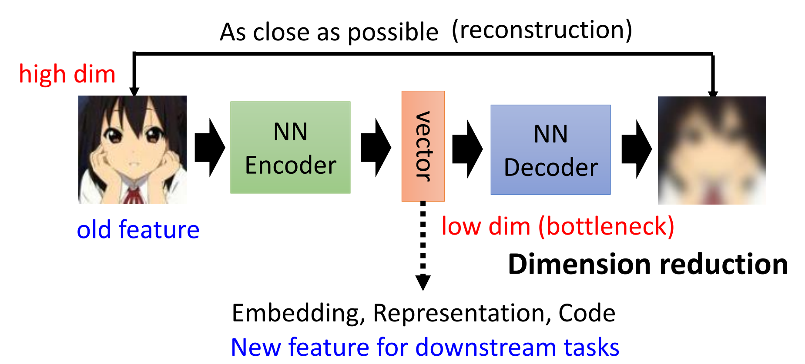

这个例子很像[Circle GAN](Lecture-6.md#Circle%20GAN)。$\text{Encoder}$做了降维，提取出Embedding/Representation，供下游任务学习。

很多同种类的图片具有某些相同的模式，因此可以降维。

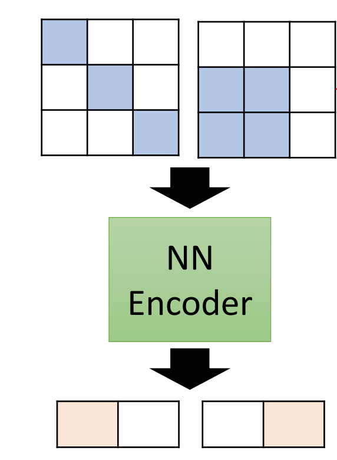

去噪声Auto-encoder

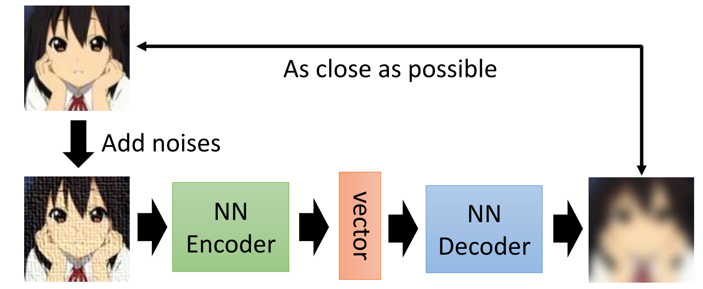

BERT就是一种De-noising Auto-encoder。

## 特征解耦（Feature Disentanglement）

我们很自然地去思考Embedding应该包含了哪些信息。比如输入一张图片，Embedding应该含有对象、风格信息；输入 一段音频，Embedding应该含有内容、讲话人的音色；输入句子，Embedding应该含有句法、语义。

Embedding中哪些部分是代表这些特征？能不能把它们单独提取出来组合？就引入了特征解耦这一技术。

**应用**：声音转换

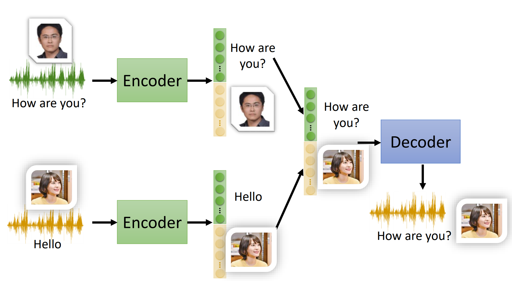

## 其他应用

生成器

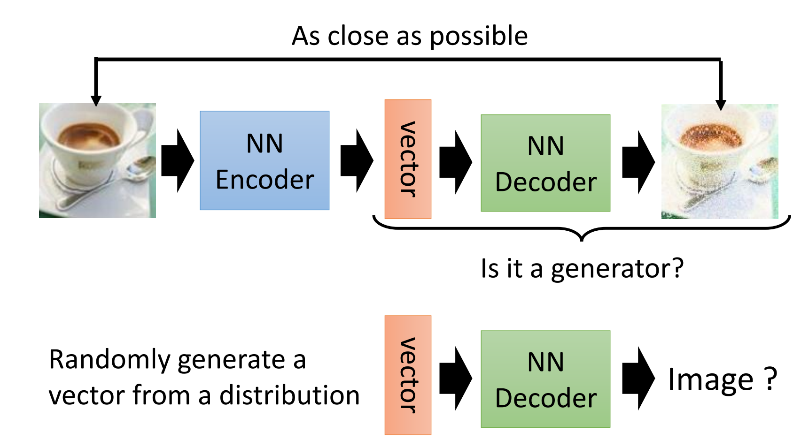

压缩

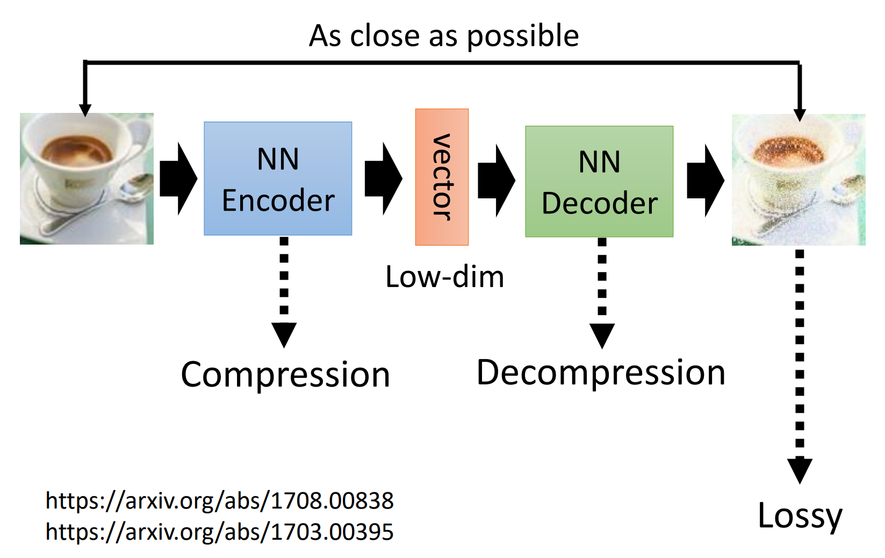

异常检测

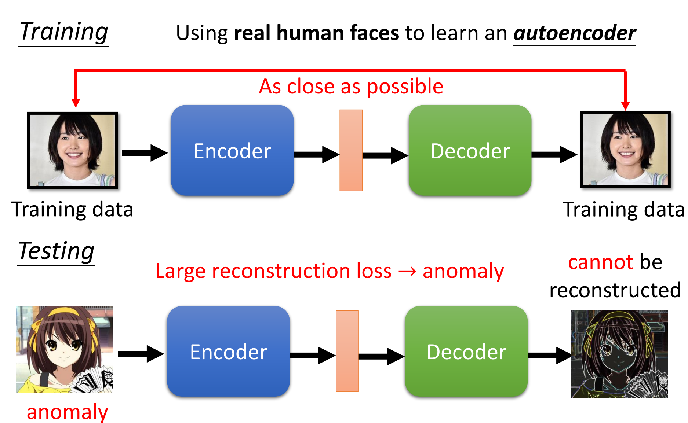

## 异常检测

[Anomaly Detection](https://github.com/Fafa-DL/Lhy_Machine_Learning/blob/main/2021%20ML/07%20Self-Supervised%20Learning/Anomaly%20Detection%20(v9).pdf)

### 问题建模

给定训练数据集${x_{1},x_{2},\dots,x_{N}}$，找到一个函数检测输入$x$是否与训练数据相似。

与二分类问题还不一样，这里的输入数据只有一类，属于自监督学习。

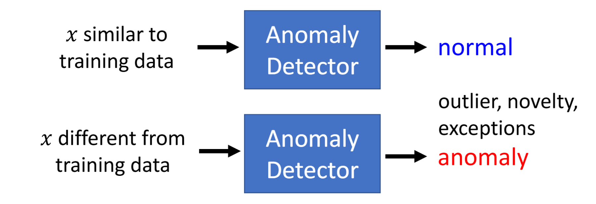

另一个原因是，“异常”包含所有不相同的种类，无法完全收集，有些情况是很难收集。这就造成异常检测不是一个单纯的二分类问题。

### 类别

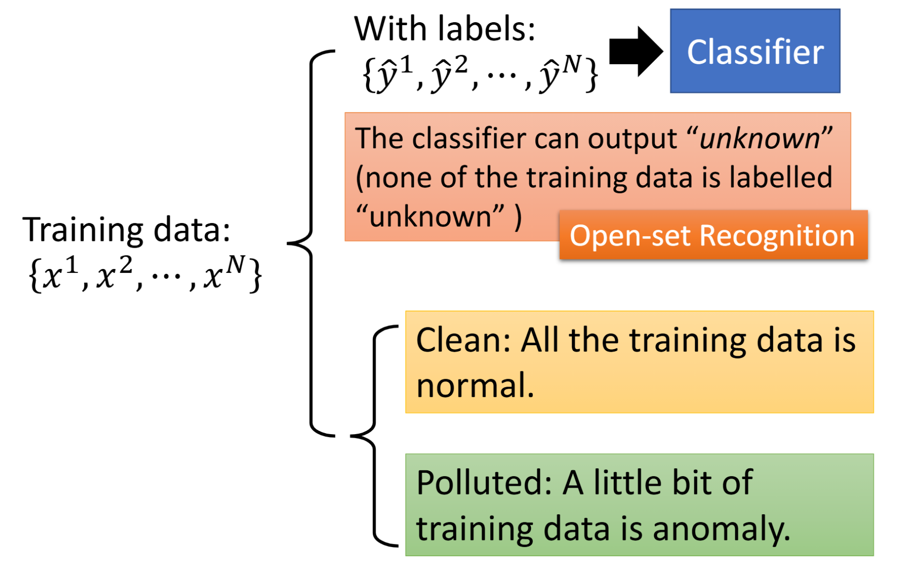

训练数据也可以有标签。

### With Classifier

比如说做一个是不是辛普森家族的异常检测。数据集都是辛普森家族成员图片，然后有每张图片有标签（霸子、麗莎、荷馬、美枝）。

训练的这个分类器除了输出类别外，还有一个信息分数：

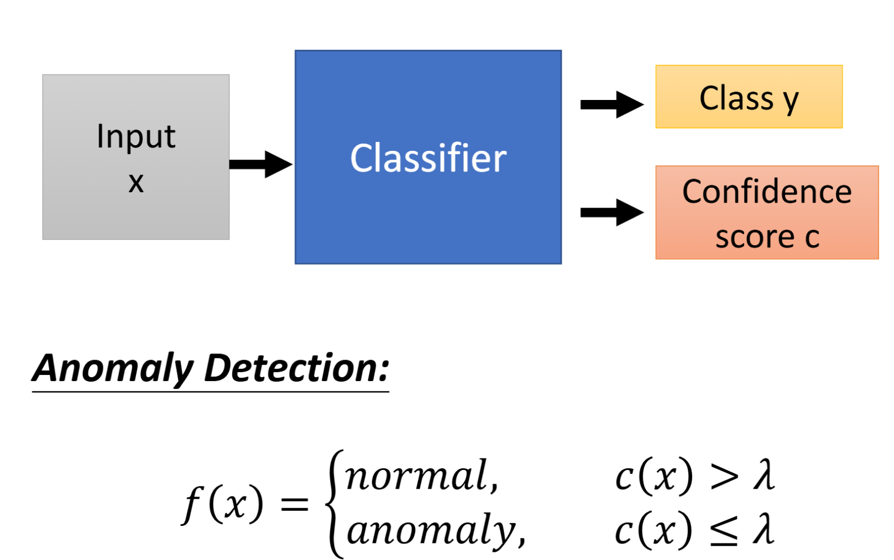

如何评估分数呢？其实多分类任务的 `softmax` 函数输出就是一个概率分布。

**异常检测系统**的框架：

**训练集**：图片$x$及其辛普森家族成员标签$\hat{y}$。训练一个分类，并且可以获得信心分数$c(x)$。

$$
f(x)=\begin{cases}
nor mal, & c(x) > \lambda, \\
anomaly, & c(x) \le \lambda
\end{cases}
$$

**验证集**：图片$x$只需要标明是否是辛普森家族成员。计算$f(x)$的表现，调整$\lambda$。

**测试集**：图片$x$ -> 是否是辛普森家族。

### Without Labels

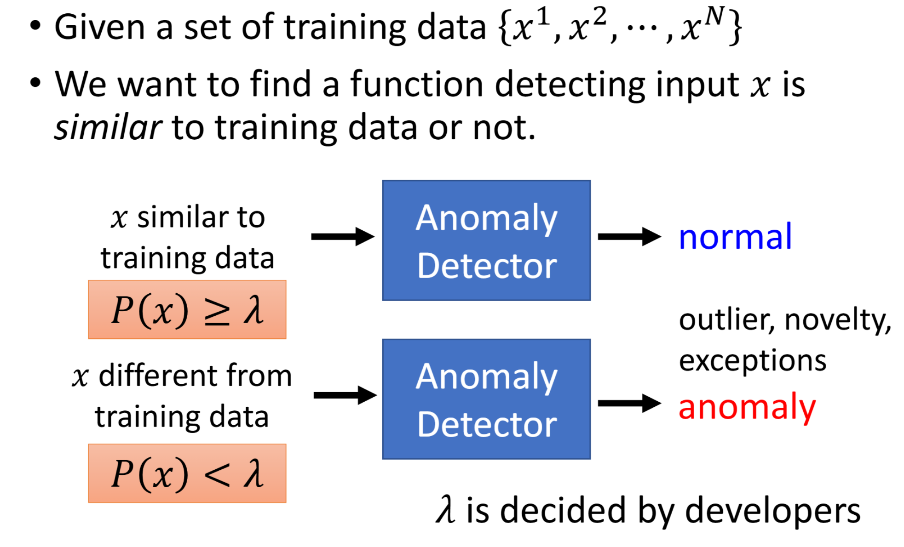

找到一个分布$f_{\theta }(x)$使得训练资料出现的可能性最大：

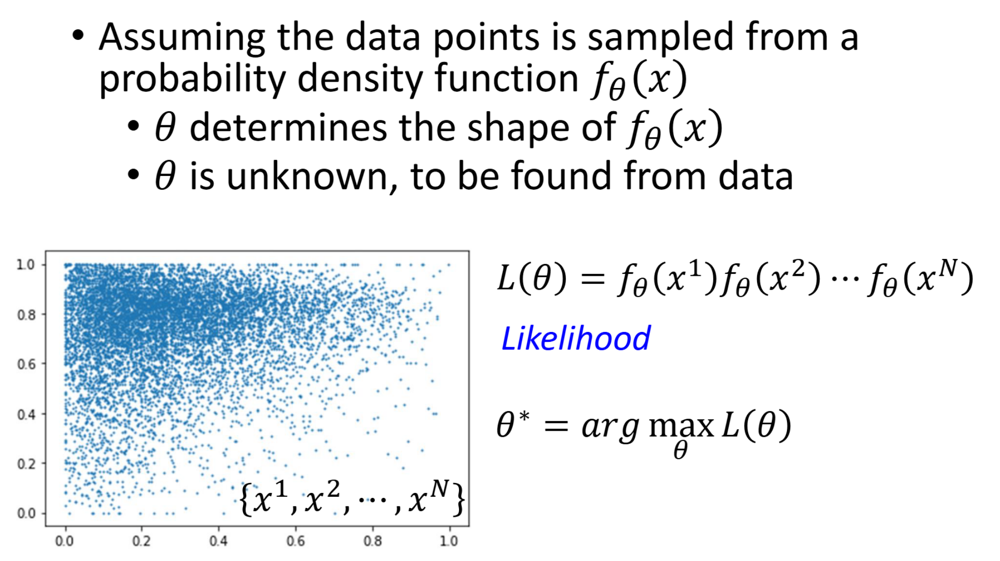

一个常用的分布就是高斯分布。我对这种形式的Gaussian Distribution没有非常熟悉。

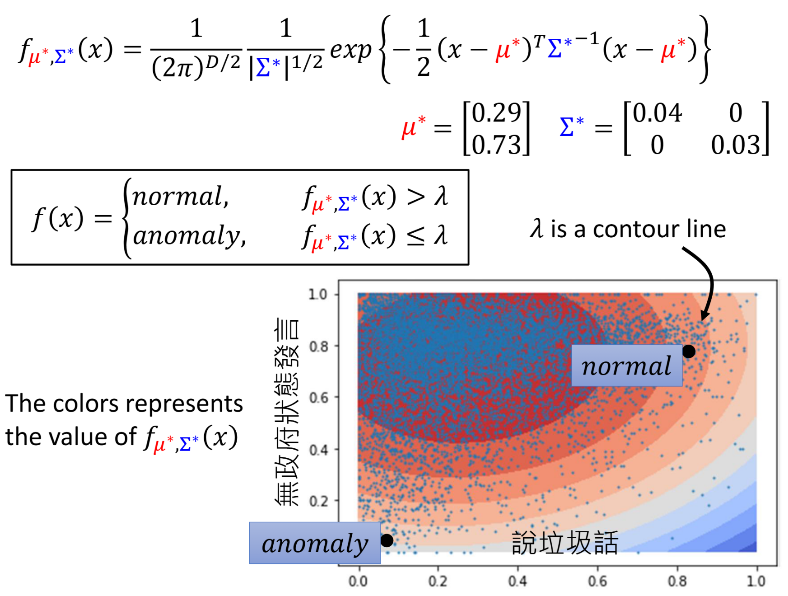

这里是两个特征找到的高斯分布。对于机器学习来说，我们可以加入其他许多特征。

## HW8: Anomaly Detection

[Machine Learning Homework 8 Anomaly Detection](https://speech.ee.ntu.edu.tw/~hylee/ml/ml2022-course-data/Machine%20Learning%20Homework%208%20Anomaly%20Detection.pdf)

### 任务介绍

这次HW要做的是异常检测（自监督学习）。

训练一个模型，能够判断给定的图片是否跟训练数据相似。

### 数据集

训练数据：10000张

测试数据：20000张（10000张与训练数据分布相同，label是0；10000张是另外的分布，label是1）。

每个.npy文件都是[64, 64, 3]的图片。

### 方法


Auto-encoder的架构。

### 评估指标

ROC/AUC score

### Baselines

#### Simple Baseline(AUC>0.53150)

示例代码有三种Auto-encoder，直接运行都可以通过。

#### Medium Baseline(AUC>0.73171)

调整模型架构。修改fcn网络的层数和参数。

```python
class fcn_autoencoder(nn.Module):
    def __init__(self):
        super(fcn_autoencoder, self).__init__()
        self.encoder = nn.Sequential(
            nn.Linear(64 * 64 * 3, 1024),
            nn.ReLU(),
            nn.Linear(1024, 512),
            nn.ReLU(),
            nn.Linear(512, 256),
            nn.ReLU(),
            nn.Linear(256, 64),
            nn.ReLU(),
            nn.Linear(64, 8)
        )

        self.decoder = nn.Sequential(
            nn.Linear(8, 64),
            nn.ReLU(),
            nn.Linear(64, 256),
            nn.ReLU(),
            nn.Linear(256, 512),
            nn.ReLU(),
            nn.Linear(512, 1024),
            nn.ReLU(),
            nn.Linear(1024, 64 * 64 * 3),
            nn.Tanh()
        )

    def forward(self, x):
        x = self.encoder(x)
        x = self.decoder(x)
        return x
```

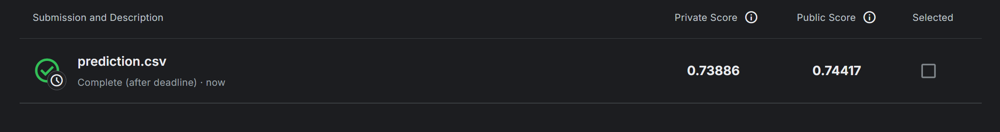

#### Strong Baseline(AUC>0.76739)

Multi-encoder auto-encoder

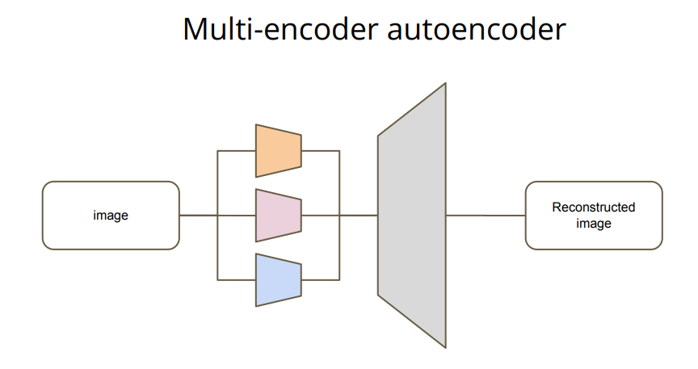

进一步增加FCN的参数：

```python
class fcn_autoencoder(nn.Module):
    def __init__(self):
        super(fcn_autoencoder, self).__init__()
        self.encoder = nn.Sequential(
            nn.Linear(64 * 64 * 3, 2048),
            nn.ReLU(),
            nn.Linear(2048, 1024),
            nn.ReLU(),
            nn.Linear(1024, 512),
            nn.ReLU(),
            nn.Linear(512, 256),
            nn.ReLU(),
            nn.Linear(256, 128),
           
        )
        
        self.decoder = nn.Sequential(
            nn.Linear(128, 256),
            nn.ReLU(),
            nn.Linear(256, 512),
            nn.ReLU(),
            nn.Linear(512, 1024),
            nn.ReLU(),
            nn.Linear(1024, 2048),
            nn.ReLU(),
            nn.Linear(2048, 64 * 64 * 3),
            nn.Tanh())

    def forward(self, x):
        x = self.encoder(x)
        x = self.decoder(x)
        return x

```

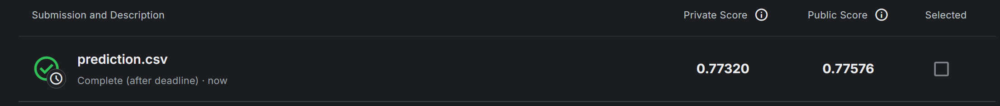

#### Boss Baseline(AUC>0.80072)

Add random noise and an extra classifier

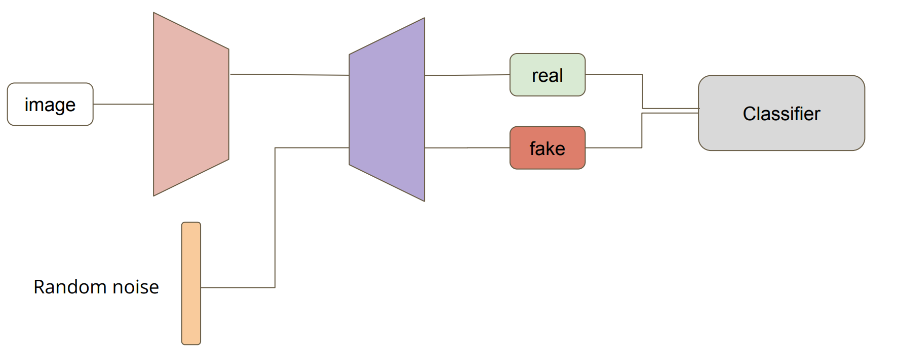

加上scheduler前后，差异非常明显啊！

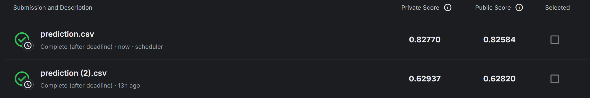

### Report

1. Make a brief introduction about variational autoencoder (VAE). List one advantage comparing with vanilla autoencoder and one problem of VAE.

 关于VAE模型可以看[一文搞懂所有 VAE 模型（4个AE+12个VAE原理汇总）](https://zhuanlan.zhihu.com/p/682709613)。但是大概看了一下，看不太懂www
