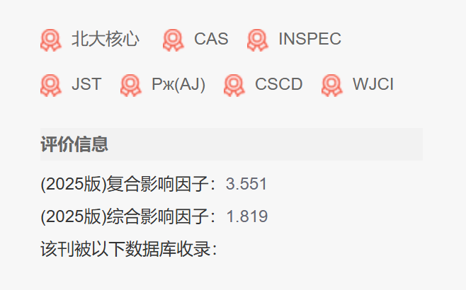
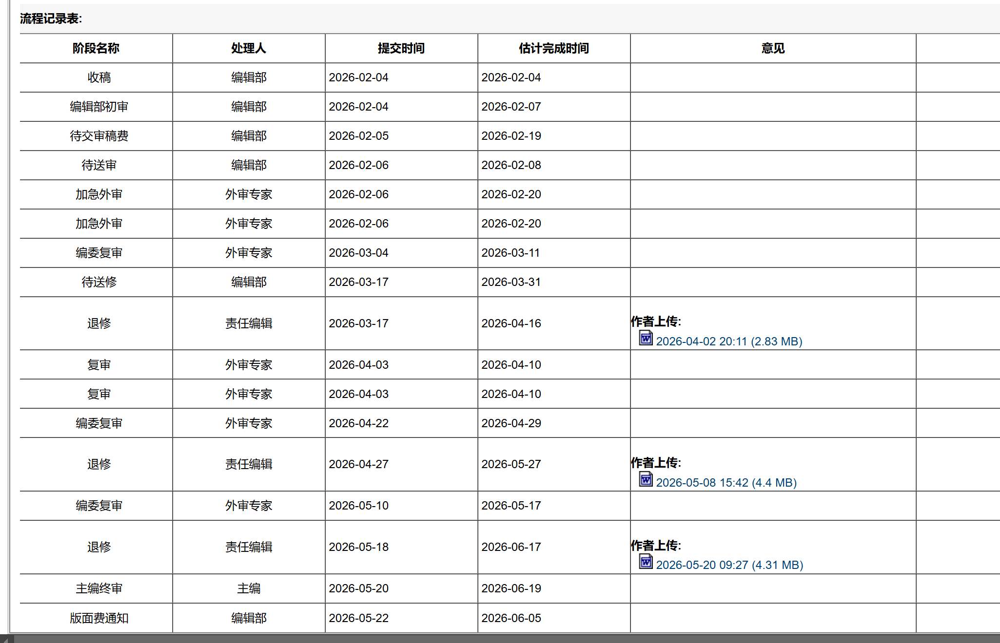

前前后后搞了一年多，写出了一篇论文，终于被《计算机工程》录用了。前天看到稿件采编系统的版面费通知，很感慨。我在这篇论文上投入了大量时间精力。借这篇文章分享我的投稿经验，顺便回顾我与论文的历程。翻看聊天记录，2024年4月19日，我向导师提出前人论文一个不够好的地方。应该是那前几天我都在阅读屎山论文代码。在那个时代，我还在亲自阅读和理解代码。阅读了两篇相关工作的代码后，我从中对比发现了改进点。但是这个发现是远远不够的，导师给出另一领域的处理。我研究了几天，理解了核心思路，觉得完全可以迁移应用。比完算法初赛后，2025年五一的时候，我开始构思架构并编写代码。然后用Visio画图。他问我想试试A类的英文的，还是弄一篇B类的中文的。一上来起点就很高，其实是喜欢画大饼。“取乎上者得其中，取乎中者得其下”。我当时不懂，前段时间也看英文文献看得头大，就选了中文的。事实证明中文比英文难录用……深度学习当时也不太懂（今年学了NTU李宏毅機器學習课程才有系统性的理解），按自己的模糊理解慢慢摸索。一开始他还想投《软件学报》，真是不自量力。但苦的就是我了，从五月底开始快半年都在让我改这个改那个，严重打击了我的心情。十一月底转向《计算机工程与应用》投出。一审不痛不痒，二审只给四个问题很难回答，有刻意刁难的嫌疑。我本来想办法写了不少辩解，反被导师驳斥“不正面回复”。我红温之下删去了大量内容，非常抵触地重写。这次拖了一个月后果然拒稿，但是给的意见其实能改，真是离谱！而且它这个流程是一审给一个人看后换一个人二审，非常奇怪。听同学说进EI后变得非常难搞，确实如此啊。

二月初让我转向《计算机科学》或《计算机工程》。我看了一下知网，《计算机工程》的影响因子高一些，就选择了它。

投稿时需要填写两三个推荐审稿人。按照指引汇款审稿费后进入初审阶段。期间赶上春节，所以过了六个星期才返回结果，给了三个审稿人，十多二十条意见。跟《计算机工程与应用》相比之下，这些意见更具体，更专业，也不算难改，审稿人之间的意见有的是重复的。复审用了24天，返回了4条意见，主要是让增加对比方法和一些图表修改的。让改什么我就改什么。修改的时候看清楚要求，这些要求好像是会变的。我这边的要求是回答意见+在何处做了修改后的段落，还要在上传的修改稿中把修改的部分标红。复审后修改时跟我说：“本刊最多有2轮专家复审，本次为最后一次，复审不过会被遗憾退稿，建议作者认真回应专家意见。若能通过复审，则本次为知网首发前的最后一次修改，之后不再接受版本修改与替换……”但实际上还有第三次修改，主要是格式问题。这次编辑部给的意见中出现了：“**为了提升您文章的国际传播和学术影响力，本刊从2027年（文章见刊时间）开始采用英文长摘要出版，因此请您把中文摘要改为1000字以上**……”。所以这次我把摘要也重写了一遍。这次修改提交后直接变成“主编终审”，过量两天就是“版面费通知”了。在“主编终审”的时候，我赶紧办理了“版权协议”和保密审查证明并寄出。快递很快就到了，也有人在那边马上签收。除了审稿过程中会拖过几天外，期刊的工作效率是很高的，整体体验很好。

> （流程如上↑，修改意见太长，已经被我隐藏了）

我投稿过程中一直都比较焦虑，特别是第一次被拒稿后。因此我也看了一些分享经验的文章，稍微缓解了一下焦虑。现在被录用后，我也要抒发感想。初审意见多不怕，只要能改，就会一直让你改到录用为止，认真回应，不用焦虑！

能以本科生第一作者完成一篇论文的全过程，我收获了经验，也尝遍了酸甜苦辣，途中不乏动摇与自我怀疑。收到版面费通知的那一刻，我长舒一口气，心中涌上的不是欣喜，而是一种如释重负的轻松——仿佛终于走完了一道必须支付的关卡。如今回望，最初的激情与理想主义早已被消磨殆尽，剩下的只是沉甸甸的责任与无法挣脱的现实枷锁。那些关于纯粹学术的美好想象，终究渡不过泥沙俱下的长河——你拼尽全力划桨，却发现水下的暗流早已替许多人标好了航向。

回想大一的时候，曾以为做学术研究对我来说是一个很好的施展平台，但后来的经历让我彻底祛魅。还好我反而沉淀了深厚的编程和计科功底，这里才有真正的自由创造，才有人类天赋能力和涌现和天才般的炫技。
