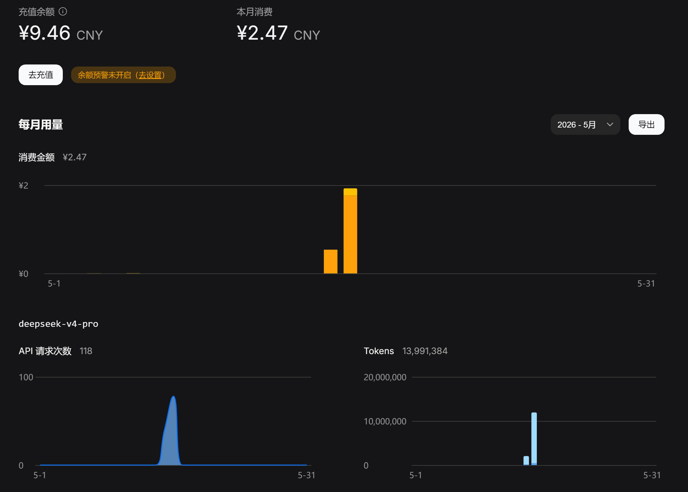

1984年，南斯拉夫的年轻人在技术封锁下，靠一本杂志上的图纸自己组装电脑——那台电脑叫**Galaksija**。他们甚至用收音机播送的电流声来分发程序，组成了一个地下互联网。

2023年，我只能在各种中转站和镜像网站上使用GPT-3。在受限的额度下复制粘贴代码，聊天内容随时可能被窥探。

四十年过去了，人类对自由和技术的渴望，从未改变。

智能第一次来到身边，我在简陋的场景下欣喜地体验。看着人们追求自由和科学的精神，我总能热泪盈眶。现在看来，我也是无数这样的人当中的一员。

我好喜欢DeepSeek啊，但是为什么会这么喜欢DeepSeek呢？

2024年DeepSeek-R1发布，可以在网页和手机APP上聊天对话。虽然当时用户请求爆满，系统经常繁忙，但是给我留下了非常好的印象。这是我国真正的技术突破，DeepSeek没有某些大厂的那种异味。事实证明，我的直觉是对的。锐意进取、有技术品味的岭南人，真的让我感到亲切安心。他们开源参数权重，公开训练过程，甚至连踩过的坑都详细记录，富有远见和品味的创新，宁可延迟发布也要适配国产显卡，不追逐OpenClaw大跃进的噱头，专注文本处理——每一步都有主见地走在正确的道路上。

相比之下，我及其讨厌A÷。25年3月，我的网站架设起来了，并在上面放了整套CS:APP学习笔记。当时我对网站的访客充满好奇，满怀期待。观察日志文件，我发现Claude Bot高强度来爬我的网站。当时A÷还不出名，我搜了一下，发现这是一家AI公司，并且有很多人在吐槽它的爬虫无视robot.txt高强度爬网。我感到被极大的冒犯，我的文章都是CC协议，也欢迎读者阅读交流，但Claude就不一样了，这样的不速之客把我的心血一下子就学走了，然后反过来卖给用户赚钱。我直接在Nginx层面给它屏蔽了。

没想到后来A÷越做越大，但就是品性难改。果不其然，后来的一系列事件都印证我的感觉。将中国列为“敌对国家”；随意缩减订阅额度，封锁用户账号，不服也得受着，傲慢至极；购买百万实体书，扫描蒸馏后直接销毁，现代版修《四库全书》，我又是爱惜书的人，我不太舍得买书，经常去看图书馆的书，我也知道很多欠发达地区还缺乏书籍，这样的“焚书”和浪费资源的行径直接触怒了我；Claude Code泄露的源码里，将用户本地的文件直接上传到A÷的服务器，真是处处写着这家公司人品不行，说真的我也不明白Claude Code好用在哪，就那几个简陋的工具，还没有其他开源竞品做的精细，整个就是Vibe Coding出来的屎山。这只是冰山一角，但每一件都能精准踩在我的雷区上。就是这样无德行的东西，国内一堆人吹捧，还替我假想没有Claude Code就干不了活，怎么能舔成这个样子，我连Github Copilot里面的Opus都没用过。

有趣的是，一项调查显示，国外用户对A÷的忍受度远低于国内。越受限，越追捧——这种“反向筛选”的现象，比技术本身更值得玩味。与此同时还要踩deepseek一脚，包括我身边的一些人，说v4各种比不上，还要去给GPT充订阅，看在不是给A÷尽孝的份上，我就不跟他争论了，Openai其实还好啊，最初的GPT就是他搞出来的，开创了一个时代，作为当初唯一的LLM模型，训练数据也都是自己采集的。

众所周知，前段时间Github Copilot更新了学生订阅的政策。由于我一直用的VSCode的旧版本，除了只能用GPT-5.2外，没有受到什么Session limit, Weekly limit的影响。为了接入deepseek-v4，我更新了VSCode就受到影响了……不过趁此机会我体验了deepseek-v4-pro。DeepSeek发表的论文承认，与最先进的模型只有半年左右的差距，而API价格却是如此优惠。我在Github Copilot里接入deepseek-v4的模型，我的体验也是觉得v4-pro不比GPT-5.2差，而deepseek-v4-pro的思考比较长，完成任务的耗时更久一点。在agent这样的长程任务中，1M的上下文都还没用满，换别的模型都压缩好几次了，而且越用缓存命中越多。

就算与最先进的模型有差距，在我的应用场景中也影响不大。反而因为低价而更有优势。那些说不如这个那个的，请问你是内核开发工程师，还是在手搓GPU算子？至少身边这样的高级工程师不多见呀。有些人就是本质菜，怪到模型头上。想我这样基础扎实，把架构和场景想得明白，切入点具体明确，模型完成的效果都是很好的、差不多的。

这两天Weekly limit用完了，又用Deepseek-v4很好地完成了一些Rust编程任务。中间有一次问一个比较简单的问题，我就把模型切换成flash。其实不该切换的，会导致缓存不命中。



[crates.io](https://crates.io/)上有一个openai库，但是相较官方维护的python版openai完成度不高且疏于维护，OpenAI后来增加的一些新字段也没跟进，无法精细化控制调用参数。我自己fork了一份稍作修改，为DeepSeek API增加了一些调用参数的支持，比如`extra_body`, `reasoning_effort`。然后将依赖改为：

```toml
openai = { git = https://github.com/TanKimzeg/openai }
```

现在勉强够用，但我后续打算写一个DeepSeek专用的crate，为生态贡献一份力量。作为兼容OpenAI格式的子集，又没有audio那些东西，实现难度应该不高。我还想深入学习DeepSeek论文里提出的架构和方法——现在的LLM训练已经和我学过的初代GPT大不相同了，各种技巧策略都用上了，整个过程非常繁琐精细。

deepseek-v4发布后，听说MinMax、智谱股价都下跌了。我其实没有用过seed、QWen、GLM这些其他国内模型，看来我对DeepSeek真的情有独钟hhh
