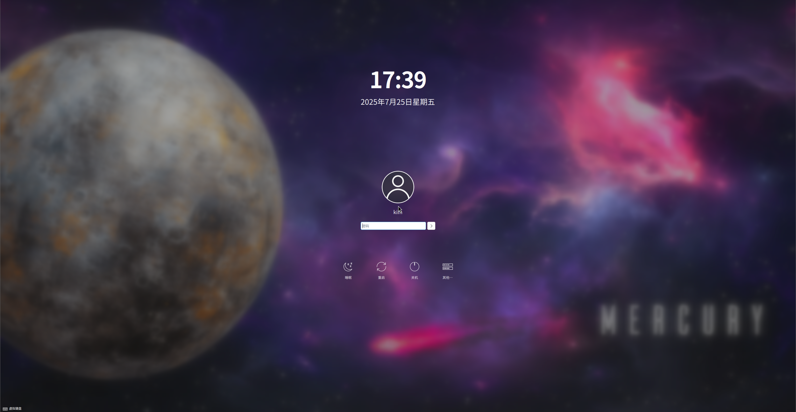
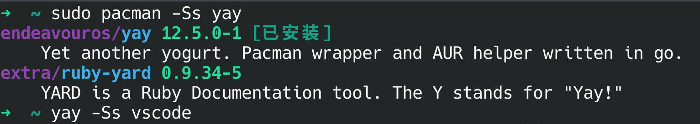
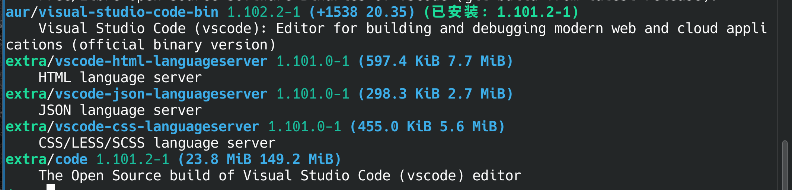
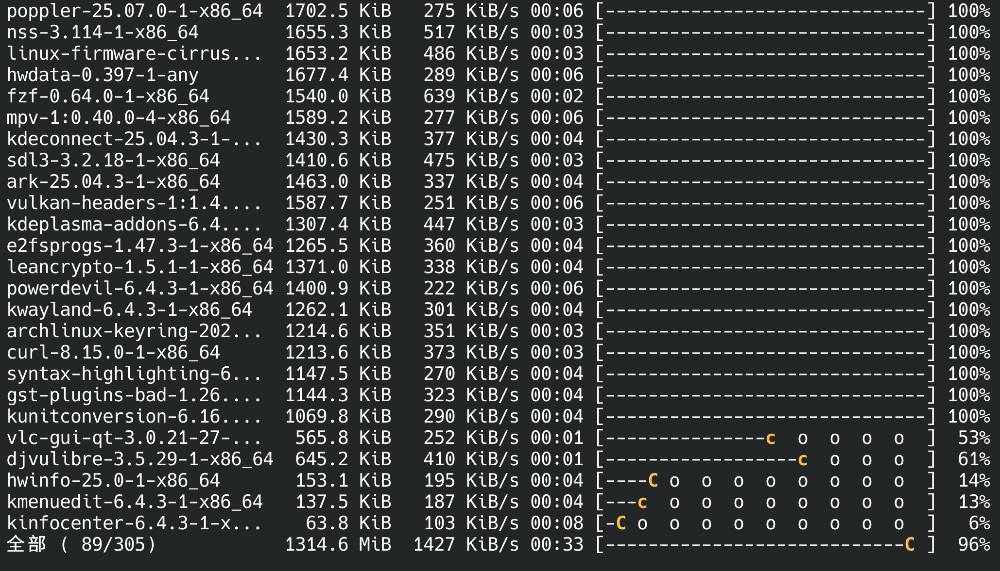
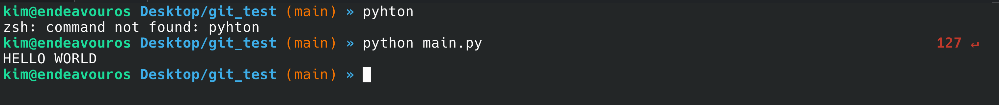

厌倦了臃肿的系统，又对 Arch Linux 的安装门槛望而却步？那么，**EndeavourOS** 可能就是你的理想选择！

它并非又一个“简单版 Arch”，而是秉承 Arch 哲学精髓的优雅继承者：**轻量、滚动更新、软件包丰富（得益于 AUR）**。EndeavourOS 的核心目标非常明确：**为你提供一个近乎纯净的 Arch Linux 基础，同时通过一个极其友好的图形安装程序（Calamares），彻底扫除安装 Arch 的最大障碍。**

安装后，你将获得一个**清爽、快速、高度可定制**的桌面环境（默认是精心调校过的 KDE，但也提供多种流行桌面选项）。没有预装大量你可能不需要的软件，系统将掌控权完全交还给你。你可以通过便捷的包管理工具 `pacman` 和 `yay` ，轻松访问 Arch 庞大的软件仓库和用户仓库（AUR），构建属于你自己的专属系统。

## 安装
在[官网](https://endeavouros.com/)中找到自己所在区域下载ISO，然后，就可以像Ubuntu/Kali等发行版那样进入图形化安装界面，顺便配置好镜像源，非常简单省事！离线默认安装KDE桌面，而且自带水星太空主题，很美观嘛：

每次开机后，自动会出现一个Welcome向导，充满新手关怀：

## 丰富的软件生态
与majargo有自己的软件仓库不同，Endeavouros完全就是用Arch的软件仓库。`yay`则能从AUR装软件包。

Arch的软件生态真是独一档。`pacman` 包管理器从[官方的软件仓库](https://archlinux.org/packages/)搜索软件包。这里的软件包开源可靠稳定的。

我一开始在这边安装了vscode，结果发现是那个开源版的vscode。而平时用到vscode与此不同，随后我发现它在[AUR](https://aur.archlinux.org/)里面。

为了便捷安装AUR的软件包，我发现了一个类似于 `pacman` 的包管理器 `yay`。作为补充，它能自动安装AUR的软件包。用法也与 `pacman`相同。

我们可以先搜索一下软件包的名字：

找到真正想要的那一个

在网页里面看更方便准确。

之前在NixOS里面想用V2rayN，结果发现无法自动配置系统代理。搞了很久才明白是不支持Xfce桌面的系统代理。而且连浏览器里面不能设置浏览器的代理，真是一个致命缺陷！相比之下，虽然Gnome和KDE资源占用较多，但还是受主流支持。

这次，在AUR里面找到V2rayN并安装，非常顺利就设置好了代理。

`pacman`还是很好用的，常用的命令就那几个。我这边一个月没滚动更新了，运行一下`sudo pacman -Syu`也没有挂。所以我觉得只要不去折腾太多的不稳定的插件和软件包，也没有那么容易滚挂吧...

## 详细的文档
[Arch Wiki](https://wiki.archlinuxcn.org/wiki/%E9%A6%96%E9%A1%B5)的文档真是非常详实。

比如我现在想把bash换成zsh，直接在Arch Wiki里面搜索[zsh](https://wiki.archlinuxcn.org/wiki/Zsh)，就教你怎么换默认shell，甚至zsh的第三方拓展也给你指明了它们的项目地址，配置起来还是非常高效的。

## Zsh的配置
Zsh支持Vim motion！那么我们初始化zsh之后，就去Github上的oh-my-zsh项目，按照README的指示下载并激活了oh-my-zsh。在~/.zshrc里面，我先置 `ZSH_THEME="random"`，出来`source ~/.zshrc`一下，给我加载了一个叫做lukerandall的主题，看起来挺美观的，就它了：

还能显示进程异常返回码，比显示时间有用😆

我安装的其他插件，都用oh-my-zsh管理：

- [zsh autosuggestions](https://github.com/zsh-users/zsh-autosuggestions/blob/master/INSTALL.md)
- [zsh-syntax-highlighting](https://github.com/zsh-users/zsh-syntax-highlighting/blob/master/INSTALL.md)

## Inspect
终端模拟器这块，KDE自带Konsole，但是感觉没Windows的终端好用啊，也不能设置透明度啥的。想找一个更好的替代品。

还有各种分屏快捷键，都得配好，才能用得顺手。中文输入法也还没搞，下次再说吧！

上次试用了NixOS,构建速度慢，网络问题多，软件包少，有的得自己打包，也就是要自己编写nix代码厘清依赖关系。上次发现xfce的系统代理问题后我想切换成GNOME，结果`nixos build`就一直失败，实在太折腾了。EndeavourOS给我的体验很不错。我不想把精力花在这些琐事上，还是Arch系的发行版省心。

前段时间我萌生了自己配一台台式电脑的念头，然后装上纯Linux操作系统来作为开发主力机。所以我开始关注硬件市场，学着去了解主板、CPU、显卡，已经有了自己一套“高性价比”配置方案🤓，跃跃欲试了。
都用Linux了，内核资源占用少，软件轻量，自然无需高配置。CPU的话5700X看起来不错。搞深度学习只好用皮衣黄的东西。不想买矿卡又买不起40系，只好先弄一块亮机卡，偶尔还能玩玩游戏。其实这个想法有点冲动了，买了没地方放。刚好这几个月以来内存条和机械硬盘都大涨，只能再忍一手了。我估计明年局势明朗，到时候如果能拿下，我肯定把装机过程详细记录一下，敬请期待哦！
