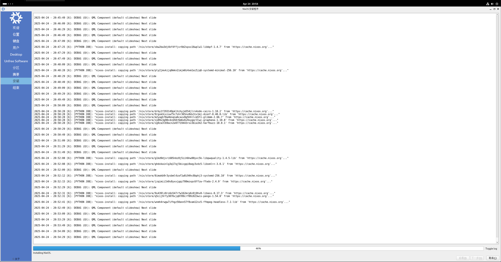
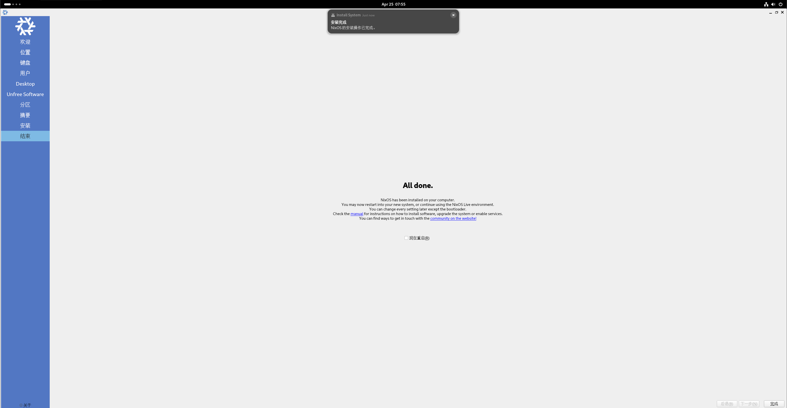

## Linux Experience

很长一段时间,我默默了解过很多Linux发行版,发表一下个人的看法吧.

忘记是怎么听说的Linux,大一寒假时我心血来潮,突然想在VMware中安装Linux.我安装的第一个发行版是Ubuntu,毕竟是网上说的最多的"新手入门"发行版.然后又因为专业相关,安装了Kali,Kali有虚拟机版的vmx文件,安装比Ubuntu简单多了.而且桌面观感也比Ubuntu那配色顺眼多了.

当时装完之后就没有怎么理它,也不知道要用来干什么,搁置了许久.

后来我发现了Windows上的WSL功能,由于Ubuntu并没有给我很好的印象,居然有那么多人推荐,我好像产生了逆反心理🙄,了解到Ubuntu基于Debian后,我在

```sh
wsl --list --online
```

列出的可安装的发行版中看到了Debian,于是果断选了Debian.在WSL中熟悉了Debian系的apt包管理器.Debian 确实比臃肿的Ubuntu好多了.

2024年底,我折腾Github学生认证并且通过了,于是去微软的Azure上搞了个迷你服务器玩(即本站,也提供影梭服务),也选了Debian12,除了1G1vCPU运行一些多余的功能容易卡死外(现在我已经玩杜绝那些花里胡哨的服务了),运行得非常稳定.此时我也听说Debain适合做服务器,符合我的预期.

在2025年寒假,我学习CMU 15213 CS:APP课程,我用WSL CLI中Linux环境,然后在主机用VS Code+WSL插件编程,体验很好(难道WSL2才是最好的发行版🤫).同时CS:APP课程使我更进一步了解Linux操作系统,对Linux产生多方面的兴趣.

而对于桌面环境,常常听说Arch Linux,但是它有"滚挂"的风险,让我担忧.Kali的xfce确实漂亮,自带的zsh也顺手,也许应该选用Kali作为主力桌面系统?

为了做学校课程实验(搭建在内网),我需要安装Easy Connect.我听说Easy Connect是流氓软件,只好在Kali的虚拟机里面安装Easy Connect.下载.deb包,dpkg 安装,点击运行却没有反应...经过一番原因的排查,原来是动态链接库缺失(或版本不对).解决方法是下载3个对应版本的.so文件,放到安装目录里,再次运行就成功.

结合一下CS:APP中学过的[动态链接库](https://tankimzeg.top/blog/csapp/linking)知识,我预见了这一问题的严重性.如果某package的依赖不能被满足(我用apt安装docker时遇到),或者依赖升级后不兼容了(上文的Easy Connect),软件就会悄无声息地挂掉.到下一次使用时才能发现,到时候难以排查原因.

这段时间,NixOS进入了我的视野,我一下子意识到它的理念正能解决这个问题.

我仿佛能从其先进的理念中看到未来,但同时,它的门槛又好像在说生人勿近.跟Rust给我的感觉一样.

## Nix: A Package Manager

包管理器是做什么的?我们可能在包管理中遇到什么问题?

从nmp,pip,cargo,到apt,yum,pacman.它们都叫做"包管理器".究竟包管理器是做什么的?

[Linux 黑话解释：什么是包管理器？它是如何工作的？](https://zhuanlan.zhihu.com/p/265309587)

> 一个“ _包(package)_”（或“软件包”）通常指的是一个应用程序，它可以是一个 GUI 应用程序、命令行工具或（其他软件程序需要的）软件库。包本质上是一个存档文件，包含二进制可执行文件、配置文件，有时还包含依赖关系的信息。

> 在旧时代，[软件曾经是从它的源代码安装的](https://itsfoss.com/install-software-from-source-code/)。你会参考一个文件（通常命名为 `README`），看看它需要什么软件组件、二进制文件的位置。它通常包括一个配置脚本或 `Makefile`。你必须自己编译该软件或自己处理所有的依赖关系（有些软件需要安装其他软件）。

> 为了摆脱这种复杂性，Linux 发行版创建了自己的打包格式，为终端用户提供随时可用的二进制文件（预编译软件），以便安装软件，同时提供一些[元数据](https://link.zhihu.com/?target=https%3A//www.computerhope.com/jargon/m/metadata.htm)（版本号、描述）和依赖关系。

--- 

包管理器是现代软件开发中不可或缺的工具，它们的主要功能可以概括为以下几个方面：

#### 核心功能

1. **软件包的安装与卸载**
   - 自动化下载软件及其依赖项
   - 提供简单的命令完成复杂安装过程（如`npm install`或`apt install`）

2. **依赖关系管理**
   - 自动解决软件间的依赖关系
   - 确保所有必需的组件都能正确安装

3. **版本控制**
   - 允许指定特定版本的软件包
   - 处理不同版本间的兼容性问题

#### 其他重要功能

1. **更新维护**
   - 检查并安装可用更新
   - 保持系统或项目中的软件处于最新状态

2. **仓库管理**
   - 提供中央化的软件仓库（如PyPI、CRAN等）
   - 支持添加第三方仓库源

3. **配置管理**
   - 自动完成软件的初始配置
   - 管理环境变量和路径设置

4. **安全检查**
	- 验证包的签名或哈希值,防止恶意软件植入

不同领域的包管理器对以上功能**各有侧重**

---

Nix 作为一款独特的包管理器，相较于传统包管理器和其他依赖管理工具（如 Docker、虚拟环境等），具有以下显著优势：


1. **声明式配置与可复现能力** 
- **声明式管理**：Nix 使用声明式语言定义软件包及其依赖关系，用户只需描述系统应达到的状态，而非具体安装步骤。这种方式使得配置更清晰、可维护性更高，且支持版本控制（如 Git），便于团队协作和长期维护。
- **可复现性**：通过 `flake.lock` 文件锁定所有依赖的版本和哈希值，确保在不同机器上构建完全一致的环境。例如，NixOS 的系统配置可以精确复现，避免“在我的机器上能运行”的问题。


2. **纯函数式包管理与隔离性** 
- **独立环境**：每个软件包及其依赖被存储在唯一的路径（包含哈希值），不同版本的包互不干扰。例如，Python 项目的不同版本依赖可在同一系统中共存，无需虚拟环境。
- **无依赖冲突**：传统包管理器常因依赖版本冲突导致系统崩溃，而 Nix 通过隔离安装路径彻底解决了这一问题。


3. **多版本支持与灵活的回滚机制** 
- **多版本共存**：开发者可同时安装同一软件的多个版本（如 Node.js 或 Python），并通过环境变量快速切换，适合多项目开发需求。
- **系统级回滚**：NixOS 默认保留所有历史配置，用户可随时回滚到任意旧版本，甚至通过启动菜单选择历史系统状态，极大提升了系统稳定性。


4. **跨平台与轻量级开发环境** 
- **跨平台支持**：Nix 不仅支持 Linux（如 NixOS），还可在 macOS 和 Windows（通过 WSL）上运行。例如，macOS 用户可通过 `nix-darwin` 实现类似 NixOS 的系统级配置管理，避免 Homebrew 的路径污染和速度问题。
- **轻量级隔离**：相比 Docker 或虚拟机，Nix 通过声明式配置创建隔离的开发环境，无需虚拟化开销。例如，使用 `nix-shell` 可为单个项目临时加载特定依赖，不污染全局环境。


5. **社区与生态优势** 
- **丰富的软件仓库**：官方仓库 `nixpkgs` 提供超过 80,000 个软件包，覆盖主流开发工具和库。
- **活跃的社区创新**：尽管 Flakes 仍为实验特性，但社区已广泛采用，GitHub 上超过半数的新 Nix 项目使用 Flakes 管理依赖，推动生态快速演进。

6. **自动化构建** 
- **自动化编译与缓存**：若二进制缓存中存在相同哈希的预编译包，Nix 会自动下载，否则触发本地编译，提升效率。

**对比传统工具的具体场景优势**
- **vs Homebrew**：Nix 避免污染系统路径（如 `/usr/local`），安装更安全；支持多版本共存，且配置可版本化。
- **vs Docker**：Nix 无需容器化开销，直接通过声明式配置管理环境，更适合本地开发和轻量级隔离。
- **vs 虚拟环境（如 Python venv）**：Nix 提供系统级隔离，支持跨语言依赖管理，减少手动配置复杂度。

---

以上DeepSeek回答(做过删改)大致梳理了包管理器的作用,包管理可能存在的问题以及Nix的解决方案.

## [How NixOS work?](https://nixos.org/guides/how-nix-works/)

> _**标题链接一定要阅读  ↑**_,官方的解释已经非常好.以下是我自己的理解.

NixOS是以Nix理念构建起来的系统,所以它将Nix的优点拓展到了整个系统.

以往,当我们安装一个崭新的Linux系统后,想要安装各种服务/软件,都是通过命令的形式,或者编辑分散在各处的.config文件.且不说命令没有良好的记录,就算记录下来了,想要倒回去也麻烦.这就导致了我们配置的系统是一个"黑盒"状态,无法在另一个新主机上复现.

而NixOS以类似于configuration.nix文件声明系统状态,集中管理系统,然后用nixos-rebuild命令重构系统.声明是正道,命令是忌讳.这是我作为一个新手的理解.

因此,系统的状况一目了然,系统的迁移易如反掌.我觉得在服务器集群管理的情境下是很有应用前景的.但由于技术惯性,还不愿采用.

作为个人用户,这样的系统非常洁净,配置好后非常稳定,一劳永逸.挂掉(只要遵循声明式的准则基本不可能)也能像Git那样回滚.

***Reproducible,Declarative,Reliable*** 是[NixOS官网](https://nixos.org)上给出的三个特点.


不得不说,这玩意实在太过小众,(中文)资料欠缺,也不讲新手的主要困惑,以至于没有一个能讲清楚Nix,flake,Home Manager分别用来解决什么问题,这些困惑差点劝退我.正当我面对Github上别人长长的配置仓库一筹莫展时,幸运地发现Youtube的几个视频讲的不错.如
[Full NixOS Guide: Everything You Need to Know in One Place!](https://www.youtube.com/watch?v=nLwbNhSxLd4)

这几个播放量还挺高的,搜NixOS都有.可以都看看.

> Nix的这个雪花logo❄️,我还没看到有人介绍它的来历,不过我直觉猜它是由"依赖"具象而来的.你看它一个分支勾着一个分支,就像包的依赖关系.

## 安装实录

在虚拟机(VMware)中安装，直接从图形化安装界面开始:

[Graphical Installation](https://nixos.org/manual/nixos/stable/#sec-installation-graphical)



会在46%停留非常非常久...

放了一晚上,第二天来看就好了：



如果不是从命令行安装/手动分区的话还是非常简单的.

欢迎打开新世界的大门! 我将持续记录一个新手使用NixOS的心路历程😎
