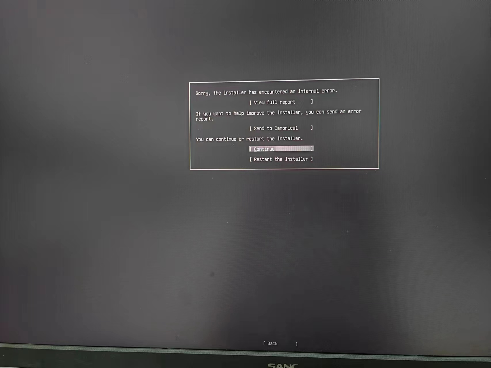
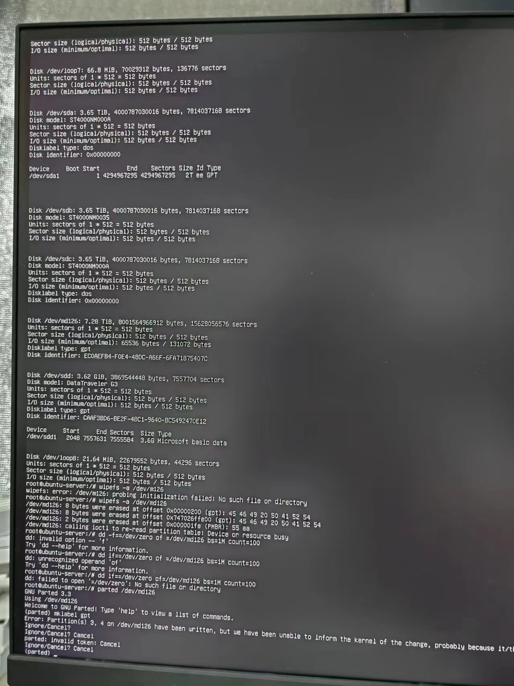
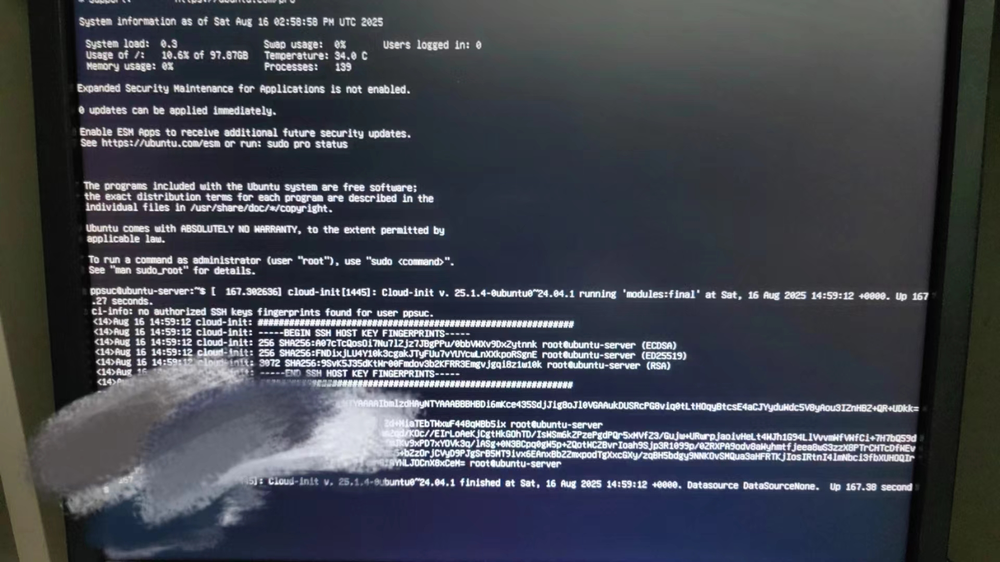
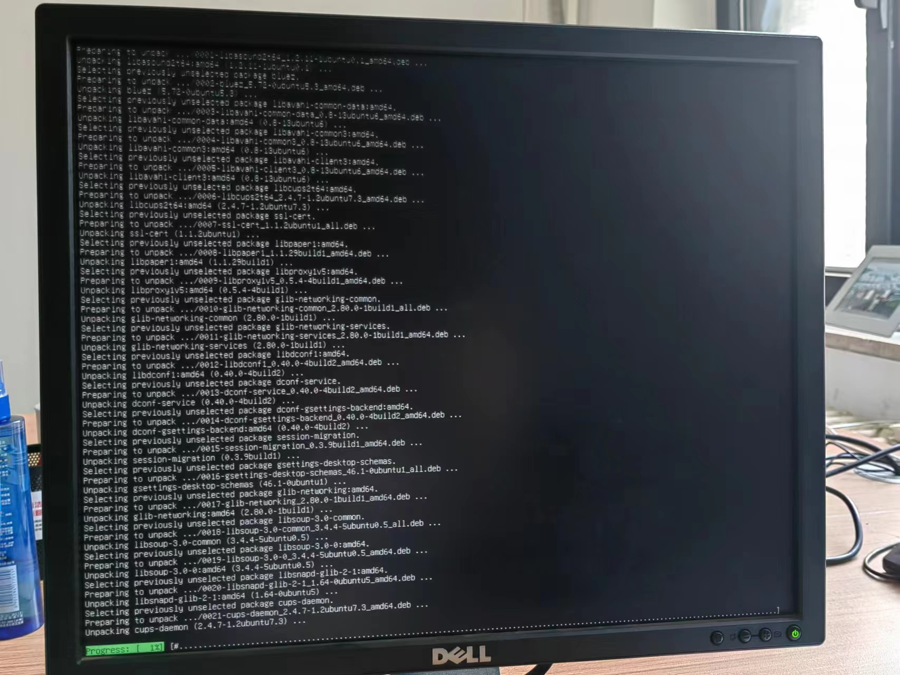
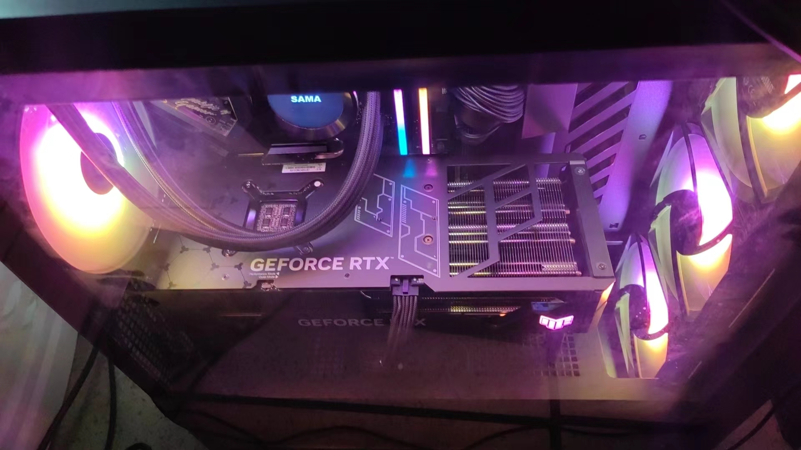
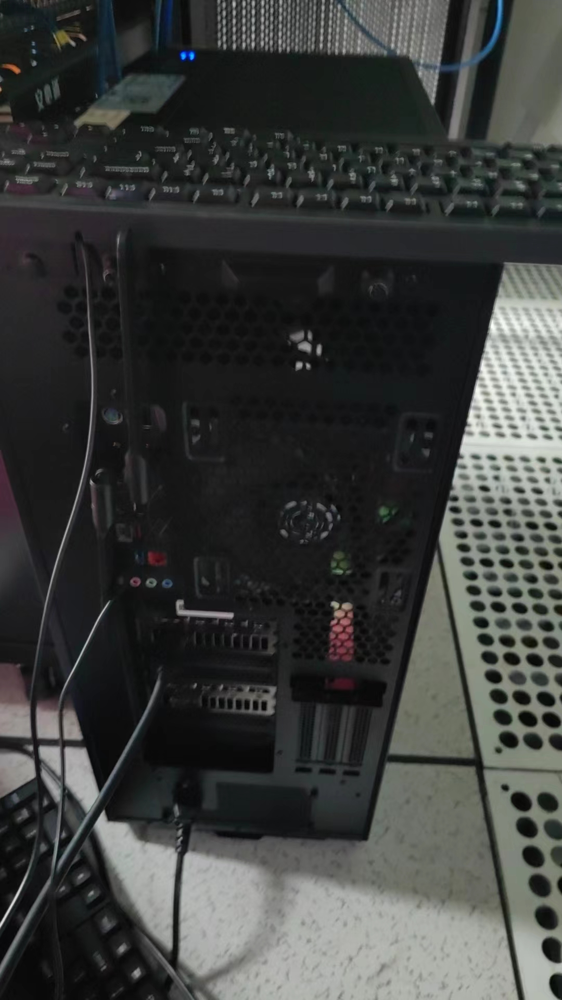

学校的老师委托我去实验室给电脑装系统,还要搬到另一个校区来~~充当免费劳动力了~~.点名要安装Ubuntu.我还是第一次在实体机上安装系统.

首先要自己制作启动U盘.我找了个旧U盘,容量只有3.5G,臃肿的Ubuntu桌面至少要4G以上.所以我只好安装Server版.

刚到学校,中午都没休息,我就直接出发去另一个校区了.来到机房,一台ThinkServer,主机上都是灰尘,烦得很.插上显示器,猛按Delete和F12,听见滴的一声进入BIOS界面.

我太着急了,这里忘了拍照记录.跟网上的界面不太一样,反正找到Boot相关的,根据操作指示把U盘移动到最上面,重启.

我当时的U盘里面是UBUNTU 20.04,而且机器原来就有Windows系统.不知道是不是这个原因,总是装不进去.我不太记得具体是哪个步骤了.如果是磁盘格式的问题,按理来说直接格式化就行了啊,我看别的GUI界面都是有这个选项的,很奇怪.

事实又一次证明,装机装系统不能下午开始搞,更不能晚上开始搞.没办法,我从下午搞到旁晚.断了一会电,到了晚上,又试一次,之前出问题的那个步骤过去了,到了设置用户名和密码的步骤,结果又不行了.重启,又是一直出错的那个地方过不去.

进去shell, 靠着DeepSeek给出的方案手动格式化磁盘,也不明所以.另一边,我看网上说装新板的UBUNTU就成功了.虽然问题不一样,实在没法了,我重新下了Ubuntu Server 24.04,.iso大小直接从20.04的1G多变成了3.2G,真是逆天.

不知道是我手动格式化磁盘的原因,还是更新发行版的原因,这次顺利安装了...

安装完成~~

第二天搬到办公室,插上网线,又配置了一下网卡,顺利连上网了.

连上网之后,安装桌面环境.我参考了 [如何在Ubuntu服务器上安装桌面环境](https://zhuanlan.zhihu.com/p/373773218)

GNOME桌面下载中~~

成功点亮!顺便安装一个远程桌面,服务一条龙.主机也是一直搬来搬去的,累鼠我了.

> *运维的基本操作,我早已无师自通了*

> *机房的其他主机:好炫酷啊,啥时候我也装一台,羡慕了~*

> *一个超大的机箱:*

