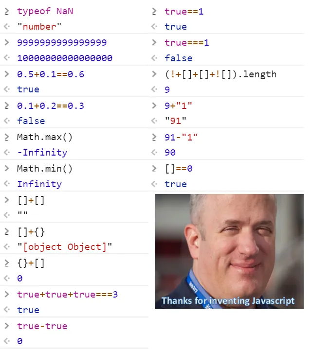

新开了一个关于前端的学习任务,因为实习需要做一些前端的相关工作(SpringBoot后端倒是没有给我带来太多困难).那边的前端用的是Vue,我只要照猫画虎复制修改一些组件,再用JavaScript处理表单转发.有时候有点懵,所以要补点这方面的知识.

其实早就听说前端很好入手,很快就能做出东西,正反馈很强.但我不准备学太深,重心还是放在真正的狠活上.

我先从JavaScript学起,到TypeScript.正好后面也可以为我的一些项目做个好看一点的前端页面.

在此之前,我对JS的印象是简单,弱类型,这导致了一些奇怪的事情:

听说 TypeScript避免了这些问题.而TypeScript兼容了JavaScript.所以为了以后能编写 TypeScript ,现在学点也好.

我找到了 [现代 JavaScript 教程](https://zh.javascript.info/) 作为学习资料.我不会完全复制过来,而是记录一些我不懂的特性作为笔记.

---

JavaScript 的能力很大程度上取决于它运行的环境。例如，Node.js 支持允许 JavaScript 读取/写入任意文件，执行网络请求等的函数。

浏览器中的 JavaScript 可以做与网页操作、用户交互和 Web 服务器相关的所有事情。

浏览器有一些特定的命令,如 `alert` .这个命令用 `Node.js` 就不能运行.

---

对于接触过几门现代编程语言的人来说,JavaScript基础的语法比较简单,不在此详细记录,但有一些奇怪的特性.
