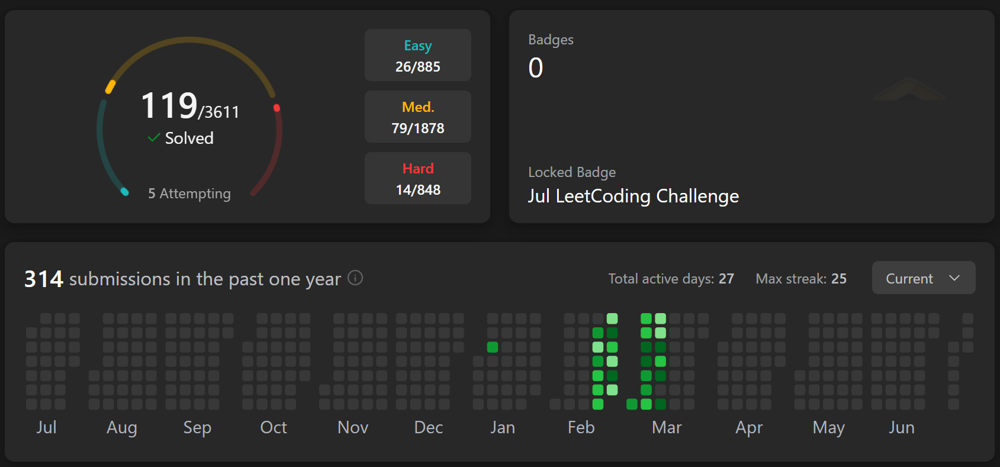
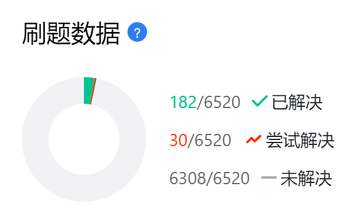
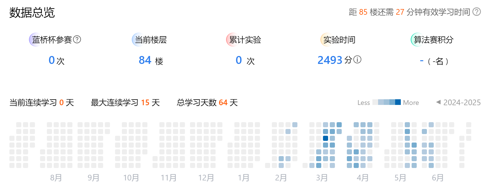
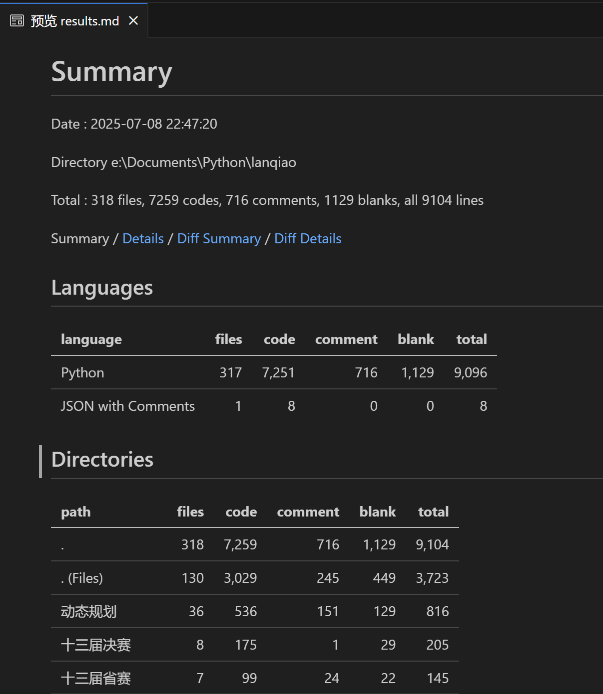
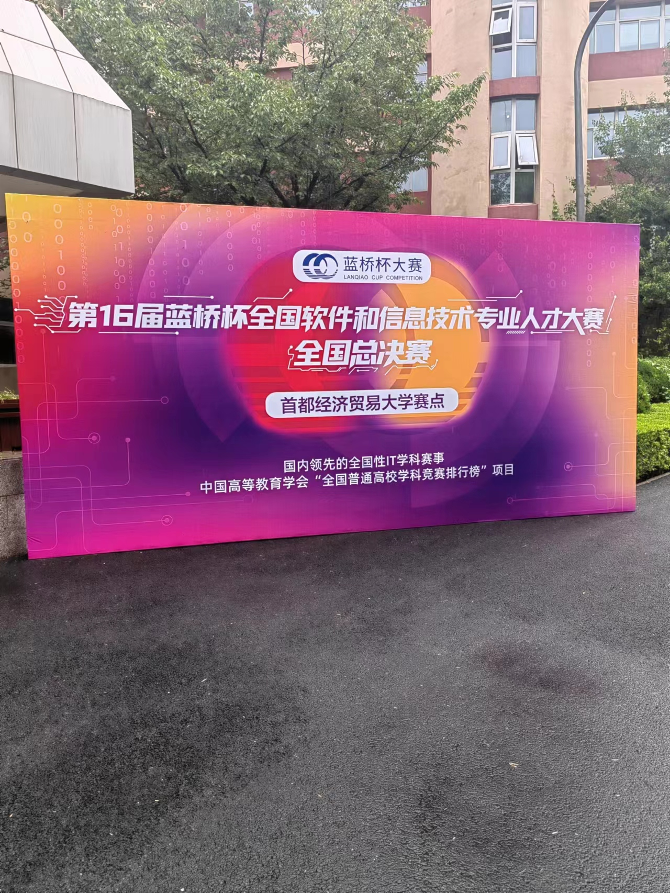

> What I have is not what I want...

在准备蓝桥杯之前，我没有受过任何ACM的学习和训练，只是学过数据结构并且满绩。我深知数据结构这种课跟算法竞赛差别还是蛮大的。今年二月份下旬，学完CS:APP，我从基础开始，跟着[代码随想录](https://space.bilibili.com/525438321/lists/180037)入门了基础算法题，在[国际版力扣](leetcode.com)上刷了一百多道题，然后就开始去蓝桥杯官网上的题库做题。苦于烂学校不但用水课浪费学生时间，还不让学生翘课，我只能用课余时间拼命刷题。从省赛到国赛，直接就贯穿了整个学期，所以我一个学期都没时间打游戏，上次这样还是在高中。哎，平时也是苦不堪言，以后再分享吧。

满打满算才做了两个多月，不到三个月的题，最后拿了国二，对于刚入门的我来说还算可以吧。不奢求国一了，毕竟前5%确实还是有难度的。

蓝桥杯本来就是圈钱的水赛，为了卖课办的比赛，频频爆出作弊丑闻，现在甚至干脆不公布获奖名单了。真是厚颜无耻，估计以后不再参加了，要不就去参加某些区域天梯赛什么的。

今年的省赛北京这边非常简单，有些人反而因为大意遭遇滑铁卢了。国赛的话听说C/C++组那边很难。Python倒是还好，10道题中我做了8道，估计在国二当中属于前部，靠近国一的。