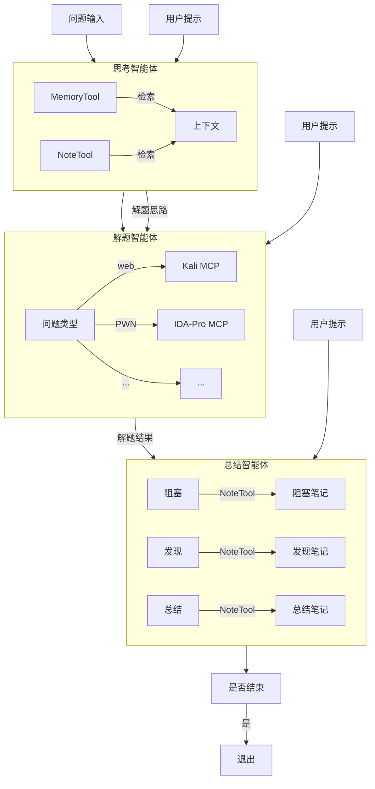

## 毕业设计

终于来到了最后一章！我即将自己构建一个智能体应用。选什么主题进行开发好呢？

在组队学习中，队员关注于网络安全。也就是要制作一个自动化渗透测试的智能体。

### 准备工作

首先我需要了解选题的现状。在Github中搜索CTF + Agent字样，搜出来几个项目，都是不成熟的学习项目，甚至没有利用任何现有智能体开发框架。那么机会来了！

在搜索过程中我还发现了[CAI](https://github.com/aliasrobotics/cai),这是一个转为网络安全智能体设计的框架，看起来很厉害，以后可以了解一下。

其次，我们需要相关MCP服务器的支撑。有一个[IDA-Pro-MCP](https://github.com/mrexodia/ida-pro-mcp)，同学说很好用，但是要安装IDA-Pro，这将导致测试Demo十分臃肿。

另外是一个本质上执行Linux shell命令的MCP，即执行Kali Linux的命令，可用于web方面，这个用来测试不错。

收集完以上信息，加上看了两周[Hello Agent教程](https://datawhalechina.github.io/hello-agents/#/)的知识储备，周末直接开工！

### 架构设计

整体架构设计如下：

### 开发过程

周末整整奋斗两天半，我终于搓出了一个能够运行的Demo。马上让Chat-GPT5加上前后端框架，DDL即将截止！前后端交互的部分没有来得及测试，但我看至少是没报错且正常启动的。赶在DDL之前完成了这个项目。

不得不吐槽一下Hello Agent库，遇到了不少Bug，工作流写完还不得不折腾半天调试，等有空整理一下提交PR。

虽然反复调试，但还好我提的测试问题简单，而且DeepSeek-chat的API非常便宜，还经过了一轮降价。强烈推荐大家在开发AI应用阶段使用。

把Agent当数据总线是一种不推荐的做法,会浪费大量Token。但即便我没有专门优化，在烧掉八万五千token的情况下才用掉8分钱。由于我反复跑测试，大部分都是缓存命中，因此成本甚至不比网费+电费😂

2025-11-23 | 84524 tokens
--- | ---
输入（命中缓存） | 52992 tokens
输入（未命中缓存） | 20291 tokens
输出 | 11241 tokens

### 项目发布

项目已发布在[ctf-agent](https://github.com/TanKimzeg/ctf-agent)。

后面只需再优化一下体验，打包成dokcer,在这种双非用来当本科毕设都绰绰有余。
