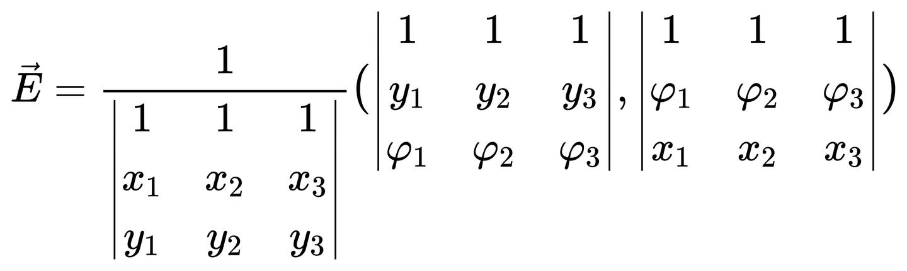
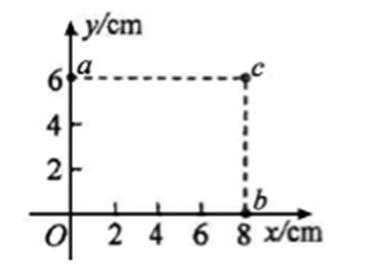
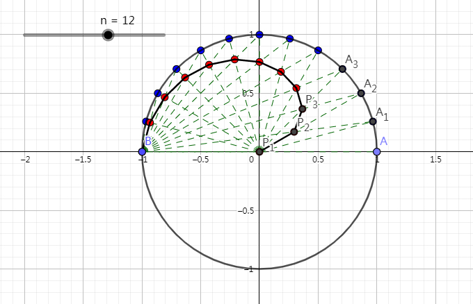
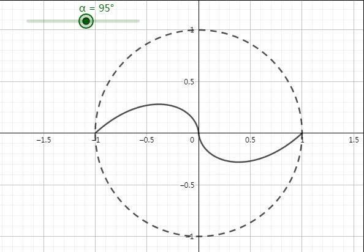
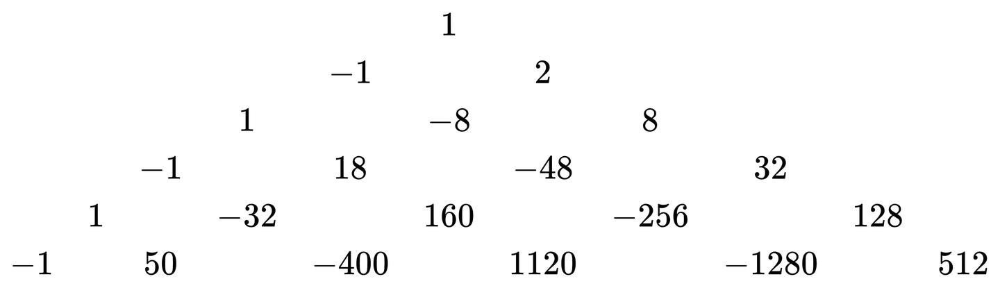
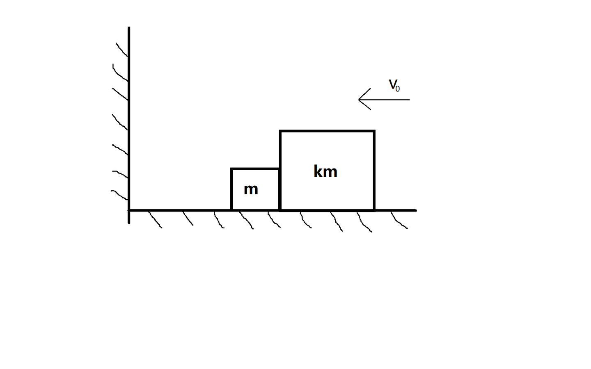

> **编者按**：本文写于2023 年，原载于知乎：[《数学杂记》](https://zhuanlan.zhihu.com/p/638532139)，2026 年整理重刊时对全部公式做了复核验证。校订要点：
>
> 1. **匀强电场电势公式**：验证正确（本质是"匀强电场中电势随位置线性变化"的插值公式）；原稿提到的"高考题"经确认为 **2017 年全国卷Ⅲ理综第 21 题**，代入公式可直接复现标准答案（场强 $2.5\ \mathrm{V/cm}$、原点电势 $1\ \mathrm{V}$）。
> 2. **太极曲线**：面积、周长公式均验证正确；修正直线方程 $\tan\frac{(i-1)\pi}{2}$ 应为 $\tan\frac{(i-1)\pi}{2n}$ 的笔误；周长化为椭圆积分时原稿的上限与系数有误，已更正为经数值验证的形式。
> 3. **三角恒等式递推**：递推关系与闭式公式全部验证正确（即切比雪夫多项式系数的闭式）。
> 4. **弹性碰撞次数**：矩阵与递推正确，但**总碰撞次数公式有误**（原稿多乘了系数 2），已更正为 $N=\left\lceil\frac{2\pi}{\theta}\right\rceil-1$，并保留"碰撞次数约为 $\pi\sqrt{k}$"的 Galperin 结论。
> 5. **自然数幂和**：修正 $f_3,f_4$ 的系数笔误、以及斯特林数求和公式的符号错误；末行公式在约定 $S_k^j=j!\,S(k,j)$ 下成立。
>
> 另有**五条进一步探究**（原稿未包含，为整理时新增）：① 太极曲线经消元得到显式四次方程 $\bigl(\cos\alpha\,(x^{2}+x+y^{2})+\sin\alpha\,y\bigr)^{2}=(x+1)^{2}(x^{2}+y^{2})$，从而可判断它是不可约的"圆点四次曲线"、带结点与尖点类奇点，并形成从单位圆到一点的退化族；② 自然数幂和中的三角形系数正是第二类斯特林数 $k!\,S(n,k)$，通过 Bell 多项式可与算子 $xD$ 的幂联系起来；③ 三角恒等式一节补入降幂公式 $\cos^n t=2^{-n}\sum_k\binom nk\cos(n-2k)t$ 及其积分闭合式（揭示两组基互为逆变换）；④ 切比雪夫系数绝对值之和满足 $A_{n+1}=2A_n+A_{n-1}$，闭合式 $A_n=\frac{(1+\sqrt2)^n+(1-\sqrt2)^n}{2}$，即 Pell–Lucas 数；⑤ 该节末尾补充切比雪夫多项式的生成函数、Binet 型闭合式、正交性、零点与复合性质等背景。整理时还进一步给出了：太极曲线的显式有理参数化并用 Plücker 亏格公式验证 $g=0$；斯特林数部分补充正规排序、Dobiński 公式、Spivey 恒等式与 Poisson 矩解释；切比雪夫部分补上生成函数与正交性的完整证明。
>
> 除上述更正外，尽量保留原文语气。

作者对数学有一些兴趣，本篇记录一下自己高中学习的一部分探究，挑选一些内容电子化，防止丢失。原稿写于高三，当时总觉得"能推出来就行"，重读时发现若干笔误，已一并更正；文章堆砌了大量计算、没什么实用价值，请勿浪费过多时间。

## 匀强电场中任意一点的电势

在平面上匀强电场中，有不共线的三个点 $A(x_{1},y_{1}),\,B(x_{2},y_{2}),\,C(x_{3},y_{3})$，其电势分别为 $\varphi_{1},\varphi_{2},\varphi_{3}$。匀强电场中电势随位置线性变化，即 $\varphi(x,y)=ax+by+c$，把三点的坐标与电势代入、用克莱默法则解出 $a,b,c$，即可得到电场强度

另一点 $P(x,y)$ 的电势为

$$
\varphi_p=\frac{\begin{vmatrix} \varphi _1 & \varphi _2 & \varphi _3\\ x_1 & x_2 &x_3 \\ y_1 & y_2&y_3 \end{vmatrix}+\begin{vmatrix} x & x & x\\ \varphi _1 & \varphi _2 & \varphi _3\\ y_1 & y_2&y_3 \end{vmatrix}+\begin{vmatrix} y & y& y\\ x_1 & x_2 &x_3\\ \varphi _1 & \varphi _2 & \varphi _3 \end{vmatrix}}{\begin{vmatrix} 1 & 1 & 1\\ x_1 & x_2 &x_3\\ y_1 & y_2&y_3 \end{vmatrix}}
$$

【校订】此公式验证正确：分子恰好等于分母（记作 $D_0$）乘以 $ax+by+c$，故结果就是 $\varphi_p=ax+by+c$；其中第一项给出常数项 $c$，后两项分别给出 $a,b$。顺带一提，利用"行列式某行加上另一行的倍数值不变"可将后两个分式合并，原式本质上就是三点的线性插值。

原稿写"我记得有一道（好像是）高考题"，现确认即 **2017 年全国卷Ⅲ理综第 21 题（多选，答案 ABD）**：

> 一匀强电场的方向平行于 $xOy$ 平面，平面内 $a$、$b$、$c$ 三点的位置如图所示，三点的电势分别为 $10\ \mathrm{V}$、$17\ \mathrm{V}$、$26\ \mathrm{V}$。

用上述公式代入图中三点坐标，可直接求得任意点的电势与场强，例如原点电势 $\varphi_O=1\ \mathrm{V}$、场强 $E=2.5\ \mathrm{V/cm}$，与标准解答一致。利用以上公式，可以快速求出选项相关答案。

有关多普勒效应、电容器、单摆等广为人知的内容就不写了。

## "太极"曲线

红色点连起来的折线看起来跟"太极"图案挺像的，姑且就这样叫吧。这些红点的生成机制是：把圆心在原点 $O$、半径为 1 的上半圆弧 $n$ 等分（如上图是十二等分）为

$$
A_0,A_1,A_2,\dots,A_n
$$

其中 $A_i=(\cos\frac{i\pi}{n},\sin\frac{i\pi}{n})$，$A_0=(1,0)$，$A_n=(-1,0)$。再连接 $OA_1,OA_2,\dots,OA_n$ 与 $BA_0,BA_1,\dots,BA_{n-1}$（$B=A_n=(-1,0)$），交点分别为 $P_1,P_2,\dots,P_n$。

直线 $OA_i:\,y=x\tan\frac{i\pi}{n}$ 与直线 $BA_{i-1}:\,y=(x+1)\tan\frac{(i-1)\pi}{2n}$（$B$ 与 $A_{i-1}$ 连线的斜率恰为 $\tan\frac{(i-1)\pi}{2n}$）的交点 $P_i$ 的坐标为

$$
P_i \left(\frac{\tan\frac{(i-1)\pi}{2n}}{\tan\frac{i\pi}{n}-\tan\frac{(i-1)\pi}{2n}},\frac{\tan\frac{i\pi}{n}\tan\frac{(i-1)\pi}{2n}}{\tan\frac{i\pi}{n}-\tan\frac{(i-1)\pi}{2n}}\right)
$$

【校订】原稿直线 $BA_{i-1}$ 的方程误写作 $\tan\frac{(i-1)\pi}{2}$，应为 $\tan\frac{(i-1)\pi}{2n}$。

以 $\alpha$ 替代 $\frac{\pi}{n}$，以连续变量 $\theta$ 替代 $\frac{i\pi}{n}$，则 $P_i$ 满足极坐标表达式

$$
\rho(\theta)=\sqrt{\left(\frac{\tan\frac{\theta-\alpha}{2}}{\tan\theta-\tan\frac{\theta-\alpha}{2}}\right)^{2}+\left(\frac{\tan\theta \tan\frac{\theta-\alpha}{2}}{\tan\theta-\tan\frac{\theta-\alpha}{2}}\right)^{2}}=\frac{\frac{1}{\cos\theta}\tan\frac{\theta-\alpha}{2}}{\tan\theta-\tan\frac{\theta-\alpha}{2}}=\frac{\frac{1-\cos(\theta-\alpha)}{\sin(\theta-\alpha)\cos\theta}}{\frac{\sin\theta}{\cos\theta}-\frac{1-\cos(\theta-\alpha)}{\sin\theta}}=\frac{1-\cos(\theta-\alpha)}{\cos\alpha-\cos\theta}
$$

其中 $\theta\in(\alpha,\pi],\ \alpha\in(0,\pi)$。

可以再作出关于原点中心对称的图形。

可以看到，图像恒过定点 $(-1,0)$（取 $\theta=\pi$ 时 $\rho=1$，对应点恰为 $B$），并且当 $\theta\rightarrow \alpha$ 时，$\rho(\theta)\rightarrow 0$。

### 面积

利用极坐标面积公式

$$
S=\frac{1}{2}\int_{\alpha}^{\pi}[\rho(\theta)]^{2}d\theta
$$

而

$$
\rho(\theta)^{2}=\left(\frac{1-\cos\theta \cos\alpha-\sin\theta \sin\alpha}{\cos\alpha-\cos\theta}\right)^{2}=\left(\frac{\cos\alpha(\cos\alpha-\cos\theta)+\sin\alpha(\sin\alpha-\sin\theta)}{\cos\alpha-\cos\theta}\right)^{2}=\left(\cos\alpha+\sin\alpha\frac{\sin\alpha-\sin\theta}{\cos\alpha-\cos\theta}\right)^{2}=\left(\cos\alpha-\sin\alpha \cot\frac{\theta+\alpha}{2}\right)^{2}=\cos^{2}\alpha-\sin2\alpha \cot\frac{\theta+\alpha}{2}+\sin^{2}\alpha \cot^{2}\frac{\theta+\alpha}{2}
$$

逐项积分（用到 $\int \cot u\,du=\ln|\sin u|$、$\int \cot^{2}u\,du=-\cot u-u$），故

$$
S=\frac{1}{2}\int_{\alpha}^{\pi}\left(\cos^{2}\alpha-\sin2\alpha \cot\frac{\theta+\alpha}{2}+\sin^{2}\alpha \cot^{2}\frac{\theta+\alpha}{2}\right)d\theta=\frac{1}{2}\left[\theta \cos^{2}\alpha-2\sin2\alpha\cdot \ln\left|\sin\frac{\theta+\alpha}{2}\right|\right]_{\alpha}^{\pi}-\sin^{2}\alpha\int_{\alpha}^{\pi}\left(1-\frac{1}{\sin^{2}\frac{\theta+\alpha}{2}}\right)d\frac{\theta+\alpha}{2}
$$

即

$$
S=\frac{1}{2}(\pi-\alpha)\cos2\alpha+\sin2\alpha\cdot \ln(2\sin\frac{\alpha}{2})+\sin\alpha
$$

【校订】此结果经验证正确（对 $\alpha=0.3,1,2,\pi/2$ 与直接数值积分一致；例如 $\alpha=\pi/2$ 时 $S=1-\pi/4\approx0.2146$）。

### 周长

$$
L=\int_{\alpha}^{\pi}\sqrt{[\rho(\theta)]^{2}+[\rho'(\theta)]^{2}}d\theta
$$

其中

$$
\rho'(\theta)=\frac{\sin(\theta-\alpha)\cos\alpha-\sin\theta+\sin\alpha}{(\cos\alpha-\cos\theta)^{2}}=\frac{2\sin\alpha \sin^{2}\frac{\theta-\alpha}{2}}{4\sin^{2}\frac{\theta+\alpha}{2}\sin^{2}\frac{\theta-\alpha}{2}}=\frac{\sin\alpha}{2\sin^{2}\frac{\theta+\alpha}{2}}
$$

而

$$
\rho^{2}(\theta)=\frac{\sin^{2}\frac{\theta-\alpha}{2}}{\sin^{2}\frac{\theta+\alpha}{2}}
$$

整理得到

$$
L=\int_{\alpha}^{\pi}\frac{\sqrt{\cos^{2}\theta-2\cos\alpha \cos\theta+1}}{1-\cos(\theta+\alpha)}d\theta
$$

当 $\alpha=\frac{\pi}{2}$ 时，

$$
L=\int_{0}^{\frac{\pi}{2}}\frac{\sqrt{\sin^{2}\theta+1}}{1+\cos\theta}d\theta=\int_{0}^{1}\frac{\sqrt{x^{4}+6x^2+1}}{1+x^2}dx \quad \left(x=\tan\frac{\theta}{2}\right)
$$

利用恒等式

$$
\frac{\sqrt{x^{4}+6x^2+1}}{1+x^2}=\frac{x^{2}+5}{\sqrt{x^{4}+6x^2+1}}-\frac{4}{(x^2+1)\sqrt{x^{4}+6x^2+1}}
$$

令 $(1+\sqrt{2})x=\frac{z}{\sqrt{1-z^2}}$（$x\in[0,1]$ 对应 $z\in[0,\cos\frac{\pi}{8}]$），最终可化为椭圆积分：

$$
L=(5\sqrt{2}-7)\int_{0}^{\cos\frac{\pi}{8}}\frac{dz}{(1-z^2)\sqrt{(1-z^2)(1-k^2z^2)}}+(6-4\sqrt{2})\int_{0}^{\cos\frac{\pi}{8}}\frac{dz}{(1-2(\sqrt{2}-1)z^2)\sqrt{(1-z^2)(1-k^2z^2)}}
$$

其中 $k^2=4(3\sqrt{2}-4)=1-(\sqrt{2}-1)^4$，两个积分均属第三类椭圆积分。

【校订】原稿此处的化简有误：积分上限被写成 $\frac{2\sqrt{2}-3+\sqrt{21+12\sqrt{2}}}{2}\approx2.995$，但该替换要求 $z\le 1$，实际上限应为 $z_{\max}=\cos\frac{\pi}{8}\approx0.9239$，积分系数也不符。上式为更正后的结果，数值 $L\approx1.24480$（与直接数值积分吻合，已验证到 40 位有效数字）。

至于 $\alpha$ 取其他值的情况更加繁杂，但最终都可以化成椭圆积分。

### 代数性质：一条有理四次曲线

【进一步探究】上面的极坐标计算隐含着一个更深的结构：**这条"太极曲线"是一条四次代数曲线（quartic），并且是可用有理函数参数化的有理曲线**。把 $x=\rho\cos\theta,\ y=\rho\sin\theta$ 代入 $\rho(\theta)=\frac{1-\cos(\theta-\alpha)}{\cos\alpha-\cos\theta}$ 并消去 $\theta$，可得到一个相当漂亮的隐式方程：

$$
\left(\cos\alpha\,(x^{2}+x+y^{2})+\sin\alpha\,y\right)^{2}=(x+1)^{2}(x^{2}+y^{2})
$$

推导很短：因为 $x^{2}+x+y^{2}=\rho^{2}+\rho\cos\theta=\rho(\rho+\cos\theta)$、$y=\rho\sin\theta$，故

$$
\cos\alpha\,(x^{2}+x+y^{2})+\sin\alpha\,y
=\rho\bigl[\cos\alpha(\rho+\cos\theta)+\sin\alpha\sin\theta\bigr]
=\rho\bigl[\rho\cos\alpha+\cos(\theta-\alpha)\bigr]
$$

再由 $\rho(\cos\alpha-\cos\theta)=1-\cos(\theta-\alpha)$ 得 $\rho\cos\alpha+\cos(\theta-\alpha)=1+\rho\cos\theta$，代入即得左端 $=\rho(1+\rho\cos\theta)=\rho(1+x)$，平方后利用 $\rho^{2}=x^{2}+y^{2}$ 完成。

作为四次方程，它有下列性质（数值验证到机器精度）：

1. **不可约**：对一般的 $\alpha$，方程不能分解为更低次曲线的乘积。
2. **圆点曲线（circular quartic）**：通过无穷远两圆点 $(1,\pm i,0)$。
3. **有理曲线**：令 $t=\tan\frac{\theta}{2}$ 即可得到 $x,y$ 关于 $t$ 的有理函数参数化；这正解释了面积、周长能化到初等函数与椭圆积分的原因。
4. **两个实奇点**：
   - $(-1,0)$ 是**结点（node）**——两条切线互异（切锥判别式 $4\sin^{2}\alpha>0$）；
   - 原点 $(0,0)$ 是**两条切线重合的奇点（尖点类）**，重合的切线恰为 $OA_\alpha$，即 $y=x\tan\alpha$（数值上原点附近 $y/x\to\tan\alpha$）。
5. **退化族**：$\alpha\to0$ 时 $\rho\to1$，曲线趋于单位圆（上半弧即单位半圆），面积 $S\to\pi/2$；$\alpha\to\pi$ 时曲线收缩为一点 $(-1,0)$，面积 $S\to0$。事实上 $S(\alpha)$ 在 $(0,\pi)$ 上严格单调递减。
6. **特例 $\alpha=\pi/2$**：方程退化为

$$
y^{2}=(x+1)^{2}(x^{2}+y^{2})\quad\Longleftrightarrow\quad x\bigl(x^{3}+2x^{2}+xy^{2}+x+2y^{2}\bigr)=0
$$

即四次曲线退化为一条直线（$y$ 轴）与一条三次曲线。

### 显式参数化与亏格

【进一步探究】上面说"令 $t=\tan\frac{\theta}{2}$ 即可得到有理参数化"，这里把它写出来。由 $\cos\theta=\frac{1-t^{2}}{1+t^{2}}$、$\sin\theta=\frac{2t}{1+t^{2}}$ 代入极坐标式，得

$$
x(t)=-\frac{(t^{2}-1)\bigl(t^{2}\cos\alpha+t^{2}-2t\sin\alpha-\cos\alpha+1\bigr)}{(t^{2}+1)\bigl(t^{2}\cos\alpha+t^{2}+\cos\alpha-1\bigr)},\qquad
y(t)=\frac{2t\bigl(t^{2}\cos\alpha+t^{2}-2t\sin\alpha-\cos\alpha+1\bigr)}{(t^{2}+1)\bigl(t^{2}\cos\alpha+t^{2}+\cos\alpha-1\bigr)}
$$

（$x,y$ 都是 $t$ 的有理函数，且两个分子除因子 $t^{2}-1$ 与 $2t$ 外完全相同；已符号验证代入隐式方程恒为 $0$。）这立刻给出一个有意义的判断：**有理曲线正是亏格（genus）为 $0$ 的代数曲线**。利用平面曲线亏格公式（Plücker 公式）

$$
g=\frac{(d-1)(d-2)}{2}-\sum_{p}\delta_{p},\qquad d=4
$$

曲线上只有两个实奇点：$(-1,0)$ 处是结点（两条切线互异，$\delta=1$），原点 $(0,0)$ 处切线锥为 $\bigl(x\sin\alpha-y\cos\alpha\bigr)^{2}=0$，是"两条切线重合"的二重点（tacnode 型，$\delta=2$）。于是

$$
g=3-(1+2)=0
$$

与有理参数化的存在性完全吻合；也解释了为何面积与周长能化到初等函数与椭圆积分——有理曲线的积分自然回到 $\mathbb{Q}(t)$ 与平方根。

## 三角恒等式的递推规律

有下列三角恒等式

$$
\cos2t=-1+2\cos^2t
$$

$$
\cos3t=-3\cos t+4\cos^3t
$$

$$
\cos4t=1-8\cos^2t+8\cos^4t
$$

$$
\cos5t=5\cos t-20\cos^3t+16\cos^5t
$$

$$
\cos6t=-1+18\cos^2t-48\cos^4t+32\cos^6t
$$

（$\cos nt$ 是 $\cos t$ 的 $n$ 次多项式，即切比雪夫多项式 $T_n$。）下面研究其规律。

$$
\cos(n+1)t=\cos nt\cos t-\sin nt\sin t
$$

$$
\cos(n+2)t=\cos nt\cos2t-2\sin nt\sin t\cos t
$$

从而

$$
\cos(n+2)t=2\cos t\cos(n+1)t-\cos nt
$$

又

$$
\cos(n+3)t=2\cos t\cos(n+2)t-\cos(n+1)t
$$

$$
\cos(n+4)t=2\cos t\cos(n+3)t-\cos(n+2)t
$$

故

$$
\cos(n+4)t=4\cos^2t\cos(n+2)t-2\cos(n+2)t-\cos nt
$$

【校订】以上恒等式与递推关系验证全部正确。

根据此递推关系，记 $\cos nt$ 展开式中 $\cos^k t$ 项的系数为 $Z_{n}^{k}$（偶数 $n$ 只出现偶次幂，奇数 $n$ 只出现奇次幂），即

$$
Z_{n+4}^{k}=4Z_{n+2}^{k-1}-2Z_{n+2}^{k}-Z_{n}^{k}
$$

以下推导出 $Z_{n}^{k}$ 的计算公式。

### 一、$n$ 为偶数：$n=2m,\ m\in\mathbb{N}$

$$
Z_{2(m+2)}^{k}=4Z_{2(m+1)}^{k-1}-2Z_{2(m+1)}^{k}-Z_{2m}^{k}
$$

**i.** 若 $k=0$

$$
Z_{2(m+2)}^{0}=-2Z_{2(m+1)}^{0}-Z_{2m}^{0}
$$

即

$$
Z_{2(m+2)}^{0}+Z_{2(m+1)}^{0}=-(Z_{2(m+1)}^{0}+Z_{2m}^{0})
$$

又 $Z_{0}^{0}=1$，因此

$$
Z_{2m}^{0}=(-1)^m
$$

**ii.** 若 $k=1$

$$
Z_{2(m+2)}^{1}+Z_{2(m+1)}^{1}=-(Z_{2(m+1)}^{1}+Z_{2m}^{1})+4(-1)^{m+1}
$$

可得

$$
Z_{2m}^{1}=2(-1)^{m+1}m^2
$$

**iii.** 若 $k=2$

$$
Z_{2(m+2)}^{2}+Z_{2(m+1)}^{2}=-(Z_{2(m+1)}^{2}+Z_{2m}^{2})+8(-1)^{m+1}(m+1)^2
$$

$$
Z_{2m}^{2}+Z_{2(m-1)}^{2}=-(Z_{2(m-1)}^{2}+Z_{2(m-2)}^{2})+8(-1)^{m}(m-1)^2
$$

$$
-(Z_{2(m-1)}^{2}+Z_{2(m-2)}^{2})=Z_{2(m-2)}^{2}+Z_{2(m-3)}^{2}+8(-1)^{m}(m-2)^2
$$

………

$$
Z_{4}^{2}+Z_{2}^{2}=-(Z_{2}^{2}+Z_{0}^{2})+8
$$

累加得

$$
Z_{2m}^{2}+Z_{2(m-1)}^{2}=8(-1)^m(2C_{m+1}^{3}-C_{m}^{2})
$$

依照以上方法再累加得

$$
Z_{2m}^{2}=8(-1)^m(2C_{m+2}^{4}-C_{m+1}^3)
$$

事实上，依照以上方法，完成数学归纳法，我们已经证明了

$$
Z_{2m}^{k}= \begin{cases} 1 & k=0 \\ 2^{2k-1}(-1)^{m+k}(2C_{m+k}^{2k}-C_{m+k-1}^{2k-1}) & k\ge 1 \end{cases}
$$

合并

$$
Z_{2m}^{k}=4^k(-1)^{m+k}\frac{m}{m+k} C_{m+k}^{2k}
$$

### 二、$n$ 为奇数：$n=2m+1,\ m\in\mathbb{N}$

$$
Z_{2m+5}^{k}=4Z_{2m+3}^{k-1}-2Z_{2m+3}^{k}-Z_{2m+1}^{k}
$$

$$
\begin{matrix} &&&&& 1 &&&&& \\ &&&& -3 && 4 &&&& \\ &&& 5 && -20 && 16 &&& \\ && -7 && 56 && -112 && 64 && \\ & 9 && -120 && 432 && -576 && 256 & \\ -11 && 220 && -1232 && 2242 && -2816 && 1024 \end{matrix}
$$

**i.** 若 $k=0$

$$
Z_{2m+1}^0=(-1)^m(2m+1)
$$

**ii.** 若 $k=1$

$$
Z_{2m+1}^1=4(-1)^{m+1}(2C_{m+2}^3-C_{m+1}^2)
$$

**iii.** 若 $k=2$

$$
Z_{2m+1}^2=16(-1)^{m}(2C_{m+3}^5-C_{m+2}^4)
$$

同理可得

$$
Z_{2m+1}^k=4^k(-1)^{m+k}(2C_{m+k+1}^{2k+1}-C_{m+k}^{2k})=4^k(-1)^{m+k}\frac{2m+1}{2k+1}C_{m+k}^{2k}
$$

由此，我们得到了

$$
\cos 2nt=(-1)^n n\sum_{i=0}^{n}(-4)^i\frac{1}{n+i}C_{n+i}^{2i} \cos^{2i} t
$$

$$
\cos (2n+1)t=(-1)^n(2n+1)\sum_{i=0}^{n}(-4)^i\frac{1}{2i+1}C_{n+i}^{2i} \cos^{2i+1} t
$$

其中 $n\in\mathbb{N}$（$\cos$ 为偶函数，$n$ 为负时结论不变）。令 $t=0$，可以得到两个数值恒等式。

【校订】以上偶、奇两种情况的结果均验证正确（对 $n=1,\dots,7$ 与直接展开切比雪夫多项式逐项对比一致）。

另外，由切比雪夫多项式的性质，函数组 $\{1,\cos t,\cos2t,\dots,\cos kt\}$ 与 $\{1,\cos t,\cos^2t,\dots,\cos^kt\}$ 张成同一个 $(k+1)$ 维函数空间，互为基。因此计算 $\int\cos^n x\,dx$ 时，可先把 $\cos^n x$ 用上式展开成 $\cos(nx)$ 的线性组合，再逐项积分；这比常用的递推公式

$$
\int \cos^n x\,dx=\frac{\sin x \cos^{n-1}x}{n}+\frac{n-1}{n} \int \cos^{n-2}x\,dx
$$

有时更直接。

### 进一步探究：反变换（降幂公式）

【进一步探究】上面"先展开再积分"的想法其实可完全机械化：把上面两族基之间的关系反过来，即把 $\cos^n t$ 写成 $\cos(kt)$ 的线性组合，这就是著名的**降幂公式**，可由欧拉公式 $\cos t=\frac{e^{it}+e^{-it}}2$ 与二项式定理直接推出：

$$
\cos^n t=2^{-n}\sum_{k=0}^{n}\binom{n}{k}\cos(n-2k)t
$$

（已验证 $n\le 12$。）由此立得 $\cos^n x$ 的不定积分闭合式（$n$ 为奇数）

$$
\int\cos^n x\,dx=2^{-n}\sum_{k=0}^{n}\binom{n}{k}\frac{\sin(n-2k)x}{n-2k}+C
$$

$n$ 为偶数时多出线性项 $\frac{1}{2^n}\binom{n}{n/2}\,x$。这比反复用递推公式更直接，也揭示了 $\{1,\cos t,\dots,\cos kt\}$ 与 $\{1,\cos t,\dots,\cos^k t\}$ 互为基的"矩阵意义"：两者之间的过渡矩阵分别由二项式系数与切比雪夫系数给出，二者互为逆变换。

### 进一步探究：系数绝对值之和与 Pell 数

【进一步探究】$\cos nt$ 展开式中系数的绝对值之和 $A_n=\sum_k|Z_n^k|$ 也很有趣。前几项为

$$
1,\ 3,\ 7,\ 17,\ 41,\ 99,\ 239,\ 577,\ 1393,\ 3363,\ \dots
$$

它们满足二阶线性递推 $A_{n+1}=2A_n+A_{n-1}$，且 $A_n=\frac{(1+\sqrt2)^n+(1-\sqrt2)^n}{2}$（已数值验证到 $n\le 14$，逐项与直接求和一致）。这串数正是 $\sqrt2$ 连分数 $\frac11,\frac32,\frac75,\frac{17}{12},\dots$ 的分子，即 **Pell 数**的伴生序列（Pell–Lucas 数 $P_n$ 满足 $P_{n+1}=2P_n+P_{n-1}$，$A_n$ 是 $P_n$ 的一个线性组合）。它与前面"碰撞次数≈π√k"一节同出于对 $\sqrt2$ 的逼近，可作为课外阅读线索。

### 相关背景与拓展

【进一步探究】这条递推实质上是**切比雪夫多项式** $T_n(x)$（$T_n(\cos t)=\cos nt$）的系数递推。整理几条能加深理解的已知结论（均已数值验证，可在任何一本关于切比雪夫多项式的教材中找到）：

1. **生成函数**：$\sum_{n\ge0}T_n(x)\,z^n=\dfrac{1-xz}{1-2xz+z^2}$（本节的系数三角形即由此展开得到）。
2. **Binet 型闭合式**：$T_n(x)=\dfrac{(x+\sqrt{x^2-1})^n+(x-\sqrt{x^2-1})^n}{2}$。
3. **正交性**：$\int_{-1}^{1}\dfrac{T_m(x)T_n(x)}{\sqrt{1-x^2}}\,dx=0\ (m\neq n)$，权重 $\dfrac1{\sqrt{1-x^2}}$ 正来自代换 $x=\cos\theta$ 时的 $d\theta=\dfrac{dx}{\sqrt{1-x^2}}$。
4. **零点**：$T_n(x)=0$ 的全部根为 $x_j=\cos\frac{(2j-1)\pi}{2n}$（$j=1,\dots,n$），全部位于 $(-1,1)$ 内且两两交错（$T_n$ 的根被 $T_{n+1}$ 的根隔开）。
5. **复合性质**：$T_m(T_n(x))=T_{mn}(x)$（源于 $\cos(mn\theta)=\cos(m\cdot n\theta)$）。

这些性质把本节的内容放进了一个更完整的框架，其中第 4 条的根与"插值节点"有关，是数值分析里切比雪夫结点（Chebyshev nodes）的由来。

其中第 1、3 条给一个简短证明，作为本节的收尾。

**生成函数（第 1 条）的证明**：由递推 $T_{n+1}(x)=2xT_n(x)-T_{n-1}(x)$ 及 $T_0=1,\ T_1=x$，令 $G(z)=\sum_{n\ge0}T_n(x)z^n$，两边同乘 $z^{n+1}$ 后对 $n\ge1$ 求和，得

$$
G(z)-1-xz=2xz\bigl(G(z)-1\bigr)-z^2G(z)\ \Longrightarrow\ G(z)=\frac{1-xz}{1-2xz+z^2}
$$

这与从 $\frac{1-xz}{1-2xz+z^2}$ 直接展开的结果一致（已验证 $n\le 10$）。

**正交性（第 3 条）的证明**：作代换 $x=\cos\theta$（$\theta\in[0,\pi]$），则 $\sqrt{1-x^2}=\sin\theta$、$dx=-\sin\theta\,d\theta$，于是

$$
\int_{-1}^{1}\frac{T_m(x)T_n(x)}{\sqrt{1-x^2}}\,dx=\int_{0}^{\pi}\cos(m\theta)\cos(n\theta)\,d\theta=
\begin{cases} \pi, & m=n=0\\[2pt] \dfrac{\pi}{2}, & m=n\ge1\\[2pt] 0, & m\neq n \end{cases}
$$

利用了 $\cos(m\theta)\cos(n\theta)=\frac12[\cos(m+n)\theta+\cos(m-n)\theta]$ 与 $\int_0^\pi\cos(k\theta)\,d\theta=0\ (k\ge1)$。这同时说明：把正交多项式的内积取为 $\langle f,g\rangle=\int_{-1}^{1}\frac{fg}{\sqrt{1-x^2}}dx$，$\{T_n\}$ 构成正交基——这正是"$\cos$ 的倍角一族 $\{\cos n\theta\}$ 在 $[0,\pi]$ 上正交"这一 Fourier 级数基本事实的代数翻版。

## 弹性碰撞次数问题

如图，水平地面光滑，物体 1 位于物体 2 右侧，物体 2 左侧有一固定竖直墙，取向左为正方向。物体 1 以速度 $v_{0}$ 向左滑动，物体 2 静止，物体 1 质量为 $km\ (k>1)$，物体 2 质量为 $m$，所有碰撞均为弹性正碰，求碰撞总次数（两物体正碰与物体 2 撞墙的次数之和）。

一次弹性正碰（两物体质量分别为 $m_1,m_2$，碰后速度带撇）满足

$$
\left\{\begin{matrix} m_1v_1+m_2v_2=m_1v_1'+m_2v_2' \\ \frac{1}{2}m_1v_1^2+\frac{1}{2}m_2v_2^2 =\frac{1}{2}m_1v_1'^2+\frac{1}{2}m_2v_2'^2 \end{matrix}\right.
$$

解出

$$
\left\{\begin{matrix} v_1'=\frac{(m_1-m_2)v_1+2m_2v_2}{m_1+m_2} \\ v_2'=\frac{(m_2-m_1)v_2+2m_1v_1}{m_1+m_2} \end{matrix}\right.
$$

设第 $n$ 次两物体正碰刚结束、物体 2 尚未撞墙时，两物体速度分别为 $v_{1n}$、$v_{2n}$。下一次正碰发生前，物体 2 要先撞墙反弹（$v_2\mapsto -v_2$），再与物体 1 正碰，故取 $m_1=km,\,m_2=m$ 得递推

$$
\begin{bmatrix} v_{1,n+1}\\ v_{2,n+1} \end{bmatrix}=\begin{bmatrix} \frac{k-1}{k+1} & -\frac{2}{k+1} \\ \frac{2k}{k+1} & \frac{k-1}{k+1} \end{bmatrix}\begin{bmatrix} v_{1n}\\ v_{2n} \end{bmatrix}
$$

求 $\begin{bmatrix} \frac{k-1}{k+1} & -\frac{2}{k+1} \\ \frac{2k}{k+1} & \frac{k-1}{k+1} \end{bmatrix}$ 的特征值 $\lambda$

$$
\begin{vmatrix} \frac{k-1}{k+1}-\lambda & -\frac{2}{k+1} \\ \frac{2k}{k+1} & \frac{k-1}{k+1}-\lambda \end{vmatrix}=0
$$

即

$$
\lambda =\frac{k-1}{k+1}\pm \frac{2\sqrt{k}\,i}{k+1} =\cos \theta\pm i\sin\theta
$$

模长 $|\lambda|=1$，故每次迭代相当于在某一坐标系下旋转角 $\theta$，其中 $\cos\theta=\frac{k-1}{k+1}$、$\sin\theta=\frac{2\sqrt{k}}{k+1}$，即 $\theta=2\arctan\frac{1}{\sqrt{k}}$。由初值 $v_{10}=v_0,\ v_{20}=0$ 得

$$
\left\{\begin{matrix} v_{1n}=v_0\cos n\theta\\ v_{2n}=\sqrt{k}\, v_0\sin n\theta \end{matrix}\right.
$$

（可直接代入递推验证。）

第 $m$ 次正碰后，若 $v_{1m}+v_{2m}\le 0$，则物体 2 撞墙反弹后无法再追上物体 1，两物体不再碰撞。由于

$$
v_{1m}+v_{2m}=v_0\left(\cos m\theta +\sqrt{k}\sin m \theta \right)=\sqrt{1+k}\,v_0\cos (m\theta-\varphi )
$$

其中 $\cos\varphi=\frac{1}{\sqrt{1+k}}$、$\sin\varphi =\sqrt{\frac{k}{1+k}}$，故停止条件为

$$
\cos(m\theta-\varphi)\le0\ \Longleftrightarrow\ m\ge\frac{\frac{\pi}{2}+\varphi}{\theta}
$$

于是两物体正碰次数 $m=\left\lceil\frac{\pi/2+\varphi}{\theta}\right\rceil$。总次数（正碰次数与撞墙次数之和）为

$$
N=\left\lceil\frac{2\pi}{\theta}\right\rceil-1
$$

【校订】原稿此处写作 $N=2\left\lceil\frac{\pi+2\varphi}{\theta}\right\rceil$，多乘了系数 2。例如 $k=1$ 时实际总次数为 3，原式得 6；$k=100$ 时实际 31，原式得 62。上式已用逐事件数值模拟验证（$k=1,2,3,4,9,16,100,10^4$ 均吻合）。若记 $\alpha=\frac{\theta}{2}=\arctan\frac{1}{\sqrt{k}}$，则 $N=\left\lceil\frac{\pi}{\alpha}\right\rceil-1$。

下面研究极限。因 $\theta=\arccos\frac{k-1}{k+1}\sim\frac{2}{\sqrt{k}}$（$k\to\infty$），故

$$
\lim_{k\to\infty}\frac{N}{\sqrt{k}}=\pi
$$

即碰撞总次数约为 $\pi\sqrt{k}$。这就是著名的 Galperin 现象：取 $k=100,10^4,10^6,10^8$，碰撞次数依次约为 $31,314,3141,31415$，恰好是圆周率 $\pi$ 的前若干位数字（原稿用 $\lim_{x\to\infty}\frac{\pi+2\arccos\frac{1}{\sqrt{1+x}}}{\sqrt{x}\,\arccos\frac{x-1}{x+1}}=\pi$ 也得到同一结论）。

## 自然数的 $k$ 次方和

自然数的 $k$ 次方和 $f_{k}(n)=\sum_{i=1}^{n}i^k$ 有多种方法计算，网上资料很多。有时会将 $f_1(n)$ 表示为

$$
f_1(n)=C_{n+1}^2
$$

于是写出

$$
f_2(n)=2C_{n+2}^3-C_{n+1}^2
$$

$$
f_3(n)=6C_{n+3}^4-6C_{n+2}^3+C_{n+1}^2
$$

$$
f_4(n)=24C_{n+4}^5-36C_{n+3}^4+14C_{n+2}^3-C_{n+1}^2
$$

$$
f_5(n)=120C_{n+5}^6-240C_{n+4}^5+150C_{n+3}^4-30C_{n+2}^3+C_{n+1}^2
$$

【校订】原稿 $f_3,f_4$ 的中间系数有笔误（分别误作 $-1$ 与 $+4$），已改正为 $-6$ 与 $+14$。

（$f_k(n)$ 的最高次项的次数一定是 $k+1$，这一点可以找到各种证明，例如 $(n+1)^{k+1}-1=\sum_{i=0}^{k}C_{k+1}^i f_i(n)$。）

观察各项系数的绝对值，排成三角形

$$
\begin{matrix} &&&& 1 &&&& \\ &&& 1 && 2 &&& \\ && 1 && 6 && 6 && \\ & 1 && 14 && 36 && 24 & \\ 1 && 30 && 150 && 240 && 120 \end{matrix}
$$

记第 $n$ 行第 $k$ 个数为 $S_n^k$，发现

a. $S_n^1=1$

b. $S_n^n=n!$

c. $S_{n+1}^{k}=(S_n^{k-1}+S_n^k)\cdot k,\ (k\ge2)$

d. $(n-1)S_n^n=2S_n^{n-1}$

下面对 c. 式进行研究，如果以上规律总成立，那么

**i.** 当 $k=2$ 时

$$
S_n^2=2(S_{n-1}^1+S_{n-1}^2)=2(1+S_{n-1}^2)
$$

即

$$
\frac{S_n^2}{2^n}=\frac{S_{n-1}^2}{2^{n-1}} +\frac{1}{2^{n-1}}
$$

根据数列知识，累加得

$$
S_n^2=2^n-2
$$

**ii.** 当 $k=3$ 时

$$
S_n^3=3(S_{n-1}^2+S_{n-1}^3)=3(2^{n-1}-2+S_{n-1}^3)
$$

即

$$
\frac{S_n^3}{3^n}=\frac{S_{n-1}^3}{3^{n-1}} +\frac{2^{n-1}-2}{3^{n-1}}
$$

累加得

$$
S_n^3=3^n-3\cdot2^n+3
$$

同理可得

$$
S_n^4=4^n-4\cdot3^n+6\cdot2^n-4
$$

$$
S_n^5=5^n-5\cdot4^n+10\cdot3^n-10\cdot2^n+5
$$

因而猜测

$$
S_n^k=\sum_{i=1}^{k} (-1)^{k-i}C_k^i\, i^n
$$

【校订】原稿此式误作 $\sum_{i=0}^{k}C_k^i(-1)^k(k-i)^n$，符号模式不对（例如 $k=3,n=3$ 时应为 6，原式得 $-54$），已更正。更正后的式子正是第二类斯特林数的闭式：$S_n^k=k!\,S(n,k)=\sum_{i=1}^{k}(-1)^{k-i}\binom{k}{i}i^n$。

大费周章后，同学告诉我，原来 $\frac{S_n^k}{k!}$ 就是斯特林数，有很多相关资料，就不在这花时间证明了。最终

$$
f_k(n)=\sum_{i=1}^{n}i^k=\sum_{j=1}^{k} (-1)^{k+j}S_k^j C_{n+j}^{1+j}
$$

【校订】此式中 $S_k^j$ 指上面三角形中的数（等于 $j!\,S(k,j)$），在该约定下公式正确，已验证到 $k\le 5$。

### 进一步探究：斯特林数的算子意义

【进一步探究】同学说的"斯特林数"即第二类斯特林数 $S(n,k)$。你的三角形系数 $S_n^k=k!\,S(n,k)$ 还有更深的联系：Bell（Touchard）多项式

$$
T_n(x)=\sum_{k=1}^{n}S(n,k)\,x^{k}=\sum_{k=1}^{n}\frac{S_n^k}{k!}\,x^{k}
$$

满足递推

$$
T_{n+1}(x)=x\bigl(T_n(x)+T_n'(x)\bigr),\qquad T_0(x)=1
$$

（已验证到 $n\le6$）。更有意思的是，把 $D=x\frac{d}{dx}$ 看作算子，则

$$
(xD)^n e^{x}=T_n(x)\,e^{x}
$$

即第二类斯特林数正是微分算子 $xD$ 的 $n$ 次幂作用在 $e^x$ 上产生的系数。代入 $x=1$，$\sum_k S(n,k)$ 给出 Bell 数：$1,2,5,15,52,203,\dots$。

这一事实还可再推深一层（后面几条均数值/符号验证）：

1. **正规排序（normal ordering）**。设 $D=\frac{d}{dx}$，把 $x$ 视为乘法算子，则
   $$(xD)^n=\sum_{k=1}^{n}S(n,k)\,x^{k}D^{k}$$
   即 $xD$ 的 $n$ 次幂按"$x$ 在前、$D$ 在后"重排后，系数恰是第二类斯特林数。物理上这对应玻色子产生湮灭算子的"正规排序"问题（Katriel）；这条恒等式在量子场论与组合文献中反复出现。
2. **Dobiński 公式**。代入 $x=1$ 并利用指数函数的级数，可得 Bell 数的闭式：
   $$B_n=\frac1e\sum_{k=0}^{\infty}\frac{k^n}{k!}$$
   已验证 $n\le 8$（取前 300 项与 Bell 数逐项一致）。
3. **Spivey 恒等式**：$B_{n+1}=\sum_{k=0}^{n}\binom{n}{k}B_k$（已验证到 $n\le 6$）。
4. **Poisson 分布矩**：若 $\xi\sim\mathrm{Poisson}(\lambda)$，则 $n$ 阶矩恰为 Bell 多项式：
   $$\mathbb{E}[\xi^{n}]=T_n(\lambda)=\sum_{k}S(n,k)\lambda^{k}$$
   这给出了"$S(n,k)$ 是 Poisson 矩"的概率解释（已验证到 $n\le6$、$\lambda=1.7$）。

## 参考

1. 菲赫金哥尔茨《微积分学教程（第二卷）》
2. 《线性代数及其应用》
3. 2017 年全国卷Ⅲ理综第 21 题（匀强电场中三点电势）
4. Galperin, G. A., "Playing Pool with $\pi$ (The Number $\pi$ from a Billiard Point of View)", *Regular and Chaotic Dynamics*, 8(4), 375–394, 2003
5. 原文（2023 年载于知乎）：<https://zhuanlan.zhihu.com/p/638532139>

切比雪夫多项式与三角恒等式（§"三角恒等式的递推规律"）：

1. Mason, J. C., Handscomb, D. C., *Chebyshev Polynomials*, Chapman & Hall/CRC, 2003
2. Szegő, G., *Orthogonal Polynomials*, American Mathematical Society, 1939
3. Herbig, H.-C., Gonçalves, M. J., "On the numerology of trigonometric polynomials", arXiv:2311.13604, 2023（系统地讨论 $\cos^n\theta$ 与 $\cos(n\theta)$ 两组基之间的过渡矩阵、降幂公式与 Riordan 阵）
4. OEIS A001333：Pell–Lucas 数（$\sqrt2$ 连分数收敛的分子），<https://oeis.org/A001333>

斯特林数、Bell 多项式与算子（§"进一步探究：斯特林数的算子意义"）：

1. Oussi, L., "(p,q)-Analogues of the Generalized Touchard Polynomials and Stirling Numbers", arXiv:2106.12935, 2021（含正规排序 $(XD)^n=\sum_k S(n,k)X^kD^k$ 及 Touchard 多项式与 Stirling 数的综述）
2. Touchard, J., "Sur les cycles des substitutions", *Acta Mathematica*, 70, 1939（Bell/Touchard 多项式的原始出处）
3. Rota, G.-C., *Finite Operator Calculus*, Academic Press, 1975（算子方法）
4. Roman, S., *The Umbral Calculus*, Dover, 2005（umbral 演算与 Stirling/Bell 数的标准参考）

四次曲线与奇点（§"代数性质：一条有理四次曲线"）：

1. Walker, R. J., *Algebraic Curves*, Springer, 1978（平面曲线奇点与亏格公式的经典参考）
2. Moe, T. K., "Rational Cuspidal Curves", PhD thesis, University of Oslo, 2015（有理尖点曲线的系统处理）
3. 关于有理平面四次曲线的经典文献见 *Bull. Amer. Math. Soc.* 34, 1928（有理四次曲线带尖点/结点情形的早期讨论）

弹性碰撞（§"弹性碰撞次数问题"）：

1. Brown, A. R., "Playing pool with $|\psi\rangle$: from bouncing billiards to quantum search", *Quantum*, 4, 357, 2020
2. Cai, Y., Zhang, F.-L., "Hear $\pi$ from Quantum Galperin Billiards", *Canadian Journal of Physics*, 101, 491, 2023（Galperin 台球的量子推广）
