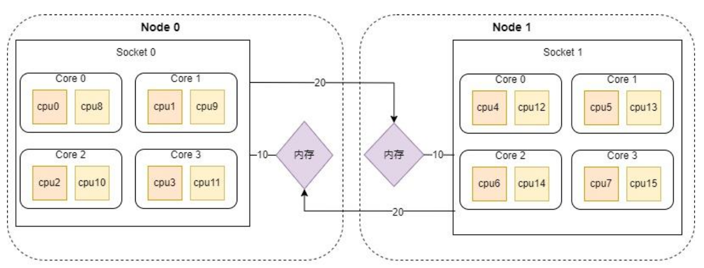
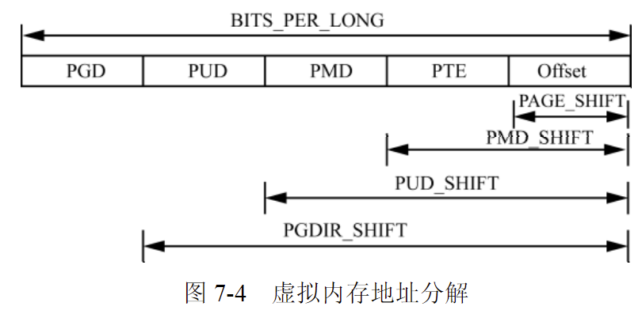
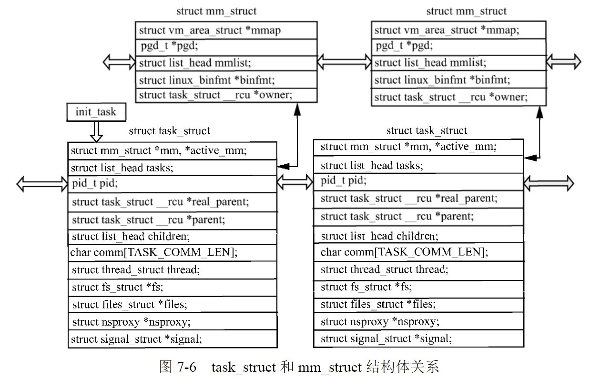

## Linux操作系统关键组件

### Linux内存管理
内核对一致(UMA)和非一致内存访问系统(NUMA)使用相同的数据结构.

内存划分为节点,每个节点关联到系统中的一个处理器


(NUMA内存架构)

### Linux地址转换
前面第二章我们提到了,虚拟地址到物理地址依赖于地址转换.以四级页表为例,虚拟地址分为5个部分:
- PGD
- PUD
- PMD
- PTE
- OFFSET



各级页目录/页表所能存储的指针数目，可以通过宏定义确定。

PTRS_PER_PTE、PTRS_PER_PMD、PTRS_PER_PUD、PTRS_PER_PGD分别对应页目录项、页中间目录、页上层目录、页全局目录中项的个数。两级页表的体系结构会将PTRS_PER_PMD和PTRS_PER_PUD定义为1。

在对Linux内存分析时,就需要将虚拟地址转换为物理地址.

- 内核空间的地址转换
	正如我在[链接](https://tankimzeg.top/blog/链接)过程中学过的,程序有链接过程中需要一个**符号表**,保存着符号与虚拟地址的对应关系,内核的符号也有与虚拟地址的对应关系,这个文件在内核编译时产生,大多位于/boot/System.map.
	
	在32位系统,内核符号swapper_pg_dir的值就是目录表基址DTB的值;在64位系统,内核符号init_level4_pgt的值就是DTB.
	
	在32 bit系统下，将DTB的虚拟地址减去0xc0000000即可获取到DTB的物理地址；在64 bit系统下，将DTB的虚拟地址减去0xffffffff80000000即可获取到DTB的物理地址.

- 进程空间的地址转换
对于进程空间地址转换的问题,需要获取目标进程页目录指针的值.

内核维护着进程相关的结构体,进程页目录指针的值可以通过
task_struct -> mm -> pgd
获取到



### 系统内核符号表
```shell
cat /proc/kallsyms | tail -n +0 | head -n 100
```
可以查看当前环境下导出的内核符号


中间的字母表示符号表类型
- B:该符号来自未初始化bss段
- D:该符号位于初始化数据段
- G:初始化数据段,专门对应小的数据对象
- I:其他符号的间接引用
- N:调试符号
- R:只读代码段符号
- S:BSS段符号
- T:代码段符号

内核符号表可以通过以下方式获取:
1. 复制/proc/kallsysms或者System.map
	System.map包含了内核映像中的符号表，由./scripts/kallsyms.c在编译内核时生成；/proc/kallsyms则包含kernel image和所有动态加载模块的符号表，由./kernel/kallsyms.c在内核启动时生成。

2. 内核将System.map内容置于内核可执行文件中，可以通过以下命令提取出来
```shell
./scripts/extract-vmlinux/tmp/vmlinuz-3.13.0-63-generic >/tmp/vmlinuz-3.13.0-63-generic.elf 
readelf -Wa /tmp/vmlinuz-3.13.0-63-generic.elf 
objcopy -j ksymtab_strings -O binary /tmp/vmlinuz-3.13.0-63-generic.elf vmlinux.bin- ksymtab_strings
```

## ELF可执行可链接文件格式
在[链接](https://www.tankimzeg.top/blog/链接)中,我已经学过链接过程.

ELF文件有以下三种类型:
- 可重定位文件: 包含代码和数据
- 可执行文件
- 共享目标文件(.so)

可通过 `readelf` 分析和查看ELF文件结构:
```shell
readelf -h /usr/bin/ps
```


### ELF header
除了用于标识ELF文件的几个字节外，ELF文件头还包含了文件类型和大小的有关信息，以及文件加载后程序执行的入口点信息。

### Segment header table
向系统提供了 **可执行文件** 的数据在进程虚拟地址空间中的组织方式的相关信息,还表示了文件可能包含的段数目/段的位置和用途.

```shell
readelf -l /eusr/bin/ps
```
查看段头部表.

### Section
```shell
readelf -S /usr/bin/ps
```

### Section header table
节头部表包含了各节相关的附加信息

## Volatility物理内存分析方法
Volatility是使用Python语言编写的GNU内存取证工具集,需要向程序传递正确的操作系统详细版本信息,并需要System.map内核符号表文件.

在只给定一个物理内存镜像文件的情况下，无法进行物理内存分析处理。或者已知操作系统版本但是没有对应的System.map符号表文件，如在使用硬件方式获取物理内存时，只能获取到物理内存信息，无法获取System.map符号表文件，这种情况下也无法进行物理内存分析操作。

## 不依赖内核符号表的Linux物理内存分析方法

在对内核态进行地址翻译时,最需要的是页目录.

内核变量 `swapper_pg_dir` 存放了页目录的 **虚拟地址**.
获取这个值应该还是有很多方法的.
[linux内核中内核态虚拟地址和物理地址之间转换原理分析](https://zhuanlan.zhihu.com/p/146477822)

kallsyms则是(运行时)内核符号表?

kallsyms抽取了内核用到的所有函数地址(全局的、静态的)和非栈数据变量地址，生成一个数据块，作为只读数据链接进kernel image，相当于内核中存了一个System.map

> 感觉需要深入理解Linux内核,现在对我来说太晦涩了😵‍💫

