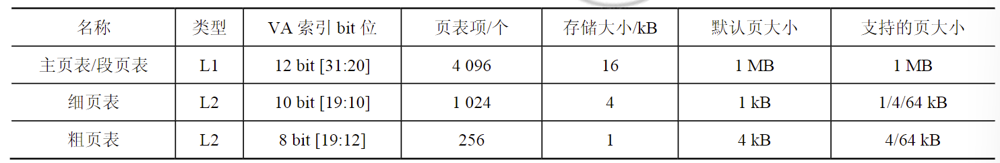

基于在CS:APP中学习的内存相关知识,我开启了内存取证的新坑...🤓

---

## 中央处理器和内存管理单元

### 寄存器
CPU中与内存相关的寄存器:
1. EIP寄存器: 存放下一条指令的地址
2. IA32_EFER MSR
3. 控制寄存器
	- CR0:含有控制处理器工作模式和状态的控制标志
	- CR1: 保留未用
	- CR2: 含有页错误的线性地址
	- CR3: 含有地址转换的初始结构.该结构含有页目录物理内存基地址
	- CR4: 标志使用架构的拓展功能
 
🥱

### 南北桥芯片
### 直接存储器访问(Direct Media Access:DMA)
> 现代设备不是基本不用了吗...

### 内存
动态随机存储器(DRAM),无需多言

## 内存管理
> 具体细节参考英特尔技术手册

IA-32(32 bits) 和 Intel 64( 64 bits)架构的处理器

32 bits允许程序拥有$2^{32}$比特即4GB大小的物理内存.通过物理地址拓展最多支持64GB

IA-32提供实模式(实地址)和保护模式(虚地址)两种工作模式,现代的设备基本都用保护模式呀.

IA-32架构处理器的内存管理功能分成两部分:分段和分页:

### 分段
分段提供了一种隔离机制，将不同代码、数据和栈模块隔离开来，使运行在同一处理器上的多个程序（或者任务）互不干扰.

> 我的理解是,这是每个进程的上下文,相互独立.

### 分页
分页机制为请求分页（Demand Paging）、虚拟内存系统提供支持，当程序执行环境的部分需要时，将其映射到物理内存。分页也可以用来隔离多个任务空间。

当CPU中的寄存器CR0的分页标志位为0时（CR0.PG = 0），不使用分页机制，处理器将线性地址直接视为物理地址。

当CPU中的寄存器CR0的分页标志位为1（CR0.PG = 1），并且处于保护模式时（CR0.PE = 1），处理器使用分页模式。根据寄存器CR4的标志位CR4.PAE和IA32_EFER寄存器的标志位IA32_EFER的值，决定采用何种分页模式。

目前，Intel处理器的分页模式有3种：32 bit分页模式（32-bit Paging）、PA E分页（PA E Paging）和四级分页（4-Level Paging，曾用术语IA-32e分页）。

## 地址转换
实现从虚拟地址到物理地址的翻译的过程就是地址转换.

### 32bit分页
32 bit分页的页大小有两种情况：4 kB和4 MB。

> 每次看页表,都有一种既熟悉又被绕晕的感觉🥱

### 物理地址拓展分页(PAE)
> 意思是拓展了页目录和页表项,从32bits 到 64 bits,但是32位处理器哪来64位的地址?不是很懂emm

### 64bit分页

Intel 64-bit 架构处理器采用四级分页

## ARM架构
移动通讯领域如手机大多使用了ARM处理器.

> 操作系统方面，ARM系统大部分采用了基于Linux内核的操作系统，而且几乎所有的硬件系统都需要单独构建自己的系统，以致于与其他系统不能兼容，应用软件不能方便移植，这一直制约了ARM系统的发展和应用。Google开发了Android系统并开放后，使基于ARM架构的系统有了统一、开放、免费的操作系统，为ARM的发展提供了强大的支持和动力。

ARM MMU硬件也是通过页表机制将虚拟地址翻译成对应物理地址的，处理器通过查找页表中的描述符来获取虚拟地址对应的物理地址.

ARM MMU使用两级页表结构:(L1 和L2)
有两种类型的L2页表,分别是L2粗页表和L2细页表 

