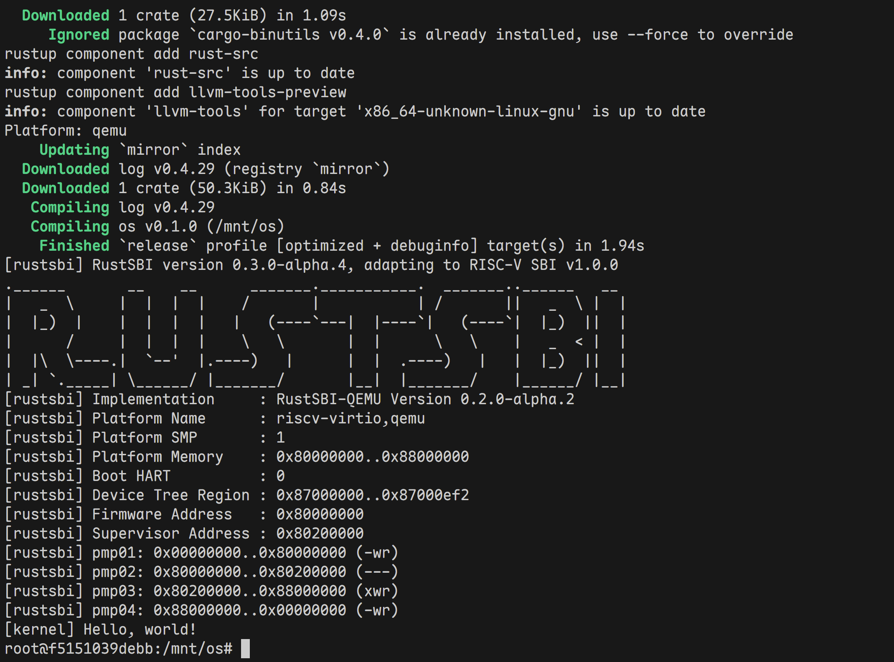
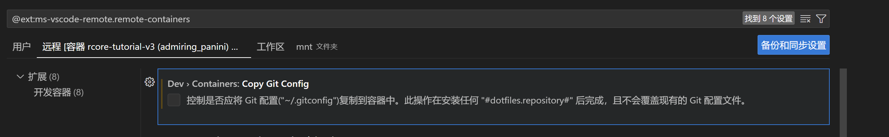

两周前，[OS-Lecture](https://github.com/LearningOS/os-lectures)登上了我的Github推荐。作为非科班的学生，编写操作系统可谓是我从学完CS:APP以来的雄伟梦想。比起一年前看到的[rCore-Tutorial](https://rcore-os.cn/rCore-Tutorial-Book-v3/)，这个仓库作为教学讲义有更多的实践细节，补充了一些内容。大约一年前我就曾经尝试过这个课程，但种种因素难以进行。时隔一年，我也具备了一些Rust编程能力，于是决定重新填这个坑。与我素来一口气学完一门课程、做完一个项目的风格不同，我决定把它作为一个长期学习计划慢慢推进。

- 实验指导书：[rCore-Tutorial-Guide-2025S 文档](https://learningos.cn/rCore-Tutorial-Guide-2025S/)
- OS实践：[rCore Tutorial Book v3](https://rcore-os.github.io/rCore-Tutorial-Book-v3)

---

本章节搭建开发环境。大约一年前我就曾尝试过这个课程，根据指引在我的WSL2中装了一大堆东西，现在已经不知道如何删掉复原了。其实可以通过Dockerfile来简化这个配置过程，也无需套WSL。

## Docker镜像构建

这个docker build我花了不少时间去构建，然而频频因为网络问题失败。我尝试搜索别人构建的rCore镜像，但都缺乏维护和更新说明。我还是只好从Dockerfile构建，并做一些大陆化的适配。

首先是qemu源码的下载非常不稳定，tuna镜像源提供的git仓库的镜像，但与源码压缩包格式还是不太相同。然后我找到了阿里云的[qemu镜像](https://mirrors.aliyun.com/blfs/conglomeration/qemu/)

接下来是Ubuntu镜像源。在 `apt-get update` 之前

```dockerfile
RUN sed -i 's/archive.ubuntu.com/mirrors.aliyun.com/g' /etc/apt/sources.list
RUN sed -i 's/security.ubuntu.com/mirrors.aliyun.com/g' /etc/apt/sources.list
```

替换为阿里云镜像源。

然后是rust工具链的镜像。参照[字节跳动的Rustup镜像代理](https://rsproxy.cn/)：

```dockerfile
ENV RUSTUP_DIST_SERVER=https://rsproxy.cn  \
    RUSTUP_UPDATE_ROOT=https://rsproxy.cn/rustup
```

最后是cargo镜像地址。参照[Rust crates.io 稀疏索引](https://rsproxy.cn/)：

```dockerfile
ENV CARGO_HTTP_MULTIPLEXING=false \
    CARGO_NET_RETRY=10 \
    CARGO_HTTP_TIMEOUT=300
RUN mkdir -vp ${CARGO_HOME:-$HOME/.cargo} && \
    cat << EOF | tee -a ${CARGO_HOME:-$HOME/.cargo}/config.toml
[source.crates-io]
replace-with = 'rsproxy-sparse'
[source.rsproxy]
registry = "https://rsproxy.cn/crates.io-index"
[source.rsproxy-sparse]
registry = "sparse+https://rsproxy.cn/index/"
[registries.rsproxy]
index = "https://rsproxy.cn/crates.io-index"
[net]
git-fetch-with-cli = true
EOF
```

解释：

- `CARGO_HTTP_MULTIPLEXING=false`：关闭 HTTP/2 多路复用，有时能规避某些网关 / 代理的 bug；
- `CARGO_NET_RETRY=10`：失败时多重试几次；
- `CARGO_HTTP_TIMEOUT=300`：整体超时时间放宽到 300 秒。

整体如下：

```dockerfile
# syntax=docker/dockerfile:1
# This Dockerfile is adapted from https://github.com/LearningOS/rCore-Tutorial-v3/blob/main/Dockerfile
# with the following major updates:
# - ubuntu 18.04 -> 20.04
# - qemu 5.0.0 -> 7.0.0
# - Extensive comments linking to relevant documentation
FROM ubuntu:20.04

ARG QEMU_VERSION=7.0.0
ARG HOME=/root

# 0. Install general tools
ARG DEBIAN_FRONTEND=noninteractive
RUN sed -i 's/archive.ubuntu.com/mirrors.aliyun.com/g' /etc/apt/sources.list
RUN sed -i 's/security.ubuntu.com/mirrors.aliyun.com/g' /etc/apt/sources.list
RUN apt-get update && \
    apt-get install -y \
        curl \
        git \
        python3 \
        wget

# 1. Set up QEMU RISC-V
# - https://learningos.github.io/rust-based-os-comp2022/0setup-devel-env.html#qemu
# - https://www.qemu.org/download/
# - https://wiki.qemu.org/Documentation/Platforms/RISCV
# - https://risc-v-getting-started-guide.readthedocs.io/en/latest/linux-qemu.html

# 1.1. Download source
WORKDIR ${HOME}
RUN wget -c https://mirrors.aliyun.com/blfs/conglomeration/qemu/qemu-${QEMU_VERSION}.tar.xz  && \
    tar xvJf qemu-${QEMU_VERSION}.tar.xz

# 1.2. Install dependencies
# - https://risc-v-getting-started-guide.readthedocs.io/en/latest/linux-qemu.html#prerequisites
RUN apt-get install -y \
        autoconf automake autotools-dev curl libmpc-dev libmpfr-dev libgmp-dev \
        gawk build-essential bison flex texinfo gperf libtool patchutils bc \
        zlib1g-dev libexpat-dev git \
        ninja-build pkg-config libglib2.0-dev libpixman-1-dev libsdl2-dev

# 1.3. Build and install from source
WORKDIR ${HOME}/qemu-${QEMU_VERSION}
RUN ./configure --target-list=riscv64-softmmu,riscv64-linux-user && \
    make -j$(nproc) && \
    make install

# 1.4. Clean up
WORKDIR ${HOME}
RUN rm -rf qemu-${QEMU_VERSION} qemu-${QEMU_VERSION}.tar.xz

# 1.5. Sanity checking
RUN qemu-system-riscv64 --version && \
    qemu-riscv64 --version

# 2. Set up Rust
# - https://learningos.github.io/rust-based-os-comp2022/0setup-devel-env.html#qemu
# - https://www.rust-lang.org/tools/install
# - https://github.com/rust-lang/docker-rust/blob/master/Dockerfile-debian.template

# 2.1. Install
ENV RUSTUP_HOME=/usr/local/rustup \
    CARGO_HOME=/usr/local/cargo \
    PATH=/usr/local/cargo/bin:$PATH \
    RUST_VERSION=nightly-2025-10-02 \
    RUSTUP_DIST_SERVER=https://rsproxy.cn \
    RUSTUP_UPDATE_ROOT=https://rsproxy.cn/rustup
RUN set -eux; \
    curl --proto '=https' --tlsv1.2 -sSf https://rsproxy.cn/rustup-init.sh -o rustup-init; \
    chmod +x rustup-init; \
    ./rustup-init -y --no-modify-path --profile minimal --default-toolchain $RUST_VERSION; \
    rm rustup-init; \
    chmod -R a+w $RUSTUP_HOME $CARGO_HOME;

# 2.2. Sanity checking
RUN rustup --version && \
    cargo --version && \
    rustc --version

# 3. Build env for labs
# See os1/Makefile `env:` for example.
# This avoids having to wait for these steps each time using a new container.
ENV CARGO_HTTP_MULTIPLEXING=false \
    CARGO_NET_RETRY=10 \
    CARGO_HTTP_TIMEOUT=300
RUN mkdir -vp ${CARGO_HOME:-$HOME/.cargo} && \
    cat << EOF | tee -a ${CARGO_HOME:-$HOME/.cargo}/config.toml
[source.crates-io]
replace-with = 'rsproxy-sparse'
[source.rsproxy]
registry = "https://rsproxy.cn/crates.io-index"
[source.rsproxy-sparse]
registry = "sparse+https://rsproxy.cn/index/"
[registries.rsproxy]
index = "https://rsproxy.cn/crates.io-index"
[net]
git-fetch-with-cli = true
EOF
RUN rustup target add riscv64gc-unknown-none-elf && \
    cargo install cargo-binutils --vers ~0.2 && \
    rustup component add rust-src && \
    rustup component add llvm-tools-preview

# Ready to go
WORKDIR ${HOME}

```

这是我踩坑得到的改进，推荐大家使用，减少时间的浪费！

## 运行Docker容器

另一边，来看Makefile。 `${PWD}` 是Linux中的变量，在我这边的mingw应该修改为 `$(CURDIR)`，这是GNU Make 自带的「当前工作目录」变量，在 Linux 和 Windows 下都能用。

做完这些修改后，执行

```shell
mingw32-make.exe build_docker
mingw32-make.exe docker
```

即可进入容器内部。

为了避免每次启动新容器都要下载一遍依赖，也便于下面将提到的VSCode容器开发，我去掉 `--rm` 参数，退出后依然保留容器，

## 试运行rCore

`rust-toolchain.toml` 里面原来写的是

```toml
channel = "nightly-2024-05-02"
```

**nightly 是「每天一版，随时会被回收」的测试版**。其他Rustup镜像没有字节跳动的好用（tuna和阿里云在这一步都出问题，tuna只保留最近一个月，阿里云missing packages）。

这个channel有点太旧了，有一点依赖问题：

```
error: failed to compile `cargo-binutils v0.4.0`, intermediate artifacts can be found at `/tmp/cargo-installPF7rZ1`.
To reuse those artifacts with a future compilation, set the environment variable `CARGO_TARGET_DIR` to that path.

Caused by:
  rustc 1.80.0-nightly is not supported by the following package:
    indexmap@2.12.0 requires rustc 1.82
  Try re-running `cargo install` with `--locked`
```

我改为2025年的（跟Dockerfile中保持一致），然后把编译错误修一下，就可以成功运行了：



## 配置VSCode在容器中开发

安装Dev Containers插件，然后就可以像远程开发那样在容器中开发了。点击左侧面板的“远程资源管理器”，选择该容器启动。这会在容器中安装vscode-server。然后在容器中安装rust-analyzer插件，结果出现了网络代理错误，cargo也不能正常检查依赖了。

我也是第一次深入使用容器开发这个插件，难免踩坑。原来是Dev Containers这个插件会复制我宿主机的 `~/.gitconfig` 文件，而我在其中配置了http代理。解决办法是删掉 `~/.gitconfig` 文件并在设置中取消勾选。



至此，我基本完成了开发环境的搭建任务。进一步保存工作区，然后从Docker Desktop启动容器（或`docker ps -a` `docker start <container_id>` ），即可从工作区进入开发环境。
