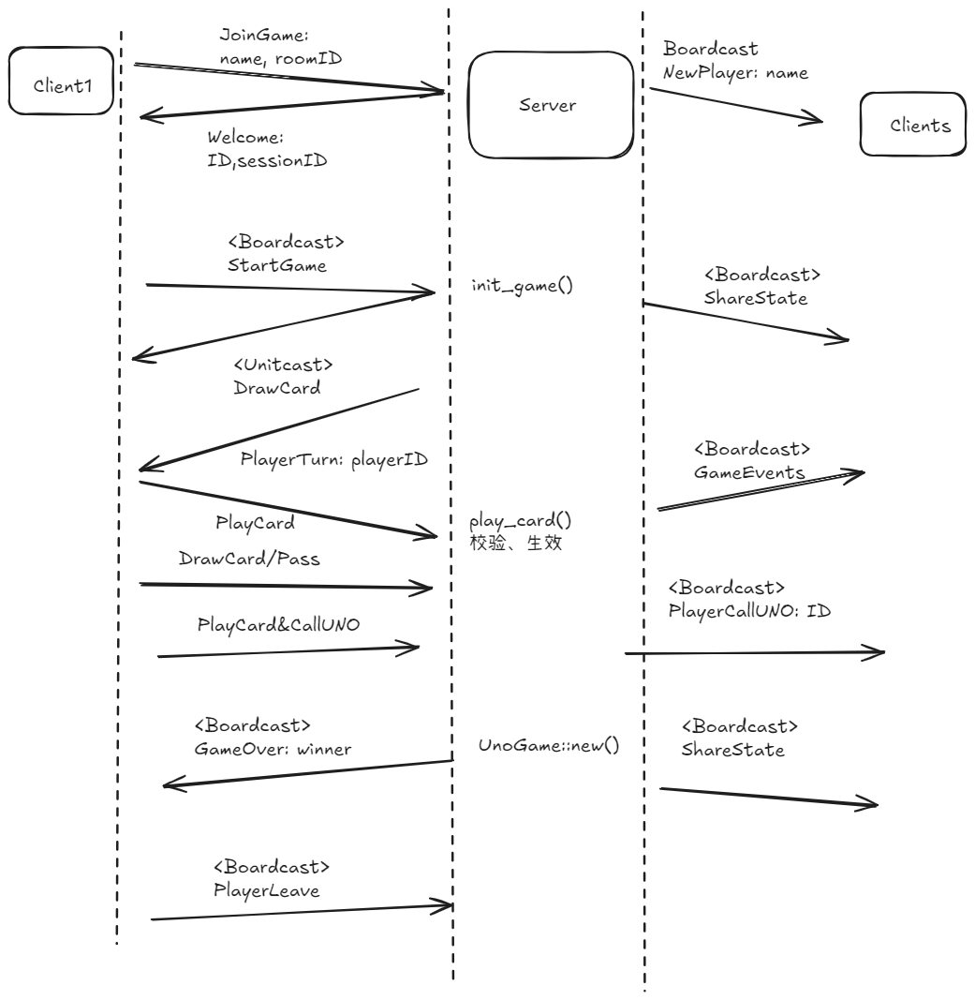
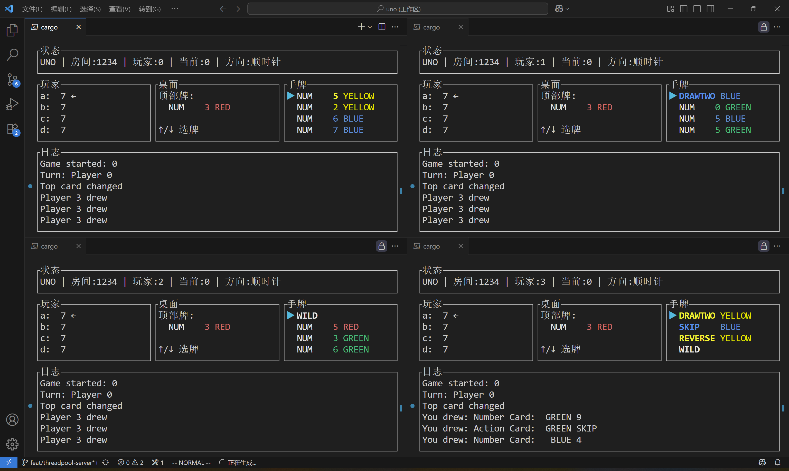
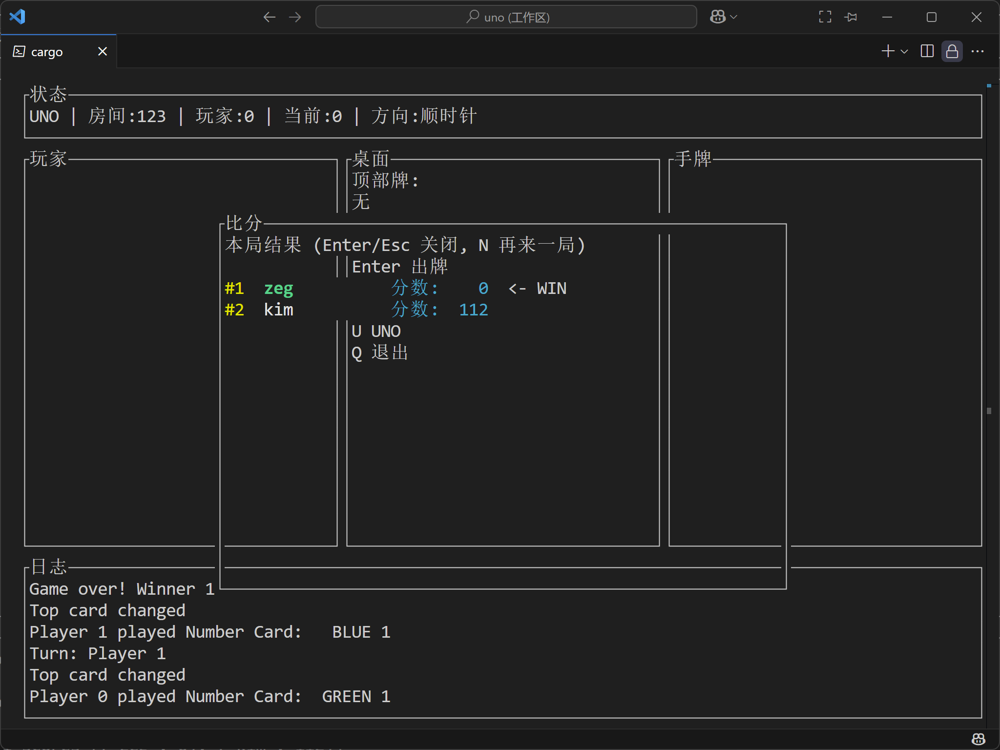

## 软件设计
对软件开发的生命周期来说,首先就是需求分析和架构设计.这个游戏最终的样子,
就正如我们平时玩的联机卡牌游戏一样,是一个服务端-客户端模式,而原项目显然差得远.

### 原项目问题
近日ChatGPT5推出了,我的VSCode Copilot马上就上新模型,感觉挺强大!我跟他聊天,他给我提出很多有用的建议.可惜的是我重启了一下我的电脑,在写本文的时候聊天记录都丢失了,否则我很乐意记录改进项目的经过.


首先是IO分离的问题,我希望设计一个统一的接口,无论是终端还是GUI客户端都能复用的游戏逻辑.
因此直接打印肯定是不行的.

由此,GPT5引出了"事件驱动编程"的概念.

经过一番搜肠刮肚的理解,我突然醒悟!事件驱动编程(Event-Driven Programming)我其实听说过,
我已知的应用场景是GUI开发,比如用户的点击/鼠标滚动都可以抽象为一系列事件,没想到这里也可以用吗?

在重构的过程中,我也不是一开始就全盘进入EDP的,毕竟这对我来说是第一次接触,我总想用已有思维去重构,
但不久就全部失败了,因为我发现UnoGame,Player有些部分总是耦合在一起,非常恶心.我搜索了一下EDP,
知乎的这篇文章阐述了症结所在:
[面向事件编程](https://zhuanlan.zhihu.com/p/22111320)

相反,通过返回一个个事件给事件总线(Bus),相当于一个路由模块,再把事件分发,
既能实现服务端和客户端的通信,又能简化游戏主体逻辑的代码,还能为此编写不同的客户端!
于是我下定决心重构代码.

> 为什么本项目适用?

- 领域模型天然是“事件流”。UNO 的核心状态变化都是离散事件：如加入玩家、出牌、抽牌、跳过、
反转、惩罚、换人、结束等，项目已用一个集中枚举表达它们：`game::events::GameEvent`。
- 逻辑与界面/网络解耦。游戏核心只需产出事件即可，由外层决定把事件用于日志、UI 展示或网络广播。
你已经有事件总线与处理器接口：`ports::bus::EventBus`、`ports::bus::EventHandler`、
以及一个简单的控制台处理器 `ports::bus::ConsoleLogger`。
- 组合简单，可多路消费。同一事件可被多个订阅者并行消费（日志、观战、统计、录像等），
无需更改核心逻辑。
- 方便网络协议映射。服务端可以直接把产生的 `GameEvent` 封装并下发给客户端：`protocol::server2client::ServerMessage::Event`。
- 更易测试与回放。方法已返回事件序列以便断言：`game::uno_game::UnoGame` 的 `init_game`、`play_card`、`draw_card` 都返回 `Vec<GameEvent>`，天然适合单元测试和事件回放。
- 扩展友好。新增可视化 UI、WebSocket 推送或统计模块，只需注册新的事件处理器，不影响游戏引擎。

经过一天的EDP重构,目前游戏主体已经重构为事件驱动,设计了一系列GameEvent.接下来就是消息协议设计和服务端客户端的架构设计了.

首先我要想清楚游戏本身会有哪些事件.服务器有一个线程池,每个线程池都可以作为一个牌局,
用户输入房间编号进入.每次有玩家进入,都要向所有服务端广播玩家.一名玩家发送开始指令,不再接受新玩家,牌局开始.

游戏内部,玩家可向服务端发送PlayCard/CallUNO,对于特殊情况,还有Pass/Challenge等.服务端会向客户端发送DrawCard,要做隐私过滤.游戏结束,发送GameOver,包含获胜者以及分数排名.这属于游戏内事件(GameEvent)

客户端负责对以上事件进行渲染.从而可以开发出不同的客户端:TUI/GUI/Web端.

真是一个非常大的工程!不知道要做到什么时候,还要考虑到加密防篡改的协议,例如维护一个sessionID,使用HTTPS等.

交互UML:


这只是随手画了个大概,具体设计有所不同,以源码为准:

import RepositoryCard from "@/components/mdx/RepositoryCard.astro";

<RepositoryCard repo="TanKimzeg/uno" image="https://raw.githubusercontent.com/TanKimzeg/uno/main/.github/image.png"/>


## 改进方向

- [ ] GameOver优雅处理
- [ ] 优化出牌体验
- [ ] 加密/防抓包外挂
- [ ] 限时出牌
- [ ] 完善挑战机制: [UNO规则](https://zhuanlan.zhihu.com/p/717079545)

## 编写服务端
单线程(即一个房间)的服务端是我亲自编写.处理Client2Server消息,发送Server2Client和GameEvent事件,如同上面简单的UML示例一样.通过将ShareState封在`handle_events`里面,在每次`publish` 广播的时候自动发布,客户端更新渲染.

异步服务器用到了`tokio`库,其API我根本不熟悉.由ChatGPT5编写,我反复测试改进.异步的处理很不一样,独立于我设计的EventHandler trait对象.

## 编写TUI客户端

[什么是 GUI、CLI 和 TUI? ](https://zhuanlan.zhihu.com/p/282776001)

> TUI 是基于文本的用户界面或终端用户界面的缩写。“基于文本”这个说法主要是因为你在屏幕上有一堆文本，而“终端用户界面”的说法是因为它们只在终端中使用。

在Linux世界中,我曾把一些TUI当成CLI了.实际上TUI的体验很有趣,很有UNIX哲学之美!终端的文件管理器Yazi就是Rust编写的TUI应用,另外,在升级软件包的时候也见过TUI提供的选项.

我第一次开发TUI应用, 在ChatGPT5帮助编写的UI框架.那些API调用都由AI写好.我写了TUI客户端的事件处理部分,也调整了一些卡片布局:





很看的UI界面让人欣慰!

## Github项目协作
我给开源项目提过ISSUE和PR.这次来当自己代码的审查员.在将服务端交给AI开发之前,为了避免破坏性的修改,我先确保工作区干净,然后签出一个开发分支:
```shell
git checkout -b feat/threadpool-server
git push -u origin feat/threadpool-server
git reflog  
git branch -a  # 可以看到新分支
```
搞好之后,可以增加Cargo.toml中的版本号,然后准备合并到main分支

```shell
git fetch origin
git checkout main
git pull origin main
git checkout feat/threadpool-server
git merge origin/main
```
提交最终整理:
```shell
git add .
git commit -m "feat: multi-room async server"
```

打开Github,最为仓库的主人,我可以合并分支:
- 打开仓库 -> Compare & pull request
- 标题：feat: multi-room async server
- 描述贴上变更要点与测试步骤
- 选择 “Squash and merge” (整洁) 或 “Rebase and merge”

合并后可以打标签:
```shell
git checkout main
git pull origin main
git tag -a v0.1.1 -m "v0.1.1 multi-room async server"
git push origin v0.1.1
```

查看标签:
```shell
git tag -a
```

发布Github Release:
- Releases -> Draft new release -> 选择 v0.1.1 标签 -> 填写要点 -> Publish

清理分支:
```shell
git branch -d feat/threadpool-server
git push origin --delete feat/threadpool-server
```

## 总结
首先是对EDP的心得.任何程序的编写不是一蹴而就的,总是在开发的过程中反复重构,逐渐清晰的,逐渐优化的.但也不能完全没有框架思路,否则就没有方向,耗费心力.经过这轮开发,EDP开拓了我的视野,在我脑中留下了一席之地.以后再遇到复杂交互的任务,就得优先考虑EDP了.它跟以往我们习惯的线性思维不一样,也无关并发.横看成岭侧成峰,按线性的思维就会导致大量的耦合和阻塞,而换一个视角,另用事件总线来分别处理各种事件,反而豁然开朗.

其次是对Rust的掌握程度.这次的开发任务虽然繁重,但效率却可观.一方面有AI辅助设计,另一方面则是Rust本身的特点了.在开发过程中,我基本上都在解决程序逻辑的问题,而非像C语言那样在调试莫名其妙的Bug.甚至我连VSCode的调试功能都没有使用(我本来是想试一下的,但是不知道为什么打不了断点,就放弃了,但没有造成开发上的困扰).连Python都要调试/打印去发掘程序运行中的状态机.这是因为编译就能发现错误,`cargo check`一下的成本太低了~还有,Rust中难的部分(生命周期/智能指针)在开发中并没有用到太多,可能是因为我编写的是联网应用,需要发送的数据大多只好复制一份,不可能转移所有权,不知道有没有更好的实践能降低开销呢?

最后是对AI辅助编程的喜悦.为了使用python-env插件(见上一篇博客),我不得不升级了VSCode.这次增加了所谓的MCP服务器,我根本用不到,有点烦.但是更新了很多新的大模型,如Claude Sonnet,以及最近推出的ChatGPT5.本次开发都用的是这个模型.首先我就发现了它的语气跟之前我喜欢用的4o不一样,更专业了,不知道是不是prompt变了.另外它的代码能力和专业知识确实强,肯定是消化了大量Github代码.本来我对AI在Rust这种小众且严格的语言上的表现不抱太大期待,没想到它自主编写的服务端和客户端代码基本没有语法错误,甚至连API都是正确的用法,这说明它的知识非常新,非常准,让我刮目相看了.没有这么强的AI,本轮开发效率要低很多,要走更多弯路.


虽说有Copilot,但我也绝非等闲之辈.短时间内理解并运用EDP,在公认极难的编程语言上编写联机游戏,自主调试通过编译器的审查,体验一遍Github项目协作流程,忍受长时间专注钻研的寂寞.纵使这样的小天才,也注定难逃被埋没的命运.