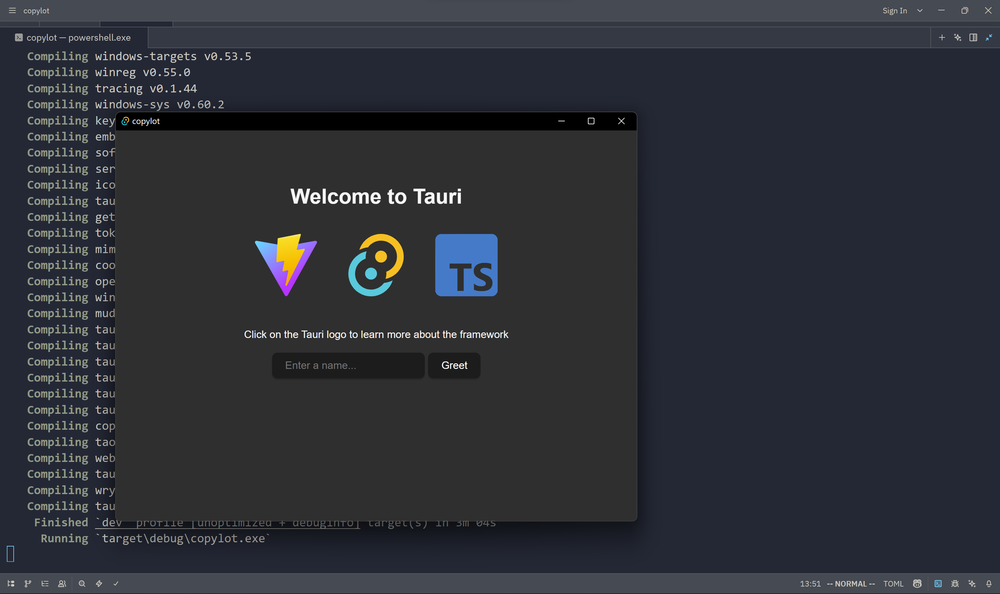
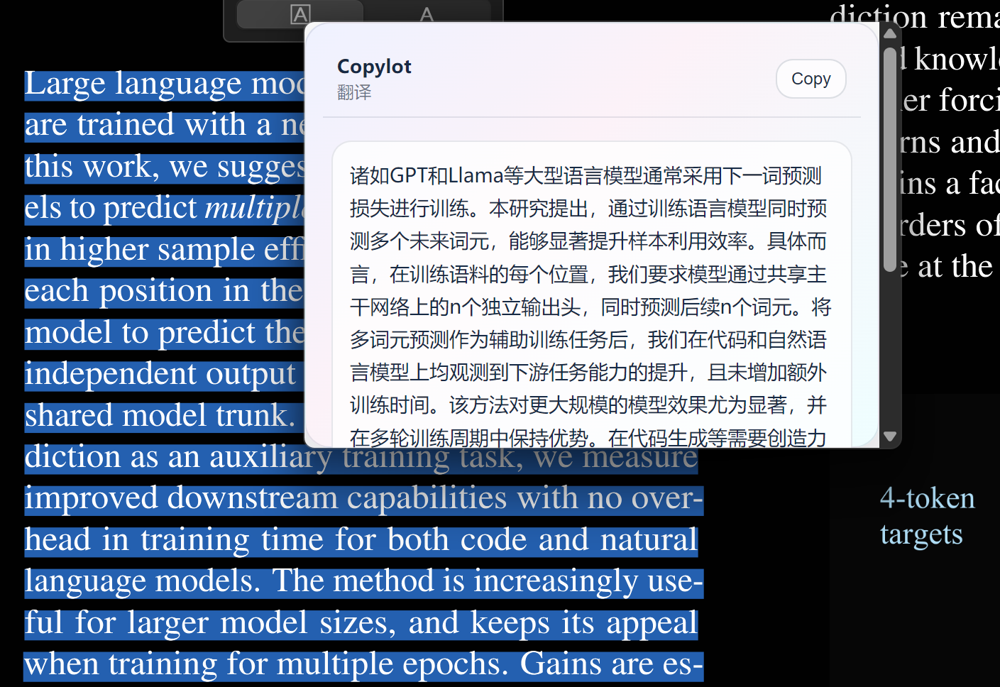
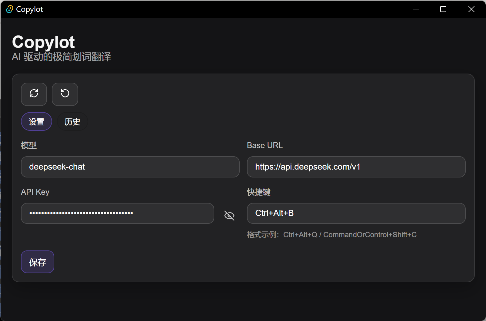
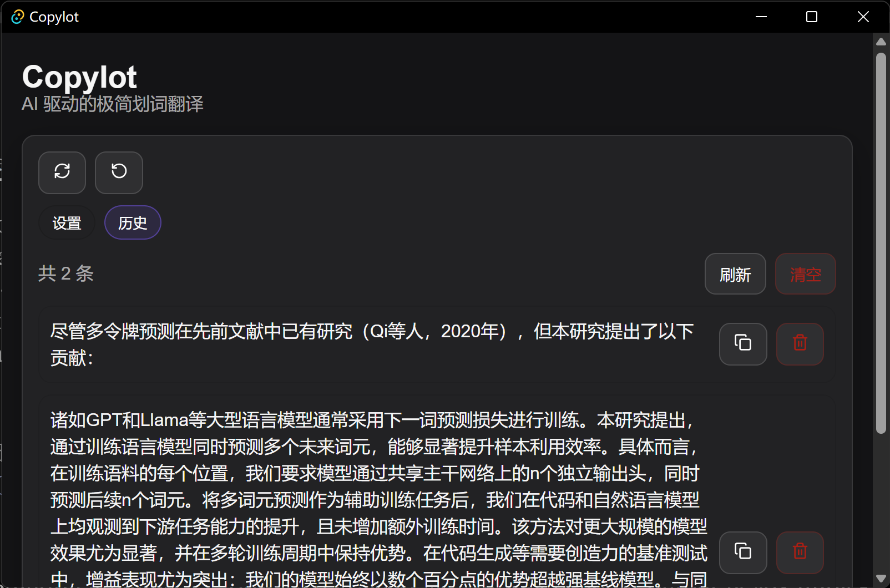

最近在看英文文献的时候需要翻译，以前用的DeepL来实现划词翻译，但该应用臃肿不堪异常卡顿，还限制单次翻译字数，我实在忍无可忍，决定自己开发一个全局应用，调用大语言模型API直接翻译，后面还可以拓展询问功能，类似VSCode Copilot inline chat那种感觉。

我在必应中搜索发现了 [Copy2AI](http://www.copy2ai.com/) 这其实可以满足我的需求，但我偏向于更轻量化，而且它也没有开放源代码。

跟DeepSeek聊了技术栈后，我决定选用Rust+Tauri。

## 环境配置

```shell
rustup toolchain install stable-msvc
```

同时安装MSVC/SDK(见 <https://zhuanlan.zhihu.com/p/678846997>)

根据 <https://v2.tauri.org.cn/start/create-project/>

可以成功运行。



> 我尝试在Zed中开发Rust项目……感觉那个Copilot插件还是有问题，AI编辑体验不好。虽然我rust代码主要是手搓的，但是因为前端代码还是得通过AI生成，我回到VSCode了。

## 第一个功能：划词

为了获得选中文本，AI为我提供了一个方案：调用Windows的UI Automation。但是实测无效，它就跟我说用粘贴板。

我觉得UI Automation无效很奇怪，在Github中搜索相关关键词，找到了两个仓库的相关实现：

- <https://github.com/pot-app/Selection/blob/622e8f32c851daabe45c88481a1c59d11bc7256e/src/windows.rs#L49>

- <https://github.com/any-menu/any-menu/blob/b70068ba4eb36effdfe895cbad7425e01ffc5419/src/Tauri/src-tauri/src/uia.rs#L865>

目前我就没有遇到UI Automation能成功的情况……这里折腾了不少时间。

通过 `WebViewWindow` 的 `emit` 方法，将文本发送到前端，就可以显示选中的文本了！

## 核心功能：调用LLM API

能够获得选中文本后，为了得到LLM的翻译结果，我还得将文本发送给API。在Python中我写过相关的代码，我不知道Rust这边的crate是什么，我就尝试直接搜索openai：

<https://crates.io/crates/openai>

这个封装好的crate确实不错！按照其文档编写了翻译接口。

再次让AI生成前端代码。我怀疑Github Copilot前段时间砍掉了一些模型之后，把剩下的模型也降智了。以前生成的前端代码很好，现在生成的代码总有点问题，看起来也很丑，用的GPT-5.2却像回到了GPT-4o时代。

## 全局快捷键呼出窗口

依靠[全局快捷键插件](https://v2.tauri.org.cn/plugin/global-shortcut/)实现，需要在app的setup方法内设置。

## 重构代码：配置模块

在快速开发阶段我自己编写了一个LLMConfig数据类存放我的LLM配置，包括模型、api key、Base URL。正好在知乎上看到了一个用Tauri框架编写的应用[MarkFlowy](https://github.com/drl990114/MarkFlowy)，我就学习了一下其项目结构，看到了它里面的配置模块，通过[存储](https://v2.tauri.org.cn/plugin/store/)插件实现配置功能。同时，把快捷键也放进配置里面，支持热重载快捷键。>

## 编译发布

通过 `pnpm tauri build` 命令编译为安装包。但是在我本地机器[打包的时候总是timeout](https://blog.csdn.net/weixin_44897499/article/details/140959338)，我就想到了Github Action，还可以直接发布到Release页面，非常方便。

## 系统托盘

[系统托盘](https://v2.tauri.org.cn/learn/system-tray/)这个功能真的让我眼前一亮！感受到了Tauri的强大，感觉没有Electron什么事了，All in Tauri！

官方文档已经写得很详细了。由于注册了全局快捷键，当关闭主窗口的时候实际上没有退出进程，这个程序还在后台监听快捷键。我在系统托盘中增加了退出按键，彻底关闭应用。

## 翻译历史记录

为了像粘贴板那样支持历史记录管理，我又增加了一个历史记录的存储功能。因为复用了很多存储代码，我将存储模块重构为一个trait，并提供默认实现。

现在每次翻译自动添加到历史记录里面，主窗口支持历史记录管理，包括清空、删除和复制操作。

---

项目发布在[Copylot - Github](https://github.com/TanKimzeg/copylot)，欢迎体验、改进！






