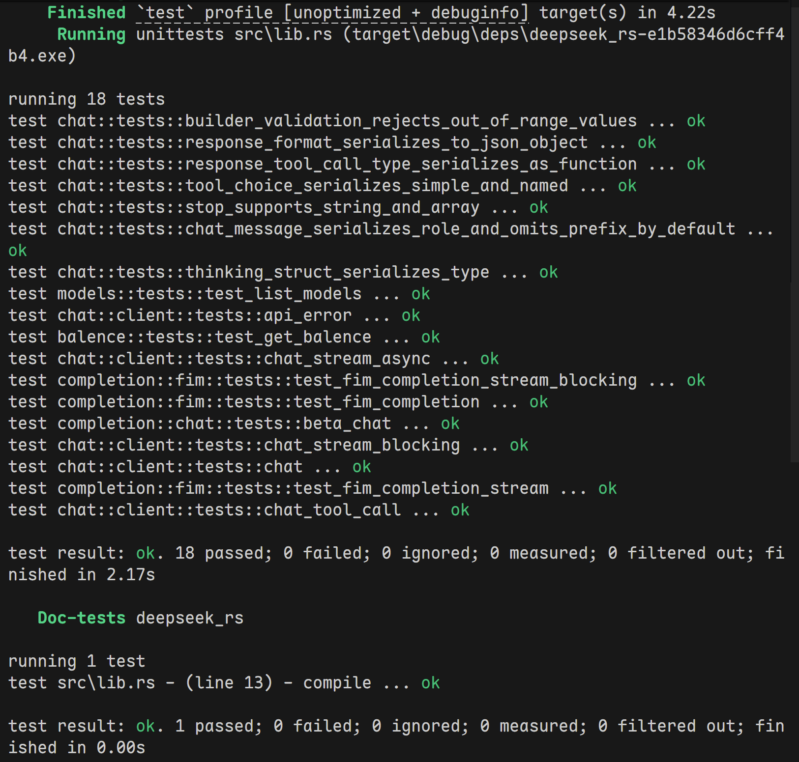
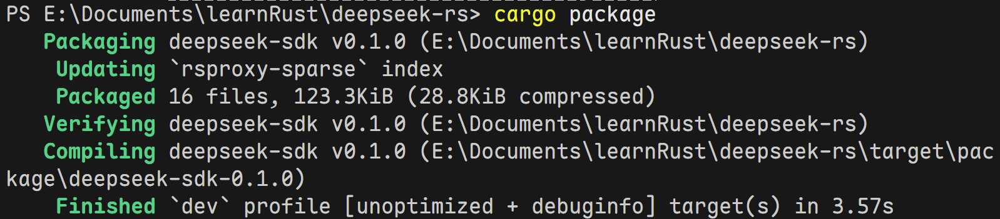
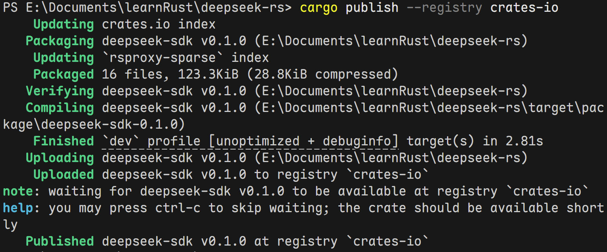

之前我基于Rust tauri框架开发了[Copylot：划词AI翻译助手](https://tankimzeg.top/blog/rust/copylot/)。为了调用DeepSeek API，我在[crates.io](https://crates.io)找到了一个模仿OpenAI的SDK。但疏于维护，缺少一些现行标准的实现，比如我我无法控制思考模式。我随后查阅了[DeepSeek API文档](https://api-docs.deepseek.com/zh-cn/api/create-chat-completion)，发现有不少字段都缺乏支持。尝试向他们提交PR，不出意料没有回音。那么社区有没有其他方案呢？最近营销起来的[DeepSeek-TUI](https://github.com/Hmbown/DeepSeek-TUI/blob/eeccf7de6c3b1c8becce367cfcba6ce4d1fbd057/crates/tui/src/client/chat.rs#L1667)的做法也主要是从返回的JSON响应中提取字段，做一些简单的结构化封装。

OpenAI有一些多模态的接口，功能复杂得多。我决定自行编写一个crate，专门支持DeepSeek API。经过三四天的编写和调试，我完成了官网上所有提及API接口的支持。下面，我将在对比中介绍其中的功能。

---

## `deepseek-sdk` vs `deepseek_rs` 全面对比

### 功能对比一览表

| 功能                          | `deepseek-sdk` ✅                   | `deepseek-rs` (v0.1.4)           |
| --------------------------- | ----------------------- | ----------------------- |
| **Chat Completions**        | ✅                       | ✅                       |
| **Async Streaming (SSE)**   | ✅                       | ❌ 不支持                   |
| **Blocking Streaming**      | ✅                       | ❌ 不支持                   |
| **FIM 补全 (beta)**           | ✅                       | ❌ 不支持                   |
| **列出模型**                    | ✅                       | ❌ 不支持                   |
| **查询余额**                    | ✅                       | ❌ 不支持                   |
| **Thinking 推理开关**           | ✅                       | ❌ 不支持                   |
| **Reasoning Effort**        | ✅                       | ❌ 不支持                   |
| **Tool Calling**            | ✅                       | ✅                       |
| **Logprobs / Top Logprobs** | ✅                       | ✅                       |
| **User ID**                 | ✅                       | ❌ 不支持                   |
| **Builder 模式**              | `derive_builder` 自动生成   | 手写 `with_*` 方法链         |
| **统一 Request Trait**        | `DeepSeekRequest` trait | ❌ 无统一抽象                 |
| **API 错误解析**                | 结构化 `ApiError` 解析       | 只返回 HTTP status 分类      |
| **真实 API 测试**               | ✅ 有可运行的集成测试             | ❌ 全被 `#[ignore]`，无法自动运行 |
| **Edition**                 | **2024**（最新）            | 2021                    |
| **上次更新**                    | 活跃开发中                   | ~1 年前                   |

### 我的核心优势

**1. 功能覆盖面碾压**
对方只做了 `chat/completions`，我覆盖了 DeepSeek API **全部** 4 个端点：chat、FIM、models、balance。功能量是对方的 **4 倍**。

**2. 真正的 Streaming 支持**
对方完全没有 streaming 实现。我支持了 **async streaming**（`tokio::mpsc::Receiver`）+ **blocking streaming**（`std::sync::mpsc` 驱动内部 tokio runtime），两者都能用。这是一个巨大的差异点。

**3. 统一的 API 抽象**
我设计了 `DeepSeekRequest` trait，所有请求类型（Chat、FIM）都实现同一接口，用户可以统一调用 `.send()`、`.stream()`、`.stream_blocking()`。对方的 chat 只是一个 `client.chat_completions(req)` 方法，没有扩展性。

**4. API 错误处理更专业**
对方只是用 `thiserror` 把 HTTP status 映射成枚举，我则**真正解析了 DeepSeek API 返回的 JSON 错误体**（`ApiError`，含 `message`、`type`、`param`、`code`），调试体验完全不是一个级别。

**5. 代码质量和工程质量**
    - 我的测试不是摆设——是真正发请求到 API 的集成测试，并且有对 API 错误体的断言
    - 使用了最新的 **Edition 2024**
    - 模块结构清晰分离（`chat/`、`completion/`、`models/`、`balence/`、`error/`）
    - 用 `derive_builder` 生成 Builder，减少手写模板代码

### 对方的优势

| 项目               | 对方的优势                                                         |
| ---------------- | ------------------------------------------------------------- |
| **下载量**          | 6,887 downloads（先发优势）                                         |
| **版本数**          | 5 个版本（成熟度感知）                                                  |
| **newtype 参数校验** | `Temperature`、`TopP`、`MaxTokens` 都用了 newtype 做 clamp 校验，更类型安全 |

### 我缺少但对方有的东西

- `frequency_penalty` / `presence_penalty` 参数（不过 DeepSeek 中这两个参数已经deprecated）
- 一些参数的 newtype 校验（我选择了 Builder validate，各有千秋）

## 对比结论

**我的库在功能和架构上完胜。** 对方的库更像是一个“占坑”项目——只做了最基础的 chat completion，没有 streaming、没有其他端点、一年多没更新、测试都是忽略状态。我的库功能更全、设计更统一、工程质量更高。

> 至于「占着茅坑不拉屎」——从数据看确实如此：1 年多没实质更新、6.8k 下载但 0 个 dependent crates、测试全被 ignore，基本上处于停滞状态。

---

## 发布到[crates.io](https://crates.io)

我记得Rust入门教程就有这个内容，但直到现在我才准备发布第一个crate。crates.io跟pypi一样有包重名的缺点。没办法，我只好重新起一个名字。最终我决定命名为 `deepseek-sdk` 。

以下是发布流程的详细步骤：

### 注册账户

访问 [Crates.io](https://crates.io/)，使用 GitHub 账号登录。
进入 Account Settings，创建一个API token，并在终端中运行 `cargo login` 登录。由于我更改了 rsproxy 镜像源，才需要指定官方仓库。

```shell
$cargo login --registry crates-io
    Updating crates.io index
please paste the token found on https://crates.io/me below                    
***
       Login token for `crates-io` saved
$cargo check
    Finished `dev` profile [unoptimized + debuginfo] target(s) in 0.19s
```

### 配置 `Cargo.toml`

我的 `Cargo.toml` 中是这样配置`package`的：

```toml
[package]
name = "deepseek-sdk"
version = "0.1.0"
edition = "2024"
authors = ["Tan Kimzeg <tankimzeg@qq.com>"]
description = "DeepSeek API client for Rust."
homepage = "https://github.com/TanKimzeg/deepseek-sdk"
repository = "https://github.com/TanKimzeg/deepseek-sdk"
license = "MIT"
readme = "README.md"
keywords = ["deepseek", "openai", "ai"]
categories = ["api-bindings", "asynchronous", "web-programming"]

```

确保包名未被注册。

### 打包验证

```shell
# 确保代码能编译
cargo build

# 确保测试通过
cargo test

# 检查 crate 元数据是否正确
cargo package
```





### 发布



很快就在 [Crates.io](https://crates.io/)上找到我发布的crate：[deepseek-sdk](https://crates.io/crates/deepseek-sdk)，但索引和文档页（由 docs.rs 自动构建[https://docs.rs/deepseek-sdk](https://docs.rs/deepseek-sdk)）需在半小时内才能彻底更新。

很高兴发布第一个包🎉！现在我已经是一个真正的 Rust 包作者了🦀
