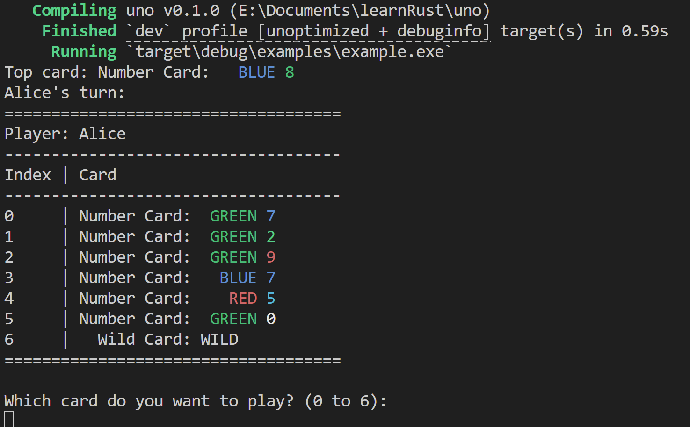

## 为什么学习Rust

这几年，由于Rust传教士的努力，Rust进入了大家的视野，给人一种未来大势所趋的感觉。好像是去年年中的时候，我第一次听说了这个编程语言，了解到它受吹捧的优势。我向来思想开明，对新兴事物充满兴趣和热情，于是决定学习，作为C++的替代品。

我以前在leetcode上刷题的时候注意到它们的题的函数签名有类型注释，我才发现Python有这样的特性。后来我尝试培养这一习惯，发现非常爽！既有利于Pylance解释器提醒我写项目的过程中没有考虑到的情况（引发Bug的原因之一），也有利于动手写代码之前明确每个函数的作用，自顶向下设计程序。软件工程简直是一种艺术般的构思！

我看到Youtube上[这位博主](https://www.youtube.com/@Indently)也有写类型注释的习惯，跟我不谋而合。他介绍的一些Python技巧也给我很多帮助，Python居然能写得这么爽！最近他也开始发Rust的视频了。

这是一个很好的契机。暑假，我终于有时间具体学习一下。

## 学习感受

Rust代码给人一种很丑的感觉，而且其学习曲线陡峭，所有权、生命周期这些概念也令新手恐惧。去年的时候我就看过Rust官方的一点文档，当时还是直接看英语文档。但当我最近再去找教程时，发现质量和数量都有了很大提升，而且也有了中文翻译，集合在一起，这不仅为新手的学习提供了很大的帮助，也能为开发过程中查找API用法提供便利。

[Rust中文文档](https://rustwiki.org/docs/)

花了两天时间，我学到了Rust程序设计语言的第12章：[一个I/O项目：构建命令行程序](](https://rustwiki.org/zh-CN/book/ch12-00-an-io-project.html))，跟着教程做了一遍。

由于我没学过C++，而且Rust自身也有奇怪的语法糖，我觉得很别扭，特别是if let，match这些基础的语法糖，还有很多错误处理的方法。不过好在我懂计算机程序底层，能够很快理解生命周期和设立所有权的原因。这么搞的话安全性确实高，甚至有点过于苛刻了。在下面的入门项目中我得到了深刻体会。

## 初学Rust的第一个入门项目

受bilibili视频 [Python，但是用Rust的写法](https://www.bilibili.com/video/BV11f4xekEqz) 的启发，我决定写一个UNO游戏，作为练习项目。

实际上项目没有用到生命周期标注和只能指针那些东西，如果硬要减少开销，应该是能用上的。在一个结构体的方法中，如果需要对结构体的某一个字段进行可变引用，就要对方法传入整个结构体的可变引用，因而此时及时是对另一个不相干的字段的修改也是不行的。这真是太苛刻了，不过好像在后面的RefCall可以解决，我在写这个项目时还不会，造成了一些不便。

Rust的测试非常好用！我通过编写许多测试，甚至不需要调试程序，编译器通过了就没问题，除了处理逻辑上的疏忽（UNO虽然在卡牌游戏里算简单的，但毕竟还是有很多种情况的）。另外编译器的报错提示很明确，很快就能确定问题所在。所以，我居然只用1天时间就写出来了这个简陋的命令行游戏，换做C语言现在肯定还在用打印调试呢！Python可能能快一点，不过看在我对Rust的写法、项目管理不熟悉的前提下，我对这样的开发体验还是很满意的，完全超出了我的预料，何况编译型语言的速度是解释型语言不能比的。

虽然现在这个项目是一个非常基础的库crate，只能单机自娱自乐，离我设想的网络游戏应用还差一整套网络编程，不过游戏的逻辑和接口都有了。我觉得项目管理和函数实现上应该还有更好的实践，随着我对Rust学习的深入，我希望能逐步完善这个项目！

使用 `cargo run --example example` 命令运行示例程序:

源代码已上传至Github:

import RepositoryCard from "@/components/mdx/RepositoryCard.astro";

<RepositoryCard repo="TanKimzeg/uno" image="https://raw.githubusercontent.com/TanKimzeg/uno/main/.github/image.png"/>

