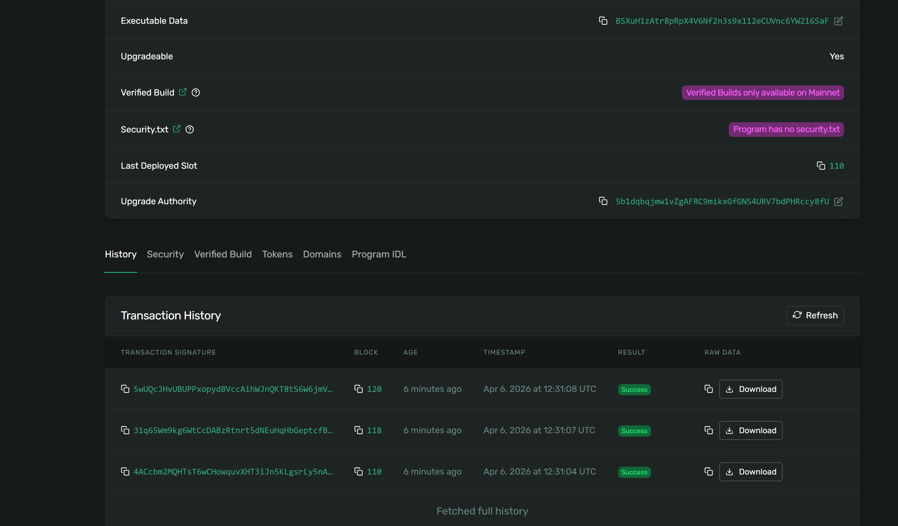

## 搭建开发环境

官方网站上提供了[安装文档](https://solana.com/zh/docs/intro/installation)，但我喜欢Docker环境开发。我改编了一个[Dockerfile](https://github.com/TanKimzeg/solana-docker)，使用了一些镜像源，可以直接构建镜像开发环境。但[Solana CLI](https://solana.com/zh/docs/intro/installation/dependencies#%E5%AE%89%E8%A3%85-solana-cli)、[Anchor CLI](https://solana.com/zh/docs/intro/installation/dependencies#%E5%AE%89%E8%A3%85-anchor-cli)没有镜像源，最好还是用加速器下载。

构建后，运行

```shell
rustc --version && solana --version && anchor --version && surfpool --version && node --version && yarn --version
```

看到以下输出才算成功：

```log

rustc 1.94.1 (e408947bf 2026-03-25)
solana-cli 3.1.12 (src:6c1ba346; feat:4140108451, client:Agave)
anchor-cli 0.32.1
surfpool 1.1.2
v24.10.0
1.22.22
```

缺哪个就去[安装依赖项](https://solana.com/zh/docs/intro/installation/dependencies)对应单独安装。

随后，（在 `workspace`目录中）初始化项目：

```shell
anchor init hello_sol 
cd hello_sol
```

然后就可以关闭当前窗口，去新项目中打开VSCode，使用Dev Container开始开发~

但是后续需要运行 `anchor build` 等命令时，由于挂载本地目录，IO速度非常慢，不建议使用这个Dockerfile。那这样就丧失了容器的优势，体验不如用虚拟机了。

所以，我转而去下载了一个**Ubuntu Server 24.04**（更旧的版本会使用solana工具链会报GLIBC不满足条件的问题）。安装速度快很多，然后用VSCode的Remote SSH开发。

## 运行示例项目

```shell
solana-keygen new -o ~/.config/solana/id.json
```

得到我的公钥：

`pubkey: 5b1dqbqjmw1vZgAFRC9mikxGfGN54URV7bdPHRccy8fU`

另一个shell运行

```shell
solana-test-validator
```

这边可以

```shell
solana airdrop 2
solana balance
```

部署程序：

```shell
anchor build
anchor deploy
```

得到部署成功

```shell
$ anchor deploy
Deploying cluster: http://127.0.0.1:8899
Upgrade authority: /home/kim/.config/solana/id.json
Deploying program "task_market"...
Program path: /home/kim/task_market/target/deploy/task_market.so...
Program Id: BwmMCaKvNr79ogioXnoM22soAcbW546ekFRGWR5REdJx

Signature: 4ACcbm2MQHTsT6wCHowquvXHT3iJn5KLgsrLy5nA5gVNACXrZSB78qQWDEMuQb8j21kUbqaYMS2L2Dc9kux9qbZb

Waiting for program BwmMCaKvNr79ogioXnoM22soAcbW546ekFRGWR5REdJx to be confirmed...
Program confirmed on-chain
Idl data length: 215 bytes
Step 0/215 
Idl account created: DeKEBzPvUQ3JEFG6R3CbXM2JSoJV2t5say7KXo5APG5W
Deploy success
```

访问[区块链浏览器](https://explorer.solana.com/) ，切换到本地集群，搜索这个程序ID，可以看到：



磁盘不够用了，Linux神奇的扩容步骤：

```shell
kim@ubuntu-server:~/task_market$ df -h
Filesystem                         Size  Used Avail Use% Mounted on
tmpfs                              387M  1.6M  386M   1% /run
/dev/mapper/ubuntu--vg-ubuntu--lv  9.8G  9.3G     0 100% /
tmpfs                              1.9G     0  1.9G   0% /dev/shm
tmpfs                              5.0M     0  5.0M   0% /run/lock
/dev/sda2                          1.8G  104M  1.6G   7% /boot
tmpfs                              387M   12K  387M   1% /run/user/1000
kim@ubuntu-server:~/task_market$ lsblk
sudo pvs
sudo vgs
sudo lvs
sudo fdisk -l | sed -n '1,120p'
NAME                      MAJ:MIN RM  SIZE RO TYPE MOUNTPOINTS
sda                         8:0    0   20G  0 disk 
├─sda1                      8:1    0    1M  0 part 
├─sda2                      8:2    0  1.8G  0 part /boot
└─sda3                      8:3    0 18.2G  0 part 
  └─ubuntu--vg-ubuntu--lv 252:0    0   10G  0 lvm  /
sr0                        11:0    1 1024M  0 rom  
[sudo] password for kim: 
  PV         VG        Fmt  Attr PSize  PFree
  /dev/sda3  ubuntu-vg lvm2 a--  18.22g 8.22g
  VG        #PV #LV #SN Attr   VSize  VFree
  ubuntu-vg   1   1   0 wz--n- 18.22g 8.22g
  LV        VG        Attr       LSize  Pool Origin Data%  Meta%  Move Log Cpy%Sync Convert
  ubuntu-lv ubuntu-vg -wi-ao---- 10.00g                                                    
Disk /dev/sda: 20 GiB, 21474836480 bytes, 41943040 sectors
Disk model: VMware Virtual S
Units: sectors of 1 * 512 = 512 bytes
Sector size (logical/physical): 512 bytes / 512 bytes
I/O size (minimum/optimal): 512 bytes / 512 bytes
Disklabel type: gpt
Disk identifier: 488DB51D-F361-434A-BDE2-68790A510E19

Device       Start      End  Sectors  Size Type
/dev/sda1     2048     4095     2048    1M BIOS boot
/dev/sda2     4096  3719167  3715072  1.8G Linux filesystem
/dev/sda3  3719168 41940991 38221824 18.2G Linux filesystem


Disk /dev/mapper/ubuntu--vg-ubuntu--lv: 10 GiB, 10737418240 bytes, 20971520 sectors
Units: sectors of 1 * 512 = 512 bytes
Sector size (logical/physical): 512 bytes / 512 bytes
I/O size (minimum/optimal): 512 bytes / 512 bytes
kim@ubuntu-server:~/task_market$ sudo lvextend -r -l +50%FREE /dev/mapper/ubuntu--v
g-ubuntu--lv
  Size of logical volume ubuntu-vg/ubuntu-lv changed from 10.00 GiB (2560 extents) to 14.11 GiB (3613 extents).
  Logical volume ubuntu-vg/ubuntu-lv successfully resized.
resize2fs 1.47.0 (5-Feb-2023)
Filesystem at /dev/mapper/ubuntu--vg-ubuntu--lv is mounted on /; on-line resizing required
old_desc_blocks = 2, new_desc_blocks = 2
The filesystem on /dev/mapper/ubuntu--vg-ubuntu--lv is now 3699712 (4k) blocks long.
```

如果编写好TypeScript测试文件后，用 `anchor test` 测试更方便。

## 项目一：AI驱动的策略金库

把[对话历史](https://chat.deepseek.com/share/1zrpqqfd83pvdbp4e1)发给Github Colipot，迭代多轮生成可运行的智能合约。

测试成功了：

```shell
kim@ubuntu-server:~/task_market$ solana -u http://127.0.0.1:8899 program show BwmMCaKvNr79ogioXnoM22soAcbW546ekFRGWR5REdJx | head -n 40

Program Id: BwmMCaKvNr79ogioXnoM22soAcbW546ekFRGWR5REdJx
Owner: BPFLoaderUpgradeab1e11111111111111111111111
ProgramData Address: BSXuH1zAtr8pRpX4V6Nf2n3s9x112eCUVnc6YW216SaF
Authority: 5b1dqbqjmw1vZgAFRC9mikxGfGN54URV7bdPHRccy8fU
Last Deployed In Slot: 104
Data Length: 321968 (0x4e9b0) bytes
Balance: 2.24210136 SOL

kim@ubuntu-server:~/task_market$ solana -u http://127.0.0.1:8899 account BwmMCaKvNr79ogioXnoM22soAcbW546ekFRGWR5REdJx

Public Key: BwmMCaKvNr79ogioXnoM22soAcbW546ekFRGWR5REdJx
Balance: 2.00114144 SOL
Owner: BPFLoaderUpgradeab1e11111111111111111111111
Executable: true
Rent Epoch: 18446744073709551615
Length: 36 (0x24) bytes
0000:   02 00 00 00  9b 1f 54 68  4b 9e 47 4f  0b ee 70 a8   ......ThK.GO..p.
0010:   73 b4 cc a5  60 61 dc 66  43 6c bd 9f  6f a2 5f 53   s...`a.fCl..o._S
0020:   38 52 ba 34            
```

---

### 进一步测试结果（可复现）

我刚在当前工作区状态下又完整跑了一遍 strategy_vault.ts，结果稳定通过：

- `localnet: init_ix_data + initialize_vault + set_ix_data + rebalance (no swap)` ✅ `1 passing`
- 模拟日志里能看到：
  - `Instruction: Rebalance` 被调用并 `success`
  - 交易签名 `tx: ...` 打印成功
- program 也确认已正确部署到 localnet：
  - `Owner: BPFLoaderUpgradeab1e11111111111111111111111`
  - `Executable: true`

### 现在已经实现了什么功能（合约侧）

在 lib.rs 里，你现在已经落地了一个“策略金库（Strategy Vault）”的可运行骨架，关键点如下：

1) **Vault 核心账户模型（PDA 托管）**

- `vault` PDA：按 `[b"vault", owner]` 派生
- `vault_authority` PDA：按 `[b"vault_authority", vault]` 派生，作为金库资产的 token authority
- 为 USDC / wSOL 预留并通过 ATA 方式建立金库托管 token account（`vault_usdc`, `vault_wsol`）

1) **IxData PDA：用“本程序 PDA”承载外部 CPI 指令 data**

- `ix_data` PDA：按 `[b"ix_data", agent]` 派生
- 指令：
  - `init_ix_data`：初始化 ix_data 账户
  - `set_ix_data(data)`：写入（或更新）Jupiter CPI 所需的指令 data bytes
- 这满足了你之前强调的“localnet 演示也要用本程序 PDA 承载 ix data”，而不是把 data 硬塞进 remaining accounts。

1) **Agent 调用的 rebalance 风控链路**

- `rebalance` 已实现并包含关键风控/治理逻辑（至少涵盖）：
  - agent 授权校验
  - nonce 防重放（递增）
  - 最小调仓间隔
  - 目标比例上下界 + 单次变化上限
- 当前演示模式下 `callJupiterSwap=false`，因此**不执行真实 swap**，但风控、状态更新、事件等链路都能跑通。

1) **Deposit/Withdraw 指令骨架已具备**

- `deposit` / `withdraw` 已实现（PDA signer seeds 等模式已打通）
- 但目前演示测试还没把“铸币/给 owner 创建 ATA/转入金库”这条资金流跑起来（下一步可以补）。

### 已完成的演示（测试侧）

task_market.ts 当前已经演示并验证了：

1. 生成新的 `owner` / `agent`，并对二者 airdrop SOL  
2. `initIxData`：创建 `ix_data` PDA（由 owner 付费，agent 作为 authority）  
3. `initializeVault`：创建 `vault`、`vault_authority` 以及 vault 的 USDC/wSOL ATA  
4. `setIxData`：往 `ix_data` 写入占位数据（避免空数据被合约拒绝）  
5. `rebalance(no-swap)`：走完整风控 + nonce 更新链路，并成功上链  
6. 读取 `vault` 账户并断言 `nonce == 1`

### 下一步建议（你选一个方向我就继续做）

A. **把资金流演示跑通**：在 localnet 给 owner mint 一些 USDC → 创建 owner ATA → `deposit` → 再 `rebalance`（仍 no-swap）  
B. **接近真实 Jupiter**：转到 devnet（localnet 没有 Jupiter 程序/流动性），准备 Jupiter 指令与 remaining accounts，把 `callJupiterSwap=true` 跑起来。

---

## 项目二：钱包管家

同样把[对话历史](https://chat.deepseek.com/share/odlty4fn8t13c8dcrg)发给Github Copilot，迭代多轮成功生成代码。但Copilot的理解好像跟设计的不太一致……

项目地址：[wallet-guardian](https://github.com/TanKimzeg/wallet-guardian)

## 小结

关于区块链领域，虽然我从大一就去了解比特币网络，但长期停留在比特币，没有了解很多新兴的链。比特币是最简单的区块链，导致我以为其他链也只有交易金融属性，有些无聊。现在的区块链通过智能合约拓展了非常多的功能，把程序放在区块链上运行，并以此开发了去中心化的APP，非常强大！Solana整套工具链非常完备、采用Rust/TypeScript作为主要开发语言，文档详细，后发优势非常明显。因此我觉得Web3的前景非常好，安全匿名、去中心化，符合Anarchism理想。由于天生排斥中心化控制，不可避免地受限于传统应用和当局管控。所以只有现实发生这种根本性地变革，否则Web3无法被大规模使用，只能是极客专属的浪漫。它不可能像LLM一样，不到十年的时间，爆发到每一个人身边。

不得不说这些用Web3开发赚钱的人嘴是真严啊，文档工具链这么成熟，我现在才接触到，还没有使用过任何DApp。然后每种链的设计、概念、工具都不一样，这也形成了难以广泛传播的壁垒。然后这些开发者主要是在搞量化炒币，赚钱的方法当然不能被人学走，所以都在重复造轮子，没有人搞出出圈的开源项目（从Copilot在测试过程迭代折磨好多轮就能看出来）。

所以我感觉Web3生态的现状并不好，不知道有没有朝好的方向走，拓展应用场景。如果一直都是在搞量化炒币，那么Web3虽然有潜力，但可能永远都只是“有潜力”。2024年底到2025年初的一段时间，我曾经用OKX体验过炒币，感觉跟赌博没太大差别。肯定有人不同意，摆出一堆什么策略什么统计，分析得头头是道。但我坚持自己的看法，Trump币不就是一个惨案么？谁喜欢参与别人的游戏？从那以后我就丧失兴趣了~~也别拿这种事情来烦我了~~。

我觉得这些智能合约、DApp还是比较好玩的，特别是现在个人部署的智能越来越多，智能体之间沟通、买卖，在链上交互简洁清晰，也免去了在不太平台之间切换的开销，就是发生争议不好处理。对我个人来说，我会继续保持一些关注，继续了解概念甚至SDK的API（毕竟我看了两天文档还是晕晕的）。
