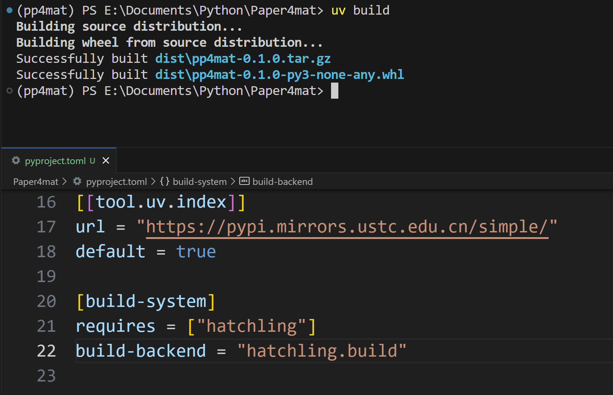

随着我写的项目越来越多,我越加感受到一种组织项目结构的"强迫症".项目的目录应该是什么样子,才能方便调用和维护?这其实是软件工程研究的领域.由于我从未系统学习过软件工程,以前的我反复琢磨,总感觉不是最佳实践,浑身难受!

但是现在,我宣布我已经悟了!

## 从脚本到模块，从混乱到整洁
梦开始之前,功能需求小,加上Python语言的极致胶水感🤭,在一个py文件里写一些类就足够了.或者顶多就像这样
```
my_project/
├── main.py
├── helper.py
├── test_data.csv
├── output.txt
```

后来不知道从哪里看到了有人用 `__init__.py` 文件,一番了解之后,非常兴奋,这简直完美适用于我日益增长的需求!马上就开始实战了.这期间与无数 `ModuleNotFound`错误斗智斗勇,又被C语言里面的循环导入绕晕,总算是有了一点基本的项目结构意识.然后就变成这个样子:
```
my_project/
├── .venv/
├── module1/
|	├── __init__.py
|	├── main.py
|	├── utils.py
|	├── logger.py
├── module2/
|	├── __init__.py
|	├── main.py
|	├── utils.py
├── main.py
├── logs/
├── requirements.txt
├── .gitignore
├── README.md
```
我长期保持着这种风格,通过 `pip freeze > ./requirements.txt`来生成依赖.不涉及打包的话,这样其实也过得去,那些搞深度学习的项目就长这样.我也一直觉得轻松可接受.

直到最近我学了Rust,发现Cargo竟有如此强大的功能,测试功能也爽得不得了,"库"和"包"的区别也引发我的思考.

大概是年初的时候我听说了uv,当时对项目了思考还不够,所以觉得它跟conda应该差不多吧.既然我有conda了没有必要再装一个吧,conda已经相当臃肿了.最近看到几个视频,我认真看了,才了解到pip生成requirements.txt的缺点以及uv能做的事情:跟Cargo差不多,是"项目管理器"而不只是"包管理器"!

[从pip到uv：一口气梳理现代Python项目管理全流程！](https://www.bilibili.com/video/BV13WGHz8EEz)

[build + hatchling 15分钟搞懂Python项目结构和打包](https://www.bilibili.com/video/BV12NgLzhEKx)

**悟已往之不谏,知来者之可追!**

# uv使用
技术以我们难以追赶的速度更新迭代,热情拥抱新技术,是像我这样的编程爱好者必须的品质!
事不宜迟,马上入手!

[uv - 一个用 Rust 编写的极速 Python 包和项目管理工具。](https://uv.doczh.com/)

最近vscode的ms-python插件抽风了,导致我的虚拟环境和tasks任务也出问题.一看Github上面一堆issue,维护者告诉我们暂时下载一个python env插件来解决.为了体验uv,我干脆删掉了原来用 `python -m venv .env`创建的虚拟环境,重构目录结构.

为了采用新式项目管理,首先运行:
```shell
uv init
```
会自动生成pyproject.toml

然后看看pylace报了哪些模块缺失错误,逐个运行
```shell
uv add package
```
来安装.这些依赖被自动添加到了pyproject.toml里面,跟Cargo add ,npm install是一样的.

## src layout布局与打包

src layout布局:
```
sampleproject
├── scripts/
├── src/
|    └── package_name/
|         ├── __init__.py 
|		  └── utils.py
├── pyproject.toml 
└── tests/
```
这是越来越多新项目的项目布局,其中src里面是打包的对象.

我把项目调整为这样之后,在pyproject.toml里面添加hatchling作为打包工具(默认为setuptool)的配置后,运行
```shell
uv pip install -e .
```
把我们开发的包本身安装到虚拟环境中

生成压缩文件和wheel:
```shell
uv build
```

这些wheel是可以通过pip来安装的:
```shell
uv pip install dist/package_name.whl
```

## uv换源
不是说uv很快吗?怎么下载速度比pip install还慢?甚至Timeout?其实他们用的是同一个源,都来自pypi,跟conda有自己的源是不一样的.

换源的步骤是设置系统环境变量:

```
UV_DEFAULT_INDEX=https://pypi.mirrors.ustc.edu.cn/simple/
```
> 话说清华源是不是不好用了,换成清华源的话会出现403;之前搞Arch mirror_list 清华源好像也有问题,推荐科大源吧

## 一个简单的前后端项目
最近在写一个[论文格式检测](https://github.com/TanKimzeg/PP4mat)项目.小项目没有历史包袱,我将其按以上方式重构,检测部分是可复用的逻辑,所以我把它放在src/pp4mat里面,能被打包.在Copilot的帮助下增加了前后端.后端在 `app` 里面,用fastapi处理请求.前端在 `frontend` 里面,主要是一个网页和JS. 没想到有一天我也能搞全栈开发了haha,天才如我😆.

```
pp4mat_detection
├── app/
|   ├── api/
|   ├── services/
|   ├── __init__.py
|   └── main.py 
├── src/
|    └── pp4mat/
|         ├── __init__.py 
|		  ├── main.py
|         ├── check_format/
|         └── config_convert/
├── frontend/
|    ├── node_modules
|    └── index.html
├── configs
|    └── rules.yaml
├── pyproject.toml 
├── .gitignore
├── README.md
└── tests/
```

前后端逻辑比较简单,所以把Copilot提供的代码修修就行.目前前端看起来还比较简陋,后面会做美化!

import RepositoryCard from "@/components/mdx/RepositoryCard.astro";

<RepositoryCard repo="TanKimzeg/PP4mat" />